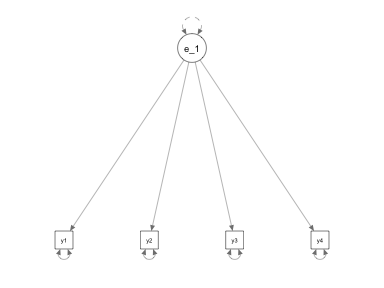
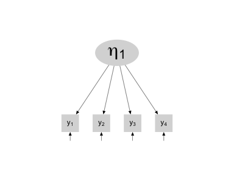
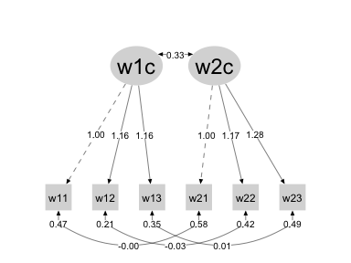
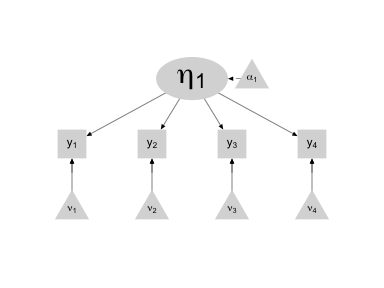

01
================
A Solomon Kurz
2018-11-07

Review of some Key Latent Variable Principles
=============================================

Newsome started the chapter thusly:

> To lay the groundwork needed for acquiring an in-depth understanding of longitudinal struc- tural equation models, this chapter reviews some of the key concepts related to latent variables, including principles of reliability, measurement error, factor variance identification, measurement intercepts and latent variable means, and analysis of non-continuous indicators. There is particular emphasis on how factor variances and means are defined. I emphasize these issues partly to bridge some of the gaps that may exist between the knowledge gained from an introductory course on structural equation modeling (SEM) and the understanding needed to discerningly apply many of the longitudinal structural equation models discussed in this book. My hope is that nearly all readers will find this chapter at least a worthwhile review if not the kernel of more meaningful insights into longitudinal structural models. As a starting point, I assume the reader is familiar with introductory concepts of latent variables and path analysis, including basic principles of path analysis, confirmatory factor analysis, model identification, estimation methods, modeling diagrams, and model fit. Many good sources exist for an introduction to these concepts (e.g., [Bollen, 1989](https://www.wiley.com/en-us/Structural+Equations+with+Latent+Variables-p-9780471011712); [Hayduk, 1987](https://jhupbooks.press.jhu.edu/content/structural-equation-modeling-lisrel); [Kline, ~~2010~~ 2015](https://www.guilford.com/books/Principles-and-Practice-of-Structural-Equation-Modeling/Rex-Kline/9781462523344); [Maruyama, 1997](http://sk.sagepub.com/books/basics-of-structural-equation-modelling); [Mulaik, 2009](https://www.crcpress.com/Linear-Causal-Modeling-with-Structural-Equations/Mulaik/p/book/9781439800386)). (p. 1)

Although it’s a little more focused than the texts Newsome referenced, I also recommend [Brown (2015)](https://www.guilford.com/books/Confirmatory-Factor-Analysis-for-Applied-Research/Timothy-Brown/9781462515363).

Latent variables with continuous indicators
-------------------------------------------

### Variance, measurement error, and reliability

> The original conception of reliability and one applied in most physical sciences is that the measure itself is unchanging over time. Upon repeated measurement, given that the underlying construct has not changed, the observed value returned will be identical unless measurement error is present. In other words, an instant retest would produce the same value if the measure is perfectly reliable. The test-retest concept gives rise to the idea of the split-half correlation, developed to assess the reliability of tests with two equivalent forms administered simultaneously. The split-half correlation concept of reliability, in turn, gives rise to the more general idea of internal reliability for measures with multiple observations of the same construct. (p. 1)

Consider a normally-distributed variable *X*.

*X* ∼ Normal(*μ*, *σ*<sup>2</sup>)
 From Classical Test Theory (CTT), we decompose the variability (i.e., *σ*<sup>2</sup>) of *X* into a *true score* and *measurement error*. This follows the formula

Var(*X*)=Var(*T*)+Var(*e*)

where Var(.) denotes variance of some construct, *T* is the true score and *e* is the measurement error.

> Reliability is defined as the proportion of observed score variance that is true score variance, Var(*T*)/Var(*X*), with perfect reliability occurring when there is no variance due to error. Alternatively, then, one can think of reliability as the absence of measurement error. (p. 1)

The SEM measurement model parallels the CTT formulation. Given a latent variable measured by a single indicator, the measurement model follows the form

*y*<sub>1</sub> = *λ*<sub>11</sub>*η*<sub>1</sub> + *ϵ*<sub>1</sub>

where the observed variable--the single indicator--is *y*<sub>1</sub>, the *λ*<sub>11</sub> is the factor loading, *η*<sub>1</sub> is the latent variable measured by *y*<sub>1</sub>, and *ϵ*<sub>1</sub> is the residual variance. The subscript **<sub>1</sub> for *y*, *η*, and *ϵ* indicate they are the first of possibly more terms of their class. E.g., there could, in principle, be more than one indicators. By *λ*<sub>11</sub> we indicate the first factor loading for the first latent variable.

In situations for which we only have one indicator *y*<sub>1</sub>, we typically set *λ*<sub>11</sub> = 1, which reduces the equation above to

*y*<sub>1</sub> = *η*<sub>1</sub> + *ϵ*<sub>1</sub>

When we have multiple items measuring a sole latent variable *η*<sub>1</sub>, we can estimate the true score variance Var(*η*<sub>*k*</sub>)=*ψ*<sub>*k**k*</sub> and the error variance Var(*ϵ*<sub>*j*</sub>)=*θ*<sub>*j**j*</sub>, for which the subscripts **<sub>*k*</sub> and **<sub>*j*</sub> indicate particular factors and measured variables, respectively.

The next part is important and critically differentiates latent variable theory from CTT.

> An important difference in the meaning of the error term in the SEM measurement model and the error term in the classical test formula is that, for the SEM measurement model, we cannot assume that all the variance unaccounted for by *η*<sub>*k*</sub> is purely measurement error ([Lord & Novick, 1968](https://books.google.com/books/about/Statistical_Theories_of_Mental_Test_Scor.html?id=0nkMX_MqEQ4C), p. 535). Because the latent variable is defined by multiple items in practice, the *measurement residual* term incorporates any variance, systematic variance or error variance, that is unique to each measured variable and, there- fore, cannot be due to the latent variable. Stated in the form of an equation, $\\epsilon\_j = \\text s\_j + \\text e\_j$. *Systematic variation*, $\\text s\_j$, is any value of the observed score that varies systematically as a function of any variable once the true score is taken into account. Measurement error, $\\text e\_j$, is any remaining random variation, which by virtue of being random cannot be correlated with anything. (p. 2, *emphasis* in the original)

We can use Sacha Epskamp's [semPlot package](https://cran.r-project.org/web/packages/semPlot/index.html) to make a streamlined version of Figure 1.1.

``` r
library(semPlot)
```

The main function we'll be using to plot is `semPlot::semPaths()`. However, `semPaths()` takes a SEM fit object as its input. Since we're focusing on the lavaan package in this project, we'll need to fit a lavaan model corresponding to the figure. Since we don't have any data associated with the figure, we'll just make some up.

``` r
library(lavaan)

lower <- '
1
.7 1
.7 .7 1
.7 .7 .7 1 
'

(cor <- getCov(lower, names = paste("y", 1:4, sep = "")))
```

    ##     y1  y2  y3  y4
    ## y1 1.0 0.7 0.7 0.7
    ## y2 0.7 1.0 0.7 0.7
    ## y3 0.7 0.7 1.0 0.7
    ## y4 0.7 0.7 0.7 1.0

What we just did was specify the lower triangle of a correlation matrix, fed it into the `lavaan::getCov()` function, which transformed the lower triangle to a full covariance matrix with named rows and columns.

Next, we'll specify a lavaan model corresponding to the figure and fit the model based on the covariance matrix, `cor`, and a defined sample size.

``` r
model <- '
eta_1 =~ NA*y1 + y2 + y3 + y4

eta_1 ~~ 1*eta_1
'

fit <-
  cfa(model, 
      sample.cov = cor, 
      sample.nobs = 100)
```

Now we have our model fit, `fit`, in hand, we are ready to use `semPlot::semPaths()` to make the figure. Here's the simple default.

``` r
semPaths(fit)
```



The `semPaths()` function comes with a range of arguments that'll help us customize the plot.

``` r
semPaths(fit,
         style = "lisrel",
         rotation = 1,
         edge.color = "black",
         color = "grey85",
         sizeMan = 8,
         sizeLat = 20,
         sizeLat2 = 12,
         label.scale = T,
         label.cex = 1.25,
         borders = F,
         nodeLabels = c(expression(y[1]), 
                        expression(y[2]),
                        expression(y[3]),
                        expression(y[4]),
                        expression(eta[1])),
         mar = rep(15, 4))
```



To learn more about the `semPaths()` function, check out [this](http://www.sachaepskamp.com/files/semPlot.pdf) and [this](http://sachaepskamp.com/documentation/semPlot/semPaths.html).

### Factor variances and covariances

> Latent variable variances are derived from the variances and covariances of the observed variables. We know this from the familiar decomposition of the covariance matrix into the constituent matrices of loadings, factor variances, and measurement residuals. The decomposition is summarized in the matrix expression of the structural equation measurement model. (p. 3)

The model follows the form

∑(**θ**)=**Λ****Ψ****Λ****′** + **Θ**

where ∑(**θ**) stands for the variance-covariance matrix of the observed data *y*, **Λ** is a matrix of factor loadings and **Λ****′** is its transpose, **Ψ** is the matrix of the latent variable variances, and **Θ** is the matrix of residual variances/covariances.

#### Factor variance scaling

> The factor variance cannot be identified unless we impose a scaling constraint. Typically, either the variance of the factor is constrained to be equal to 1, which I will call the *factor variance identification* approach, or one of the loadings is constrained to be equal to 1, which I will call the referent loading identification approach (also com- monly known as the "marker variable" approach). A third identification approach, effects coding identification ([Little, Slegers, & Card, 2006](http://citeseerx.ist.psu.edu/viewdoc/download?doi=10.1.1.469.9845&rep=rep1&type=pdf)), will be explained later in the chapter. (p. 4, *emphasis* in the original)

Though one’s scaling method is often arbitrary, it can make a difference in some analyses (e.g., examining measurement invariance).

### Example 1.1: Factor loadings and factor variance

Here we load our data.

``` r
library(tidyverse)

socex1_names <- 
  c("w1vst1", "w1vst2", "w1vst3", "w2vst1", "w2vst2", "w2vst3", "w3vst1", "w3vst2", "w3vst3", "w1unw1", "w1unw2", "w1unw3", "w2unw1", "w2unw2", "w2unw3", "w3unw1", "w3unw2", "w3unw3", "w1dboth","w1dsad", "w1dblues", "w1ddep", "w2dboth", "w2dsad","w2dblues", "w2ddep", "w3dboth", "w3dsad", "w3dblues", "w3ddep", "w1marr2", "w1happy", "w1enjoy", "w1satis", "w1joyful", "w1please", "w2happy", "w2enjoy", "w2satis", "w2joyful", "w2please", "w3happy", "w3enjoy", "w3satis", "w3joyful", "w3please", "w1lea", "w2lea", "w3lea")

socex1 <- 
  read_table2("data/socex1.dat",
              col_names = F) %>% 
  set_names(socex1_names)
```

We can use the base R `head()` function to take a peek at the data.

``` r
head(socex1)
```

    ## # A tibble: 6 x 49
    ##   w1vst1 w1vst2 w1vst3 w2vst1 w2vst2 w2vst3 w3vst1 w3vst2 w3vst3 w1unw1
    ##    <int>  <int>  <int>  <int>  <int>  <int>  <int>  <int>  <int>  <int>
    ## 1      0      1      0      3      3      2      3      2      2      2
    ## 2      3      3      4      3      3      3      2      3      3      1
    ## 3      2      2      3      1      0      2      2      2      1      2
    ## 4      2      2      3      1      2      2      2      2      2      4
    ## 5      3      2      2      2      2      2      3      3      2      2
    ## 6      4      4      4      4      4      4      4      4      4      0
    ## # ... with 39 more variables: w1unw2 <int>, w1unw3 <int>, w2unw1 <int>,
    ## #   w2unw2 <int>, w2unw3 <int>, w3unw1 <int>, w3unw2 <int>, w3unw3 <int>,
    ## #   w1dboth <int>, w1dsad <int>, w1dblues <int>, w1ddep <int>,
    ## #   w2dboth <int>, w2dsad <int>, w2dblues <int>, w2ddep <int>,
    ## #   w3dboth <int>, w3dsad <int>, w3dblues <int>, w3ddep <int>,
    ## #   w1marr2 <int>, w1happy <int>, w1enjoy <int>, w1satis <int>,
    ## #   w1joyful <int>, w1please <int>, w2happy <dbl>, w2enjoy <dbl>,
    ## #   w2satis <dbl>, w2joyful <dbl>, w2please <dbl>, w3happy <dbl>,
    ## #   w3enjoy <dbl>, w3satis <dbl>, w3joyful <dbl>, w3please <dbl>,
    ## #   w1lea <int>, w2lea <int>, w3lea <int>

Here's how to specify the modle in lavaan. Do note, I’ve slightly reordered Newsom’s code, but the guts are all the same.

``` r
model1.1 <- '
# factor loadings
w1comp =~ w1vst1 + w1vst2 + w1vst3
w2comp =~ w2vst1 + w2vst2 + w2vst3

# latent covariance
w2comp ~~ w1comp

# latent variances
w1comp ~~ w1comp
w2comp ~~ w2comp

# residual covariances
w1vst1 ~~ w2vst1
w1vst2 ~~ w2vst2
w1vst3 ~~ w2vst3

# residual variances
w1vst1 ~~ w1vst1
w1vst2 ~~ w1vst2
w1vst3 ~~ w1vst3
w2vst1 ~~ w2vst1
w2vst2 ~~ w2vst2
w2vst3 ~~ w2vst3
'
```

As is always the case in R, the text following the `#` marks is commented out, which offers a handy way to annotate the code. Our two latent variables are `w1comp` and `w1comp`. They are defined by the variables following the `=~` operator, which you might read as *is measured by*. Thus, we might read the first line of model code as: *The latent variable `w1comp` is measured by the three items `w1vst1`, `w1vst2`, and `w1vst3`*.

Starting with the line `w2comp ~~ w1comp` and below, those are the variances and residual covariances in the model. That first line, `w2comp ~~ w1comp`, explicated that the two latent variables should covary. The double-tilde operator `~~` defined the covariance.

Now notice one line down, `w1comp ~~ w1comp`. When you use the `~~` operator with the same item before and after it, you are specifying a variance. And notice how the `~~` operator worked the same with the observed variables.

Before we fit, we should point out a couple defaults. First, laavan automatically fixes the first loading in each latent variable to 1 (i.e., the *factor variance identification* approach). As we'll see later, we can override this. Second, we didn't have to specify the residual variances (e.g., `w1comp ~~ w1comp`). laavan will estimate those by default. However, it's not a bad idea to put them in the model by hand. It can be good practice.'

Now some of the preliminaries are out of the way, we can fit the model using the `sem()` function and then examine how well it fit using the `summary()` function.

``` r
fit1.1 <- sem(model1.1, data = socex1)

summary(fit1.1, 
        fit.measures = T, 
        rsquare = T, 
        standardized = T)
```

    ## lavaan 0.6-3 ended normally after 25 iterations
    ## 
    ##   Optimization method                           NLMINB
    ##   Number of free parameters                         16
    ## 
    ##   Number of observations                           574
    ## 
    ##   Estimator                                         ML
    ##   Model Fit Test Statistic                       9.911
    ##   Degrees of freedom                                 5
    ##   P-value (Chi-square)                           0.078
    ## 
    ## Model test baseline model:
    ## 
    ##   Minimum Function Test Statistic             1735.163
    ##   Degrees of freedom                                15
    ##   P-value                                        0.000
    ## 
    ## User model versus baseline model:
    ## 
    ##   Comparative Fit Index (CFI)                    0.997
    ##   Tucker-Lewis Index (TLI)                       0.991
    ## 
    ## Loglikelihood and Information Criteria:
    ## 
    ##   Loglikelihood user model (H0)              -4410.277
    ##   Loglikelihood unrestricted model (H1)      -4405.322
    ## 
    ##   Number of free parameters                         16
    ##   Akaike (AIC)                                8852.555
    ##   Bayesian (BIC)                              8922.197
    ##   Sample-size adjusted Bayesian (BIC)         8871.404
    ## 
    ## Root Mean Square Error of Approximation:
    ## 
    ##   RMSEA                                          0.041
    ##   90 Percent Confidence Interval          0.000  0.079
    ##   P-value RMSEA <= 0.05                          0.591
    ## 
    ## Standardized Root Mean Square Residual:
    ## 
    ##   SRMR                                           0.020
    ## 
    ## Parameter Estimates:
    ## 
    ##   Information                                 Expected
    ##   Information saturated (h1) model          Structured
    ##   Standard Errors                             Standard
    ## 
    ## Latent Variables:
    ##                    Estimate  Std.Err  z-value  P(>|z|)   Std.lv  Std.all
    ##   w1comp =~                                                             
    ##     w1vst1            1.000                               0.913    0.800
    ##     w1vst2            1.159    0.048   24.360    0.000    1.059    0.917
    ##     w1vst3            1.156    0.049   23.659    0.000    1.056    0.874
    ##   w2comp =~                                                             
    ##     w2vst1            1.000                               0.698    0.674
    ##     w2vst2            1.173    0.081   14.419    0.000    0.819    0.784
    ##     w2vst3            1.284    0.088   14.556    0.000    0.897    0.788
    ## 
    ## Covariances:
    ##                    Estimate  Std.Err  z-value  P(>|z|)   Std.lv  Std.all
    ##   w1comp ~~                                                             
    ##     w2comp            0.331    0.039    8.442    0.000    0.519    0.519
    ##  .w1vst1 ~~                                                             
    ##    .w2vst1           -0.001    0.026   -0.045    0.965   -0.001   -0.002
    ##  .w1vst2 ~~                                                             
    ##    .w2vst2           -0.030    0.021   -1.417    0.156   -0.030   -0.102
    ##  .w1vst3 ~~                                                             
    ##    .w2vst3            0.013    0.025    0.509    0.610    0.013    0.032
    ## 
    ## Variances:
    ##                    Estimate  Std.Err  z-value  P(>|z|)   Std.lv  Std.all
    ##     w1comp            0.834    0.074   11.206    0.000    1.000    1.000
    ##     w2comp            0.488    0.059    8.261    0.000    1.000    1.000
    ##    .w1vst1            0.469    0.034   13.798    0.000    0.469    0.360
    ##    .w1vst2            0.212    0.029    7.337    0.000    0.212    0.159
    ##    .w1vst3            0.346    0.033   10.511    0.000    0.346    0.237
    ##    .w2vst1            0.585    0.043   13.557    0.000    0.585    0.545
    ##    .w2vst2            0.419    0.042    9.946    0.000    0.419    0.385
    ##    .w2vst3            0.490    0.049    9.900    0.000    0.490    0.379
    ## 
    ## R-Square:
    ##                    Estimate
    ##     w1vst1            0.640
    ##     w1vst2            0.841
    ##     w1vst3            0.763
    ##     w2vst1            0.455
    ##     w2vst2            0.615
    ##     w2vst3            0.621

Here's what the model looks like using `semPaths()`.

``` r
semPaths(fit1.1,
         style = "lisrel",
         edge.color = "black",
         color = "grey85",
         sizeMan = 8,
         sizeLat = 16,
         sizeLat2 = 12,
         label.scale = T,
         label.cex = 1.25,
         edge.label.cex = 1.25,
         borders = F,
         mar = c(10, 5, 10, 5),
         whatLabel = "est")
```



### Means and intercepts

Note how our `fit1.1` didn't even have a mean structure. Means and intercepts were nowhere in the `summary()` output. But is we want to, we can expand our models to include mean structures and in some models these will be critical. "Just as latent variable variances are a function of observed variable variances, latent variable means are a function of observed variable means" (p. 5).

#### Mean structures

If we include a mean structure, the measurement model for a single indicator follows the form

*y*<sub>1</sub> = *ν*<sub>1</sub> + *λ*<sub>11</sub>*η*<sub>1</sub> + *ϵ*<sub>1</sub>

where the new term, *ν*<sub>1</sub>, is the intercept for the observed variable. We can explore what that might look like with `semPaths()`, but first we’ll need to refit the model with a mean vector. We’ll call it `means`.

``` r
means <- rep(0, times = 4)

model <- '
eta_1 =~ NA*y1 + y2 + y3 + y4

eta_1 ~~ 1*eta_1
'

fit <-
  cfa(model, 
      sample.cov = cor, 
      sample.mean = means,
      sample.nobs = 100)
```

Here's our version of Figure 1.2.

``` r
semPaths(fit,
         style = "lisrel",
         rotation = 1,
         edge.color = "black",
         color = "grey85",
         sizeMan = 8,
         sizeLat = 20,
         sizeLat2 = 12,
         sizeInt = 7,
         label.scale = T,
         label.cex = 1.25,
         borders = F,
         nodeLabels = c(expression(y[1]), 
                        expression(y[2]),
                        expression(y[3]),
                        expression(y[4]),
                        expression(eta[1]),
                        expression(nu[1]),
                        expression(nu[2]),
                        expression(nu[3]),
                        expression(nu[4]),
                        expression(alpha[1])),
         mar = rep(c(12, 6), 2))
```



Switching topics a touch, we can compute the degrees of freedom for a frequentist model with the equation

$$df = \\bigg\[ \\frac{J (J + 1)}{2} + J \\bigg\] - q$$

where *J* is the number of observed variables and *q* is the number of freely-estimated model parameters. For example, in the model for Figure 1.2, we had 4 observed variables, 3 loadings, 4 residual variances, 3 intercepts, 1 latent variance, and 1 latent mean. Working the math

``` r
j <- 4

lambdas  <- 3
epsilons <- 4
nus      <- 3
psis     <- 1
alphas   <- 1

(df <- (j * (j + 1) /2 + j) - (lambdas + epsilons + nus + psis + alphas))
```

    ## [1] 2

#### Measurement error and means

In CTT, the mean structure has no influence on the true score. Within that paradigm, the error *e* is Gaussian with a zero mean (i.e., *E*(*e*)=0). The latent variable framework, however, admits to systematic error, which can influence the estimates for the true score. This kind of systematic bias is often termed *measurement bias* when connected to substantively-relevant groups.

In latent variable theory, the formula for the expected value (i.e., the mean) of an indicator follows the form

*E*(*y*<sub>*j*</sub>)=*ν*<sub>*j*</sub> + *λ*<sub>*j**k*</sub>*α*<sub>*k*</sub>

where *j* indexes a given indicator and *k* indexes a given latent variable. A little algebraic manipulation will show that the intercept *ν*<sub>*j*</sub> is a function of the item mean and the latent mean.

*ν*<sub>*j*</sub> = *E*(*y*<sub>*j*</sub>)−*λ*<sub>*j**k*</sub>*α*<sub>*k*</sub>

And similarly, the latent mean is a function of the observed mean and the intercept.

$$\\alpha\_k = \\frac{E(y\_j) - \\nu\_j}{\\lambda\_{jk}}$$

#### Factor mean scaling

Just like with latent variances, latent means require a scaling method. A common default is to set the first loading to 1 and the corresponding intercept to 0. This approach is called the *referent intercept identification* approach or the "marker variable" approach. The consequence of this approach is

*E*(*y*<sub>*j*</sub>)=*α*<sub>*k*</sub>′

In words, the equation means that the marker variable approach scales the latent mean to be the same as the mean of the marker indicator. And recall, SEM software (e.g., laavan) often sets the first item as the marker indicator by default. In formula, we Newsom used *α*<sub>*k*</sub>′ to clarify that we are referring to the estimated mean of the latent variable, rather than the true value, however you might conceptualize that.

Presuming, for a moment, we are talking about the mean of the first latent variable, *α*<sub>1</sub>, and have indeed used the first indicator to scale it, *y*<sub>1</sub>, we can rewrite that equation as

*E*(*y*<sub>1</sub>)=*α*<sub>1</sub>′

It’s worth it to make that granular point because it might help clarify the next one. The upshot is that the equation for the second indicator of *η*<sub>1</sub> and its mean, $\\alhpa\_1$, is

*ν*<sub>2</sub>′=*E*(*y*<sub>2</sub>)−*λ*<sub>21</sub>′*α*<sub>1</sub>′

And all other indicators for that first latent will follow the same formula, just with the three subscripted 2s being switched out for the corresponding indicator index. Using more words, this means that using the marker variable approach, the mean of the marker variable influences the intercepts for all other indicators. Perhaps making it even more clear, we can switch out *α*<sub>1</sub>’ in the equation for *E*(*y*<sub>1</sub>).

*ν*<sub>2</sub>′=*E*(*y*<sub>2</sub>)−*λ*<sub>21</sub>′*E*(*y*<sub>1</sub>)

The other most common method of scaling latent means is what Newsom called the *factor mean identification* approach. This approach entails fixing the latent mean to 0 and the latent variance to 1, standardizing the latent variable. In so doing, the intercepts and loadings of all the indicators are freely estimated. For indicators 1 though *i* and latent variables 1 through *k*, this results in the formulas

$$
\\begin{eqnarray} 
\\nu\_1 = E(y\_1) - \\lambda\_{11} \\alpha\_1 = E(y\_1) - \\lambda\_{11} (0) & = & E(y\_1) \\\\
\\nu\_2 = E(y\_2) - \\lambda\_{21} \\alpha\_1 = E(y\_2) - \\lambda\_{21} (0) & = & E(y\_2) \\\\
& \\vdots \\\\
\\nu\_i = E(y\_i) - \\lambda\_{jk} \\alpha\_j = E(y\_i) - \\lambda\_{jk} (0) & = & E(y\_i)
\\end{eqnarray} 
$$

Or more compactly

$$
\\begin{eqnarray} 
\\nu\_1 & = & E(y\_1) \\\\
\\nu\_2  & = & E(y\_2) \\\\
& \\vdots \\\\
\\nu\_i  & = & E(y\_i)
\\end{eqnarray} 
$$

### Example 1.2: Measurement intercepts and factor means

> The second section of Table 1.1 also illustrates how intercepts and means obtained using the two identification approaches can be derived from one another using the social exchanges data set for the same factor model discussed in Example 1.1. (p. 9)

We should take the opportunity to refit `model1.1`, this time including the mean structure. To do so, simply add the `meanstructure = T` argument to the `sem()` or `cfa()` function.

``` r
var(socex1$w1vst1) * .640
```

    ## [1] 0.83555

``` r
var(socex1$w2vst1) * .455
```

    ## [1] 0.4886966

``` r
fit1.1 <- sem(model1.1,
              data = socex1,
              meanstructure = T)

summary(fit1.1, 
        fit.measures = T, 
        standardized = T)
```

    ## lavaan 0.6-3 ended normally after 25 iterations
    ## 
    ##   Optimization method                           NLMINB
    ##   Number of free parameters                         22
    ## 
    ##   Number of observations                           574
    ## 
    ##   Estimator                                         ML
    ##   Model Fit Test Statistic                       9.911
    ##   Degrees of freedom                                 5
    ##   P-value (Chi-square)                           0.078
    ## 
    ## Model test baseline model:
    ## 
    ##   Minimum Function Test Statistic             1735.163
    ##   Degrees of freedom                                15
    ##   P-value                                        0.000
    ## 
    ## User model versus baseline model:
    ## 
    ##   Comparative Fit Index (CFI)                    0.997
    ##   Tucker-Lewis Index (TLI)                       0.991
    ## 
    ## Loglikelihood and Information Criteria:
    ## 
    ##   Loglikelihood user model (H0)              -4410.277
    ##   Loglikelihood unrestricted model (H1)      -4405.322
    ## 
    ##   Number of free parameters                         22
    ##   Akaike (AIC)                                8864.555
    ##   Bayesian (BIC)                              8960.313
    ##   Sample-size adjusted Bayesian (BIC)         8890.472
    ## 
    ## Root Mean Square Error of Approximation:
    ## 
    ##   RMSEA                                          0.041
    ##   90 Percent Confidence Interval          0.000  0.079
    ##   P-value RMSEA <= 0.05                          0.591
    ## 
    ## Standardized Root Mean Square Residual:
    ## 
    ##   SRMR                                           0.018
    ## 
    ## Parameter Estimates:
    ## 
    ##   Information                                 Expected
    ##   Information saturated (h1) model          Structured
    ##   Standard Errors                             Standard
    ## 
    ## Latent Variables:
    ##                    Estimate  Std.Err  z-value  P(>|z|)   Std.lv  Std.all
    ##   w1comp =~                                                             
    ##     w1vst1            1.000                               0.913    0.800
    ##     w1vst2            1.159    0.048   24.360    0.000    1.059    0.917
    ##     w1vst3            1.156    0.049   23.659    0.000    1.056    0.874
    ##   w2comp =~                                                             
    ##     w2vst1            1.000                               0.698    0.674
    ##     w2vst2            1.173    0.081   14.419    0.000    0.819    0.784
    ##     w2vst3            1.284    0.088   14.556    0.000    0.897    0.788
    ## 
    ## Covariances:
    ##                    Estimate  Std.Err  z-value  P(>|z|)   Std.lv  Std.all
    ##   w1comp ~~                                                             
    ##     w2comp            0.331    0.039    8.442    0.000    0.519    0.519
    ##  .w1vst1 ~~                                                             
    ##    .w2vst1           -0.001    0.026   -0.045    0.965   -0.001   -0.002
    ##  .w1vst2 ~~                                                             
    ##    .w2vst2           -0.030    0.021   -1.417    0.156   -0.030   -0.102
    ##  .w1vst3 ~~                                                             
    ##    .w2vst3            0.013    0.025    0.509    0.610    0.013    0.032
    ## 
    ## Intercepts:
    ##                    Estimate  Std.Err  z-value  P(>|z|)   Std.lv  Std.all
    ##    .w1vst1            1.960    0.048   41.134    0.000    1.960    1.717
    ##    .w1vst2            1.979    0.048   41.075    0.000    1.979    1.714
    ##    .w1vst3            1.969    0.050   39.026    0.000    1.969    1.629
    ##    .w2vst1            2.031    0.043   47.003    0.000    2.031    1.962
    ##    .w2vst2            2.049    0.044   47.022    0.000    2.049    1.963
    ##    .w2vst3            2.019    0.047   42.534    0.000    2.019    1.775
    ##     w1comp            0.000                               0.000    0.000
    ##     w2comp            0.000                               0.000    0.000
    ## 
    ## Variances:
    ##                    Estimate  Std.Err  z-value  P(>|z|)   Std.lv  Std.all
    ##     w1comp            0.834    0.074   11.206    0.000    1.000    1.000
    ##     w2comp            0.488    0.059    8.261    0.000    1.000    1.000
    ##    .w1vst1            0.469    0.034   13.798    0.000    0.469    0.360
    ##    .w1vst2            0.212    0.029    7.337    0.000    0.212    0.159
    ##    .w1vst3            0.346    0.033   10.511    0.000    0.346    0.237
    ##    .w2vst1            0.585    0.043   13.557    0.000    0.585    0.545
    ##    .w2vst2            0.419    0.042    9.946    0.000    0.419    0.385
    ##    .w2vst3            0.490    0.049    9.900    0.000    0.490    0.379

From the [Meanstructures section of the lavaan tutorial](http://lavaan.ugent.be/tutorial/means.html), we read:

> By default, the `cfa()` and `sem()` functions fix the latent variable intercepts (which in this case correspond to the latent means) to zero. Otherwise, the model would not be estimable. Note that the chi-square statistic and the number of degrees of freedom is the same as in the original model (without a mean structure).

To unerstand what happened, it might help to make a table.

``` r
tibble(method = c("referent intercept identification", "factor mean identification", "lavaan default"),
       loading = c("first item set to 1", "all freely estimated", "first item set to 1"),
       `latent variance` = c("the variance if the first item", "set to 1", "the variance of the first item multiplied by its r-square"),
       intercept = c("first item set to 0", "all freely estimated", "all freely estimated"),
       `latent mean` = c("the mean if the first item", "set to 0", "set to 0")) %>% 
  knitr::kable()
```

| method                            | loading              | latent variance                                           | intercept            | latent mean                |
|:----------------------------------|:---------------------|:----------------------------------------------------------|:---------------------|:---------------------------|
| referent intercept identification | first item set to 1  | the variance if the first item                            | first item set to 0  | the mean if the first item |
| factor mean identification        | all freely estimated | set to 1                                                  | all freely estimated | set to 0                   |
| lavaan default                    | first item set to 1  | the variance of the first item multiplied by its r-square | all freely estimated | set to 0                   |

If you would like to refit model 1.1 to follow Newsom's referent intercept identification approach, here's how you might alter the syntax. A few things to note. First, we are no longer relying on the lavaan default by using the `meanstructure = T` argument. Rather, we're putting in the mean structure by hand in the model code. In lavaan, mean/intercept code follows the form `x ~ 1` where `x` is an observed or latent variable and the `~ 1` portion indicates you'd like a mean or intercept. lavaan, of course, knows which one is which. Because the lavaan default is to set the latent means to 0 and freely estimate the intercepts, we we'll do two things to override that. First, we told lavaan to freely estimate the latent means by switching out `~ 1` with `~ NA*1` for the latent means. When you put `NA*` on the left side of a parameter, such as a mean or loading, that explicitly tells lavaan to freely estimate it. The other thing we did was fix the intercepts of the first indicators for each latent variable to 0 using the `x ~ 0*1` syntax.

``` r
model1.1_ri <- '
# factor loadings
w1comp =~ w1vst1 + w1vst2 + w1vst3
w2comp =~ w2vst1 + w2vst2 + w2vst3

# residual covariances
w1vst1 ~~ w2vst1
w1vst2 ~~ w2vst2
w1vst3 ~~ w2vst3

# residual variances
w1vst1 ~~ w1vst1
w1vst2 ~~ w1vst2
w1vst3 ~~ w1vst3
w2vst1 ~~ w2vst1
w2vst2 ~~ w2vst2
w2vst3 ~~ w2vst3

# latent means
w1comp ~ NA*1
w2comp ~ NA*1

# intercepts
w1vst1 ~ 0*1
w1vst2 ~ 1
w1vst3 ~ 1
w2vst1 ~ 0*1
w2vst2 ~ 1
w2vst3 ~ 1
'

fit1.1_ri <- sem(model1.1_ri,
                 data = socex1)

summary(fit1.1_ri,
        fit.measures = T, 
        standardized = T)
```

    ## lavaan 0.6-3 ended normally after 47 iterations
    ## 
    ##   Optimization method                           NLMINB
    ##   Number of free parameters                         22
    ## 
    ##   Number of observations                           574
    ## 
    ##   Estimator                                         ML
    ##   Model Fit Test Statistic                       9.911
    ##   Degrees of freedom                                 5
    ##   P-value (Chi-square)                           0.078
    ## 
    ## Model test baseline model:
    ## 
    ##   Minimum Function Test Statistic             1735.163
    ##   Degrees of freedom                                15
    ##   P-value                                        0.000
    ## 
    ## User model versus baseline model:
    ## 
    ##   Comparative Fit Index (CFI)                    0.997
    ##   Tucker-Lewis Index (TLI)                       0.991
    ## 
    ## Loglikelihood and Information Criteria:
    ## 
    ##   Loglikelihood user model (H0)              -4410.277
    ##   Loglikelihood unrestricted model (H1)      -4405.322
    ## 
    ##   Number of free parameters                         22
    ##   Akaike (AIC)                                8864.555
    ##   Bayesian (BIC)                              8960.313
    ##   Sample-size adjusted Bayesian (BIC)         8890.472
    ## 
    ## Root Mean Square Error of Approximation:
    ## 
    ##   RMSEA                                          0.041
    ##   90 Percent Confidence Interval          0.000  0.079
    ##   P-value RMSEA <= 0.05                          0.591
    ## 
    ## Standardized Root Mean Square Residual:
    ## 
    ##   SRMR                                           0.018
    ## 
    ## Parameter Estimates:
    ## 
    ##   Information                                 Expected
    ##   Information saturated (h1) model          Structured
    ##   Standard Errors                             Standard
    ## 
    ## Latent Variables:
    ##                    Estimate  Std.Err  z-value  P(>|z|)   Std.lv  Std.all
    ##   w1comp =~                                                             
    ##     w1vst1            1.000                               0.913    0.800
    ##     w1vst2            1.159    0.048   24.360    0.000    1.059    0.917
    ##     w1vst3            1.156    0.049   23.659    0.000    1.056    0.874
    ##   w2comp =~                                                             
    ##     w2vst1            1.000                               0.698    0.674
    ##     w2vst2            1.173    0.081   14.419    0.000    0.819    0.784
    ##     w2vst3            1.284    0.088   14.556    0.000    0.897    0.788
    ## 
    ## Covariances:
    ##                    Estimate  Std.Err  z-value  P(>|z|)   Std.lv  Std.all
    ##  .w1vst1 ~~                                                             
    ##    .w2vst1           -0.001    0.026   -0.045    0.965   -0.001   -0.002
    ##  .w1vst2 ~~                                                             
    ##    .w2vst2           -0.030    0.021   -1.417    0.156   -0.030   -0.102
    ##  .w1vst3 ~~                                                             
    ##    .w2vst3            0.013    0.025    0.509    0.610    0.013    0.032
    ##   w1comp ~~                                                             
    ##     w2comp            0.331    0.039    8.442    0.000    0.519    0.519
    ## 
    ## Intercepts:
    ##                    Estimate  Std.Err  z-value  P(>|z|)   Std.lv  Std.all
    ##     w1comp            1.960    0.048   41.134    0.000    2.146    2.146
    ##     w2comp            2.031    0.043   47.003    0.000    2.909    2.909
    ##    .w1vst1            0.000                               0.000    0.000
    ##    .w1vst2           -0.293    0.101   -2.904    0.004   -0.293   -0.254
    ##    .w1vst3           -0.297    0.104   -2.851    0.004   -0.297   -0.246
    ##    .w2vst1            0.000                               0.000    0.000
    ##    .w2vst2           -0.333    0.172   -1.944    0.052   -0.333   -0.319
    ##    .w2vst3           -0.589    0.186   -3.165    0.002   -0.589   -0.518
    ## 
    ## Variances:
    ##                    Estimate  Std.Err  z-value  P(>|z|)   Std.lv  Std.all
    ##    .w1vst1            0.469    0.034   13.798    0.000    0.469    0.360
    ##    .w1vst2            0.212    0.029    7.337    0.000    0.212    0.159
    ##    .w1vst3            0.346    0.033   10.511    0.000    0.346    0.237
    ##    .w2vst1            0.585    0.043   13.557    0.000    0.585    0.545
    ##    .w2vst2            0.419    0.042    9.946    0.000    0.419    0.385
    ##    .w2vst3            0.490    0.049    9.900    0.000    0.490    0.379
    ##     w1comp            0.834    0.074   11.206    0.000    1.000    1.000
    ##     w2comp            0.488    0.059    8.261    0.000    1.000    1.000

Now let's practice Newsom's factor mean identification approach. With this approach, we'll freely estimate all loadings by using the `NA*` syntax for the first indicators for each latent variable. In conjunction with the loadings, we'll also fit the latent variances to 1 with the `1*` syntax. Similarly, we'll fix the latent means to 0 with the `0*1` syntax and freely estimate all the intercepts with the `x ~ 1` syntax.

``` r
model1.1_fm <- '
# factor loadings
w1comp =~ NA*w1vst1 + w1vst2 + w1vst3
w2comp =~ NA*w2vst1 + w2vst2 + w2vst3

# latent variances
w1comp ~~ 1*w1comp
w2comp ~~ 1*w2comp

# residual covariances
w1vst1 ~~ w2vst1
w1vst2 ~~ w2vst2
w1vst3 ~~ w2vst3

# residual variances
w1vst1 ~~ w1vst1
w1vst2 ~~ w1vst2
w1vst3 ~~ w1vst3
w2vst1 ~~ w2vst1
w2vst2 ~~ w2vst2
w2vst3 ~~ w2vst3

# latent means
w1comp ~ 0*1
w2comp ~ 0*1

# intercepts
w1vst1 ~ 1
w1vst2 ~ 1
w1vst3 ~ 1
w2vst1 ~ 1
w2vst2 ~ 1
w2vst3 ~ 1
'

fit1.1_fm <- sem(model1.1_fm,
                 data = socex1)

summary(fit1.1_fm,
        fit.measures = T, 
        standardized = T)
```

    ## lavaan 0.6-3 ended normally after 20 iterations
    ## 
    ##   Optimization method                           NLMINB
    ##   Number of free parameters                         22
    ## 
    ##   Number of observations                           574
    ## 
    ##   Estimator                                         ML
    ##   Model Fit Test Statistic                       9.911
    ##   Degrees of freedom                                 5
    ##   P-value (Chi-square)                           0.078
    ## 
    ## Model test baseline model:
    ## 
    ##   Minimum Function Test Statistic             1735.163
    ##   Degrees of freedom                                15
    ##   P-value                                        0.000
    ## 
    ## User model versus baseline model:
    ## 
    ##   Comparative Fit Index (CFI)                    0.997
    ##   Tucker-Lewis Index (TLI)                       0.991
    ## 
    ## Loglikelihood and Information Criteria:
    ## 
    ##   Loglikelihood user model (H0)              -4410.277
    ##   Loglikelihood unrestricted model (H1)      -4405.322
    ## 
    ##   Number of free parameters                         22
    ##   Akaike (AIC)                                8864.555
    ##   Bayesian (BIC)                              8960.313
    ##   Sample-size adjusted Bayesian (BIC)         8890.472
    ## 
    ## Root Mean Square Error of Approximation:
    ## 
    ##   RMSEA                                          0.041
    ##   90 Percent Confidence Interval          0.000  0.079
    ##   P-value RMSEA <= 0.05                          0.591
    ## 
    ## Standardized Root Mean Square Residual:
    ## 
    ##   SRMR                                           0.018
    ## 
    ## Parameter Estimates:
    ## 
    ##   Information                                 Expected
    ##   Information saturated (h1) model          Structured
    ##   Standard Errors                             Standard
    ## 
    ## Latent Variables:
    ##                    Estimate  Std.Err  z-value  P(>|z|)   Std.lv  Std.all
    ##   w1comp =~                                                             
    ##     w1vst1            0.913    0.041   22.413    0.000    0.913    0.800
    ##     w1vst2            1.059    0.039   27.365    0.000    1.059    0.917
    ##     w1vst3            1.056    0.041   25.443    0.000    1.056    0.874
    ##   w2comp =~                                                             
    ##     w2vst1            0.698    0.042   16.523    0.000    0.698    0.674
    ##     w2vst2            0.819    0.042   19.567    0.000    0.819    0.784
    ##     w2vst3            0.897    0.045   19.790    0.000    0.897    0.788
    ## 
    ## Covariances:
    ##                    Estimate  Std.Err  z-value  P(>|z|)   Std.lv  Std.all
    ##  .w1vst1 ~~                                                             
    ##    .w2vst1           -0.001    0.026   -0.045    0.965   -0.001   -0.002
    ##  .w1vst2 ~~                                                             
    ##    .w2vst2           -0.030    0.021   -1.417    0.156   -0.030   -0.102
    ##  .w1vst3 ~~                                                             
    ##    .w2vst3            0.013    0.025    0.509    0.610    0.013    0.032
    ##   w1comp ~~                                                             
    ##     w2comp            0.519    0.038   13.507    0.000    0.519    0.519
    ## 
    ## Intercepts:
    ##                    Estimate  Std.Err  z-value  P(>|z|)   Std.lv  Std.all
    ##     w1comp            0.000                               0.000    0.000
    ##     w2comp            0.000                               0.000    0.000
    ##    .w1vst1            1.960    0.048   41.134    0.000    1.960    1.717
    ##    .w1vst2            1.979    0.048   41.075    0.000    1.979    1.714
    ##    .w1vst3            1.969    0.050   39.026    0.000    1.969    1.629
    ##    .w2vst1            2.031    0.043   47.003    0.000    2.031    1.962
    ##    .w2vst2            2.049    0.044   47.022    0.000    2.049    1.963
    ##    .w2vst3            2.019    0.047   42.534    0.000    2.019    1.775
    ## 
    ## Variances:
    ##                    Estimate  Std.Err  z-value  P(>|z|)   Std.lv  Std.all
    ##     w1comp            1.000                               1.000    1.000
    ##     w2comp            1.000                               1.000    1.000
    ##    .w1vst1            0.469    0.034   13.798    0.000    0.469    0.360
    ##    .w1vst2            0.212    0.029    7.337    0.000    0.212    0.159
    ##    .w1vst3            0.346    0.033   10.511    0.000    0.346    0.237
    ##    .w2vst1            0.585    0.043   13.557    0.000    0.585    0.545
    ##    .w2vst2            0.419    0.042    9.946    0.000    0.419    0.385
    ##    .w2vst3            0.490    0.049    9.900    0.000    0.490    0.379

If you comb through the output for our three models--`fit1.1`, `fit1.1_ri`, and `fit1.1_fm`--you’ll see they all have the same model fit. However, it’s easy to get lost swimming in all that output. Happily, we can use the `fitMeasures()` function to take a more focused approach.

``` r
fitMeasures(fit1.1, c("npar", "chisq", "df"))
```

    ##   npar  chisq     df 
    ## 22.000  9.911  5.000

``` r
fitMeasures(fit1.1_ri, c("npar", "chisq", "df"))
```

    ##   npar  chisq     df 
    ## 22.000  9.911  5.000

``` r
fitMeasures(fit1.1_fm, c("npar", "chisq", "df"))
```

    ##   npar  chisq     df 
    ## 22.000  9.911  5.000

All three have the same number of parameters, the same *χ*<sup>2</sup>, and the same degrees of freedom. They are all algebraic transformations of the same model.

### Effects coding identification approach

"[Little and colleagues (2006)](http://citeseerx.ist.psu.edu/viewdoc/download?doi=10.1.1.469.9845&rep=rep1&type=pdf) proposed the effects coding identification approach as an alternative scaling method that sets factor variance and mean using complex parameter constraints. Each will be discussed in turn" (p. 9). Well start by talking about variances and loadings.

#### Factor variance scaling

> To scale the factor variance using the effects coding method, the value of one loading for a factor is constrained to be a function of the other loadings for the factor. Consider that the average of several loadings is the sum of the estimated values divided by the number of loadings on the factor. The average loading for a factor with three indicators, for example, would be $\\overline{\\lambda}\_{j1} = (\\lambda\_{11} + \\lambda\_{21} + \\lambda\_{31}) / 3$. It follows that requiring one of the loadings to be equal to the number of loadings minus the remaining loadings will produce an estimate of the factor variance that is a function of the three loadings. For the three indicator example, we would require the first loading to be equal to
>
> *λ*<sub>11</sub> = 3 − *λ*<sub>21</sub> − *λ*<sub>31</sub>
>
> When this requirement is made for the estimate of the first loading, the factor variance will be a weighted function of the covariance of the indicators...
>
> ... Consequently, the variance of the factor can then be considered an average of the covariances, putting the scaling of the variance in terms of the variances and covariances among the indicators. (pp. 9--10)

#### Factor mean scaling

> A similar strategy is used to scale the factor mean so that it will be a weighted average of the observed indicator means. For the three indicator example, the estimate of one of the measurement intercepts is constrained to be a function of the two remaining measurement intercepts.
>
> *ν*<sub>1</sub> = 0 − *ν*<sub>2</sub> − *ν*<sub>3</sub>
>
> These constraints lead to a factor mean that is a weighted average of the observed means, $\\overline y\_j$. (p. 10)

#### ~~Comments~~ Practice with code

You can read the book for Newsom's comments. For the sake of this project, let's practice how to fit a `model1.1` with effects coding in lavaan syntax.

The peculiarities of the lavaan model syntax provides one more complication. Recall that the lavaan default is to set the loading of the first indicator of each latent variable to 1. In order to override that default, we have to use the `NA*x` syntax. Just hold that in your mind for a moment. Now, it’s true in lavaan as in other SEM programs, like Mplus, that in order to specify complicated model constraints, we’ll need to name our parameters. The names themselves are arbitrary, so we may as well make it easy and use terms like `a`, `b`, and so on. So the way to name a parameter in lavaan is to specify the desired name, follow that with the `*` operator, and follow that up with the variable in question. So, for example, if we wanted to name the three loadings of the first latent variable, we’d code `w1comp =~ a*w1vst1 + b*w1vst2 + c*w1vst3`. But if we wanted to freely estimate the loading for the first indicator `w1vst1`, we’d have to put a `NA` in the spot where the `a` name is. Remember how I told you to keep in mind how to use the `NA` syntax? Yeah, now you see the complication. And no, Frankenstein syntax like `a*NA*w1vst1` won’t work.

In order to solve our problem, let’s take another look at the formula from above.

*λ*<sub>11</sub> = 3 − *λ*<sub>21</sub> − *λ*<sub>31</sub>

As it turns out, if we just take *λ*<sub>11</sub> out of the equation, we can achieve the same results by (a) freely estimating the first loading and (b) specifying the model constraint that the sum of the remaining loadings equals the number of remaining loadings. This is what that looks like in practice:

``` r
partial_model_syntax <- '
# factor loadings
w1comp =~ NA*w1vst1 + a*w1vst2 + b*w1vst3
w2comp =~ NA*w2vst1 + c*w2vst2 + d*w2vst3

# constrain the loadings
a + b == 2
c + d == 2

# latent variances
w1comp ~~ w1comp
w2comp ~~ w2comp
`
```

Happily, the situation is easier for the intercept constraints. Recall that by default, lavaan freely estimates all intercepts, while setting the latent means to zero. This makes is easy to name the intercept parameters and set the necessary constraints. That code would look like this:

``` r
partial_model_syntax <- '
# latent means
w1comp ~ NA*1
w2comp ~ NA*1

# intercepts
w1vst1 ~ e*1
w1vst2 ~ f*1
w1vst3 ~ g*1
w2vst1 ~ h*1
w2vst2 ~ i*1
w2vst3 ~ j*1

# constrain the intercepts
e == 0 - f - g
h == 0 - i - j
`
```

Now let's put the whole thing together and examine the model.

``` r
model1.1_ec <- '
# factor loadings
w1comp =~ NA*w1vst1 + a*w1vst2 + b*w1vst3
w2comp =~ NA*w2vst1 + c*w2vst2 + d*w2vst3

# constrain the loadings
a + b == 2
c + d == 2

# latent variances
w1comp ~~ w1comp
w2comp ~~ w2comp

# residual covariances
w1vst1 ~~ w2vst1
w1vst2 ~~ w2vst2
w1vst3 ~~ w2vst3

# residual variances
w1vst1 ~~ w1vst1
w1vst2 ~~ w1vst2
w1vst3 ~~ w1vst3
w2vst1 ~~ w2vst1
w2vst2 ~~ w2vst2
w2vst3 ~~ w2vst3

# latent means
w1comp ~ NA*1
w2comp ~ NA*1

# intercepts
w1vst1 ~ e*1
w1vst2 ~ f*1
w1vst3 ~ g*1
w2vst1 ~ h*1
w2vst2 ~ i*1
w2vst3 ~ j*1

# constrain the intercepts
e == 0 - f - g
h == 0 - i - j
'

fit1.1_ec <- sem(model1.1_ec,
                 data = socex1)

summary(fit1.1_ec,
        fit.measures = T, 
        standardized = T)
```

    ## lavaan 0.6-3 ended normally after 44 iterations
    ## 
    ##   Optimization method                           NLMINB
    ##   Number of free parameters                         26
    ##   Number of equality constraints                     4
    ## 
    ##   Number of observations                           574
    ## 
    ##   Estimator                                         ML
    ##   Model Fit Test Statistic                       9.911
    ##   Degrees of freedom                                 5
    ##   P-value (Chi-square)                           0.078
    ## 
    ## Model test baseline model:
    ## 
    ##   Minimum Function Test Statistic             1735.163
    ##   Degrees of freedom                                15
    ##   P-value                                        0.000
    ## 
    ## User model versus baseline model:
    ## 
    ##   Comparative Fit Index (CFI)                    0.997
    ##   Tucker-Lewis Index (TLI)                       0.991
    ## 
    ## Loglikelihood and Information Criteria:
    ## 
    ##   Loglikelihood user model (H0)              -4410.277
    ##   Loglikelihood unrestricted model (H1)      -4405.322
    ## 
    ##   Number of free parameters                         22
    ##   Akaike (AIC)                                8864.555
    ##   Bayesian (BIC)                              8960.313
    ##   Sample-size adjusted Bayesian (BIC)         8890.472
    ## 
    ## Root Mean Square Error of Approximation:
    ## 
    ##   RMSEA                                          0.041
    ##   90 Percent Confidence Interval          0.000  0.079
    ##   P-value RMSEA <= 0.05                          0.591
    ## 
    ## Standardized Root Mean Square Residual:
    ## 
    ##   SRMR                                           0.018
    ## 
    ## Parameter Estimates:
    ## 
    ##   Information                                 Expected
    ##   Information saturated (h1) model          Structured
    ##   Standard Errors                             Standard
    ## 
    ## Latent Variables:
    ##                    Estimate  Std.Err  z-value  P(>|z|)   Std.lv  Std.all
    ##   w1comp =~                                                             
    ##     w1vst1            0.864    0.032   26.645    0.000    0.913    0.800
    ##     w1vst2     (a)    1.001    0.018   55.355    0.000    1.059    0.917
    ##     w1vst3     (b)    0.999    0.018   55.209    0.000    1.056    0.874
    ##   w2comp =~                                                             
    ##     w2vst1            0.814    0.050   16.344    0.000    0.698    0.674
    ##     w2vst2     (c)    0.955    0.032   29.934    0.000    0.819    0.784
    ##     w2vst3     (d)    1.045    0.032   32.774    0.000    0.897    0.788
    ## 
    ## Covariances:
    ##                    Estimate  Std.Err  z-value  P(>|z|)   Std.lv  Std.all
    ##  .w1vst1 ~~                                                             
    ##    .w2vst1           -0.001    0.026   -0.045    0.965   -0.001   -0.002
    ##  .w1vst2 ~~                                                             
    ##    .w2vst2           -0.030    0.021   -1.417    0.156   -0.030   -0.102
    ##  .w1vst3 ~~                                                             
    ##    .w2vst3            0.013    0.025    0.509    0.610    0.013    0.032
    ##   w1comp ~~                                                             
    ##     w2comp            0.470    0.049    9.586    0.000    0.519    0.519
    ## 
    ## Intercepts:
    ##                    Estimate  Std.Err  z-value  P(>|z|)   Std.lv  Std.all
    ##     w1comp            2.063    0.052   39.621    0.000    1.951    1.951
    ##     w2comp            2.167    0.056   39.042    0.000    2.527    2.527
    ##    .w1vst1     (e)    0.178    0.052    3.446    0.001    0.178    0.156
    ##    .w1vst2     (f)   -0.087    0.047   -1.842    0.065   -0.087   -0.075
    ##    .w1vst3     (g)   -0.091    0.049   -1.867    0.062   -0.091   -0.076
    ##    .w2vst1     (h)    0.267    0.081    3.301    0.001    0.267    0.258
    ##    .w2vst2     (i)   -0.020    0.081   -0.252    0.801   -0.020   -0.020
    ##    .w2vst3     (j)   -0.246    0.084   -2.938    0.003   -0.246   -0.217
    ## 
    ## Variances:
    ##                    Estimate  Std.Err  z-value  P(>|z|)   Std.lv  Std.all
    ##     w1comp            1.118    0.075   14.989    0.000    1.000    1.000
    ##     w2comp            0.736    0.058   12.651    0.000    1.000    1.000
    ##    .w1vst1            0.469    0.034   13.798    0.000    0.469    0.360
    ##    .w1vst2            0.212    0.029    7.337    0.000    0.212    0.159
    ##    .w1vst3            0.346    0.033   10.511    0.000    0.346    0.237
    ##    .w2vst1            0.585    0.043   13.557    0.000    0.585    0.545
    ##    .w2vst2            0.419    0.042    9.946    0.000    0.419    0.385
    ##    .w2vst3            0.490    0.049    9.900    0.000    0.490    0.379
    ## 
    ## Constraints:
    ##                                                |Slack|
    ##     a+b - (2)                                    0.000
    ##     c+d - (2)                                    0.000
    ##     e - (0-f-g)                                  0.000
    ##     h - (0-i-j)                                  0.000

And yes, if you do your due diligence, you’ll notice that our `fit1.1_ec` has the same number of parameters, the same *χ*<sup>2</sup>, and the same degrees of freedom as the other fits.

Latent variables with binary indicators
---------------------------------------

Reference
---------

[Newsom, J. T. (2015). *Longitudinal structural equation modelling: A comprehensive introduction*. London: Routledge.](http://www.longitudinalsem.com)

Session info
------------

``` r
sessionInfo()
```

    ## R version 3.5.1 (2018-07-02)
    ## Platform: x86_64-apple-darwin15.6.0 (64-bit)
    ## Running under: macOS High Sierra 10.13.6
    ## 
    ## Matrix products: default
    ## BLAS: /Library/Frameworks/R.framework/Versions/3.5/Resources/lib/libRblas.0.dylib
    ## LAPACK: /Library/Frameworks/R.framework/Versions/3.5/Resources/lib/libRlapack.dylib
    ## 
    ## locale:
    ## [1] en_US.UTF-8/en_US.UTF-8/en_US.UTF-8/C/en_US.UTF-8/en_US.UTF-8
    ## 
    ## attached base packages:
    ## [1] stats     graphics  grDevices utils     datasets  methods   base     
    ## 
    ## other attached packages:
    ##  [1] forcats_0.3.0   stringr_1.3.1   dplyr_0.7.6     purrr_0.2.5    
    ##  [5] readr_1.1.1     tidyr_0.8.1     tibble_1.4.2    ggplot2_3.0.0  
    ##  [9] tidyverse_1.2.1 lavaan_0.6-3    semPlot_1.1    
    ## 
    ## loaded via a namespace (and not attached):
    ##   [1] minqa_1.2.4          colorspace_1.3-2     rjson_0.2.20        
    ##   [4] rprojroot_1.3-2      htmlTable_1.12       corpcor_1.6.9       
    ##   [7] base64enc_0.1-3      rstudioapi_0.7       lubridate_1.7.4     
    ##  [10] xml2_1.2.0           splines_3.5.1        mnormt_1.5-5        
    ##  [13] knitr_1.20           glasso_1.10          Formula_1.2-3       
    ##  [16] jsonlite_1.5         nloptr_1.0.4         broom_0.4.5         
    ##  [19] cluster_2.0.7-1      png_0.1-7            compiler_3.5.1      
    ##  [22] httr_1.3.1           backports_1.1.2      assertthat_0.2.0    
    ##  [25] Matrix_1.2-14        lazyeval_0.2.1       cli_1.0.0           
    ##  [28] acepack_1.4.1        htmltools_0.3.6      tools_3.5.1         
    ##  [31] bindrcpp_0.2.2       igraph_1.2.1         OpenMx_2.11.5       
    ##  [34] coda_0.19-1          gtable_0.2.0         glue_1.3.0          
    ##  [37] reshape2_1.4.3       Rcpp_0.12.18         carData_3.0-2       
    ##  [40] cellranger_1.1.0     statnet.common_4.1.4 nlme_3.1-137        
    ##  [43] lisrelToR_0.1.4      psych_1.8.4          network_1.13.0.1    
    ##  [46] lme4_1.1-17          rvest_0.3.2          ggm_2.3             
    ##  [49] semTools_0.5-1       gtools_3.8.1         XML_3.98-1.16       
    ##  [52] MASS_7.3-50          scales_0.5.0         BDgraph_2.52        
    ##  [55] hms_0.4.2            parallel_3.5.1       huge_1.2.7          
    ##  [58] RColorBrewer_1.1-2   yaml_2.1.19          pbapply_1.3-4       
    ##  [61] gridExtra_2.3        rpart_4.1-13         latticeExtra_0.6-28 
    ##  [64] stringi_1.2.3        highr_0.7            sem_3.1-9           
    ##  [67] checkmate_1.8.5      boot_1.3-20          rlang_0.3.0.1       
    ##  [70] pkgconfig_2.0.1      d3Network_0.5.2.1    arm_1.10-1          
    ##  [73] evaluate_0.10.1      lattice_0.20-35      bindr_0.1.1         
    ##  [76] htmlwidgets_1.2      tidyselect_0.2.4     plyr_1.8.4          
    ##  [79] magrittr_1.5         R6_2.2.2             Hmisc_4.1-1         
    ##  [82] sna_2.4              withr_2.1.2          pillar_1.2.3        
    ##  [85] haven_1.1.2          whisker_0.3-2        foreign_0.8-70      
    ##  [88] rockchalk_1.8.117    survival_2.42-3      abind_1.4-5         
    ##  [91] nnet_7.3-12          modelr_0.1.2         crayon_1.3.4        
    ##  [94] utf8_1.1.4           fdrtool_1.2.15       ellipse_0.4.1       
    ##  [97] rmarkdown_1.10       jpeg_0.1-8           grid_3.5.1          
    ## [100] readxl_1.1.0         qgraph_1.5           data.table_1.11.4   
    ## [103] pbivnorm_0.6.0       matrixcalc_1.0-3     digest_0.6.15       
    ## [106] mi_1.0               stats4_3.5.1         munsell_0.5.0
