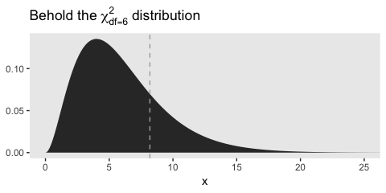
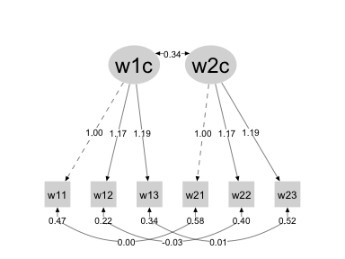
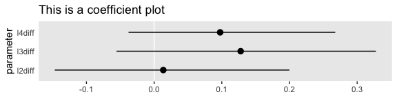
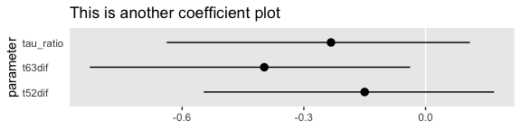

02
================
A Solomon Kurz
2018-11-10

Longitudinal Measurement Invariance
===================================

> Any longitudinal structural model should begin with a complete understanding of the measurement properties of the latent variables used in the analysis. The objective is to ensure that measurement properties of latent variables are stable over time, termed measurement invariance, to avoid mistaking changes in measurement properties for hypothesized changes in the construct. [Millsap and Cham (2011)](https://www.guilford.com/books/Handbook-of-Developmental-Research-Methods/Laursen-Little-Card/9781462513932/reviews) more formally define longitudinal invariance as the case in which the conditional distributions of observed values are unchanging given the same latent variable values over time. (p. 27)

Nested model tests
------------------

"To investigate measurement invariance, statistical tests comparing nested models are conducted to determine whether observed differences are greater than what would be expected due to chance" (p. 27).

### Likelihood ratio test

> The SEM approach makes possible precise statistical comparisons of parameter estimates across groups or over time through imposition of equality constraints. Comparisons should always be made using raw, unstandardized variables, because important variance infor- mation is lost if variables are standardized, potentially leading to incorrect conclusions ([Cudeck, 1989](http://www.statpower.net/Content/319SEM/Reading/Cudeck89.pdf)). Invariance tests are conducted by comparisons of nested models with and without constraints of individual or sets of parameters. Nested models, at minimum, involve the same cases and the same measured variables in the models being compared. Two models are compared that have the same structure, with one model including some restrictions on free parameters (i.e., more degrees of freedom)...
>
> Nested models are generally compared with a chi-square difference test, or more for- mally called a likelihood ratio test, where *Δ**χ*<sup>2</sup> = *χ*<sub>*M*0</sub><sup>2</sup> − *χ*<sub>*M*1</sub><sup>2</sup>. Model M0 is nested within M1, because additional restrictions on the parameter estimates have been made, leading to a model chi-square for M0 that will be equal to or greater than the less restricted model, M1. The difference in chi-square values is compared to the chi-square distribution using degrees of freedom equal to the difference in degrees of freedom from the two models, *Δ**d**f* = *d**f*<sub>*M*0</sub> − *d**f*<sub>*M*1</sub>. (pp. 27--28)

This is all very abstract. Let’s work a quick example. Consider the [Multiple groups portion of the lavaan tutorial](http://lavaan.ugent.be/tutorial/groups.html). In the tutorial, they use the famous `HolzingerSwineford1939` data to fit a 3-factor CFA with IQ-text responses from students from two different schools, Pasteur and Grant\_White. Let’s load the data.

``` r
library(lavaan)

data(HolzingerSwineford1939)
```

The data look like this:

``` r
library(tidyverse)

glimpse(HolzingerSwineford1939)
```

    ## Observations: 301
    ## Variables: 15
    ## $ id     <int> 1, 2, 3, 4, 5, 6, 7, 8, 9, 11, 12, 13, 14, 15, 16, 17, 18, 19, 20, 21, 22, 23, 2...
    ## $ sex    <int> 1, 2, 2, 1, 2, 2, 1, 2, 2, 2, 1, 1, 2, 2, 1, 2, 2, 1, 2, 2, 1, 1, 1, 2, 1, 1, 1,...
    ## $ ageyr  <int> 13, 13, 13, 13, 12, 14, 12, 12, 13, 12, 12, 12, 12, 12, 12, 12, 14, 13, 12, 12, ...
    ## $ agemo  <int> 1, 7, 1, 2, 2, 1, 1, 2, 0, 5, 2, 11, 7, 8, 6, 1, 11, 5, 8, 3, 10, 9, 11, 8, 3, 7...
    ## $ school <fct> Pasteur, Pasteur, Pasteur, Pasteur, Pasteur, Pasteur, Pasteur, Pasteur, Pasteur,...
    ## $ grade  <int> 7, 7, 7, 7, 7, 7, 7, 7, 7, 7, 7, 7, 7, 7, 7, 7, 7, 7, 7, 7, 7, 7, 7, 7, 7, 7, 7,...
    ## $ x1     <dbl> 3.333333, 5.333333, 4.500000, 5.333333, 4.833333, 5.333333, 2.833333, 5.666667, ...
    ## $ x2     <dbl> 7.75, 5.25, 5.25, 7.75, 4.75, 5.00, 6.00, 6.25, 5.75, 5.25, 5.75, 6.00, 4.50, 5....
    ## $ x3     <dbl> 0.375, 2.125, 1.875, 3.000, 0.875, 2.250, 1.000, 1.875, 1.500, 0.750, 2.000, 2.8...
    ## $ x4     <dbl> 2.333333, 1.666667, 1.000000, 2.666667, 2.666667, 1.000000, 3.333333, 3.666667, ...
    ## $ x5     <dbl> 5.75, 3.00, 1.75, 4.50, 4.00, 3.00, 6.00, 4.25, 5.75, 5.00, 3.50, 4.50, 4.00, 4....
    ## $ x6     <dbl> 1.2857143, 1.2857143, 0.4285714, 2.4285714, 2.5714286, 0.8571429, 2.8571429, 1.2...
    ## $ x7     <dbl> 3.391304, 3.782609, 3.260870, 3.000000, 3.695652, 4.347826, 4.695652, 3.391304, ...
    ## $ x8     <dbl> 5.75, 6.25, 3.90, 5.30, 6.30, 6.65, 6.20, 5.15, 4.65, 4.55, 5.70, 5.15, 5.20, 4....
    ## $ x9     <dbl> 6.361111, 7.916667, 4.416667, 4.861111, 5.916667, 7.500000, 4.861111, 3.666667, ...

Here's their initial two-group CFA.

``` r
HS <- '  
visual  =~ x1 + x2 + x3
textual =~ x4 + x5 + x6
speed   =~ x7 + x8 + x9
'

fit_1 <- 
  cfa(HS,
      data = HolzingerSwineford1939,
      group = "school")
```

Notice that last argument in the `cfa()` function, `group = "school"`. With that argument, we instructed lavaan to allow the CFA parameters to vary by `school`. Now consider an alternative model. In this model, we’ll tell lavaan to constrain the loadings to equality between the two groups. Within the `cfa()` function, we’ll do that by specifying `group.equal = c("loadings")`.

``` r
fit_2 <- 
  cfa(HS,
      data = HolzingerSwineford1939,
      group = "school",
      group.equal = c("loadings"))
```

If you’d like, you can use the `summary()` function to examine the model parameters. But for our purposes, let’s jump straight to the relevant fit statistics with the `fitMeasures()` function.

``` r
fitMeasures(fit_1, c("npar", "chisq", "df"))
```

    ##    npar   chisq      df 
    ##  60.000 115.851  48.000

``` r
fitMeasures(fit_2, c("npar", "chisq", "df"))
```

    ##    npar   chisq      df 
    ##  54.000 124.044  54.000

Turns out that `fit_2` has 6 fewer parameters than `fit_1`. This is because among the nine indicators, `x1` through `x9`, three were fixed to 1 by lavaan default in order to define the metric for the latent variances. With our `fit_1` approach, we allowed the remaining 6 indicators to have their loadings vary by `school`. However, `fit_2` required the loadings--but no other model parameters--be equal by `school`. Thus, `fit_2` has 6 fewer parameters. It's also the case that `fit_2` is nested within `fit_1`, we can directly compare their fits with that `chisq` and `df` information.

Based on the formulas from above,

-   `fit_1` = M1, the less restricted model
-   `fit_2` = MO, the more restricted model which is nested in M1

To make things explicit, we can arrange their model fit information in a tibble.

``` r
nested <-
  tibble(parameter = c("chisq", "df"),
         M1 = fitMeasures(fit_1, c("chisq", "df")),
         M0 = fitMeasures(fit_2, c("chisq", "df")))

print(nested)
```

    ## # A tibble: 2 x 3
    ##   parameter    M1    M0
    ##   <chr>     <dbl> <dbl>
    ## 1 chisq      116.  124.
    ## 2 df          48    54

So to get our likelihood ratio test, we need to compute two differences: *Δ**χ*<sup>2</sup> = *χ*<sub>*M*0</sub><sup>2</sup> − *χ*<sub>*M*1</sub><sup>2</sup> and *Δ**d**f* = *d**f*<sub>*M*0</sub> − *d**f*<sub>*M*1</sub>. Within our tibble framework, we can do that with `mutate()`.

``` r
nested <-
  nested %>% 
  mutate(delta = M0 - M1)

print(nested)
```

    ## # A tibble: 2 x 4
    ##   parameter    M1    M0 delta
    ##   <chr>     <dbl> <dbl> <dbl>
    ## 1 chisq      116.  124.  8.19
    ## 2 df          48    54   6

So we can use the *χ*<sup>2</sup> distribution to see how impressed we should be by these differences. Recall the *χ*<sup>2</sup> distribution ranges from 0 to ∞. In r, we can plot its density with the `dchisq()`. All we need to do is specify what range of values we'd like to evaluate that density over and what degree of freedom our *χ*<sup>2</sup> distribution should take. Here we'll do so and plot the results.

``` r
tibble(x = seq(from = 0, to = 30, by = .1)) %>% 
  mutate(density = dchisq(x, df = 6)) %>% 
  
  ggplot(aes(x = x, ymin = 0, ymax = density)) +
  geom_ribbon() +
  geom_vline(xintercept = 8.19, color = "grey67", linetype = 2) +
  ggtitle(expression(paste("Behold the ", chi[df == 6]^2, " distribution"))) +
  coord_cartesian(xlim = 0:25) +
  theme(panel.grid = element_blank())
```



The dashed vertical line shows where our *Δ**χ*<sup>2</sup> value fell on that distribution. It’s not in the central hump, but it’s also not very far off into the right tail. Within the lavaan framework, we can use the `lavTestLRT()` function to compare the models with a formal *χ*<sup>2</sup> different test.

``` r
lavTestLRT(fit_1, fit_2)
```

    ## Chi Square Difference Test
    ## 
    ##       Df    AIC    BIC  Chisq Chisq diff Df diff Pr(>Chisq)
    ## fit_1 48 7484.4 7706.8 115.85                              
    ## fit_2 54 7480.6 7680.8 124.04     8.1922       6     0.2244

That large *p*-value in the rightmost column suggests we should reject the null hypothesis that the simpler nested model, M0, fits the data substantially worse than the more complicated parent model, M1. In case you were curious, we can use the `qchisq()` function to tell us how large that value would need to be before we’d reject the null hypothesis at the *α* = .95 level.

``` r
qchisq(.95, df = 6)
```

    ## [1] 12.59159

Back to the text, we learn further that

> The simple chi-square difference test is not appropriate unless data are multivariate nor- mal and standard maximum likelihood (ML) estimation is used. With the Satorra–Bentler scaled chi-square for nonnormal data or the Yuan–Bentler scaled chi-square for nonnor- mal missing data ([Yuan & Bentler, ~~2007~~ 2006](https://www.sciencedirect.com/science/article/pii/S0047259X05000928)), the chi-square difference test can be computed using the following formula ([Satorra, 2000](https://econ-papers.upf.edu/papers/395.pdf); [Satorra & Bentler, 2001](https://www.researchgate.net/publication/24063391_A_Scaled_Difference_Chi-Square_Test_Statistic_for_Moment_Structure_Analysis)):

$$\\Delta \\chi\_{SB}^2 = \\frac{\\chi\_{M0}^2 - \\chi\_{M1}^2}{(df\_{M0} scf\_{M0} - df\_{M1} scf\_{M1}) / df\_{M0} - df\_{M1}}$$

> The difference in chi-square values is scaled by the difference in degrees of freedom and the scaling correction factor (scf) for the two models, a weighting value based on multi-variate kurtosis used in computing the Satorra–Bentler scaled chi-square. The scf is equal to the ratio of traditional ML chi-square to the Satorra–Bentler scale chi-square for the SB model, or scf = *χ*<sub>*M**L*</sub><sup>2</sup>/*χ*<sub>*S**B*</sub><sup>2</sup> .1 Because the ML estimate is inflated proportionate to the ML SB amount of multivariate kurtosis, the ratio of the scf becomes larger with greater kurtosis.

When we used the `lavTestLRT()` function, above, we used the default ML estimator. If we’d like to switch to a *χ*<sub>*S**B*</sub><sup>2</sup>, we have several options available through the `method` argument. But before we can make use of them, we need to refit the models using a robust estimator. I recommend `"MLR"`.

``` r
fit_1 <- 
  cfa(HS,
      data = HolzingerSwineford1939,
      group = "school",
      estimator = "MLR")

fit_2 <- 
  cfa(HS,
      data = HolzingerSwineford1939,
      group = "school",
      group.equal = c("loadings"),
      estimator = "MLR")
```

Now we're ready to compare the results from three robust *χ*<sup>2</sup> difference tests, all derived from [Albert Satorra](https://www.barcelonagse.eu/people/satorra-albert)'s work (with and without [Peter Bentler](https://www.psych.ucla.edu/faculty/page/gisele)).

``` r
lavTestLRT(fit_1, fit_2, method = "satorra.bentler.2001")
```

    ## Scaled Chi Square Difference Test (method = "satorra.bentler.2001")
    ## 
    ##       Df    AIC    BIC  Chisq Chisq diff Df diff Pr(>Chisq)
    ## fit_1 48 7484.4 7706.8 115.85                              
    ## fit_2 54 7480.6 7680.8 124.04     6.5672       6     0.3627

``` r
lavTestLRT(fit_1, fit_2, method = "satorra.bentler.2010")
```

    ## Warning in lavaan(model = PT.M1.extended, slotOptions = Options, slotSampleStats = m1@SampleStats, : lavaan WARNING: not all elements of the gradient are (near) zero;
    ##                   the optimizer may not have found a local solution;
    ##                   use lavInspect(fit, "optim.gradient") to investigate

    ## Scaled Chi Square Difference Test (method = "satorra.bentler.2010")
    ## 
    ##       Df    AIC    BIC  Chisq Chisq diff Df diff Pr(>Chisq)
    ## fit_1 48 7484.4 7706.8 115.85                              
    ## fit_2 54 7480.6 7680.8 124.04     5.3227       6     0.5031

``` r
lavTestLRT(fit_1, fit_2, method = "satorra.2000")
```

    ## Scaled Chi Square Difference Test (method = "satorra.2000")
    ## 
    ##       Df    AIC    BIC  Chisq Chisq diff Df diff Pr(>Chisq)
    ## fit_1 48 7484.4 7706.8 115.85                              
    ## fit_2 54 7480.6 7680.8 124.04     6.4218       6     0.3776

The subsetting code is a little hairy, but you can see what the scaling factors were in the two fits like this.

``` r
fit_1@Fit@test[[2]]$scaling.factor
```

    ## [1] 0.9516238

``` r
fit_2@Fit@test[[2]]$scaling.factor
```

    ## [1] 0.9844925

If that looks like magic, to you, execute `fit_1 %>% str()` to inspect the contents of the model fit. That might clarify where that subsetting code came from. And with a combination of `fitMeasures()` and fit subsetting, we can extract the necessary values from out fits to compute the *χ*<sub>*S**B*</sub><sup>2</sup> by hand.

``` r
chisq_M1 <- fitMeasures(fit_1, "chisq") 
chisq_M0 <- fitMeasures(fit_2, "chisq")
df_M1    <- fitMeasures(fit_1, "df")
df_M0    <- fitMeasures(fit_2, "df")
scf_M1   <- fit_1@Fit@test[[2]]$scaling.factor
scf_M0   <- fit_2@Fit@test[[2]]$scaling.factor

(chisq_M0 - chisq_M1) / ((df_M0 * scf_M0 - df_M1 * scf_M1) / (df_M0 - df_M1))
```

    ## chisq 
    ## 6.567

If you look above, you’ll see that value corresponds to the one we computed with the `lavTestLRT()` function and the `method = "satorra.bentler.2001"` argument.

### Effect size

> In conducting chi-square difference tests for determining longitudinal invariance, it is important to distinguish between statistical significance and practical importance. There may be many circumstances where statistical power to detect differences is high, even for rather trivial departures from invariance. In such circumstances, researchers may choose to consider the assumption of invariance to be essentially met for practical purposes, concluding that any bias that occurs from violating invariance assumptions is of minor importance. Decisions about the magnitude of the violations will need to depend on the researcher’s knowledge about the topic, the nature of the research question, and the stand- ards of practice in the area of research, however. (p. 29)

One way to assess magnitude is with

> the *w* effect size estimate used for contingency chi-square effect size computations.
>
> $$w = \\sqrt{\\frac{\\Delta \\chi^2}{N (\\Delta df)}}$$
>
> The value of *w* is equal to *p**h**i* (and Pearson’s correlation coefficient) in the 2 × 2 contingency chi-square or Cramer’s V in the *n* × *m* case. The advantage of this index is that it can be used to reference standard conventions for small (*w* = .1), medium (*w* = .3), and large (*w* = .5) effect sizes suggested by [Cohen (1992)](http://www.bwgriffin.com/workshop/Sampling%20A%20Cohen%20tables.pdf). (pp. 29--30)

Instead of exploring this with the hypothetical example in the text, let’s continue on with our example using the `HolzingerSwineford1939` data. First, we need to determine what our *N* was.

``` r
HolzingerSwineford1939 %>% 
  count()
```

    ## # A tibble: 1 x 1
    ##       n
    ##   <int>
    ## 1   301

We already know our *Δ**χ*<sup>2</sup> is about 6.6 and the *Δ**d**f* = 6, we can compute *w* by hand like this.

``` r
sqrt(6.6 / (301 * 6))
```

    ## [1] 0.06045234

That's pretty tiny, isn't it?

Fit indices are another way to compare effect sizes. The authors of several simulation studies (e.g., [Cheung & Rensvold, 2002](https://www.tandfonline.com/doi/abs/10.1207/S15328007SEM0902_5); [Fan & Sivo, 2009](https://www.researchgate.net/publication/238865189_Using_DGoodness-of-Fit_Indexes_in_Assessing_Mean_Structure_Invariance); [Widaman, Ferrer, & Conger. (2010)](https://www.researchgate.net/publication/43023975_Factorial_Invariance_Within_Longitudinal_Structural_Equation_Models_Measuring_the_Same_Construct_Across_Time))

> have investigated how a variety of difference-of-fit measures perform under various conditions. Results suggest that many indices have undesirable properties, such as values that were correlated with overall fit of the model, model complexity, or expected values that were not equal to 0. (p. 31)

Among these, Newsom singled out McDonald’s Centrality Index (Mc; McDonald, 1989), which is defined as

$$\\text{Mc} = \\text{exp} \\bigg\[ - \\frac{1}{2} \\bigg( \\frac{\\chi^2 - df}{N - 1} \\bigg) \\bigg\] $$
 &gt; The difference in fit between the two models, *Δ*Mc, can then be calculated by subtracting the Mc for M0 from the Mc for M1. Note that, in contrast to the direction of difference taken for *Δ**χ*<sup>2</sup>, the *Δ*Mc is computed by subtracting the more constrained model (M0) from the less constrained model (M1), as higher values of Mc indicate better fit and the less constrained model will have a value equal to or greater than that of the more constrained model. Although a cutoff for *Δ*Mc has been suggested (*Δ*Mc &gt; .02 indicating a difference; Fan & Sivo, 2009), it is important to keep in mind that the objective of the *Δ*Mc or other differences in alternative fit measures is to gauge the magnitude of effect rather than to determine statistical significance. (p. 31)

To practice, we'll compute the Mc values for each of our two `HolzingerSwineford1939` models and then compute their difference.

``` r
n <- 301

(Mc_M1 <- exp(-.5 * ((chisq_M1 - df_M1) / (n - 1))) %>% as.numeric())
```

    ## [1] 0.8930742

``` r
(Mc_M0 <- exp(-.5 * ((chisq_M0 - df_M0) / (n - 1))) %>% as.numeric())
```

    ## [1] 0.8898172

``` r
Mc_M1 - Mc_M0
```

    ## [1] 0.003257042

And instead of doing that all by hand, you can use the `lavaan::fitMeasures()` function to compute Mc for you. Just remember that in that context, you refer to it as `"mfi"`.

``` r
fitMeasures(fit_1, "mfi")
```

    ##   mfi 
    ## 0.893

``` r
fitMeasures(fit_2, "mfi")
```

    ##  mfi 
    ## 0.89

``` r
fitMeasures(fit_1, "mfi") - fitMeasures(fit_2, "mfi")
```

    ##   mfi 
    ## 0.003

No matter which way we do it, the effect size for the differences in how well our two models fit is quite small.

### Comments

The CFI has also been recommended in some of the simulation studies. But Newsom cautioned that it might not work well when investigating invariance by intercepts and latent means. Here it is in our working example.

``` r
fitMeasures(fit_1, "cfi")
```

    ##   cfi 
    ## 0.923

``` r
fitMeasures(fit_2, "cfi")
```

    ##   cfi 
    ## 0.921

``` r
fitMeasures(fit_1, "cfi") - fitMeasures(fit_2, "cfi")
```

    ##   cfi 
    ## 0.002

Invariance testing strategies
-----------------------------

> The order in which sets of parameters (e.g., loadings, measurement residuals, measurement intercepts) should be compared has been the focus of many discussions of measurement invariance (e.g., [Jöreskog, 1971](https://www.researchgate.net/publication/24061996_Simultaneous_Factor_Analysis_in_Several_Populations); [Taris, Bok, & Meijer, 1998](https://www.tandfonline.com/doi/abs/10.1080/00223989809599169); [Schmitt & Kuljanin, 2008](https://www.researchgate.net/publication/222363518_Measurement_Invariance_Review_of_Practice_and_Implications); [Vandenberg & Lance, 2000](https://www.researchgate.net/publication/234021997_A_Review_and_Synthesis_of_the_Measurement_Invariance_Literature_Suggestions_Practices_and_Recommendations_for_Organizational_Research); [Widaman & Reise, 1997](https://www.researchgate.net/publication/232590959_Exploring_the_measurement_invariance_of_psychological_instruments_Applications_in_the_substance_use_domain))...
>
> ... Jöreskog recommended a step that established that the same model is appropriate in each of the groups, usually referred to as *configural invariance*. Assuming configural invariance, he then recommended a progressive set of nested tests for specific groups of parameters, each tested while constraining the prior matrices to be equal: loadings, factor variances, and measurement residuals.
>
> Meredith ([1964](https://www.researchgate.net/publication/24061693_Notes_on_factorial_invariance), [1993](https://www.researchgate.net/publication/24063068_Measurement_Invariance_Factor_Analysis_and_Factorial_Invariance)) proposed a classification terminology for levels of measurement invariance, which is the most widely used. The terminology mirrors the classic testing concepts of parallel, tau-equivalent, and congeneric tests ([Lord & Novick, 1968](https://books.google.com/books/about/Statistical_Theories_of_Mental_Test_Scor.html?id=0nkMX_MqEQ4C)). *Weak factorial invariance* refers to the case when loadings are equal over time but intercepts, unique variances, latent means, and latent variances vary over time. *Strong factorial invariance* refers to the case when loadings and intercepts do not vary but unique variances, latent means, and latent variances vary over time. *Strict factorial invariance* involves invariant loadings, intercepts, and measurement residuals. *Structural factorial invariance* involves invariant factor means, factor variances, loadings, intercepts, and measurement residuals. (p. 32)

When some--hopefully most--but not all parameters in a group are invariant, we often speak of *partial measurement invariance*

"Nearly all authors suggest that invariance of measurement residuals is not required in order to proceed with substantive hypotheses about group differences in means or structural parameters" (p. 33).

Configural measurement invariance
---------------------------------

> Establishing configural invariance in the longitudinal case simply involves separate cross-sectional confirmatory factor models to establish that the measure has the same single- or multiple-factor structure at each time point (i.e., indicators load on the same factors at each wave), the model fits well at each time point, indicators load on the same factors, and loadings are all of acceptable magnitude. (p. 33)

Loadings and factor variances
-----------------------------

### Loadings

Invariance by loadings, *weak factorial invariance*, is also sometimes called *metric invariance*.

> When loadings for a full set of indicators are tested for invariance, the identification approaches (i.e., referent indicator identification, factor identification, or effects coding identification) are statistically equivalent. However, because factor identification, which constrains factor variances to 1, also implies that factor variances are equal, tests conducted with factor identification will only be equal to tests conducted with referent or effects coding identification if equality constraints on factor variances are included in the test. (p. 33)

### Example 2.1: Loadings

``` r
socex1_names <- 
  c("w1vst1", "w1vst2", "w1vst3", "w2vst1", "w2vst2", "w2vst3", "w3vst1", "w3vst2", "w3vst3", "w1unw1", "w1unw2", "w1unw3", "w2unw1", "w2unw2", "w2unw3", "w3unw1", "w3unw2", "w3unw3", "w1dboth","w1dsad", "w1dblues", "w1ddep", "w2dboth", "w2dsad","w2dblues", "w2ddep", "w3dboth", "w3dsad", "w3dblues", "w3ddep", "w1marr2", "w1happy", "w1enjoy", "w1satis", "w1joyful", "w1please", "w2happy", "w2enjoy", "w2satis", "w2joyful", "w2please", "w3happy", "w3enjoy", "w3satis", "w3joyful", "w3please", "w1lea", "w2lea", "w3lea")

socex1 <- 
  read_table2("data/socex1.dat",
              col_names = F) %>% 
  set_names(socex1_names)
```

    ## Parsed with column specification:
    ## cols(
    ##   .default = col_integer(),
    ##   X37 = col_double(),
    ##   X38 = col_double(),
    ##   X39 = col_double(),
    ##   X40 = col_double(),
    ##   X41 = col_double(),
    ##   X42 = col_double(),
    ##   X43 = col_double(),
    ##   X44 = col_double(),
    ##   X45 = col_double(),
    ##   X46 = col_double()
    ## )

    ## See spec(...) for full column specifications.

``` r
head(socex1)
```

    ## # A tibble: 6 x 49
    ##   w1vst1 w1vst2 w1vst3 w2vst1 w2vst2 w2vst3 w3vst1 w3vst2 w3vst3 w1unw1 w1unw2 w1unw3 w2unw1 w2unw2
    ##    <int>  <int>  <int>  <int>  <int>  <int>  <int>  <int>  <int>  <int>  <int>  <int>  <int>  <int>
    ## 1      0      1      0      3      3      2      3      2      2      2      2      3      4      4
    ## 2      3      3      4      3      3      3      2      3      3      1      3      2      3      2
    ## 3      2      2      3      1      0      2      2      2      1      2      1      1      1      3
    ## 4      2      2      3      1      2      2      2      2      2      4      3      3      3      2
    ## 5      3      2      2      2      2      2      3      3      2      2      4      3      2      3
    ## 6      4      4      4      4      4      4      4      4      4      0      2      1      2      1
    ## # ... with 35 more variables: w2unw3 <int>, w3unw1 <int>, w3unw2 <int>, w3unw3 <int>,
    ## #   w1dboth <int>, w1dsad <int>, w1dblues <int>, w1ddep <int>, w2dboth <int>, w2dsad <int>,
    ## #   w2dblues <int>, w2ddep <int>, w3dboth <int>, w3dsad <int>, w3dblues <int>, w3ddep <int>,
    ## #   w1marr2 <int>, w1happy <int>, w1enjoy <int>, w1satis <int>, w1joyful <int>, w1please <int>,
    ## #   w2happy <dbl>, w2enjoy <dbl>, w2satis <dbl>, w2joyful <dbl>, w2please <dbl>, w3happy <dbl>,
    ## #   w3enjoy <dbl>, w3satis <dbl>, w3joyful <dbl>, w3please <dbl>, w1lea <int>, w2lea <int>,
    ## #   w3lea <int>

Here we’ll specify and fit the unconstrained configural invariance model and the constrained weak invariance model, `model2.0` and `model2.1`, respectively. Do note that in Newsom’s `ex2-1.R` file, he only showed code for `model2.1`.

``` r
# This is the unconstrained model
model2.0 <- '
# loadings
w1comp =~ w1vst1 + w1vst2 + w1vst3
w2comp =~ w2vst1 + w2vst2 + w2vst3

# residual covariances
w1vst1 ~~ w2vst1 
w1vst2 ~~ w2vst2 
w1vst3 ~~ w2vst3
'

# This is the model proposing weak invariance
model2.1 <- '
# loadings
# we imposed equality constraints by the ways we named the loadings
w1comp =~ w1vst1 + a*w1vst2 + b*w1vst3
w2comp =~ w2vst1 + a*w2vst2 + b*w2vst3

# residual covariances
w1vst1 ~~ w2vst1 
w1vst2 ~~ w2vst2 
w1vst3 ~~ w2vst3
'

fit2.0 <- sem(model2.0, data = socex1)
fit2.1 <- sem(model2.1, data = socex1)
```

Let’s just take a look at the `summary()` for `fit2.1`. I leave inspecting that for `fit2.0` as an exercise for the interested reader.

``` r
summary(fit2.1, 
        fit.measures = T,
        rsquare = T,
        standardized = T)
```

    ## lavaan 0.6-3 ended normally after 25 iterations
    ## 
    ##   Optimization method                           NLMINB
    ##   Number of free parameters                         16
    ##   Number of equality constraints                     2
    ## 
    ##   Number of observations                           574
    ## 
    ##   Estimator                                         ML
    ##   Model Fit Test Statistic                      12.077
    ##   Degrees of freedom                                 7
    ##   P-value (Chi-square)                           0.098
    ## 
    ## Model test baseline model:
    ## 
    ##   Minimum Function Test Statistic             1735.163
    ##   Degrees of freedom                                15
    ##   P-value                                        0.000
    ## 
    ## User model versus baseline model:
    ## 
    ##   Comparative Fit Index (CFI)                    0.997
    ##   Tucker-Lewis Index (TLI)                       0.994
    ## 
    ## Loglikelihood and Information Criteria:
    ## 
    ##   Loglikelihood user model (H0)              -4411.360
    ##   Loglikelihood unrestricted model (H1)      -4405.322
    ## 
    ##   Number of free parameters                         14
    ##   Akaike (AIC)                                8850.721
    ##   Bayesian (BIC)                              8911.658
    ##   Sample-size adjusted Bayesian (BIC)         8867.214
    ## 
    ## Root Mean Square Error of Approximation:
    ## 
    ##   RMSEA                                          0.036
    ##   90 Percent Confidence Interval          0.000  0.068
    ##   P-value RMSEA <= 0.05                          0.728
    ## 
    ## Standardized Root Mean Square Residual:
    ## 
    ##   SRMR                                           0.028
    ## 
    ## Parameter Estimates:
    ## 
    ##   Information                                 Expected
    ##   Information saturated (h1) model          Structured
    ##   Standard Errors                             Standard
    ## 
    ## Latent Variables:
    ##                    Estimate  Std.Err  z-value  P(>|z|)   Std.lv  Std.all
    ##   w1comp =~                                                             
    ##     w1vst1            1.000                               0.902    0.796
    ##     w1vst2     (a)    1.166    0.041   28.422    0.000    1.051    0.914
    ##     w1vst3     (b)    1.188    0.043   27.672    0.000    1.071    0.879
    ##   w2comp =~                                                             
    ##     w2vst1            1.000                               0.721    0.689
    ##     w2vst2     (a)    1.166    0.041   28.422    0.000    0.840    0.799
    ##     w2vst3     (b)    1.188    0.043   27.672    0.000    0.856    0.764
    ## 
    ## Covariances:
    ##                    Estimate  Std.Err  z-value  P(>|z|)   Std.lv  Std.all
    ##  .w1vst1 ~~                                                             
    ##    .w2vst1            0.001    0.026    0.025    0.980    0.001    0.001
    ##  .w1vst2 ~~                                                             
    ##    .w2vst2           -0.032    0.021   -1.513    0.130   -0.032   -0.110
    ##  .w1vst3 ~~                                                             
    ##    .w2vst3            0.014    0.025    0.533    0.594    0.014    0.032
    ##   w1comp ~~                                                             
    ##     w2comp            0.335    0.039    8.613    0.000    0.516    0.516
    ## 
    ## Variances:
    ##                    Estimate  Std.Err  z-value  P(>|z|)   Std.lv  Std.all
    ##    .w1vst1            0.471    0.034   13.997    0.000    0.471    0.367
    ##    .w1vst2            0.218    0.028    7.775    0.000    0.218    0.165
    ##    .w1vst3            0.338    0.033   10.343    0.000    0.338    0.227
    ##    .w2vst1            0.576    0.042   13.777    0.000    0.576    0.526
    ##    .w2vst2            0.400    0.038   10.505    0.000    0.400    0.362
    ##    .w2vst3            0.522    0.044   11.869    0.000    0.522    0.416
    ##     w1comp            0.814    0.068   11.951    0.000    1.000    1.000
    ##     w2comp            0.519    0.046   11.219    0.000    1.000    1.000
    ## 
    ## R-Square:
    ##                    Estimate
    ##     w1vst1            0.633
    ##     w1vst2            0.835
    ##     w1vst3            0.773
    ##     w2vst1            0.474
    ##     w2vst2            0.638
    ##     w2vst3            0.584

We'll use `lavTestLRT()` to execute the *χ*<sup>2</sup> difference test.

``` r
lavTestLRT(fit2.0, fit2.1)
```

    ## Chi Square Difference Test
    ## 
    ##        Df    AIC    BIC   Chisq Chisq diff Df diff Pr(>Chisq)
    ## fit2.0  5 8852.6 8922.2  9.9108                              
    ## fit2.1  7 8850.7 8911.7 12.0767      2.166       2     0.3386

And we'll use *Δ*Mc to get a sense of the effect size.

``` r
fitMeasures(fit2.0, "mfi") - fitMeasures(fit2.1, "mfi")
```

    ## mfi 
    ##   0

The difference was so small it was indistinguishable from zero, within rounding error.

To help make this more concrete, we might use `semPlot::semPaths()` to make the path diagram.

``` r
library(semPlot)

semPaths(fit2.1,
         style = "lisrel",
         edge.color = "black",
         color = "grey85",
         sizeMan = 8,
         sizeLat = 16,
         sizeLat2 = 12,
         label.scale = T,
         label.cex = 1.25,
         edge.label.cex = 1.25,
         borders = F,
         mar = c(10, 5, 10, 5),
         whatLabel = "est")
```



Note how the loading for `w12` on the latent variable `w1c` is the same as the loading of `w22` on the latent variable `w2c`. That's what we mean by weak factorial invariance, invariance of factor loadings across time points.

Factor variances
----------------

> Tests of the equality of factor variances should not be conducted without also imposing equality constraints on all loadings for the factor. The reason is that without simultaneous constraints on factor loadings, constraining factor variances will only force the estimates of the loadings to change in compensation ([Hancock et al., 2009](https://www.researchgate.net/publication/309108981_The_tenuousness_of_invariance_tests_within_multisample_covariance_and_mean_structure_models)). (p. 34)

### Example 2.2: Factor variances

The first example in the text follows the code in Newsom's `ex2-2a.R` file. Here we fit a model with unconstrained loadings, but with the latent variances constrained to equality across the two time points.

``` r
# This is the model proposing weak invariance
model2.2a <- '
# loadings
# we are freely estimating them, here
w1comp =~ w1vst1 + w1vst2 + w1vst3
w2comp =~ w2vst1 + w2vst2 + w2vst3

# latent variances
# the equality constraint constraints are imposed by the way we named the variances
w1comp ~~ a*w1comp
w2comp ~~ a*w2comp

# residual covariances
w1vst1 ~~ w2vst1 
w1vst2 ~~ w2vst2 
w1vst3 ~~ w2vst3
'

fit2.2a <- sem(model2.2a, data = socex1)
fitMeasures(fit2.2a, c("chisq", "df", "pvalue"))
```

    ##  chisq     df pvalue 
    ## 24.664  6.000  0.000

Just as in the text, the `fitMeasures()` output suggests the model fit the data poorly. Here's the *χ*<sup>2</sup> difference test.

``` r
lavTestLRT(fit2.0, fit2.2a)
```

    ## Chi Square Difference Test
    ## 
    ##         Df    AIC    BIC   Chisq Chisq diff Df diff Pr(>Chisq)    
    ## fit2.0   5 8852.6 8922.2  9.9108                                  
    ## fit2.2a  6 8865.3 8930.6 24.6644     14.754       1  0.0001225 ***
    ## ---
    ## Signif. codes:  0 '***' 0.001 '**' 0.01 '*' 0.05 '.' 0.1 ' ' 1

That's a pretty big difference. But the *w* estimate might help clarify the magnitude of the difference.

``` r
sqrt(14.754 / (574 * 1))
```

    ## [1] 0.1603241

Our *w* suggests the difference is on the small side. Here's the *Δ*Mc.

``` r
fitMeasures(fit2.0, "mfi") - fitMeasures(fit2.2a, "mfi")
```

    ##   mfi 
    ## 0.012

The *Δ*Mc is small, well below the suggested cutoff value of .02.

For the second example, we use code based on Newsom's `ex2-2b.R` file. We're still specifying unconstrained loadings, yet constraining the latent variances constrained to equality across the two time points. However, this time we're using a different indicator to scale the latent variance(s).

``` r
# This is the unconstrained model
model2.0b <- '
# loadings
w1comp =~ NA*w1vst1 + w1vst2 + 1*w1vst3
w2comp =~ NA*w2vst1 + w2vst2 + 1*w2vst3

# residual covariances
w1vst1 ~~ w2vst1 
w1vst2 ~~ w2vst2 
w1vst3 ~~ w2vst3
'

# This is the model proposing weak invariance
model2.2b <- '
# loadings
# we are freely estimating them, here
w1comp =~ NA*w1vst1 + w1vst2 + 1*w1vst3
w2comp =~ NA*w2vst1 + w2vst2 + 1*w2vst3

# latent variances
# the equality constraint constraints are imposed by the way we named the variances
w1comp ~~ a*w1comp
w2comp ~~ a*w2comp

# residual covariances
w1vst1 ~~ w2vst1 
w1vst2 ~~ w2vst2 
w1vst3 ~~ w2vst3
'

fit2.0b <- sem(model2.0b, data = socex1)
fit2.2b <- sem(model2.2b, data = socex1)
```

The fit measures are the same for the two versions of the unconstrained model.

``` r
fitMeasures(fit2.0, c("chisq", "df", "pvalue"))
```

    ##  chisq     df pvalue 
    ##  9.911  5.000  0.078

``` r
fitMeasures(fit2.0b, c("chisq", "df", "pvalue"))
```

    ##  chisq     df pvalue 
    ##  9.911  5.000  0.078

But now the models with the latent variances constrained to equality differ by their *χ*<sup>2</sup> statistics.

``` r
fitMeasures(fit2.2a, c("chisq", "df", "pvalue"))
```

    ##  chisq     df pvalue 
    ## 24.664  6.000  0.000

``` r
fitMeasures(fit2.2b, c("chisq", "df", "pvalue"))
```

    ##  chisq     df pvalue 
    ## 17.595  6.000  0.007

The LRT still leads us to reject the null hypothesis of no difference in model fit after constraining the latent variances. But we might want to consult the effect sizes to get a sense of magnitude.

``` r
lavTestLRT(fit2.0b, fit2.2b)
```

    ## Chi Square Difference Test
    ## 
    ##         Df    AIC    BIC   Chisq Chisq diff Df diff Pr(>Chisq)   
    ## fit2.0b  5 8852.6 8922.2  9.9108                                 
    ## fit2.2b  6 8858.2 8923.5 17.5950     7.6843       1    0.00557 **
    ## ---
    ## Signif. codes:  0 '***' 0.001 '**' 0.01 '*' 0.05 '.' 0.1 ' ' 1

Our new *w* is still within the small effect size range.

``` r
sqrt(7.6843 / (574 * 1))
```

    ## [1] 0.1157034

The *Δ*Mc is still pretty small.

``` r
fitMeasures(fit2.0b, "mfi") - fitMeasures(fit2.2b, "mfi")
```

    ##   mfi 
    ## 0.006

In the middle of page 35, Newsome then pointed out what the various factor variances were in the two versions of the unconstrained model, `fit2.0` and `fit2.0b`. Let's introduce the `parameterEstimates()` function.

``` r
parameterEstimates(fit2.0)
```

    ##       lhs op    rhs    est    se      z pvalue ci.lower ci.upper
    ## 1  w1comp =~ w1vst1  1.000 0.000     NA     NA    1.000    1.000
    ## 2  w1comp =~ w1vst2  1.159 0.048 24.360  0.000    1.066    1.252
    ## 3  w1comp =~ w1vst3  1.156 0.049 23.659  0.000    1.060    1.252
    ## 4  w2comp =~ w2vst1  1.000 0.000     NA     NA    1.000    1.000
    ## 5  w2comp =~ w2vst2  1.173 0.081 14.419  0.000    1.013    1.332
    ## 6  w2comp =~ w2vst3  1.284 0.088 14.556  0.000    1.111    1.457
    ## 7  w1vst1 ~~ w2vst1 -0.001 0.026 -0.045  0.965   -0.052    0.050
    ## 8  w1vst2 ~~ w2vst2 -0.030 0.021 -1.417  0.156   -0.073    0.012
    ## 9  w1vst3 ~~ w2vst3  0.013 0.025  0.509  0.610   -0.037    0.063
    ## 10 w1vst1 ~~ w1vst1  0.469 0.034 13.798  0.000    0.402    0.536
    ## 11 w1vst2 ~~ w1vst2  0.212 0.029  7.337  0.000    0.155    0.268
    ## 12 w1vst3 ~~ w1vst3  0.346 0.033 10.511  0.000    0.281    0.410
    ## 13 w2vst1 ~~ w2vst1  0.585 0.043 13.557  0.000    0.500    0.669
    ## 14 w2vst2 ~~ w2vst2  0.419 0.042  9.946  0.000    0.337    0.502
    ## 15 w2vst3 ~~ w2vst3  0.490 0.049  9.900  0.000    0.393    0.587
    ## 16 w1comp ~~ w1comp  0.834 0.074 11.206  0.000    0.688    0.980
    ## 17 w2comp ~~ w2comp  0.488 0.059  8.261  0.000    0.372    0.603
    ## 18 w1comp ~~ w2comp  0.331 0.039  8.442  0.000    0.254    0.407

The `parameterEstimates()` function returned a data frame with summary information on all the model parameters. Because the parameter names are complex, they've been broken down into the first three columns. With a little tidyverse-style filtering, we can reduce that output to a more manageable size.

``` r
parameterEstimates(fit2.0) %>% 
  filter(op != "=~",
         lhs %in% c("w1comp", "w2comp"))
```

    ##      lhs op    rhs       est         se         z       pvalue  ci.lower  ci.upper
    ## 1 w1comp ~~ w1comp 0.8340831 0.07442858 11.206490 0.000000e+00 0.6882057 0.9799604
    ## 2 w2comp ~~ w2comp 0.4875609 0.05901685  8.261384 2.220446e-16 0.3718900 0.6032318
    ## 3 w1comp ~~ w2comp 0.3306650 0.03916882  8.442046 0.000000e+00 0.2538955 0.4074345

Now we have the two latent variances and their covariance. Here's the same output for `fit2.2b`.

``` r
parameterEstimates(fit2.0b) %>% 
  filter(op != "=~",
         lhs %in% c("w1comp", "w2comp")) %>% 
  mutate_if(is.double, round, digits = 3)
```

    ##      lhs op    rhs   est    se      z pvalue ci.lower ci.upper
    ## 1 w1comp ~~ w1comp 1.115 0.088 12.721      0    0.943    1.287
    ## 2 w2comp ~~ w2comp 0.804 0.081  9.895      0    0.645    0.963
    ## 3 w1comp ~~ w2comp 0.491 0.055  8.956      0    0.383    0.598

Note how we used that last `mutate_if()` line to reduce number of decimal places in the output.

> These examples illustrate that equality tests of factor variances should only be conducted when all factor loadings also are constrained to be equal over time. When all non-referent loadings are set equal in the constrained model, the chi-square is the same regardless of the referent. To demonstrate, longitudinal invariance of the companionship factor was tested again, this time by comparing a model with the factor variances con- strained to be equal to a model with non-referent loadings constrained to be equal. (p. 35)

To do that, we'll use code based on Newsom's `ex2-2c.R` file.

``` r
# This is the model proposing weak invariance
model2.2c <- '
# loadings
# we are freely estimating them, here
w1comp =~ w1vst1 + a*w1vst2 + b*w1vst3
w2comp =~ w2vst1 + a*w2vst2 + b*w2vst3

# latent variances
# the equality constraint constraints are imposed by the way we named the variances
w1comp ~~ c*w1comp
w2comp ~~ c*w2comp

# residual covariances
w1vst1 ~~ w2vst1 
w1vst2 ~~ w2vst2 
w1vst3 ~~ w2vst3
'

fit2.2c <- sem(model2.2c, data = socex1)
```

This model still didn't fit the data well.

``` r
fitMeasures(fit2.2c, c("chisq", "df", "pvalue"))
```

    ##  chisq     df pvalue 
    ## 37.553  8.000  0.000

In this case, the less restrictive model was the one imposing weak factorial invariance, `fit2.1`, which fit the data well.

``` r
fitMeasures(fit2.1, c("chisq", "df", "pvalue"))
```

    ##  chisq     df pvalue 
    ## 12.077  7.000  0.098

The LRT continues to indicate we might should null hypothesis of no difference in model fit after constraining the latent variances.

``` r
lavTestLRT(fit2.1, fit2.2c)
```

    ## Chi Square Difference Test
    ## 
    ##         Df    AIC    BIC  Chisq Chisq diff Df diff Pr(>Chisq)    
    ## fit2.1   7 8850.7 8911.7 12.077                                  
    ## fit2.2c  8 8874.2 8930.8 37.553     25.476       1  4.478e-07 ***
    ## ---
    ## Signif. codes:  0 '***' 0.001 '**' 0.01 '*' 0.05 '.' 0.1 ' ' 1

Our new *w* estimate is square within the middle of the small effect size range.

``` r
sqrt(25.476 / (574 * 1))
```

    ## [1] 0.2106734

The *Δ*Mc is just over Fan and Sivo's (2009) suggested threshold.

``` r
fitMeasures(fit2.1, "mfi") - fitMeasures(fit2.2c, "mfi")
```

    ##   mfi 
    ## 0.021

Specific loading tests
----------------------

> Metric invariance tests that focus on only a subset of loadings are complicated by the interdependence of factor loadings and factor variances. This issue, sometimes termed the standardization problem ([Cheung & Rensvold, 1999](https://www.researchgate.net/publication/276959328_Testing_Factorial_Invariance_Across_Groups_A_Reconceptualization_and_Proposed_New_Method); [Johnson, Meade, & DuVernet, 2009](https://www.researchgate.net/publication/233307244_The_Role_of_Referent_Indicators_in_Tests_of_Measurement_Invariance)), makes it challenging to identify the source of noninvariance when the omnibus test of loadings is rejected. When only a subset of loadings are tested for invariance, the choice of referent, or how the factor is "standardized," may lead to erroneous conclusions about which specific loadings differ. As shown in Equation (1.7), any two loadings of the same factor are proportionate to one another, and, as a consequence, a test of invariance of individual loadings will also involve a test of the invariance of loading proportions.

Equation 1.7, recal, showed "that any loading from one identification approach can be obtained from a simple ratio of two loadings obtained from the other identification approach" (p. 5). Here it is, again:

$$\\lambda\_{21}' = \\frac{\\lambda\_{21}}{\\lambda\_{11}}$$

Various authors have proposed methods to grapple with the issue. Recently, [Cheung and Lau (2012)](https://www.researchgate.net/publication/258174087_A_Direct_Comparison_Approach_for_Testing_Measurement_Invariance) "proposed a simultaneous test of the invariance of all factor-ratios and suggested a bias-corrected bootstrap approach to significance, but this strategy requires software that can implement complex equality constraints and bootstrapping" (p. 36). Happily, R has those handled. In the next section, we'll practice.

### Example 2.3: Tests of specific factor loadings

Here we'll execute a simultaneous test of longitudinal invariance of the full set of factor loading ratios:

-   $\\frac{\\lambda\_{52}}{\\lambda\_{42}} - \\frac{\\lambda\_{21}}{\\lambda\_{11}} = 0$
-   $\\frac{\\lambda\_{62}}{\\lambda\_{42}} - \\frac{\\lambda\_{31}}{\\lambda\_{11}} = 0$
-   $\\frac{\\lambda\_{62}}{\\lambda\_{52}} - \\frac{\\lambda\_{31}}{\\lambda\_{21}} = 0$

We'll specify those tests via extra parameters estimated via model constraints.

``` r
model2.3 <- '
w1comp =~ w1vst1 + (l21)*w1vst2 + (l31)*w1vst3
w2comp =~ w2vst1 + (l52)*w2vst2 + (l62)*w2vst3

# residual covariances
w1vst1 ~~ w2vst1
w1vst2 ~~ w2vst2
w1vst3 ~~ w2vst3

# complex model constraints
l2diff := l52 - l21
l3diff := l62 - l31
l4diff := l62/l52 - l31/l21
'

fit2.3 <- 
  sem(model2.3,
      data = socex1,
      # within the frequentist paradigm, loading ratio tests require bootstrapping
      se = "bootstrap",
      bootstrap = 1000)
```

Before we get the results, if you looked closely at Newsom’s script, you’ll notice mine had two departures. First, we included the `se = "bootstrap"`, which is currently necessary to instruct the fitting funciton `sem()` to compute bootstraped standard errors. Second, you'll also notice Newsom specified `bootstrap = 1000L`, whereas I simply used `bootstrap = 1000L`. We can use the `class()` function to understand the distinction.

``` r
class(1000L)
```

    ## [1] "integer"

``` r
class(1000)
```

    ## [1] "numeric"

Newsom’s code treated 1000 as an integer, whereas mine defaulted to class numeric. In this case, it doesn’t matter. For more on the topic, go [here](https://r4ds.had.co.nz/vectors.html#important-types-of-atomic-vector) or [here](https://bookdown.org/rdpeng/rprogdatascience/r-nuts-and-bolts.html#numbers). Here's the model `summary()`.

``` r
summary(fit2.3, 
        fit.measures = T, 
        rsquare = T, 
        standardized = T)
```

    ## lavaan 0.6-3 ended normally after 25 iterations
    ## 
    ##   Optimization method                           NLMINB
    ##   Number of free parameters                         16
    ## 
    ##   Number of observations                           574
    ## 
    ##   Estimator                                         ML
    ##   Model Fit Test Statistic                       9.911
    ##   Degrees of freedom                                 5
    ##   P-value (Chi-square)                           0.078
    ## 
    ## Model test baseline model:
    ## 
    ##   Minimum Function Test Statistic             1735.163
    ##   Degrees of freedom                                15
    ##   P-value                                        0.000
    ## 
    ## User model versus baseline model:
    ## 
    ##   Comparative Fit Index (CFI)                    0.997
    ##   Tucker-Lewis Index (TLI)                       0.991
    ## 
    ## Loglikelihood and Information Criteria:
    ## 
    ##   Loglikelihood user model (H0)              -4410.277
    ##   Loglikelihood unrestricted model (H1)      -4405.322
    ## 
    ##   Number of free parameters                         16
    ##   Akaike (AIC)                                8852.555
    ##   Bayesian (BIC)                              8922.197
    ##   Sample-size adjusted Bayesian (BIC)         8871.404
    ## 
    ## Root Mean Square Error of Approximation:
    ## 
    ##   RMSEA                                          0.041
    ##   90 Percent Confidence Interval          0.000  0.079
    ##   P-value RMSEA <= 0.05                          0.591
    ## 
    ## Standardized Root Mean Square Residual:
    ## 
    ##   SRMR                                           0.020
    ## 
    ## Parameter Estimates:
    ## 
    ##   Standard Errors                            Bootstrap
    ##   Number of requested bootstrap draws             1000
    ##   Number of successful bootstrap draws            1000
    ## 
    ## Latent Variables:
    ##                    Estimate  Std.Err  z-value  P(>|z|)   Std.lv  Std.all
    ##   w1comp =~                                                             
    ##     w1vst1            1.000                               0.913    0.800
    ##     w1vst2   (l21)    1.159    0.045   25.750    0.000    1.059    0.917
    ##     w1vst3   (l31)    1.156    0.046   25.176    0.000    1.056    0.874
    ##   w2comp =~                                                             
    ##     w2vst1            1.000                               0.698    0.674
    ##     w2vst2   (l52)    1.173    0.078   15.040    0.000    0.819    0.784
    ##     w2vst3   (l62)    1.284    0.091   14.162    0.000    0.897    0.788
    ## 
    ## Covariances:
    ##                    Estimate  Std.Err  z-value  P(>|z|)   Std.lv  Std.all
    ##  .w1vst1 ~~                                                             
    ##    .w2vst1           -0.001    0.026   -0.045    0.965   -0.001   -0.002
    ##  .w1vst2 ~~                                                             
    ##    .w2vst2           -0.030    0.021   -1.471    0.141   -0.030   -0.102
    ##  .w1vst3 ~~                                                             
    ##    .w2vst3            0.013    0.025    0.523    0.601    0.013    0.032
    ##   w1comp ~~                                                             
    ##     w2comp            0.331    0.038    8.811    0.000    0.519    0.519
    ## 
    ## Variances:
    ##                    Estimate  Std.Err  z-value  P(>|z|)   Std.lv  Std.all
    ##    .w1vst1            0.469    0.037   12.576    0.000    0.469    0.360
    ##    .w1vst2            0.212    0.029    7.414    0.000    0.212    0.159
    ##    .w1vst3            0.346    0.033   10.344    0.000    0.346    0.237
    ##    .w2vst1            0.585    0.043   13.718    0.000    0.585    0.545
    ##    .w2vst2            0.419    0.042   10.003    0.000    0.419    0.385
    ##    .w2vst3            0.490    0.049    9.979    0.000    0.490    0.379
    ##     w1comp            0.834    0.066   12.685    0.000    1.000    1.000
    ##     w2comp            0.488    0.058    8.410    0.000    1.000    1.000
    ## 
    ## R-Square:
    ##                    Estimate
    ##     w1vst1            0.640
    ##     w1vst2            0.841
    ##     w1vst3            0.763
    ##     w2vst1            0.455
    ##     w2vst2            0.615
    ##     w2vst3            0.621
    ## 
    ## Defined Parameters:
    ##                    Estimate  Std.Err  z-value  P(>|z|)   Std.lv  Std.all
    ##     l2diff            0.014    0.087    0.156    0.876   -0.240   -0.133
    ##     l3diff            0.128    0.098    1.309    0.191   -0.159   -0.085
    ##     l4diff            0.098    0.079    1.239    0.215    0.098    0.052

Do note how we got information on the bootstrap draws in the `Parameter Estimates` section, just below the fit indices. But to see the bootstrap confidence intervals, we'll use the `parameterEstimates()` function. It appears a few things have changed with the lavaan syntax since Newsom's text came out. First, the `boot.ci.type` options include `"norm"`, `"basic"`, `"perc"`, and `"bca.simple"`. And as you might note from the [lavaan manual (version 0.6-3)](https://cran.r-project.org/web/packages/lavaan/lavaan.pdf), "the `"bca.simple"` option produces intervals using the adjusted bootstrap percentile (BCa) method, but with no correction for acceleration (only for bias)" (p. 86). Second the `fmi` argument now takes wither `TRUE` or `FALSE`. The default is `FALSE`.

``` r
parameterEstimates(fit2.3, 
                   ci = T,
                   level = 0.95,
                   boot.ci.type = "bca.simple",
                   standardized = T,
                   fmi = F)
```

    ##       lhs op             rhs  label    est    se      z pvalue ci.lower ci.upper std.lv std.all
    ## 1  w1comp =~          w1vst1         1.000 0.000     NA     NA    1.000    1.000  0.913   0.800
    ## 2  w1comp =~          w1vst2    l21  1.159 0.045 25.750  0.000    1.078    1.257  1.059   0.917
    ## 3  w1comp =~          w1vst3    l31  1.156 0.046 25.176  0.000    1.072    1.252  1.056   0.874
    ## 4  w2comp =~          w2vst1         1.000 0.000     NA     NA    1.000    1.000  0.698   0.674
    ## 5  w2comp =~          w2vst2    l52  1.173 0.078 15.040  0.000    1.026    1.331  0.819   0.784
    ## 6  w2comp =~          w2vst3    l62  1.284 0.091 14.162  0.000    1.128    1.477  0.897   0.788
    ## 7  w1vst1 ~~          w2vst1        -0.001 0.026 -0.045  0.965   -0.055    0.045 -0.001  -0.002
    ## 8  w1vst2 ~~          w2vst2        -0.030 0.021 -1.471  0.141   -0.075    0.008 -0.030  -0.102
    ## 9  w1vst3 ~~          w2vst3         0.013 0.025  0.523  0.601   -0.035    0.061  0.013   0.032
    ## 10 w1vst1 ~~          w1vst1         0.469 0.037 12.576  0.000    0.405    0.552  0.469   0.360
    ## 11 w1vst2 ~~          w1vst2         0.212 0.029  7.414  0.000    0.156    0.266  0.212   0.159
    ## 12 w1vst3 ~~          w1vst3         0.346 0.033 10.344  0.000    0.281    0.416  0.346   0.237
    ## 13 w2vst1 ~~          w2vst1         0.585 0.043 13.718  0.000    0.502    0.671  0.585   0.545
    ## 14 w2vst2 ~~          w2vst2         0.419 0.042 10.003  0.000    0.342    0.509  0.419   0.385
    ## 15 w2vst3 ~~          w2vst3         0.490 0.049  9.979  0.000    0.394    0.597  0.490   0.379
    ## 16 w1comp ~~          w1comp         0.834 0.066 12.685  0.000    0.705    0.968  1.000   1.000
    ## 17 w2comp ~~          w2comp         0.488 0.058  8.410  0.000    0.381    0.605  1.000   1.000
    ## 18 w1comp ~~          w2comp         0.331 0.038  8.811  0.000    0.263    0.409  0.519   0.519
    ## 19 l2diff :=         l52-l21 l2diff  0.014 0.087  0.156  0.876   -0.147    0.200 -0.240  -0.133
    ## 20 l3diff :=         l62-l31 l3diff  0.128 0.098  1.309  0.191   -0.056    0.328 -0.159  -0.085
    ## 21 l4diff := l62/l52-l31/l21 l4diff  0.098 0.079  1.239  0.215   -0.038    0.268  0.098   0.052
    ##    std.nox
    ## 1    0.800
    ## 2    0.917
    ## 3    0.874
    ## 4    0.674
    ## 5    0.784
    ## 6    0.788
    ## 7   -0.002
    ## 8   -0.102
    ## 9    0.032
    ## 10   0.360
    ## 11   0.159
    ## 12   0.237
    ## 13   0.545
    ## 14   0.385
    ## 15   0.379
    ## 16   1.000
    ## 17   1.000
    ## 18   0.519
    ## 19  -0.133
    ## 20  -0.085
    ## 21   0.052

With `filter()` and `select()`, we can isolate the parameters and columns of interest.

``` r
parameterEstimates(fit2.3, 
                   ci = T,
                   level = 0.95,
                   boot.ci.type = "bca.simple",
                   standardized = T,
                   fmi = F) %>%
  filter(op == ":=") %>% 
  select(label, est, starts_with("ci")) %>% 
  mutate_if(is.double, round, digits = 3)
```

    ##    label   est ci.lower ci.upper
    ## 1 l2diff 0.014   -0.147    0.200
    ## 2 l3diff 0.128   -0.056    0.328
    ## 3 l4diff 0.098   -0.038    0.268

Another way of looking at the estimates is with a coefficient plot. One way to make one is with the combination of `geom_pointrange()` and `coord_flip()`.

``` r
parameterEstimates(fit2.3, 
                   ci = T,
                   level = 0.95,
                   boot.ci.type = "bca.simple",
                   standardized = T,
                   fmi = F) %>%
  filter(op == ":=") %>% 
  select(label, est, starts_with("ci")) %>% 
  
  ggplot(aes(x = label)) +
  geom_hline(yintercept = 0, color = "white") +
  geom_pointrange(aes(y = est, ymin = ci.lower, ymax = ci.upper)) +
  labs(title = "This is a coefficient plot",
       x = "parameter", y = NULL) +
  coord_flip() +
  theme(panel.grid   = element_blank(),
        axis.ticks.y = element_blank())
```



But anyway, whether we look at the parameter estimates in a numeric table or via a coefficient plot, all of the 95% intervals straddled zero, which means we’d fail to reject the null hypothesis of exact-zero differences.

Binary and ordinal indicators
-----------------------------

> Loading invariance tests conducted when indicators are binary or ordinal proceed in a similar fashion as when indicators are continuous. Nested tests can be conducted to compare a model with equality constraints placed on loadings over time to a model with no equality constraints imposed, assuming appropriate adjustments are made for robust ML and WLSMV chi-square difference tests ([Asparouhov & Muthén, 2006](https://www.statmodel.com/download/webnotes/webnote10.pdf)). Delta or theta parameterizations with WLSMV lead to models with identical fit and tests of invariance for loadings and factor variances.
>
> Proposed strategies for testing invariance with binary and ordinal indicators within the IRT framework differ somewhat from the approach used with continuous variables, because the focus is usually on evaluating tests for item difficulty and bias.

To get a sense, it might be easier to break that down in a table.

``` r
tibble(parameter = letters[1:2],
       `IRT (with ML)` = c("discrimination", "difficulty"),
       `theta parameterization with WLSMV` = c("item loadings", "intercepts")) %>% 
  knitr::kable()
```

| parameter | IRT (with ML)  | theta parameterization with WLSMV |
|:----------|:---------------|:----------------------------------|
| a         | discrimination | item loadings                     |
| b         | difficulty     | intercepts                        |

> The factor-ratio problem still applies with binary and ordinal indicators, but the approach to correctly identifying the invariant referent variable has differed with IRT applications compared with confirmatory factor analysis applications. The IRT approach has often involved multiple referents (or "anchors") with loadings for all but one indicator set to 1 (known as the "constrained baseline" or "all other" method), whereas the CFA approach has focused on alternating a single referent loading set to 1 across items (e.g., [Kim & Yoon, 2011](https://www.researchgate.net/publication/241730447_Testing_Measurement_Invariance_A_Comparison_of_Multiple-Group_Categorical_CFA_and_IRT); [Woods, 2009](https://www.researchgate.net/publication/232929898_Evaluation_of_MIMIC-Model_methods_for_DIF_testing_with_comparison_to_two-group_analysis)). The rationale for multiple referents is that the approach is less reliant on a single item that may not be invariant. (p. 37)

### Example 2.4: Loading and factor invariance with binary indicators

For this example, we’ll use a series of [`ifelse()`](https://www.rdocumentation.org/packages/base/versions/3.5.1/topics/ifelse) statements to transform our six indicators to dichotomous items.

``` r
socex1 <-
  socex1 %>% 
  mutate(w1unw1_d = ifelse(w1unw1 == 0, 0, 1),
         w1unw2_d = ifelse(w1unw2 == 0, 0, 1),
         w1unw3_d = ifelse(w1unw3 == 0, 0, 1),
         
         w2unw1_d = ifelse(w2unw1 == 0, 0, 1),
         w2unw2_d = ifelse(w2unw2 == 0, 0, 1),
         w2unw3_d = ifelse(w2unw3 == 0, 0, 1))
```

Based on the code from Newsom's `ex2-4a.R` file, we'll first fit a model with no equality constraints.

``` r
model2.4a <- '
# loadings
w1unw =~ 1*w1unw1_d + w1unw2_d + w1unw3_d
w2unw =~ 1*w2unw1_d + w2unw2_d + w2unw3_d

# residual covariances
w1unw1_d ~~ w2unw1_d
w1unw2_d ~~ w2unw2_d
w1unw3_d ~~ w2unw3_d

# intercepts
w1unw ~ 1
w2unw ~ 1

# thresholds
w1unw1_d | 0*t1
w1unw2_d | t1
w1unw3_d | t1

w2unw1_d | 0*t1
w2unw2_d | t1
w2unw3_d | t1
'

fit2.4a <- 
  sem(model2.4a,
      data = socex1,
      parameterization = "theta",
      estimator = "WLSMV",
      ordered = c("w1unw1_d", "w1unw2_d", "w1unw3_d",
                  "w2unw1_d", "w2unw2_d", "w2unw3_d"))
```

Here's the `summary()`.

``` r
summary(fit2.4a, 
        fit.measures = T, 
        rsquare = T, 
        standardized = T)
```

    ## lavaan 0.6-3 ended normally after 131 iterations
    ## 
    ##   Optimization method                           NLMINB
    ##   Number of free parameters                         16
    ## 
    ##   Number of observations                           574
    ## 
    ##   Estimator                                       DWLS      Robust
    ##   Model Fit Test Statistic                       4.888       5.897
    ##   Degrees of freedom                                 5           5
    ##   P-value (Chi-square)                           0.430       0.316
    ##   Scaling correction factor                                  0.931
    ##   Shift parameter                                            0.648
    ##     for simple second-order correction (Mplus variant)
    ## 
    ## Model test baseline model:
    ## 
    ##   Minimum Function Test Statistic              436.686     335.933
    ##   Degrees of freedom                                15          15
    ##   P-value                                        0.000       0.000
    ## 
    ## User model versus baseline model:
    ## 
    ##   Comparative Fit Index (CFI)                    1.000       0.997
    ##   Tucker-Lewis Index (TLI)                       1.001       0.992
    ## 
    ##   Robust Comparative Fit Index (CFI)                            NA
    ##   Robust Tucker-Lewis Index (TLI)                               NA
    ## 
    ## Root Mean Square Error of Approximation:
    ## 
    ##   RMSEA                                          0.000       0.018
    ##   90 Percent Confidence Interval          0.000  0.057       0.000  0.063
    ##   P-value RMSEA <= 0.05                          0.905       0.853
    ## 
    ##   Robust RMSEA                                                  NA
    ##   90 Percent Confidence Interval                             0.000     NA
    ## 
    ## Standardized Root Mean Square Residual:
    ## 
    ##   SRMR                                           0.070       0.070
    ## 
    ## Parameter Estimates:
    ## 
    ##   Information                                 Expected
    ##   Information saturated (h1) model        Unstructured
    ##   Standard Errors                           Robust.sem
    ## 
    ## Latent Variables:
    ##                    Estimate  Std.Err  z-value  P(>|z|)   Std.lv  Std.all
    ##   w1unw =~                                                              
    ##     w1unw1_d          1.000                               2.943    0.947
    ##     w1unw2_d          0.520    0.505    1.030    0.303    1.532    0.837
    ##     w1unw3_d          0.355    0.307    1.158    0.247    1.045    0.723
    ##   w2unw =~                                                              
    ##     w2unw1_d          1.000                               0.989    0.703
    ##     w2unw2_d          2.084    1.730    1.205    0.228    2.062    0.900
    ##     w2unw3_d          1.130    0.410    2.755    0.006    1.117    0.745
    ## 
    ## Covariances:
    ##                    Estimate  Std.Err  z-value  P(>|z|)   Std.lv  Std.all
    ##  .w1unw1_d ~~                                                           
    ##    .w2unw1_d          0.771    0.627    1.229    0.219    0.771    0.771
    ##  .w1unw2_d ~~                                                           
    ##    .w2unw2_d         -0.511    0.602   -0.849    0.396   -0.511   -0.511
    ##  .w1unw3_d ~~                                                           
    ##    .w2unw3_d          0.634    0.325    1.953    0.051    0.634    0.634
    ##   w1unw ~~                                                              
    ##     w2unw             0.832    0.709    1.173    0.241    0.286    0.286
    ## 
    ## Intercepts:
    ##                    Estimate  Std.Err  z-value  P(>|z|)   Std.lv  Std.all
    ##     w1unw             4.438    2.863    1.550    0.121    1.508    1.508
    ##     w2unw             2.061    0.305    6.760    0.000    2.083    2.083
    ##    .w1unw1_d          0.000                               0.000    0.000
    ##    .w1unw2_d          0.000                               0.000    0.000
    ##    .w1unw3_d          0.000                               0.000    0.000
    ##    .w2unw1_d          0.000                               0.000    0.000
    ##    .w2unw2_d          0.000                               0.000    0.000
    ##    .w2unw3_d          0.000                               0.000    0.000
    ## 
    ## Thresholds:
    ##                    Estimate  Std.Err  z-value  P(>|z|)   Std.lv  Std.all
    ##     w1unw1_d|t1       0.000                               0.000    0.000
    ##     w1unw2_d|t1      -0.546    0.278   -1.967    0.049   -0.546   -0.298
    ##     w1unw3_d|t1      -1.048    0.198   -5.298    0.000   -1.048   -0.724
    ##     w2unw1_d|t1       0.000                               0.000    0.000
    ##     w2unw2_d|t1       0.784    1.402    0.559    0.576    0.784    0.342
    ##     w2unw3_d|t1      -0.296    0.424   -0.699    0.485   -0.296   -0.197
    ## 
    ## Variances:
    ##                    Estimate  Std.Err  z-value  P(>|z|)   Std.lv  Std.all
    ##    .w1unw1_d          1.000                               1.000    0.104
    ##    .w1unw2_d          1.000                               1.000    0.299
    ##    .w1unw3_d          1.000                               1.000    0.478
    ##    .w2unw1_d          1.000                               1.000    0.505
    ##    .w2unw2_d          1.000                               1.000    0.190
    ##    .w2unw3_d          1.000                               1.000    0.445
    ##     w1unw             8.661   12.354    0.701    0.483    1.000    1.000
    ##     w2unw             0.979    0.567    1.727    0.084    1.000    1.000
    ## 
    ## Scales y*:
    ##                    Estimate  Std.Err  z-value  P(>|z|)   Std.lv  Std.all
    ##     w1unw1_d          0.322                               0.322    1.000
    ##     w1unw2_d          0.547                               0.547    1.000
    ##     w1unw3_d          0.691                               0.691    1.000
    ##     w2unw1_d          0.711                               0.711    1.000
    ##     w2unw2_d          0.436                               0.436    1.000
    ##     w2unw3_d          0.667                               0.667    1.000
    ## 
    ## R-Square:
    ##                    Estimate
    ##     w1unw1_d          0.896
    ##     w1unw2_d          0.701
    ##     w1unw3_d          0.522
    ##     w2unw1_d          0.495
    ##     w2unw2_d          0.810
    ##     w2unw3_d          0.555

adfs

``` r
model2.4b <- '
# loadings, which are now constrained
w1unw =~ 1*w1unw1_d + a*w1unw2_d + b*w1unw3_d
w2unw =~ 1*w2unw1_d + a*w2unw2_d + b*w2unw3_d

w1unw ~~ c*w1unw
w2unw ~~ c*w2unw

# residual covariances
w1unw1_d ~~ w2unw1_d
w1unw2_d ~~ w2unw2_d
w1unw3_d ~~ w2unw3_d

# latent means
w1unw ~ 1
w2unw ~ 1

# thresholds
w1unw1_d | 0*t1
w1unw2_d | t1
w1unw3_d | t1

w2unw1_d | 0*t1
w2unw2_d | t1
w2unw3_d | t1
'

fit2.4b <- 
  sem(model2.4b,
      data = socex1,
      parameterization = "theta",
      estimator = "WLSMV",
      ordered = c("w1unw1_d", "w1unw2_d", "w1unw3_d",
                  "w2unw1_d", "w2unw2_d", "w2unw3_d"))
```

And here's the *Δ**χ*<sup>2</sup> test, suggesting our equality constraints are fine.

``` r
lavTestLRT(fit2.4a, fit2.4b)
```

    ## Scaled Chi Square Difference Test (method = "satorra.2000")
    ## 
    ##         Df AIC BIC  Chisq Chisq diff Df diff Pr(>Chisq)
    ## fit2.4a  5         4.8879                              
    ## fit2.4b  8         8.7875     3.5647       3     0.3125

While we're at it, let's check the *Δ*Mc.

``` r
fitMeasures(fit2.4a, "mfi") - fitMeasures(fit2.4b, "mfi")
```

    ##   mfi 
    ## 0.001

Pretty small.

Including means in invariance tests of loadings and factor variance
-------------------------------------------------------------------

> Finally, a number of authors recommend inclusion of mean estimates when testing for invariance of loadings or factor variances, but inclusion of mean structures does not affect the invariance tests of loadings or variances provided that no equality constraints are imposed on the intercepts or factor means. As long as the mean structure is identified using any of the aforementioned standard scaling approaches, model fit and degrees of freedom are unaffected by the inclusion of means in the estimation. (p. 38)

Measurement intercepts and factor means
---------------------------------------

> Many longitudinal structural equation models will involve mean structures, and, for this reason, researchers may be interested in testing longitudinal invariance of intercepts or factor means. Measurement intercepts, rather than factor means, are usually the primary focus of invariance testing, because the usual goal is to establish that measurement properties do not change over time prior to investigating substantive hypotheses about changes or differences in the mean of the construct. Intercepts are partly a function of factor loadings, and this logically implies that tests of measurement intercept invariance will not be appropriate unless loadings are held invariant in the model. (p. 38)

### Measurement intercepts

> Tests of intercept invariance can be conducted with any of the three identification approaches are algebraically equivalent results, but it should be kept in mind that the factor mean identification approach, in which factor means are set to 0, implies equivalent factor means. (p. 38)

### Example 2.5: Measurement intercepts

Following Newsom's `ex2-5a.R` file, here's the model with weak invariance, but no constraints imposed on the mean structure. And in case it wasn't apparent, we've switched back two the original continuously-measured items.

``` r
model2.5a <- '
# loadings
# we imposed equality constraints by the ways we named the loadings
w1comp =~ w1vst1 + a*w1vst2 + b*w1vst3
w2comp =~ w2vst1 + a*w2vst2 + b*w2vst3

# residual covariances
w1vst1 ~~ w2vst1 
w1vst2 ~~ w2vst2 
w1vst3 ~~ w2vst3

# latent means
w1comp ~ 1
w2comp ~ 1

# intercept constraints for the referent intercept identification approach
w1vst1 ~ 0
w2vst1 ~ 0 
'

fit2.5a <- 
  sem(model2.5a,
      data = socex1,
      meanstructure = T)
```

Here's the `summary()`.

``` r
summary(fit2.5a, 
        fit.measures = T, 
        rsquare = T, 
        standardized = T)
```

    ## lavaan 0.6-3 ended normally after 38 iterations
    ## 
    ##   Optimization method                           NLMINB
    ##   Number of free parameters                         22
    ##   Number of equality constraints                     2
    ## 
    ##   Number of observations                           574
    ## 
    ##   Estimator                                         ML
    ##   Model Fit Test Statistic                      12.077
    ##   Degrees of freedom                                 7
    ##   P-value (Chi-square)                           0.098
    ## 
    ## Model test baseline model:
    ## 
    ##   Minimum Function Test Statistic             1735.163
    ##   Degrees of freedom                                15
    ##   P-value                                        0.000
    ## 
    ## User model versus baseline model:
    ## 
    ##   Comparative Fit Index (CFI)                    0.997
    ##   Tucker-Lewis Index (TLI)                       0.994
    ## 
    ## Loglikelihood and Information Criteria:
    ## 
    ##   Loglikelihood user model (H0)              -4411.360
    ##   Loglikelihood unrestricted model (H1)      -4405.322
    ## 
    ##   Number of free parameters                         20
    ##   Akaike (AIC)                                8862.721
    ##   Bayesian (BIC)                              8949.773
    ##   Sample-size adjusted Bayesian (BIC)         8886.282
    ## 
    ## Root Mean Square Error of Approximation:
    ## 
    ##   RMSEA                                          0.036
    ##   90 Percent Confidence Interval          0.000  0.068
    ##   P-value RMSEA <= 0.05                          0.728
    ## 
    ## Standardized Root Mean Square Residual:
    ## 
    ##   SRMR                                           0.025
    ## 
    ## Parameter Estimates:
    ## 
    ##   Information                                 Expected
    ##   Information saturated (h1) model          Structured
    ##   Standard Errors                             Standard
    ## 
    ## Latent Variables:
    ##                    Estimate  Std.Err  z-value  P(>|z|)   Std.lv  Std.all
    ##   w1comp =~                                                             
    ##     w1vst1            1.000                               0.902    0.796
    ##     w1vst2     (a)    1.166    0.041   28.422    0.000    1.051    0.914
    ##     w1vst3     (b)    1.188    0.043   27.672    0.000    1.071    0.879
    ##   w2comp =~                                                             
    ##     w2vst1            1.000                               0.721    0.689
    ##     w2vst2     (a)    1.166    0.041   28.422    0.000    0.840    0.799
    ##     w2vst3     (b)    1.188    0.043   27.672    0.000    0.856    0.764
    ## 
    ## Covariances:
    ##                    Estimate  Std.Err  z-value  P(>|z|)   Std.lv  Std.all
    ##  .w1vst1 ~~                                                             
    ##    .w2vst1            0.001    0.026    0.025    0.980    0.001    0.001
    ##  .w1vst2 ~~                                                             
    ##    .w2vst2           -0.032    0.021   -1.513    0.130   -0.032   -0.110
    ##  .w1vst3 ~~                                                             
    ##    .w2vst3            0.014    0.025    0.533    0.594    0.014    0.032
    ##   w1comp ~~                                                             
    ##     w2comp            0.335    0.039    8.613    0.000    0.516    0.516
    ## 
    ## Intercepts:
    ##                    Estimate  Std.Err  z-value  P(>|z|)   Std.lv  Std.all
    ##     w1comp            1.960    0.047   41.425    0.000    2.173    2.173
    ##     w2comp            2.031    0.044   46.513    0.000    2.819    2.819
    ##    .w1vst1            0.000                               0.000    0.000
    ##    .w2vst1            0.000                               0.000    0.000
    ##    .w1vst2           -0.305    0.089   -3.424    0.001   -0.305   -0.266
    ##    .w1vst3           -0.359    0.094   -3.823    0.000   -0.359   -0.295
    ##    .w2vst2           -0.319    0.095   -3.363    0.001   -0.319   -0.303
    ##    .w2vst3           -0.393    0.100   -3.948    0.000   -0.393   -0.351
    ## 
    ## Variances:
    ##                    Estimate  Std.Err  z-value  P(>|z|)   Std.lv  Std.all
    ##    .w1vst1            0.471    0.034   13.997    0.000    0.471    0.367
    ##    .w1vst2            0.218    0.028    7.775    0.000    0.218    0.165
    ##    .w1vst3            0.338    0.033   10.343    0.000    0.338    0.227
    ##    .w2vst1            0.576    0.042   13.777    0.000    0.576    0.526
    ##    .w2vst2            0.400    0.038   10.505    0.000    0.400    0.362
    ##    .w2vst3            0.522    0.044   11.869    0.000    0.522    0.416
    ##     w1comp            0.814    0.068   11.951    0.000    1.000    1.000
    ##     w2comp            0.519    0.046   11.219    0.000    1.000    1.000
    ## 
    ## R-Square:
    ##                    Estimate
    ##     w1vst1            0.633
    ##     w1vst2            0.835
    ##     w1vst3            0.773
    ##     w2vst1            0.474
    ##     w2vst2            0.638
    ##     w2vst3            0.584

So far, the model fits the data well. As pointed out in the text, adding the unconstrained mean structure yields the same fit as the model with weak invariance but without the mean structure, `fit2.1`.

``` r
fitMeasures(fit2.5a, c("chisq", "df", "pvalue"))
```

    ##  chisq     df pvalue 
    ## 12.077  7.000  0.098

``` r
fitMeasures(fit2.1,  c("chisq", "df", "pvalue"))
```

    ##  chisq     df pvalue 
    ## 12.077  7.000  0.098

In the next model, we impose strong invariance using parameter labels.

``` r
model2.5b <- '
# loadings
# we imposed equality constraints by the ways we named the loadings
w1comp =~ w1vst1 + a*w1vst2 + b*w1vst3
w2comp =~ w2vst1 + a*w2vst2 + b*w2vst3

# residual covariances
w1vst1 ~~ w2vst1 
w1vst2 ~~ w2vst2 
w1vst3 ~~ w2vst3

# latent means
w1comp ~ 1
w2comp ~ 1

# intercept constraints imposed via parameter labels
w1vst1 ~ 0*1
w1vst2 ~ c*1
w1vst3 ~ d*1

w2vst1 ~ 0*1
w2vst2 ~ c*1
w2vst3 ~ d*1
'

fit2.5b <- 
  sem(model2.5b,
      data = socex1,
      meanstructure = T)
```

The model continues to fit the data well.

``` r
fitMeasures(fit2.5b, c("chisq", "df", "pvalue"))
```

    ##  chisq     df pvalue 
    ## 12.399  9.000  0.192

The likelihood ratio test suggests strong invariance is tenable.

``` r
lavTestLRT(fit2.5a, fit2.5b)
```

    ## Chi Square Difference Test
    ## 
    ##         Df    AIC    BIC  Chisq Chisq diff Df diff Pr(>Chisq)
    ## fit2.5a  7 8862.7 8949.8 12.077                              
    ## fit2.5b  9 8859.0 8937.4 12.399    0.32254       2     0.8511

Factor means
------------

"Comparisons of factor means belongs less in the category of measurement hypothesis tests than in the category of substantive hypothesis tests" (p. 39).

### Example 2.6: Factor means

Let's look a the latent mean estimates from that last model, `fit2.5b`.

``` r
parameterEstimates(fit2.5b, 
                   ci = T) %>% 
  filter(op == "~1",
         lhs %in% c("w1comp", "w2comp")) %>% 
  select(lhs, est:ci.upper) %>% 
  mutate_if(is.double, round, digits = 2)
```

    ##      lhs  est   se     z pvalue ci.lower ci.upper
    ## 1 w1comp 1.97 0.04 44.58      0     1.88     2.05
    ## 2 w2comp 2.02 0.04 52.74      0     1.95     2.10

In this example, we'll formally test whether we can consider them the same by imposing a latent mean constraint, following the code in file `ex2-6.R`.

``` r
model2.6 <- '
# loadings
# we imposed equality constraints by the ways we named the loadings
w1comp =~ w1vst1 + a*w1vst2 + b*w1vst3
w2comp =~ w2vst1 + a*w2vst2 + b*w2vst3

# residual covariances
w1vst1 ~~ w2vst1 
w1vst2 ~~ w2vst2 
w1vst3 ~~ w2vst3

# latent means constrained to equality
w1comp ~ c*1
w2comp ~ c*1

# intercept constraints imposed via parameter labels
w1vst1 ~ 0*1
w1vst2 ~ d*1
w1vst3 ~ e*1

w2vst1 ~ 0*1
w2vst2 ~ d*1
w2vst3 ~ e*1
'

fit2.6 <- 
  sem(model2.6,
      data = socex1,
      meanstructure = T)
```

The model continues to fit the data well.

``` r
fitMeasures(fit2.6, c("chisq", "df", "pvalue"))
```

    ##  chisq     df pvalue 
    ## 14.439 10.000  0.154

The likelihood ratio test suggests the latent means are indeed invariant across time points.

``` r
lavTestLRT(fit2.5b, fit2.6)
```

    ## Chi Square Difference Test
    ## 
    ##         Df    AIC    BIC  Chisq Chisq diff Df diff Pr(>Chisq)
    ## fit2.5b  9 8859.0 8937.4 12.399                              
    ## fit2.6  10 8859.1 8933.1 14.439     2.0397       1     0.1532

Specific measurement intercept tests
------------------------------------

<Insert some text>

### Example 2.7: Specific measurement intercepts

``` r
model2.7 <- '
# loadings with parameter labels
w1comp =~ (l11)*w1vst1 + (l21)*w1vst2 + (l31)*w1vst3
w2comp =~ (l42)*w2vst1 + (l52)*w2vst2 + (l62)*w2vst3

# setting the latent variance metric
w1comp ~~ 1*w1comp

# residual covariances
w1vst1 ~~ w2vst1
w1vst2 ~~ w2vst2
w1vst3 ~~ w2vst3

# latent means
w1comp ~ 1
w2comp ~ 1

# thresholds
# the corresponding Mplus model specification differs slightly here, but is equivalent
w1vst1 ~ 0 
w2vst1 ~ 0 

w1vst2 ~ (t2)*1
w1vst3 ~ (t3)*1
w2vst2 ~ (t5)*1
w2vst3 ~ (t6)*1


# complex constraints for intercept ratio test;
t52dif := t5 - t2
t63dif := t6 - t3
tau_ratio := t63dif - l62/l52*t52dif 
'

fit2.7 <- 
  sem(model2.7,
      data = socex1,
      # within the frequentist paradigm, intercept ratio tests require bootstrapping
      se = "bootstrap",
      bootstrap = 1000,
      meanstructure = T)
```

Behold the model `summary()`.

``` r
summary(fit2.7, 
        fit.measures = T,
        standardized = T)
```

    ## lavaan 0.6-3 ended normally after 43 iterations
    ## 
    ##   Optimization method                           NLMINB
    ##   Number of free parameters                         21
    ## 
    ##   Number of observations                           574
    ## 
    ##   Estimator                                         ML
    ##   Model Fit Test Statistic                      14.138
    ##   Degrees of freedom                                 6
    ##   P-value (Chi-square)                           0.028
    ## 
    ## Model test baseline model:
    ## 
    ##   Minimum Function Test Statistic             1735.163
    ##   Degrees of freedom                                15
    ##   P-value                                        0.000
    ## 
    ## User model versus baseline model:
    ## 
    ##   Comparative Fit Index (CFI)                    0.995
    ##   Tucker-Lewis Index (TLI)                       0.988
    ## 
    ## Loglikelihood and Information Criteria:
    ## 
    ##   Loglikelihood user model (H0)              -4412.391
    ##   Loglikelihood unrestricted model (H1)      -4405.322
    ## 
    ##   Number of free parameters                         21
    ##   Akaike (AIC)                                8866.782
    ##   Bayesian (BIC)                              8958.187
    ##   Sample-size adjusted Bayesian (BIC)         8891.521
    ## 
    ## Root Mean Square Error of Approximation:
    ## 
    ##   RMSEA                                          0.049
    ##   90 Percent Confidence Interval          0.015  0.082
    ##   P-value RMSEA <= 0.05                          0.473
    ## 
    ## Standardized Root Mean Square Residual:
    ## 
    ##   SRMR                                           0.053
    ## 
    ## Parameter Estimates:
    ## 
    ##   Standard Errors                            Bootstrap
    ##   Number of requested bootstrap draws             1000
    ##   Number of successful bootstrap draws            1000
    ## 
    ## Latent Variables:
    ##                    Estimate  Std.Err  z-value  P(>|z|)   Std.lv  Std.all
    ##   w1comp =~                                                             
    ##     w1vst1   (l11)    1.000                               1.000    0.827
    ##     w1vst2   (l21)    1.103    0.029   37.384    0.000    1.103    0.921
    ##     w1vst3   (l31)    1.102    0.033   33.496    0.000    1.102    0.882
    ##   w2comp =~                                                             
    ##     w2vst1   (l42)    1.000                               0.707    0.679
    ##     w2vst2   (l52)    1.172    0.079   14.837    0.000    0.828    0.788
    ##     w2vst3   (l62)    1.284    0.093   13.797    0.000    0.907    0.792
    ## 
    ## Covariances:
    ##                    Estimate  Std.Err  z-value  P(>|z|)   Std.lv  Std.all
    ##  .w1vst1 ~~                                                             
    ##    .w2vst1            0.000    0.027    0.009    0.992    0.000    0.000
    ##  .w1vst2 ~~                                                             
    ##    .w2vst2           -0.029    0.021   -1.398    0.162   -0.029   -0.096
    ##  .w1vst3 ~~                                                             
    ##    .w2vst3            0.012    0.025    0.482    0.630    0.012    0.029
    ##   w1comp ~~                                                             
    ##     w2comp            0.377    0.038    9.888    0.000    0.534    0.534
    ## 
    ## Intercepts:
    ##                    Estimate  Std.Err  z-value  P(>|z|)   Std.lv  Std.all
    ##     w1comp            1.960    0.048   41.142    0.000    1.960    1.960
    ##     w2comp            2.031    0.043   47.062    0.000    2.874    2.874
    ##    .w1vst1            0.000                               0.000    0.000
    ##    .w2vst1            0.000                               0.000    0.000
    ##    .w1vst2    (t2)   -0.182    0.070   -2.591    0.010   -0.182   -0.152
    ##    .w1vst3    (t3)   -0.192    0.078   -2.455    0.014   -0.192   -0.153
    ##    .w2vst2    (t5)   -0.332    0.169   -1.968    0.049   -0.332   -0.316
    ##    .w2vst3    (t6)   -0.589    0.194   -3.033    0.002   -0.589   -0.514
    ## 
    ## Variances:
    ##                    Estimate  Std.Err  z-value  P(>|z|)   Std.lv  Std.all
    ##     w1comp            1.000                               1.000    1.000
    ##    .w1vst1            0.461    0.036   12.707    0.000    0.461    0.315
    ##    .w1vst2            0.216    0.028    7.804    0.000    0.216    0.151
    ##    .w1vst3            0.345    0.034   10.053    0.000    0.345    0.221
    ##    .w2vst1            0.584    0.042   13.965    0.000    0.584    0.539
    ##    .w2vst2            0.420    0.043    9.771    0.000    0.420    0.379
    ##    .w2vst3            0.489    0.051    9.555    0.000    0.489    0.373
    ##     w2comp            0.499    0.058    8.578    0.000    1.000    1.000
    ## 
    ## Defined Parameters:
    ##                    Estimate  Std.Err  z-value  P(>|z|)   Std.lv  Std.all
    ##     t52dif           -0.150    0.180   -0.834    0.404   -0.150   -0.164
    ##     t63dif           -0.398    0.201   -1.975    0.048   -0.398   -0.361
    ##     tau_ratio        -0.233    0.190   -1.226    0.220   -0.233   -0.196

The model continues to fit the data well. Now we'll use `parameterEstimates()` and some follow-up wrangling to look at the intercept ratio estimates.

``` r
parameterEstimates(fit2.7, 
                   ci = T,
                   level = 0.95,
                   boot.ci.type = "bca.simple",
                   standardized = T,
                   fmi = F) %>%
  filter(op == ":=") %>% 
  select(label, est, starts_with("ci")) %>% 
  mutate_if(is.double, round, digits = 3)
```

    ##       label    est ci.lower ci.upper
    ## 1    t52dif -0.150   -0.547    0.169
    ## 2    t63dif -0.398   -0.827   -0.038
    ## 3 tau_ratio -0.233   -0.638    0.109

Why not look at them with a coefficient plot?

``` r
parameterEstimates(fit2.7, 
                   ci = T,
                   level = 0.95,
                   boot.ci.type = "bca.simple",
                   standardized = T,
                   fmi = F) %>%
  filter(op == ":=") %>% 
  select(label, est, starts_with("ci")) %>% 
  
  ggplot(aes(x = label)) +
  geom_hline(yintercept = 0, color = "white") +
  geom_pointrange(aes(y = est, ymin = ci.lower, ymax = ci.upper)) +
  labs(title = "This is another coefficient plot",
       x = "parameter", y = NULL) +
  coord_flip() +
  theme(panel.grid   = element_blank(),
        axis.ticks.y = element_blank(),
        axis.text.y  = element_text(hjust = 0))
```



"Overall, this series of tests suggests that the measurement intercepts did not differ substantially and that the factor means did differ between the two time points" (p. 40)

Binary and ordinal variables
----------------------------

> In the case of binary or ordinal variables, tests of intercept invariance involve constraints on thresholds, and, thus, a test of the longitudinal invariance of proportions. Identification of the model requires that at least one threshold per factor be set equal to 0, that the factor mean be set equal to 0, or that effects coding constraints be used. The single occasion identification approach is also possible, with identifying constraints at only one time point as long as thresholds are held equal over time. (p. 40)

> If the distance between points on the scale differs over time, any assessments of change will be illogical.
>
> In the context of ordinal variable categories, we need to make sure that each 1% difference in proportions between category 1 and category 2 is represented by the same units of standard deviation in their underlying *y*<sup>\*</sup> distributions at both time points. If the scaling metric is consistent over time, then the ratio of the difference between the thresholds for any two categories, designated below by the subscripts *c* and *c*′, of the same repeated measurement should be equal to the ratio of the standard deviations of the two *y*<sup>\*</sup> deviations, taking into account sampling variability ([Mehta, Flay, & Neale, 2004](https://pdfs.semanticscholar.org/82ef/c88e482bf940bc5897016786b8940284bcde.pdf)). (p. 41)

$\\frac{\\tau\_{1c'} - \\tau\_{1c}}{\\tau\_{2c'} - \\tau\_{2c}} = \\frac{sd\_{y\_1^\*}}{sd\_{y\_2^\*}}$

This equality holds when the scaling is equal across time.

### Example 2.8: Thresholds for binary indicators

We've already specified the base line comparison model for this example, the one "using the referent intercept identification approach with equal loadings, equal variances, freely estimated measurement intercepts, and freely estimated factor means" (p. 41). This was `model2.4b`.

``` r
print(model2.4b)
```

    ## [1] "\n# loadings, which are now constrained\nw1unw =~ 1*w1unw1_d + a*w1unw2_d + b*w1unw3_d\nw2unw =~ 1*w2unw1_d + a*w2unw2_d + b*w2unw3_d\n\nw1unw ~~ c*w1unw\nw2unw ~~ c*w2unw\n\n# residual covariances\nw1unw1_d ~~ w2unw1_d\nw1unw2_d ~~ w2unw2_d\nw1unw3_d ~~ w2unw3_d\n\n# latent means\nw1unw ~ 1\nw2unw ~ 1\n\n# thresholds\nw1unw1_d | 0*t1\nw1unw2_d | t1\nw1unw3_d | t1\n\nw2unw1_d | 0*t1\nw2unw2_d | t1\nw2unw3_d | t1\n"

Turns out trying to `print()` the code for a lavaan model doesn't work very well. Look back up to the Example 2.4 section to review the code in a better-spaced format. Here's how we fit the model.

``` r
fit2.4b <- 
  sem(model2.4b,
      data = socex1,
      parameterization = "theta",
      estimator = "WLSMV",
      ordered = c("w1unw1_d", "w1unw2_d", "w1unw3_d",
                  "w2unw1_d", "w2unw2_d", "w2unw3_d"))
```

Since we used the robust WLSMV estimator, we'll want to exmine model fit using the `"chisq.scaled"` and the corresponding `"pvalue.scaled"`.

``` r
fitMeasures(fit2.4b, c("chisq.scaled", "df", "pvalue.scaled"))
```

    ##  chisq.scaled            df pvalue.scaled 
    ##         9.373         8.000         0.312

Based on the code in Newsom's `ex2-8a.R` file, here's the variant of that model with the added constraint of setting the thresholds to equality across time.

``` r
model2.8a <- '
# loadings, which are now constrained
w1unw =~ 1*w1unw1_d + a*w1unw2_d + b*w1unw3_d
w2unw =~ 1*w2unw1_d + a*w2unw2_d + b*w2unw3_d

w1unw ~~ c*w1unw
w2unw ~~ c*w2unw

# residual covariances
w1unw1_d ~~ w2unw1_d
w1unw2_d ~~ w2unw2_d
w1unw3_d ~~ w2unw3_d

# intercepts
w1unw ~ 1
w2unw ~ 1

# thresholds
w1unw1_d | 0*t1
w1unw2_d | d*t1
w1unw3_d | e*t1

w2unw1_d | 0*t1
w2unw2_d | d*t1
w2unw3_d | e*t1
'

fit2.8a <- 
  sem(model2.8a,
      data = socex1,
      parameterization = "theta",
      estimator = "WLSMV",
      ordered = c("w1unw1_d", "w1unw2_d", "w1unw3_d",
                  "w2unw1_d", "w2unw2_d", "w2unw3_d"))
```

The `summary()` looks like so.

``` r
summary(fit2.8a, 
        fit.measures = T,
        standardized = T)
```

    ## lavaan 0.6-3 ended normally after 66 iterations
    ## 
    ##   Optimization method                           NLMINB
    ##   Number of free parameters                         16
    ##   Number of equality constraints                     5
    ## 
    ##   Number of observations                           574
    ## 
    ##   Estimator                                       DWLS      Robust
    ##   Model Fit Test Statistic                       9.158      10.588
    ##   Degrees of freedom                                10          10
    ##   P-value (Chi-square)                           0.517       0.391
    ##   Scaling correction factor                                  1.009
    ##   Shift parameter                                            1.514
    ##     for simple second-order correction (Mplus variant)
    ## 
    ## Model test baseline model:
    ## 
    ##   Minimum Function Test Statistic              436.686     335.933
    ##   Degrees of freedom                                15          15
    ##   P-value                                        0.000       0.000
    ## 
    ## User model versus baseline model:
    ## 
    ##   Comparative Fit Index (CFI)                    1.000       0.998
    ##   Tucker-Lewis Index (TLI)                       1.003       0.997
    ## 
    ##   Robust Comparative Fit Index (CFI)                            NA
    ##   Robust Tucker-Lewis Index (TLI)                               NA
    ## 
    ## Root Mean Square Error of Approximation:
    ## 
    ##   RMSEA                                          0.000       0.010
    ##   90 Percent Confidence Interval          0.000  0.042       0.000  0.047
    ##   P-value RMSEA <= 0.05                          0.982       0.966
    ## 
    ##   Robust RMSEA                                                  NA
    ##   90 Percent Confidence Interval                             0.000     NA
    ## 
    ## Standardized Root Mean Square Residual:
    ## 
    ##   SRMR                                           0.077       0.077
    ## 
    ## Parameter Estimates:
    ## 
    ##   Information                                 Expected
    ##   Information saturated (h1) model        Unstructured
    ##   Standard Errors                           Robust.sem
    ## 
    ## Latent Variables:
    ##                    Estimate  Std.Err  z-value  P(>|z|)   Std.lv  Std.all
    ##   w1unw =~                                                              
    ##     w1unw1_d          1.000                               1.606    0.849
    ##     w1unw2_d   (a)    1.125    0.591    1.903    0.057    1.807    0.875
    ##     w1unw3_d   (b)    0.678    0.208    3.264    0.001    1.088    0.736
    ##   w2unw =~                                                              
    ##     w2unw1_d          1.000                               1.606    0.849
    ##     w2unw2_d   (a)    1.125    0.591    1.903    0.057    1.807    0.875
    ##     w2unw3_d   (b)    0.678    0.208    3.264    0.001    1.088    0.736
    ## 
    ## Covariances:
    ##                    Estimate  Std.Err  z-value  P(>|z|)   Std.lv  Std.all
    ##  .w1unw1_d ~~                                                           
    ##    .w2unw1_d          0.544    0.354    1.534    0.125    0.544    0.544
    ##  .w1unw2_d ~~                                                           
    ##    .w2unw2_d         -0.575    0.614   -0.936    0.349   -0.575   -0.575
    ##  .w1unw3_d ~~                                                           
    ##    .w2unw3_d          0.621    0.323    1.926    0.054    0.621    0.621
    ##   w1unw ~~                                                              
    ##     w2unw             0.768    0.519    1.479    0.139    0.298    0.298
    ## 
    ## Intercepts:
    ##                    Estimate  Std.Err  z-value  P(>|z|)   Std.lv  Std.all
    ##     w1unw             2.745    0.510    5.382    0.000    1.710    1.710
    ##     w2unw             2.726    0.517    5.272    0.000    1.698    1.698
    ##    .w1unw1_d          0.000                               0.000    0.000
    ##    .w1unw2_d          0.000                               0.000    0.000
    ##    .w1unw3_d          0.000                               0.000    0.000
    ##    .w2unw1_d          0.000                               0.000    0.000
    ##    .w2unw2_d          0.000                               0.000    0.000
    ##    .w2unw3_d          0.000                               0.000    0.000
    ## 
    ## Thresholds:
    ##                    Estimate  Std.Err  z-value  P(>|z|)   Std.lv  Std.all
    ##     w1nw1_d|t1        0.000                               0.000    0.000
    ##     w1nw2_d|t1 (d)   -0.116    0.414   -0.280    0.780   -0.116   -0.056
    ##     w1nw3_d|t1 (e)   -0.778    0.189   -4.106    0.000   -0.778   -0.526
    ##     w2nw1_d|t1        0.000                               0.000    0.000
    ##     w2nw2_d|t1 (d)   -0.116    0.414   -0.280    0.780   -0.116   -0.056
    ##     w2nw3_d|t1 (e)   -0.778    0.189   -4.106    0.000   -0.778   -0.526
    ## 
    ## Variances:
    ##                    Estimate  Std.Err  z-value  P(>|z|)   Std.lv  Std.all
    ##     w1unw      (c)    2.578    1.328    1.941    0.052    1.000    1.000
    ##     w2unw      (c)    2.578    1.328    1.941    0.052    1.000    1.000
    ##    .w1unw1_d          1.000                               1.000    0.279
    ##    .w1unw2_d          1.000                               1.000    0.234
    ##    .w1unw3_d          1.000                               1.000    0.458
    ##    .w2unw1_d          1.000                               1.000    0.279
    ##    .w2unw2_d          1.000                               1.000    0.234
    ##    .w2unw3_d          1.000                               1.000    0.458
    ## 
    ## Scales y*:
    ##                    Estimate  Std.Err  z-value  P(>|z|)   Std.lv  Std.all
    ##     w1unw1_d          0.529                               0.529    1.000
    ##     w1unw2_d          0.484                               0.484    1.000
    ##     w1unw3_d          0.677                               0.677    1.000
    ##     w2unw1_d          0.529                               0.529    1.000
    ##     w2unw2_d          0.484                               0.484    1.000
    ##     w2unw3_d          0.677                               0.677    1.000

If you look closely in the text, Newsom has the model fit as *χ*<sup>2</sup>(9)=10.604, *p* = .357. But his degrees of freedom is off. The baseline model, `fit2.4b` above, has *d**f* = 8, which Newsom correctly displayed on page 41 of the text. Thus, the addition of two threshold constraints should increase the degrees of freedom by 2, not 1. You can also verify this by the LRT Newsom recorded: *Δ**χ*<sup>2</sup>(2)=1.170, which indicates 2 degrees of freedom. While we're on the topic, here's the LRT in lavaan.

``` r
lavTestLRT(fit2.4b, fit2.8a)
```

    ## Scaled Chi Square Difference Test (method = "satorra.2000")
    ## 
    ##         Df AIC BIC  Chisq Chisq diff Df diff Pr(>Chisq)
    ## fit2.4b  8         8.7875                              
    ## fit2.8a 10         9.1584    0.59664       2     0.7421

It’s not clear to me, at the moment, how to compute the threshold ratio tests Newsom reported on page 41. There was no corresponding syntax in his `ex2-8a.R` file and there were no other files with lavaan syntax for this example.

Measurement residuals
---------------------

> Tests of loading or intercept invariance may be followed by an investigation of whether measurement residuals change. These tests would nearly always proceed while holding loading and factor variances equal over time. Many authors suggest that **it is not critical to establish longitudinal invariance for measurement residuals, because use of latent variables in the analysis partitions out measurement residual variance**. Inequality of residuals over time would therefore have no impact on the equality of the loadings or the factor variances over time as their values are a remainder function of the loadings and factor variances. (p. 41. **emphasis** added)

### Example 2.9: Measurement residuals

If we take the comparison model as the one without a mean structure, but with invariance constraints for loadings and latent variances, that corresponds to `model2.2c`, above. That model wasn't a great fit for the data.

``` r
fitMeasures(fit2.2c, c("chisq", "df", "pvalue", "cfi", "srmr", "rmsea"))
```

    ##  chisq     df pvalue    cfi   srmr  rmsea 
    ## 37.553  8.000  0.000  0.983  0.117  0.080

Frustratingly, Newsom’s `ex2-9.R` file doesn’t actually show the syntax necessary to impose the equality constraints on the residuals. However, we can just extend our labeling skills from earlier examples to accomplish the task.

``` r
# This is the model proposing weak invariance
model2.9 <- '
# loadings
# we are freely estimating them, here
w1comp =~ w1vst1 + a*w1vst2 + b*w1vst3
w2comp =~ w2vst1 + a*w2vst2 + b*w2vst3

# latent variances
# the equality constraint constraints are imposed by the way we named the variances
w1comp ~~ c*w1comp
w2comp ~~ c*w2comp

# residual covariances
w1vst1 ~~ w2vst1 
w1vst2 ~~ w2vst2 
w1vst3 ~~ w2vst3

w1vst1 ~~ d*w1vst1
w1vst2 ~~ e*w1vst2
w1vst3 ~~ f*w1vst3

w2vst1 ~~ d*w2vst1
w2vst2 ~~ e*w2vst2
w2vst3 ~~ f*w2vst3
'

fit2.9 <- sem(model2.9, data = socex1)
```

It appears our residual constraints made the model fit the data worse.

``` r
fitMeasures(fit2.9, c("chisq", "df", "pvalue", "cfi", "srmr", "rmsea"))
```

    ##  chisq     df pvalue    cfi   srmr  rmsea 
    ## 78.779 11.000  0.000  0.961  0.097  0.104

We can formalize our suspicion with an LRT.

``` r
lavTestLRT(fit2.2c, fit2.9)
```

    ## Chi Square Difference Test
    ## 
    ##         Df    AIC    BIC  Chisq Chisq diff Df diff Pr(>Chisq)    
    ## fit2.2c  8 8874.2 8930.8 37.553                                  
    ## fit2.9  11 8909.4 8952.9 78.779     41.226       3  5.857e-09 ***
    ## ---
    ## Signif. codes:  0 '***' 0.001 '**' 0.01 '*' 0.05 '.' 0.1 ' ' 1

Yep, we rejected the pants off that null hypothesis of exactly zero decrement in model fit. Based on the *w* estimate, the effect size is in the small range.

``` r
sqrt(41.226 / (574 * 3))
```

    ## [1] 0.154728

The *Δ*Mc is well above Fan and Sivo's (2009) suggested threshold.

``` r
fitMeasures(fit2.2c, "mfi") - fitMeasures(fit2.9, "mfi")
```

    ##   mfi 
    ## 0.032

This all suggests constraining our residuals across time might lead to biased estimates.

Correlated measurement residuals
--------------------------------

> ... The covariation among measurement residuals concerns systematic variance not measurement error, as measurement error by definition is random and cannot be correlated with other phenomena. Covariation among measurement residuals may be a function of methodological artifacts, such as the fact that the same social desirability for the item affects responses at each time point, or substantive sources of variance, such as consistent responses to the sleep item on a depression measure due to an ongoing health condition. Specifying correlated measurement residuals in a model may have some impacts (although often minor) on loadings, factor variances, or measurement residual estimates. Given that longitudinal correlations among measurement residuals are likely in most cases, not including them yields an incorrect model. It is therefore advisable to test all aspects of measurement invariance while the theoretically expected covariances among measurement residuals are estimated. (p. 43)

In case it wasn't clear, we included the residual covariances in all of the models in this chapter with the following model code.

``` r
'
# residual covariances
w1vst1 ~~ w2vst1 
w1vst2 ~~ w2vst2 
w1vst3 ~~ w2vst3
'
```

We might term these *θ*<sub>14</sub>, *θ*<sub>25</sub>, and *θ*<sub>36</sub>.

Multiple time points
--------------------

All of the above methods apply to data measured across more than 2 occasions. It is possible to impose classes of equality constraints across all measurement occasions, or to do so in a pairwise fashion. The two methods have their strengths and weaknesses. Whereas testing across all occasions avoids multiple testing concerns, if invariance is found untenable, it might be difficulty to isolate the specific sources of invariance. However, one could revert to pairwise tests in such instances, or perhaps make use of modification indices via the `modindices()` function.

Second-order factor models
--------------------------

Invariance applies to second-order CFA models, too. But before imposing constraints, make sure the higher-order structure follows configural invariance across occasions.

Consequences of noninvariance
-----------------------------

> ... The primary focus of most discussions \[on violations of measurement invariance\] has been on what to do when there is evidence of only partial measurement invariance (e.g., [Byrne et al., 1989](http://citeseerx.ist.psu.edu/viewdoc/download?doi=10.1.1.207.4589&rep=rep1&type=pdf)). The most common practice is to identify the particular items that may be the source of noninvariance and eliminate them. (p. 44)

### Configural invariance

If this happens, you might need to burrow deeper in theory. "Edwards and Wirth ([2009](http://faculty.psy.ohio-state.edu/edwards/documents/EdwardsandWirth2009.pdf), [2012](http://psycnet.apa.org/record/2012-31006-011)) explore methodology for modeling change when configural invariance is not expected theoretically" (p. 44)

### Weak and strong invariance

> ... Based on the understanding of parameter estimates and invariance tests developed in this chapter thus far, we can identify some likely consequences when measurement invariance assumptions are violated. When intercepts are not invariant, we can expect more serious impacts on factor means than on factor variances. When loadings are not invariant, we can expect factor variances and factor means to be impacted, because intercepts are weighted by their respective loadings in calculating the factor means. (p. 44)

### Strict invariance

> Strict invariance involves equal measurement residual variance over time. Most authors seem to agree that the question of whether measurement residuals are invariant is not all that central... Although strict invariance may not be used when latent variables are analyzed, items used in a composite measure need to meet the standard of strict invariance to avoid mistaken conclusions due to changes in reliability. (p. 46)

Comments
--------

"It is only sensible to test the equality of fac- tor variances after loadings have been established as invariant, and, similarly, it is only sensible to test for the equality of factor means after intercepts have been established as invariant."

"If an invariant referent indicator can be identified, latent variable models may be fairly robust to changing measurement properties if loadings and intercepts are allowed to vary over time."

"An issue too infrequently considered is the degree of noninvariance that is of practical importance... Supplementing likelihood ratio tests with effect size estimates can help address this uncertainty, but this is seldom seen in practice."

All those quotes are taken from various paragraphs on page 47.

Recommended readings
--------------------

Y'all can check to book, for those.

Reference
---------

[Newsom, J. T. (2015). *Longitudinal structural equation modelling: A comprehensive introduction*. London: Routledge.](http://www.longitudinalsem.com)

Session info
------------

``` r
sessionInfo()
```

    ## R version 3.5.1 (2018-07-02)
    ## Platform: x86_64-apple-darwin15.6.0 (64-bit)
    ## Running under: macOS High Sierra 10.13.6
    ## 
    ## Matrix products: default
    ## BLAS: /Library/Frameworks/R.framework/Versions/3.5/Resources/lib/libRblas.0.dylib
    ## LAPACK: /Library/Frameworks/R.framework/Versions/3.5/Resources/lib/libRlapack.dylib
    ## 
    ## locale:
    ## [1] en_US.UTF-8/en_US.UTF-8/en_US.UTF-8/C/en_US.UTF-8/en_US.UTF-8
    ## 
    ## attached base packages:
    ## [1] stats     graphics  grDevices utils     datasets  methods   base     
    ## 
    ## other attached packages:
    ##  [1] semPlot_1.1     bindrcpp_0.2.2  forcats_0.3.0   stringr_1.3.1   dplyr_0.7.6     purrr_0.2.5    
    ##  [7] readr_1.1.1     tidyr_0.8.1     tibble_1.4.2    ggplot2_3.0.0   tidyverse_1.2.1 lavaan_0.6-3   
    ## 
    ## loaded via a namespace (and not attached):
    ##   [1] minqa_1.2.4          colorspace_1.3-2     rjson_0.2.20         rprojroot_1.3-2     
    ##   [5] htmlTable_1.12       corpcor_1.6.9        base64enc_0.1-3      rstudioapi_0.7      
    ##   [9] lubridate_1.7.4      xml2_1.2.0           splines_3.5.1        mnormt_1.5-5        
    ##  [13] knitr_1.20           glasso_1.10          Formula_1.2-3        jsonlite_1.5        
    ##  [17] nloptr_1.0.4         broom_0.4.5          cluster_2.0.7-1      png_0.1-7           
    ##  [21] compiler_3.5.1       httr_1.3.1           backports_1.1.2      assertthat_0.2.0    
    ##  [25] Matrix_1.2-14        lazyeval_0.2.1       cli_1.0.0            acepack_1.4.1       
    ##  [29] htmltools_0.3.6      tools_3.5.1          OpenMx_2.11.5        igraph_1.2.1        
    ##  [33] coda_0.19-1          gtable_0.2.0         glue_1.3.0           reshape2_1.4.3      
    ##  [37] Rcpp_0.12.18         carData_3.0-2        cellranger_1.1.0     statnet.common_4.1.4
    ##  [41] nlme_3.1-137         lisrelToR_0.1.4      psych_1.8.4          network_1.13.0.1    
    ##  [45] lme4_1.1-17          rvest_0.3.2          ggm_2.3              semTools_0.5-1      
    ##  [49] gtools_3.8.1         XML_3.98-1.16        MASS_7.3-50          scales_0.5.0        
    ##  [53] BDgraph_2.52         hms_0.4.2            parallel_3.5.1       huge_1.2.7          
    ##  [57] RColorBrewer_1.1-2   yaml_2.1.19          pbapply_1.3-4        gridExtra_2.3       
    ##  [61] rpart_4.1-13         latticeExtra_0.6-28  stringi_1.2.3        highr_0.7           
    ##  [65] sem_3.1-9            checkmate_1.8.5      boot_1.3-20          d3Network_0.5.2.1   
    ##  [69] rlang_0.3.0.1        pkgconfig_2.0.1      arm_1.10-1           evaluate_0.10.1     
    ##  [73] lattice_0.20-35      bindr_0.1.1          htmlwidgets_1.2      labeling_0.3        
    ##  [77] tidyselect_0.2.4     plyr_1.8.4           magrittr_1.5         R6_2.2.2            
    ##  [81] Hmisc_4.1-1          sna_2.4              whisker_0.3-2        pillar_1.2.3        
    ##  [85] haven_1.1.2          foreign_0.8-70       withr_2.1.2          rockchalk_1.8.117   
    ##  [89] survival_2.42-3      abind_1.4-5          nnet_7.3-12          modelr_0.1.2        
    ##  [93] crayon_1.3.4         fdrtool_1.2.15       utf8_1.1.4           ellipse_0.4.1       
    ##  [97] rmarkdown_1.10       jpeg_0.1-8           grid_3.5.1           readxl_1.1.0        
    ## [101] qgraph_1.5           data.table_1.11.4    pbivnorm_0.6.0       matrixcalc_1.0-3    
    ## [105] digest_0.6.15        mi_1.0               stats4_3.5.1         munsell_0.5.0
