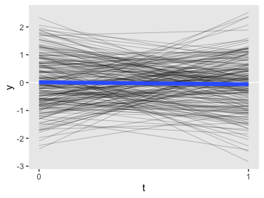
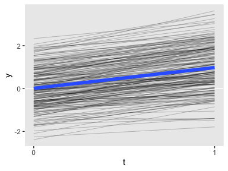
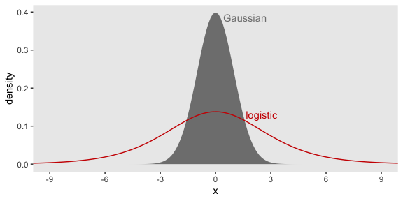
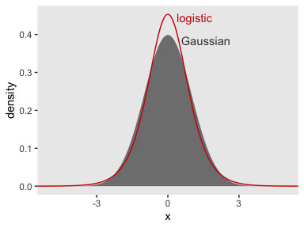
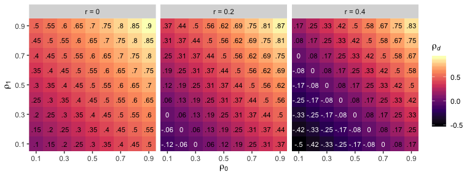
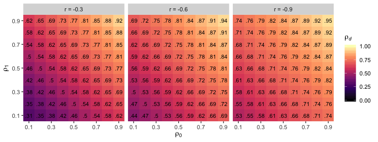
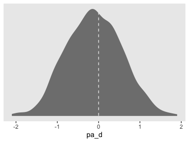

04
================
A Solomon Kurz
2019-08-05

# Fundamental Concepts of Stability and Change

> This chapter reviews essential concepts of stability and change, with
> an ultimate objective of promoting a deeper understanding of
> longitudinal models designed to investigate causes of change. In
> contrast to the previous chapter, which was more concerned with
> analyses that investigate whether change occurs, this chapter is
> concerned more with explaining which individuals change and
> identifying the potential causes of change. (p. 91)

## Stability and change

### General concepts.

With respect to change and stability, one can consider their absolute
and relative levels. Take stability. *Absolute* stability describes
situations in which a value is constant or minimally fluctuating over
time. Given a Gaussian process, this means that over time, \(\mu\) is
constant and \(\sigma\) is a small value relative to \(\mu\). *Relative*
stability is when a measurement on one occasion is highly correlated
with the measurement on the next occasion. It concerns rank order and
does not necessarily indicate the constancy of \(\mu\).

The converse of these concepts would be true for absolute and relative
change.

Also note that often times, absolute stability is a group-based
phenomenon. Data points from specific participants may go up and down,
but as long as the group mean stays the same, the data are stable at the
nomothetic level.

It might be useful to walk these out a bit with some simulated data.
First we’ll simulate data that demonstrate absolute stability for the
group mean.

``` r
library(tidyverse)

n <- 200

set.seed(4)

d <-
  tibble(id = rep(1:n, times = 2),
         t  = rep(0:1, each = n),
         y  = c(rnorm(n * 2, mean = 0, 1)))

head(d)
```

    ## # A tibble: 6 x 3
    ##      id     t      y
    ##   <int> <int>  <dbl>
    ## 1     1     0  0.217
    ## 2     2     0 -0.542
    ## 3     3     0  0.891
    ## 4     4     0  0.596
    ## 5     5     0  1.64 
    ## 6     6     0  0.689

At the group level, the data are very stable with respect to \(\mu\).

``` r
d %>% 
  ggplot(aes(x = t, y = y)) +
  geom_hline(yintercept = 0, color = "white") +
  geom_line(aes(group = id),
            size = 1/4, alpha = 1/3) +
  stat_smooth(method = "lm", size = 2, se = F) +
  scale_x_continuous(breaks = 0:1) +
  theme(panel.grid = element_blank())
```

<!-- -->

The thick blue line showed the group average over time. It’s pretty
flat. The thinner black lines are the `id` specific trajectories. They
vary quite a bit.

Now notice how the rank-order correlations for `y` across the two time
points is near zero at the `id` level.

``` r
d %>% 
  spread(key = t, value = y) %>% 
  summarise(r = cor(`0`, `1`) %>% round(digits = 3))
```

    ## # A tibble: 1 x 1
    ##       r
    ##   <dbl>
    ## 1 0.016

Next we simulate data that show clear relative stability (i.e.,
stability of rank order), but are unstable with respect to the group
mean.

``` r
set.seed(4)

d <-
  tibble(id = 1:n,
         y0 = rnorm(n, mean = 0, sd = 1)) %>% 
  mutate(y1 = rnorm(n, mean = y0 + 1, sd = 0.5)) %>% 
  gather(t, y, -id) %>% 
  mutate(t = str_remove(t, "y") %>% as.double())

head(d)
```

    ## # A tibble: 6 x 3
    ##      id     t      y
    ##   <int> <dbl>  <dbl>
    ## 1     1     0  0.217
    ## 2     2     0 -0.542
    ## 3     3     0  0.891
    ## 4     4     0  0.596
    ## 5     5     0  1.64 
    ## 6     6     0  0.689

Now at the group level, the data are rather unstable with respect to
\(\mu\). The average value clearly went up.

``` r
d %>% 
  ggplot(aes(x = t, y = y)) +
  geom_hline(yintercept = 0, color = "white") +
  geom_line(aes(group = id),
            size = 1/4, alpha = 1/3) +
  stat_smooth(method = "lm", size = 2, se = F) +
  scale_x_continuous(breaks = 0:1) +
  theme(panel.grid = element_blank())
```

<!-- -->

However, rank-order stability is still quite high.

``` r
d %>% 
  spread(key = t, value = y) %>% 
  summarise(r = cor(`0`, `1`) %>% round(digits = 3))
```

    ## # A tibble: 1 x 1
    ##       r
    ##   <dbl>
    ## 1 0.896

> As shown in Chapter 3, the average difference score is equal to the
> difference between the means, so the paired \(t\)-test or repeated
> measures ANOVA evaluate both quantities simultaneously. Less
> obviously, latent growth curve and latent difference score models also
> investigate absolute stability and change. Relative stability and
> change are assessed with correlation or regression, and analysis of
> covariance (ANCOVA) and cross-lagged panel analysis are based on this
> notion of stability and change. In the end, it will not always be so
> simple to classify structural models entirely into one of these two
> camps, and many models can incorporate some aspects of both
> definitions of change. (p. 92)

### Observed continuous variables.

We often measure relative stability/change with *autoregression*. Given
a univariate criterion \(y\) measured at time \(t\), we can express the
basic autoregressive equation as

\[y_t = \alpha_t + y_{t - 1} \beta_{t, t - 1} + \zeta_t,\]

where \(\alpha_t\) is the intercept, \(\zeta_t\) is the residual
variance, and \(\beta_{t, t - 1}\) is the autoregressive coefficient of
\(y_{t - 1}\) predicting \(y_t\) (a.k.a. autoregressive effect,
stability path, or inertia). Due note how the autoregressive
coefficient, here, is in the *unstandardized* metric. On pages 92 and
93, Newsom clarified that

> the \(i\) subscript for an individual case is omitted from the
> variables and the error term for simplicity. The mean structure may or
> may not be of interest in the particular SEM application. If, for
> convenience, we assume the intercept is 0 (model has no mean
> structure), then stating Equation (4.1) in terms of the disturbance
> (or residual), we have the equation
> 
> \[\zeta_t = y_t - y_{t - 1} \beta_{t, t - 1}.\]

We can also express autoregression in a correlation metric.

> To see how the autocorrelation implies the same relative position,
> consider that the correlation coefficient can be stated in terms of
> the difference of standardized scores, \(z_t\) and \(z_{t− 1}\) (e.g.,
> [Falk &
> Well, 1997](https://www.tandfonline.com/doi/full/10.1080/10691898.1997.11910597)).
> Assuming standardized scores computed using the sample formula for
> standard deviation, the correlation between any two scores approaches
> 1 minus half of the average squared difference for large
> \(N\).
> 
> \[r_{t, t-1} = 1 - \Bigg ( \frac{\sum (z_t - z_{t - 1})^2}{2 (N - 1)} \Bigg )\]
> 
> If there is no difference in the standardized scores, the second term
> is equal to 0 and the correlation becomes 1. (p. 93)

Here’s how we might use that formula to compute \(r_{t, t-1}\) for our
`d` data.

``` r
d %>% 
  spread(key = t, value = y) %>% 
  mutate(z_0 = (`0` - mean(`0`)) / sd(`0`),
         z_1 = (`1` - mean(`1`)) / sd(`1`)) %>% 
  mutate(`(z_1 - z_0)^2` = (z_1 - z_0)^2) %>% 
  summarise(r = 1 - (sum(`(z_1 - z_0)^2`) / (2 * (n - 1))))
```

    ## # A tibble: 1 x 1
    ##       r
    ##   <dbl>
    ## 1 0.896

You’ll notice how it matches up with our results from above, using
`cor()`.

> Without covariates, the standardized autoregression coefficient is
> equal to the autocorrelation coefficient. The formula for the
> standardized autoregression coefficient, computed in the usual way,
> suggests that if the standard deviations for \(y_{t−1}\) and \(y_t\)
> are equal, the unstandardized autoregression coefficient will be equal
> to the standardized autoregression coefficient. (p. 93)

This follows the
formula

\[\beta_{t, t-1}^* = \beta_{t, t-1} \Bigg ( \frac{sd_{y_t}}{sd_{y_t - 1}} \Bigg ) = r_{t, t-1}.\]

> To summarize, we might say that the absolute level definition of
> stability implied by difference scores is stricter in the sense that
> perfect stability occurs only if all differences are exactly zero. The
> correlation must be perfect and the raw values must be identical for
> differences scores to indicate no change. The definition is less
> strict if we consider stability to refer to the average difference
> score being zero, because individual scores could vary. The relative
> level definition of stability implied by the autoregression, on the
> other hand, is less strict than either form of absolute level
> stability, because a measure may remain perfectly stable even if raw
> scores change to the extent that the relative position does not
> change. (p. 94)

#### Regression toward the mean.

> High initial scores tend to decrease and low initial scores tend to
> increase. This *regression toward the mean* occurs whenever the
> autoregression coefficient is less than perfect or whenever the
> correlation is less than perfect, under the simplifying condition that
> means and standard deviations can be assumed to be equivalent
> ([Campbell &
> Kenny, 1999](http://davidakenny.net/old/series/rrtm.htm)). Although
> part of this less-than-perfect relationship is due to measurement
> error in many instances, the less-than-perfect relationship can be due
> to many factors. The degree of regression toward the mean is inversely
> related to the strength of the relationship between the two repeated
> measures. Because the disturbance in the autoregression model is a
> function of the strength of relationship, the autoregression
> definition of change takes into account regression toward the mean.
> The difference score metric of change includes any deviation in the
> value over time, including any regression toward the mean. This does
> not suggest there is a “flaw” in the difference score per se, only
> that the autoregression “adjusts” for the correlation over time and
> the difference score does not. (p. 94, *emphasis* in the original)

#### Intercepts.

We can re-express the equation for \(\zeta_t\) (i.e., Equation 4.2) to
include the mean structure:

\[\zeta_t = y_t - \alpha_t - y_{t - 1} \beta_{t, t - 1}.\]

For models with mean structures, subtracting \(\alpha_t\) ensures the
average disturbance is zero.

### Example 4.1: Autoregression with continuous observed variables.

> To illustrate a simple autoregression model with an observed variable
> at two time points, a composite index was computed by averaging three
> questions about the frequency of receiving unwanted advice in the
> social exchanges data set… Syntax and data sets used in the examples
> are available at the website for the book. (p. 96)

Despite the quote, Newsom did not include R scripts for most of the
examples in this chapter. However, if you do your due diligence, you’ll
see the data set he used was from the `socex1.dat` file. Here we load
the data and assign the typical vector names.

``` r
socex1_names <- 
  c("w1vst1", "w1vst2", "w1vst3", "w2vst1", "w2vst2", "w2vst3", "w3vst1", "w3vst2", "w3vst3", "w1unw1", "w1unw2", "w1unw3", "w2unw1", "w2unw2", "w2unw3", "w3unw1", "w3unw2", "w3unw3", "w1dboth","w1dsad", "w1dblues", "w1ddep", "w2dboth", "w2dsad","w2dblues", "w2ddep", "w3dboth", "w3dsad", "w3dblues", "w3ddep", "w1marr2", "w1happy", "w1enjoy", "w1satis", "w1joyful", "w1please", "w2happy", "w2enjoy", "w2satis", "w2joyful", "w2please", "w3happy", "w3enjoy", "w3satis", "w3joyful", "w3please", "w1lea", "w2lea", "w3lea")

socex1.1 <- 
  read_table2("data/socex1.dat",
              col_names = F) %>% 
  set_names(socex1_names)

head(socex1.1)
```

    ## # A tibble: 6 x 49
    ##   w1vst1 w1vst2 w1vst3 w2vst1 w2vst2 w2vst3 w3vst1 w3vst2 w3vst3 w1unw1 w1unw2 w1unw3 w2unw1 w2unw2
    ##    <dbl>  <dbl>  <dbl>  <dbl>  <dbl>  <dbl>  <dbl>  <dbl>  <dbl>  <dbl>  <dbl>  <dbl>  <dbl>  <dbl>
    ## 1      0      1      0      3      3      2      3      2      2      2      2      3      4      4
    ## 2      3      3      4      3      3      3      2      3      3      1      3      2      3      2
    ## 3      2      2      3      1      0      2      2      2      1      2      1      1      1      3
    ## 4      2      2      3      1      2      2      2      2      2      4      3      3      3      2
    ## 5      3      2      2      2      2      2      3      3      2      2      4      3      2      3
    ## 6      4      4      4      4      4      4      4      4      4      0      2      1      2      1
    ## # … with 35 more variables: w2unw3 <dbl>, w3unw1 <dbl>, w3unw2 <dbl>, w3unw3 <dbl>, w1dboth <dbl>,
    ## #   w1dsad <dbl>, w1dblues <dbl>, w1ddep <dbl>, w2dboth <dbl>, w2dsad <dbl>, w2dblues <dbl>,
    ## #   w2ddep <dbl>, w3dboth <dbl>, w3dsad <dbl>, w3dblues <dbl>, w3ddep <dbl>, w1marr2 <dbl>,
    ## #   w1happy <dbl>, w1enjoy <dbl>, w1satis <dbl>, w1joyful <dbl>, w1please <dbl>, w2happy <dbl>,
    ## #   w2enjoy <dbl>, w2satis <dbl>, w2joyful <dbl>, w2please <dbl>, w3happy <dbl>, w3enjoy <dbl>,
    ## #   w3satis <dbl>, w3joyful <dbl>, w3please <dbl>, w1lea <dbl>, w2lea <dbl>, w3lea <dbl>

``` r
dim(socex1.1)
```

    ## [1] 574  49

Let’s compute the composites of the unwanted variables. There are three
per time point.

``` r
socex1.1 <-
  socex1.1 %>% 
  mutate(unw_1 = (w1unw1 + w1unw2 + w1unw3) / 3,
         unw_2 = (w2unw1 + w2unw2 + w2unw3) / 3)
```

Fire up lavaan.

``` r
library(lavaan)
```

Here’s the syntax for the simple composite variable autoregressive
model.

``` r
model4.1 <- '   
unw_2 ~ unw_1
'

fit_4.1 <- 
  sem(model4.1,
      meanstructure = T,
      data = socex1.1)

summary(fit_4.1,
        standardized = T) 
```

    ## lavaan 0.6-3 ended normally after 12 iterations
    ## 
    ##   Optimization method                           NLMINB
    ##   Number of free parameters                          3
    ## 
    ##   Number of observations                           574
    ## 
    ##   Estimator                                         ML
    ##   Model Fit Test Statistic                       0.000
    ##   Degrees of freedom                                 0
    ## 
    ## Parameter Estimates:
    ## 
    ##   Information                                 Expected
    ##   Information saturated (h1) model          Structured
    ##   Standard Errors                             Standard
    ## 
    ## Regressions:
    ##                    Estimate  Std.Err  z-value  P(>|z|)   Std.lv  Std.all
    ##   unw_2 ~                                                               
    ##     unw_1             0.371    0.038    9.751    0.000    0.371    0.377
    ## 
    ## Intercepts:
    ##                    Estimate  Std.Err  z-value  P(>|z|)   Std.lv  Std.all
    ##    .unw_2             1.248    0.082   15.314    0.000    1.248    1.544
    ## 
    ## Variances:
    ##                    Estimate  Std.Err  z-value  P(>|z|)   Std.lv  Std.all
    ##    .unw_2             0.561    0.033   16.941    0.000    0.561    0.858

Since the model is just identified, we don’t get fit statistics. But
happily, our autoregressive coefficient matches the results Newsom
reported in the text. Due again note that the autoregressive coefficient
\(\beta_{t, t - 1}\) is in an unstandardized metric. it is the
standardized version \(\beta_{t, t - 1}^*\) that gives the
autocorrelation.

``` r
standardizedsolution(fit_4.1) %>% 
  filter(op == "~") %>% 
  select(-(se:pvalue)) %>% 
  mutate_if(is.double, round, digits = 3)
```

    ##     lhs op   rhs est.std ci.lower ci.upper
    ## 1 unw_2  ~ unw_1   0.377    0.309    0.445

Here’s the proof.

``` r
socex1.1 %>% 
  summarise(autocorrelation = cor(unw_1, unw_2) %>% round(digits = 3))
```

    ## # A tibble: 1 x 1
    ##   autocorrelation
    ##             <dbl>
    ## 1           0.377

Anyway, we can get the observed means with `lavInspect()`.

``` r
lavInspect(fit_4.1, "mean.ov")
```

    ## unw_2 unw_1 
    ## 1.983 1.979

That average difference, then, was:

``` r
1.979 - 1.983
```

    ## [1] -0.004

We can pull their variances with the `"vy"` argument within
`lavInspect()`. To convert them to standard deviations, just take the
square root.

``` r
lavInspect(fit_4.1, "vy") %>% sqrt()
```

    ## unw_2 unw_1 
    ## 0.808 0.821

Yes, it appears the standard deviation at the second time point was
smaller than it was at the first. Here’s another way to get the
autocorrelation.

``` r
lavInspect(fit_4.1, "cor.all")
```

    ##       unw_2 unw_1
    ## unw_2 1.000      
    ## unw_1 0.377 1.000

If you’d like to pull the standardized regression coefficient, you can
use `lavInspect()` to do so like this.

``` r
lavInspect(fit_4.1, "std")$beta[1, 2]
```

    ## [1] 0.3769766

Just square that result and `round()` to match up with the 14% Newsom
reported.

``` r
lavInspect(fit_4.1, "std")$beta[1, 2]^2 %>% 
  round(digits = 2)
```

    ## [1] 0.14

You could have also gotten that value by examining the \(R^2\).

``` r
lavInspect(fit_4.1, "rsquare") %>% 
  round(digits = 2)
```

    ## unw_2 
    ##  0.14

### Observed binary and ordinal variables.

On page 95, we read:

> The generalized linear model formulation ([McCullagh &
> Nelder, 1989](https://www.crcpress.com/Generalized-Linear-Models-Second-Edition/McCullagh-Nelder/p/book/9780412317606))
> is convenient for conceptualizing the simple autoregression equation
> for binary or ordinal variables. In this formulation, the model is
> stated in terms of a linear equation with the dependent variable
> \(y^*\), which represents an unobserved continuous propensity that
> underlies the binary or ordinal observed variable. An unobserved value
> on \(y^*\) exceeding some threshold results in an observed value on
> \(y\) of 1 instead of 0 (refer to Figure 1.3).
> 
> \[y_t^* = \alpha_t + \beta_{t, t - 1} y_{t - 1}\]

Here we link the continuous unobserved variable \(y_t^*\) with the
observed categorical variable \(y_t\) with a link function, typically
the logit or probit. If we generically call the link function \(\Phi\),
then we can give the probability of \(y_t = 1\)
as

\[p | y_{t - 1} = \Phi \big (\alpha_t + \beta_{t, t - 1} y_{t - 1} \big ).\]

#### Binary variables.

> [Menard
> (2010)](https://us.sagepub.com/en-us/nam/logistic-regression/book227554)
> points out that the unstandardized autoregression coefficient in the
> logistic model implies a different scaling for \(y_{t - 1}\) and
> \(y_t\). The predicted value of \(y_t\) is a logarithmically
> transformed value (or logit transformation),
> \(\text{ln} [p / (1 − p)]\), and the predictor variable in the
> equation, \(y_{t - 1}\), is not. The autoregressive effect therefore
> represents a nonlinear relationship, because the predicted value will
> increment nonlinearly with each unit increment in the predictor.
> 
> For the binary case, the exponentiation of the intercept,
> \(p | y_{t - 1} = 1 / \big (1 + e^{\alpha_t} \big )\), estimates the
> proportion of cases \(y_t = 1\) when \(y_{t - 1} = 0\) (e.g.,
> proportion responding “yes” at Time 2 if they responded “no” at Time
> 1). The interpretation of the intercept \(\alpha_t\) is the same as
> with continuous variables, because it represents the expected value of
> \(y_t\) when \(y_{t - 1}\) equals \(0\). The exponentiation of the
> regression coefficient, \(e^{\beta_{t, t - 1}}\), gives the odds
> ratio. (p. 96)

For these kinds of models, the disturbance term is quite restricted and
typically

> assumed to have a logistic distribution with mean equal to 0 and
> variance equal to \(\pi^2 /3\)\> If the logistic distribution is
> assumed to be standardized with variance equal to 1, it has a close
> resemblance to the standard normal distribution. The resemblance
> suggests that the logistic estimates will often closely resemble the
> probit estimates (Long, 1997). In fact, based on the relationship of
> the variances of the two underlying distributions, logistic regression
> coefficient will be approximately \(\pi / \sqrt{3}\) larger than the
> probit regression coefficient. (pp. 96–97)

To get a sense of what that logistic density looks like relative to the
standard Gaussian, we might plot.

``` r
variance <- (pi^2) / 3

tibble(x = seq(from = -11, to = 11, length.out = 200)) %>% 
  mutate(density = dlogis(x, 0, sqrt(variance))) %>% 
  
  ggplot(aes(x = x)) +
  geom_ribbon(aes(ymin = 0, ymax = dnorm(x, 0, 1)),
              color = "transparent", fill = "grey50") +
  geom_line(aes(y = density),
            color = "red3") +
  scale_x_continuous(breaks = seq(from = -9, to = 9, by = 3)) +
  annotate(geom = "text", x = c(1.6, 2.5), y = c(.385, .13),
           label = c("Gaussian", "logistic"), color = c("grey50", "red3")) +
  coord_cartesian(xlim = -9:9) +
  theme(panel.grid = element_blank())
```

<!-- -->

It turns out that “if the logistic distribution is assumed to be
standardized with variance equal to 1, it has a close resemblance to the
standard normal distribution” (pp. 96–97).

Before we can show that, we should make clear the parameters in the
logistic distribution, and also the parameters in the `dlogis()`
function, are the location and the scale. The location \(\mu\) is also
the mean. However, the scale \(s\) is neither the \(SD\) nor the
variance. If you want the variance, you compute \(\frac{s^2 \pi^2}{3}\).
By a little algebra, then, you can find the scale value for a given
variance \(\sigma^2\) by

\[\sqrt{\frac{3\sigma^2}{\pi^2}} = s\]

Here we put that into R code.

``` r
variance <- 1

sqrt((3 * variance) / pi^2)
```

    ## [1] 0.5513289

Here’s what that looks like.

``` r
tibble(x = seq(from = -6, to = 6, length.out = 200)) %>% 
  mutate(density = dlogis(x, 0, sqrt((3 * variance) / pi^2))) %>% 
  
  ggplot(aes(x = x)) +
  geom_ribbon(aes(ymin = 0, ymax = dnorm(x, 0, 1)),
              color = "transparent", fill = "grey50") +
  geom_line(aes(y = density),
            color = "red3") +
  scale_x_continuous(breaks = seq(from = -9, to = 9, by = 3)) +
  annotate(geom = "text", x = c(1.6, 1.12), y = c(.385, .445),
           label = c("Gaussian", "logistic"), color = c("grey25", "red3")) +
  coord_cartesian(xlim = -5:5) +
  theme(panel.grid = element_blank())
```

<!-- -->

> The resemblance suggests that the logistic estimates will often
> closely resemble the probit estimates
> ([Long, 1997](https://us.sagepub.com/en-us/nam/regression-models-for-categorical-and-limited-dependent-variables/book6071)).
> In fact, based on the relationship of the variances of the two
> underlying distributions, logistic regression coefficient will be
> approximately \(\pi / \sqrt{3}\) larger than the probit regression
> coefficient. (p. 97)

#### Ordinal Variables.

> The autoregression with ordinal variables quantifies a one-unit
> increment in \(y_t\) for each one-unit increment in \(y_{t - 1}\) ,
> taking into account the linearizing transformation. The appropriate
> link function connects the predicted ordinal values for the observed
> \(y_t\) to the unobserved continuous distribution of \(y_y^*\) through
> \(C - 1\) thresholds, where \(C\) is the number of ordinal categories.
> The slope can be interpreted as the change in \(y_y^*\) for each
> standard deviation change in \(y_{t - 1}\).
(p. 98)

### Example 4.2: Autoregression with binary and ordinal observed variables.

Newsom didn’t provide a script for this example. It appears the
variables he was talking about were `w1lea` and `w2lea`. To confirm, we
can get the counts of the four combinations of 0 and/or 1 values from
the two variables and compare the results to those presented in Table
4.1 on page 99 in the text.

``` r
socex1.1 %>% 
  group_by(w1lea, w2lea) %>% 
  count()
```

    ## # A tibble: 4 x 3
    ## # Groups:   w1lea, w2lea [4]
    ##   w1lea w2lea     n
    ##   <dbl> <dbl> <int>
    ## 1     0     0   413
    ## 2     0     1   119
    ## 3     1     0    21
    ## 4     1     1    21

At the point of this writing, [lavaan does not currently support
logistic regression](http://lavaan.ugent.be/tutorial/cat.html). It does,
however, support probit regression with the WLSMV estimator, which means
we’ll be jumping straight into `model4.2b`.

``` r
model4.2b <- '
w2lea ~ w1lea
'

fit_4.2b <- 
  sem(model4.2b,
      data = socex1.1,
      ordered = c("w2lea"))

summary(fit_4.2b,
        standardized = T) 
```

    ## lavaan 0.6-3 ended normally after 3 iterations
    ## 
    ##   Optimization method                           NLMINB
    ##   Number of free parameters                          2
    ## 
    ##   Number of observations                           574
    ## 
    ##   Estimator                                       DWLS      Robust
    ##   Model Fit Test Statistic                       0.000       0.000
    ##   Degrees of freedom                                 0           0
    ##   Minimum Function Value               0.0000000000000
    ##   Scaling correction factor                                     NA
    ##   Shift parameter                                     
    ##     for simple second-order correction (Mplus variant)
    ## 
    ## Parameter Estimates:
    ## 
    ##   Information                                 Expected
    ##   Information saturated (h1) model        Unstructured
    ##   Standard Errors                           Robust.sem
    ## 
    ## Regressions:
    ##                    Estimate  Std.Err  z-value  P(>|z|)   Std.lv  Std.all
    ##   w2lea ~                                                               
    ##     w1lea             0.760    0.203    3.747    0.000    0.760    0.194
    ## 
    ## Intercepts:
    ##                    Estimate  Std.Err  z-value  P(>|z|)   Std.lv  Std.all
    ##    .w2lea             0.000                               0.000    0.000
    ## 
    ## Thresholds:
    ##                    Estimate  Std.Err  z-value  P(>|z|)   Std.lv  Std.all
    ##     w2lea|t1          0.760    0.060   12.560    0.000    0.760    0.745
    ## 
    ## Variances:
    ##                    Estimate  Std.Err  z-value  P(>|z|)   Std.lv  Std.all
    ##    .w2lea             1.000                               1.000    0.962
    ## 
    ## Scales y*:
    ##                    Estimate  Std.Err  z-value  P(>|z|)   Std.lv  Std.all
    ##     w2lea             1.000                               1.000    1.000

Similar to what Newsom reported in the text, our probit estimate is
0.760, \(p < .001\), with a standardized coefficient of 0.194.

If we’d like to do logistic regression with observed variables, we can
use the base R `glm()` function.

``` r
model4.2a <- 
  glm(data = socex1.1,
      family = binomial,
      w2lea ~ w1lea)

summary(model4.2a) 
```

    ## 
    ## Call:
    ## glm(formula = w2lea ~ w1lea, family = binomial, data = socex1.1)
    ## 
    ## Deviance Residuals: 
    ##     Min       1Q   Median       3Q      Max  
    ## -1.1774  -0.7116  -0.7116  -0.7116   1.7306  
    ## 
    ## Coefficients:
    ##             Estimate Std. Error z value Pr(>|z|)    
    ## (Intercept)  -1.2443     0.1040 -11.960  < 2e-16 ***
    ## w1lea         1.2443     0.3257   3.821 0.000133 ***
    ## ---
    ## Signif. codes:  0 '***' 0.001 '**' 0.01 '*' 0.05 '.' 0.1 ' ' 1
    ## 
    ## (Dispersion parameter for binomial family taken to be 1)
    ## 
    ##     Null deviance: 637.76  on 573  degrees of freedom
    ## Residual deviance: 623.77  on 572  degrees of freedom
    ## AIC: 627.77
    ## 
    ## Number of Fisher Scoring iterations: 4

We can confirm we used the logit link (i.e., performed logistic
regression) like so.

``` r
model4.2a$family
```

    ## 
    ## Family: binomial 
    ## Link function: logit

We can call the point estimates for the coefficients directly with the
`coef()` function.

``` r
coef(model4.2a)
```

    ## (Intercept)       w1lea 
    ##   -1.244324    1.244324

To compute the odds ratio, we’ll just exponentiate the autoregressive
coefficient.

``` r
or <- coef(model4.2a)[2] %>% exp() %>% as.double()

print(or)
```

    ## [1] 3.470588

You’ll see that corresponds nicely with the part in page 98 where Newsom
showed \(3.469 = e^{1.244}\). Further quoting Newsom, this suggests “the
odds of reporting a health event at Time 2 were about 3.5 times greater
if the respondent experienced a health event at Time 1 as compared to
not experiencing a health event at Time 1” (p. 98).

I’m not aware of a quick way to get the standardized autoregressive
coefficient for `model4.2a`. Instead, we’ll have to follow the formlas
at the bottom of pate 98,
where

\[\beta_{t, t - 1}^* = \beta_{t, t - 1} \bigg ( sd_{y_{t - 1}} / sd_{y_t^*} \bigg )\]

and
where

\[sd_{y_t^*} = \sqrt{(\beta_{t, t - 1}^2) \text{Var}(y_{t - 1}) + (\pi^2 / 3)}.\]

Let’s compute \(sd_{y_t^*}\)
first.

``` r
sd_y_t_star <- sqrt(coef(model4.2a)[2]^2 * var(socex1.1$w1lea) + (pi^2 / 3)) %>% as.double()

print(sd_y_t_star)
```

    ## [1] 1.842567

Now let’s plug in our `sd_y_t_star` value into the equation for
\(\beta_{t, t - 1}^*\).

``` r
ar_std <- (coef(model4.2a)[2] * (sd(socex1.1$w1lea) / sd_y_t_star)) %>% as.double()

print(ar_std)
```

    ## [1] 0.1760181

Here’s the square of the standardized autoregressive coefficient (i.e.,
the correlation between `t1` and `t2`).

``` r
ar_std^2
```

    ## [1] 0.03098237

Since we saved the odds ratio above as `or`, it’s pretty easy to compute
Yule’s \(Q\).

``` r
(or - 1) / (or + 1)
```

    ## [1] 0.5526316

### The effects of measurement error.

#### Autoregression coefficients.

“Unstandardized regression coefficients are impacted only by measurement
error in the independent variable, and standardized coefficients are
impacted by measurement error in the independent or dependent variable”
(p. 99).

Recall the canonical CTT formula

\[\text{Var} (X) = \text{Var} (T) + \text{Var} (e)\]

where \(X\) is, in this case, the predictor, \(T\) is the “true score”,
and \(e\) the measurement error. Now then, the reason unstandardized
coefficients are only effected by measurement error in the predictor is
because their formula only references the variance on the
predictor:

\[\beta_{t, t - 1} = \frac{\text{Cov} (y_{t - 1}, y_t)}{\text{Var} (y_{t - 1})}\]

However, because the formula for the standardized regression coefficient
(i.e., the correlation between \(y_{t - 1}\) and \(y_t\)) accounts for
the variances of both predictor and criterion, it’s attenuated by
measurement error in both. Here’s the
formula:

\[r_{t - 1, t} = \beta_{t, t - 1}^* = \frac{\text{Cov} (y_{t - 1}, y_t)}{sd_{y_{t - 1}} \cdot sd_{y_t}}\]

Following [Spearman’s
(1904)](https://www.jstor.org/stable/pdf/1422689.pdf?casa_token=dR0fT_2DiU8AAAAA:ZQSVBV8Gif1luo7tCSyq89baqfdGtOJr9WSukm6jRzV8MEOd7JJ7jqsp884pQ7JHfZvCO2oaseb-WB4n10GEZVXPcoAuXnEcerQylFxhR45ECs-p5zU)
formula

\[\beta_{t, t - 1}^{* \text{correlated}} = \frac{\beta_{t, t - 1}^*}{\sqrt{\rho_{t - 1} \rho_t}}.\]

Here’s Newsom’s example of how measurement error can attenuate a
standardized regression coefficient.

``` r
rho_t_1  <- .7
rho_t    <- .7
beta_std <- .5

beta_std / sqrt(rho_t_1 * rho_t)
```

    ## [1] 0.7142857

Ignoring measurement error substantially biased the estimate in the
positive. Here it is with \(\rho = .9\) for both.

``` r
rho_t_1  <- .9
rho_t    <- .9

beta_std / sqrt(rho_t_1 * rho_t)
```

    ## [1] 0.5555556

#### Difference scores.

As it turns out, “measurement error has no biasing effect on the average
of the difference score, as random error has no biasing effect on the
expected value of a measure” (p. 100). This is because

\[
\begin{align*}
E(y_t - t_{t - 1}) & = E \big [ (y_t + e_t) - (y_{t - 1} + e_{t - 1}) \big ] \\
& = \big [ E (T_t) + E (e_t) \big ] - \big [ E (T_{t - 1}) + E (e_{t - 1}) \big ] \\
& = \big [ E (T_t) + 0 \big ] - \big [ E (T_{t - 1}) + 0 \big ] \\
& = E (T_t) - E (T_{t - 1}) \\
& = E (T_t - T_{t - 1}),
\end{align*}
\]

where the \(E\) refers to the *expectation*, the average value.

Measurement error within the difference-score model will have an effect
on the associated standard errors and down-the-road consequences (e.g.,
\(p\)-values and confidence intervals). This is because “the observed
score variance will be equal to or greater than the true score variance
whenever there is measurement error,
\(\text{Var} (T) \leq \text{Var} (y_t)\), so the variance of the
difference score will be affected as a consequence” (p. 100). It’s also
the case that the “reliability of the difference score will tend to be
lower than the reliability of the individual measures” (p. 101). Here’s
why:

\[\rho_\text{difference score} = \frac{\big [ ( \rho_{t - 1} + \rho_t ) / 2 \big ] - r_{t - 1, t}}{1 - r_{t - 1, t}}\]

Here’s a visual representation of some of the consequences of this
equation.

``` r
# wrangle
tibble(rho0 = seq(from = .1, to = .9, by = .1)) %>% 
  expand(rho0,
         rho1 = seq(from = .1, to = .9, by = .1)) %>% 
  expand(nesting(rho0, rho1),
         r = c(0, .2, .4)) %>% 
  mutate(rhod = (((rho0 + rho1) / 2) - r) / (1 - r)) %>% 
  mutate(text = round(rhod, digits = 2) %>% 
           as.character() %>% 
           str_replace(., "0.", "."),
         r = str_c("r = ", r)) %>% 
  
  # plot
  ggplot(aes(x = rho0, y = rho1, fill = rhod)) +
  geom_tile() +
  geom_text(aes(label = text, color = rhod <= 0),
            size = 3, show.legend = F) +
  scale_x_continuous(expression(rho[0]), 
                     breaks = seq(from = .1, to = .9, by = .2), expand = c(0, 0)) +
  scale_y_continuous(expression(rho[1]), 
                     breaks = seq(from = .1, to = .9, by = .2), expand = c(0, 0)) +
  scale_fill_viridis_c(expression(rho[italic(d)]), option = "A") +
  scale_color_manual(values = c("black", "white")) +
  facet_wrap(~r)
```

<!-- -->

And here are the consequences for a few negative autocorrelation values.

``` r
# wrangle
tibble(rho0 = seq(from = .1, to = .9, by = .1)) %>% 
  expand(rho0,
         rho1 = seq(from = .1, to = .9, by = .1)) %>% 
  expand(nesting(rho0, rho1),
         r = c(-.3, -.6, -.9)) %>% 
  mutate(rhod = (((rho0 + rho1) / 2) - r) / (1 - r)) %>% 
  mutate(text = round(rhod, digits = 2) %>% 
           as.character() %>% 
           str_replace(., "0.", "."),
         r = str_c("r = ", r)) %>% 
  
  # plot
  ggplot(aes(x = rho0, y = rho1, fill = rhod)) +
  geom_tile() +
  geom_text(aes(label = text),
            size = 3, show.legend = F) +
  scale_x_continuous(expression(rho[0]), 
                     breaks = seq(from = .1, to = .9, by = .2), expand = c(0, 0)) +
  scale_y_continuous(expression(rho[1]), 
                     breaks = seq(from = .1, to = .9, by = .2), expand = c(0, 0)) +
  scale_fill_viridis_c(expression(rho[italic(d)]), option = "A", limits = c(0, 1)) +
  facet_wrap(~r)
```

<!-- -->

However, “the reliability of the difference score is more complicated
than” that equation (p. 101). But that’s as far as I’m interested in
going in this project. You have the text for
more.

### Example 4.3: Effects of measurement error on autoregression coefficients.

We still don’t have a Newom script from this example, but we can still
fit the model. Here are the unwanted advice items.

``` r
socex1.1 %>% 
  select(contains("unw"))
```

    ## # A tibble: 574 x 11
    ##    w1unw1 w1unw2 w1unw3 w2unw1 w2unw2 w2unw3 w3unw1 w3unw2 w3unw3 unw_1 unw_2
    ##     <dbl>  <dbl>  <dbl>  <dbl>  <dbl>  <dbl>  <dbl>  <dbl>  <dbl> <dbl> <dbl>
    ##  1      2      2      3      4      4      4      2      3      3  2.33  4   
    ##  2      1      3      2      3      2      3      2      3      2  2     2.67
    ##  3      2      1      1      1      3      2      2      2      2  1.33  2   
    ##  4      4      3      3      3      2      1      3      4      2  3.33  2   
    ##  5      2      4      3      2      3      2      2      3      2  3     2.33
    ##  6      0      2      1      2      1      1      2      1      1  1     1.33
    ##  7      2      2      2      3      2      3      2      2      1  2     2.67
    ##  8      4      3      3      3      3      4      4      4      3  3.33  3.33
    ##  9      3      1      3      2      3      3      2      3      2  2.33  2.67
    ## 10      4      2      3      2      3      2      2      3      2  3     2.33
    ## # … with 564 more rows

There are a variety of ways to compute reliability coefficients in R. My
favorite is with [Ken
Kelley](https://www3.nd.edu/~kkelley/site/Welcome.html)’s [MBESS
package](https://cran.r-project.org/web/packages/MBESS/index.html). The
`MBESS::ci.reliability()` function allows users to compute a variety of
reliability coefficients, ranging from Cronbach’s \(\alpha\) to variants
of \(\omega\), as well as their accompanying confidence intervals. Here
we’ll play along with the text and compute \(\alpha\), adding ML-based
95% CIs.

``` r
library(MBESS)

a1 <-
  socex1.1 %>% 
  select(w1unw1:w1unw3) %>% 
  ci.reliability(type = "alpha",
                 interval.type = "ml")

a2 <-
  socex1.1 %>% 
  select(w2unw1:w2unw3) %>% 
  ci.reliability(type = "alpha",
                 interval.type = "ml")

a1[1:4]
```

    ## $est
    ## [1] 0.8180789
    ## 
    ## $se
    ## [1] 0.01309266
    ## 
    ## $ci.lower
    ## [1] 0.7924177
    ## 
    ## $ci.upper
    ## [1] 0.84374

``` r
a2[1:4]
```

    ## $est
    ## [1] 0.7557537
    ## 
    ## $se
    ## [1] 0.01760384
    ## 
    ## $ci.lower
    ## [1] 0.7212508
    ## 
    ## $ci.upper
    ## [1] 0.7902566

Let’s compute the composites.

``` r
socex1.1 <-
  socex1.1 %>% 
  mutate(unw_1 = (w1unw1 + w1unw2 + w1unw3) / 3,
         unw_2 = (w2unw1 + w2unw2 + w2unw3) / 3)
```

Here are their \(SD\)s and covariance.

``` r
sd(socex1.1$unw_1)
```

    ## [1] 0.8220133

``` r
sd(socex1.1$unw_2)
```

    ## [1] 0.8091526

``` r
cov(socex1.1$unw_1, socex1.1$unw_2)
```

    ## [1] 0.25074

It turns out there are a few typos in this section of the text. First,
with the following
formula

\[\beta_{2, 1}^\text{correlated} = \frac{ \text{Cov} (y_1, y_2) / (sd_1 \cdot sd_2)}{\rho_1}\]

Newsom indicated we were computing “the corrected unstandardized
coefficient” (p. 102). This is incorrect. Notice how we’re dividing by
the product of the two standard deviations? Yep, we’re standardizing.
This will compute “the corrected \[standardized\] coefficient.” Let’s
plug in our values and see what
happens.

``` r
(cov(socex1.1$unw_1, socex1.1$unw_2) / (sd(socex1.1$unw_1) * sd(socex1.1$unw_2))) / as.double(a1[1])
```

    ## [1] 0.4608071

You’ll note our value differed markedly from that in the text. That’s
because there’s a second typo. To demonstrate, first we’ll do that
again, this time with the exact values from page 102.

``` r
(0.25 / (0.809 * 0.822)) / 0.820
```

    ## [1] 0.4584646

Yep, that’s still within rounding error or our original more precise
estimate. Now try it again, this time leaving out the last part where we
divide by \(\rho_1\).

``` r
(0.25 / (0.809 * 0.822))
```

    ## [1] 0.375941

It appears 0.376 is the unattenuated regression coefficient. Let’s check
with lavaan.

``` r
model4.3 <- '   
unw_2 ~ unw_1
'

fit_4.3 <- 
  sem(model4.3,
      data = socex1.1)

summary(fit_4.3,
        standardized = T) 
```

    ## lavaan 0.6-3 ended normally after 11 iterations
    ## 
    ##   Optimization method                           NLMINB
    ##   Number of free parameters                          2
    ## 
    ##   Number of observations                           574
    ## 
    ##   Estimator                                         ML
    ##   Model Fit Test Statistic                       0.000
    ##   Degrees of freedom                                 0
    ## 
    ## Parameter Estimates:
    ## 
    ##   Information                                 Expected
    ##   Information saturated (h1) model          Structured
    ##   Standard Errors                             Standard
    ## 
    ## Regressions:
    ##                    Estimate  Std.Err  z-value  P(>|z|)   Std.lv  Std.all
    ##   unw_2 ~                                                               
    ##     unw_1             0.371    0.038    9.751    0.000    0.371    0.377
    ## 
    ## Variances:
    ##                    Estimate  Std.Err  z-value  P(>|z|)   Std.lv  Std.all
    ##    .unw_2             0.561    0.033   16.941    0.000    0.561    0.858

There it is in the `Std.all` column. You’ll note that if we use the more
precise values from above, they get much closer to that
value.

``` r
cov(socex1.1$unw_1, socex1.1$unw_2) / (sd(socex1.1$unw_1) * sd(socex1.1$unw_2))
```

    ## [1] 0.3769766

Again, this yields the uncorrected standardized coefficient,
\(\beta_{21}^*\). Now we can plug that into the equation
below

\[\beta_{21}^{* \text{corrected}} = \frac{\beta_{21}^*}{\sqrt{\rho_1 \rho_2}}\]

to get the corrected standardized regression
coefficient.

``` r
cov(socex1.1$unw_1, socex1.1$unw_2) / (sd(socex1.1$unw_1) * sd(socex1.1$unw_2)) / sqrt(as.double(a1[1]) * as.double(a2[1]))
```

    ## [1] 0.4794316

### Latent variables with multiple indicators.

#### Autoregression.

Given the special case of a single indicator, the reliability estimate
for the latent variable follows the formula

\[\rho = \frac{\lambda_{jk}^2 \Psi_k}{\text{Var} (y_i)}\]

were \(\lambda_{jk}\) is the unstandardized loading and \(\Psi_k\) is
the variance of the latent. In the language of CTT, the true score
estimate is the numerator and the variance of the observed score (i.e.,
that of the true score and measurement error) is in the denominator.

#### Difference scores.

“[Hancock
(2003)](https://digitalcommons.wayne.edu/cgi/viewcontent.cgi?referer=https://scholar.google.com/scholar?hl=en&as_sdt=0%2C44&q=Fortune+cookies%2C+measurement+error%2C+and+experimental+design&btnG=&httpsredir=1&article=1696&context=jmasm)
shows that compared with observed scores, between-group differences in
latent variables will have smaller variances, smaller standard errors,
and larger standardized effect sizes. Similar advantages hold for the
repeated measures case” (p. 103).

#### Correlated measurement residuals.

> Correlated measurement residuals (or “correlated errors”) are commonly
> estimated in longitudinal models to take into account unique variance
> that is common over time. Measurement residual variance contains
> variance due to measurement error as well as variance unique to an
> indicator but not common to the other indicators of the factor.
> Because measurement error is random, by definition, the measurement
> error component of the variance of the measurement residual cannot be
> correlated with other factors. (p. 103)

Thus, when you set residual correlations among the same items measured
across different time points, those correlations depict systematic
method variance separable from random error.

> Although inclusion of correlated measurement residuals with multiple
> indicator models could be decided on the basis of significance tests,
> they are generally included in longitudinal models a priori ([Wheaton,
> Muthén, Alwin, &
> Summers, 1977](https://www.jstor.org/stable/pdf/270754.pdf?casa_token=fek5dLbSlDEAAAAA:5phk4SW3RzeRFr5vaPDiXeN3HCkkNvdAIAWmr60FgCl6N9lNDRrKWjPnMjU4it-X0U7lv68kFj6RNeoiY-PGU1HOjjwXNpn5_a3TG5yY_WNjobAlOR48)).
> Except for the cost of degrees of freedom, there is typically no harm
> in including these estimates. (p. 104)

Based on his [2013
text](https://www.guilford.com/books/Longitudinal-Structural-Equation-Modeling/Todd-Little/9781462510160),
Little would agree.

“The covariance between two repeated observed measurements is equal to
the sum of the compound paths between the two observed variables”
(p. 104). Given a single indicator \(y_i\) measured at two time points,
\(t\) and \(t - 1\), you can use the formula below to compute the
covariance using the parameters from the latent
model.

\[\text{Cov} (y_{i_{t - 1}}, y_{i_t}) = \lambda_{i_{t - 1}} \Psi_{i_{t - 1}, i_t} \lambda_{i_t} + \text{Cov} (\epsilon_{i_{t - 1}}, \epsilon_{i_t})\]

Rearranging the formula to solve for \(\Phi\) clarifies how the residual
covariance impacts the autoregressive parameter for the
latents.

\[\Psi_{i_{t - 1}, i_t} = \frac{\text{Cov} (y_{i_{t - 1}}, y_{i_t}) - \text{Cov} (\epsilon_{i_{t - 1}}, \epsilon_{i_t})}{\lambda_{i_{t - 1}} \lambda_{i_t}}\]

Leaving out the residual covariance will tend to upwardly bias the
latent autoregressive parameter.

#### Specific factors model.

> An alternative approach to including correlations among meas- urement
> residuals is to model specific factors using the repeated measurements
> of each observed variable as indicators of a latent variable that
> represents the unique variance common to each indicator ([Raffalovich
> &
> Bohrnstedt, 1987](https://journals.sagepub.com/doi/pdf/10.1177/0049124187015004003);
> see [Finkel, 1995,
> p. 69](http://methods.sagepub.com/book/causal-analysis-with-panel-data)).
> 
> With two waves, the specific factor model is likely to encounter
> empirical under- identification problems without some additional
> constraints, such as equivalent load- ings. Additional waves add to
> the likelihood that the model can be identified with fewer
> constraints. The specific factors model is an equivalent model to the
> correlated measure- ment residuals model and will have the same effect
> on the autoregressive estimates.
(pp. 105–106)

### Example 4.4: Autoregression with latent variables and correlated measurement residuals.

Newsom offered the syntax in his `ex4-4.R` file. Below, `model4.4a`
omits the residual correlations and `model4.4b` adds them using the
approach from the “Correlated measurement residuals” subsection, above.

``` r
model4.4a <- '
w1unw =~ w1unw1 + a*w1unw2 + b*w1unw3
w2unw =~ w2unw1 + a*w2unw2 + b*w2unw3

# latent autoregressive parameter
w2unw ~ w1unw 
'

model4.4b <- '
w1unw =~ w1unw1 + a*w1unw2 + b*w1unw3
w2unw =~ w2unw1 + a*w2unw2 + b*w2unw3

# latent autoregressive parameter
w2unw ~ w1unw 

# correlated errors
w1unw1 ~~ w2unw1
w1unw2 ~~ w2unw2
w1unw3 ~~ w2unw3
'

fitmodel4.4a <- 
  sem(model4.4a, 
      data = socex1.1, 
      information = "expected")

fitmodel4.4b <- 
  sem(model4.4b, 
      data = socex1.1, 
      information = "expected")
```

Here we compare their fit indices.

``` r
fitmeasures(fitmodel4.4a, c("chisq", "df", "pvalue", "cfi", "srmr"))
```

    ##  chisq     df pvalue    cfi   srmr 
    ## 34.778 10.000  0.000  0.978  0.033

``` r
fitmeasures(fitmodel4.4b, c("chisq", "df", "pvalue", "cfi", "srmr"))
```

    ##  chisq     df pvalue    cfi   srmr 
    ## 12.108  7.000  0.097  0.996  0.025

We could even formally compare them with a likelihood ratio test.

``` r
lavTestLRT(fitmodel4.4a, fitmodel4.4b)
```

    ## Chi Square Difference Test
    ## 
    ##              Df    AIC    BIC  Chisq Chisq diff Df diff Pr(>Chisq)    
    ## fitmodel4.4b  7 8444.3 8505.2 12.108                                  
    ## fitmodel4.4a 10 8460.9 8508.8 34.779      22.67       3  4.731e-05 ***
    ## ---
    ## Signif. codes:  0 '***' 0.001 '**' 0.01 '*' 0.05 '.' 0.1 ' ' 1

Based on the \(\Delta \chi^2\) and the AIC, the model with the residual
correlations is decisively better.

You can use the `parameterestimates()` function to get the
unstandardized estimates for the autoregressive parameter, by model.

``` r
parameterestimates(fitmodel4.4a) %>% 
  filter(op == "~") %>% 
  select(est, ci.lower:ci.upper) %>% 
  round(digits = 3)
```

    ##     est ci.lower ci.upper
    ## 1 0.444    0.353    0.535

``` r
parameterestimates(fitmodel4.4b) %>% 
  filter(op == "~") %>% 
  select(est, ci.lower:ci.upper) %>% 
  round(digits = 3)
```

    ##     est ci.lower ci.upper
    ## 1 0.428    0.336    0.519

We’ll get the standardized versions with the `standardizedsolution()`
function.

``` r
standardizedsolution(fitmodel4.4a) %>% 
  filter(op == "~") %>% 
  select(est.std, ci.lower:ci.upper) %>% 
  round(digits = 3)
```

    ##   est.std ci.lower ci.upper
    ## 1   0.472    0.386    0.558

``` r
standardizedsolution(fitmodel4.4b) %>% 
  filter(op == "~") %>% 
  select(est.std, ci.lower:ci.upper) %>% 
  round(digits = 3)
```

    ##   est.std ci.lower ci.upper
    ## 1   0.453    0.366    0.541

And here are those \(\theta_{ij}\) estimates in the covariance and
correlation metrics.

``` r
parameterestimates(fitmodel4.4b) %>% 
  filter(op == "~~" &
           lhs != rhs) %>% 
  select(lhs:rhs, est, ci.lower:ci.upper) %>% 
  mutate_if(is.double, round, digits = 3)
```

    ##      lhs op    rhs    est ci.lower ci.upper
    ## 1 w1unw1 ~~ w2unw1 -0.032   -0.085    0.021
    ## 2 w1unw2 ~~ w2unw2  0.034   -0.013    0.081
    ## 3 w1unw3 ~~ w2unw3  0.093    0.050    0.136

``` r
standardizedsolution(fitmodel4.4b) %>% 
  filter(op == "~~" &
           lhs != rhs) %>% 
  select(lhs:est.std, ci.lower:ci.upper) %>% 
  mutate_if(is.double, round, digits = 3)
```

    ##      lhs op    rhs est.std ci.lower ci.upper
    ## 1 w1unw1 ~~ w2unw1  -0.075   -0.201    0.052
    ## 2 w1unw2 ~~ w2unw2   0.089   -0.030    0.208
    ## 3 w1unw3 ~~ w2unw3   0.225    0.129    0.320

Just for kicks and giggles, here’s `model4.4b` reexpressed into a
specific factors model.

``` r
model4.4c <- '
# substantive latents
w1unw =~ w1unw1 + a*w1unw2 + b*w1unw3
w2unw =~ w2unw1 + a*w2unw2 + b*w2unw3

# specific factors
eta3 =~ w1unw1 + 1*w2unw1
eta4 =~ w1unw2 + 1*w2unw2
eta5 =~ w1unw3 + 1*w2unw3

# make the specific factors orthogonal
eta3 ~~ 0*eta4 + 0*eta5 + 0*w1unw + 0*w2unw
eta4 ~~ 0*eta5 + 0*w1unw + 0*w2unw
eta5 ~~ 0*w1unw + 0*w2unw

# latent autoregressive parameter
w2unw ~ w1unw 
'

fitmodel4.4c <- 
  sem(model4.4c, 
      data = socex1.1, 
      information = "expected")
```

    ## Warning in lav_object_post_check(object): lavaan WARNING: some estimated lv variances are negative

``` r
summary(fitmodel4.4c,
        fit.measures = T, 
        standardized = T)
```

    ## lavaan 0.6-3 ended normally after 21 iterations
    ## 
    ##   Optimization method                           NLMINB
    ##   Number of free parameters                         16
    ##   Number of equality constraints                     2
    ## 
    ##   Number of observations                           574
    ## 
    ##   Estimator                                         ML
    ##   Model Fit Test Statistic                      12.108
    ##   Degrees of freedom                                 7
    ##   P-value (Chi-square)                           0.097
    ## 
    ## Model test baseline model:
    ## 
    ##   Minimum Function Test Statistic             1150.486
    ##   Degrees of freedom                                15
    ##   P-value                                        0.000
    ## 
    ## User model versus baseline model:
    ## 
    ##   Comparative Fit Index (CFI)                    0.996
    ##   Tucker-Lewis Index (TLI)                       0.990
    ## 
    ## Loglikelihood and Information Criteria:
    ## 
    ##   Loglikelihood user model (H0)              -4208.136
    ##   Loglikelihood unrestricted model (H1)      -4202.081
    ## 
    ##   Number of free parameters                         14
    ##   Akaike (AIC)                                8444.271
    ##   Bayesian (BIC)                              8505.208
    ##   Sample-size adjusted Bayesian (BIC)         8460.764
    ## 
    ## Root Mean Square Error of Approximation:
    ## 
    ##   RMSEA                                          0.036
    ##   90 Percent Confidence Interval          0.000  0.069
    ##   P-value RMSEA <= 0.05                          0.727
    ## 
    ## Standardized Root Mean Square Residual:
    ## 
    ##   SRMR                                           0.025

    ## Warning in sqrt(ETA2): NaNs produced

    ## Warning in sqrt(ETA2): NaNs produced
    
    ## Warning in sqrt(ETA2): NaNs produced

    ## 
    ## Parameter Estimates:
    ## 
    ##   Information                                 Expected
    ##   Information saturated (h1) model          Structured
    ##   Standard Errors                             Standard
    ## 
    ## Latent Variables:
    ##                    Estimate  Std.Err  z-value  P(>|z|)   Std.lv  Std.all
    ##   w1unw =~                                                              
    ##     w1unw1            1.000                               0.834    0.812
    ##     w1unw2     (a)    0.930    0.045   20.864    0.000    0.775    0.797
    ##     w1unw3     (b)    0.763    0.038   19.913    0.000    0.636    0.729
    ##   w2unw =~                                                              
    ##     w2unw1            1.000                               0.787    0.739
    ##     w2unw2     (a)    0.930    0.045   20.864    0.000    0.731    0.747
    ##     w2unw3     (b)    0.763    0.038   19.913    0.000    0.600    0.654
    ##   eta3 =~                                                               
    ##     w1unw1            1.000                                 NaN      NaN
    ##     w2unw1            1.000                                 NaN      NaN
    ##   eta4 =~                                                               
    ##     w1unw2            1.000                               0.184    0.189
    ##     w2unw2            1.000                               0.184    0.188
    ##   eta5 =~                                                               
    ##     w1unw3            1.000                               0.305    0.350
    ##     w2unw3            1.000                               0.305    0.333
    ## 
    ## Regressions:
    ##                    Estimate  Std.Err  z-value  P(>|z|)   Std.lv  Std.all
    ##   w2unw ~                                                               
    ##     w1unw             0.428    0.047    9.129    0.000    0.453    0.453
    ## 
    ## Covariances:
    ##                    Estimate  Std.Err  z-value  P(>|z|)   Std.lv  Std.all
    ##   eta3 ~~                                                               
    ##     eta4              0.000                               0.000    0.000
    ##     eta5              0.000                               0.000    0.000
    ##   w1unw ~~                                                              
    ##     eta3              0.000                               0.000    0.000
    ##  .w2unw ~~                                                              
    ##     eta3              0.000                               0.000    0.000
    ##   eta4 ~~                                                               
    ##     eta5              0.000                               0.000    0.000
    ##   w1unw ~~                                                              
    ##     eta4              0.000                               0.000    0.000
    ##  .w2unw ~~                                                              
    ##     eta4              0.000                               0.000    0.000
    ##   w1unw ~~                                                              
    ##     eta5              0.000                               0.000    0.000
    ##  .w2unw ~~                                                              
    ##     eta5              0.000                               0.000    0.000
    ## 
    ## Variances:
    ##                    Estimate  Std.Err  z-value  P(>|z|)   Std.lv  Std.all
    ##    .w1unw1            0.390    0.042    9.228    0.000    0.390    0.371
    ##    .w1unw2            0.312    0.036    8.779    0.000    0.312    0.330
    ##    .w1unw3            0.264    0.030    8.943    0.000    0.264    0.347
    ##    .w2unw1            0.546    0.051   10.748    0.000    0.546    0.482
    ##    .w2unw2            0.389    0.041    9.549    0.000    0.389    0.406
    ##    .w2unw3            0.389    0.036   10.859    0.000    0.389    0.462
    ##     w1unw             0.695    0.061   11.412    0.000    1.000    1.000
    ##    .w2unw             0.492    0.050    9.833    0.000    0.795    0.795
    ##     eta3             -0.032    0.027   -1.179    0.239      NaN      NaN
    ##     eta4              0.034    0.024    1.429    0.153    1.000    1.000
    ##     eta5              0.093    0.022    4.271    0.000    1.000    1.000

Even though the fit was the same as with `fitmodel4.4b`, we ended up
with Heywood cases. As Newsom cautioned in the text, you might run into
empirical under-identification difficulties with only two time points
using this approach.

### Comments.

\<make path model figures, here\>

## Predicting change

### Cross-lagged effects.

> Cross-lagged models are intended to examine causal precedence to
> determine whether one variable causes another. In the absence of
> experimental data, this will always be an imperfect endeavor. The
> basic *lagged regression* model estimates the effect of a hypothesized
> cause measured at an earlier time point on a hypothesized effect
> measured at a later time point, while controlling for the initial
> values of the effect variable. (p. 107, *emphasis* in the original)

#### Analysis of covariance.

> If the predictor \(x_{t - 1}\) is a binary variable, the model shown
> in Figure 4.4 represents a special case–the ANCOVA model, in which two
> groups are compared on a dependent variable while controlling for
> initial differences on the dependent variable ([Aiken, Stein, &
> Bentler, 1994](https://www.researchgate.net/publication/15135223_Structural_Equation_Analyses_of_Clinical_Subpopulation_Differences_and_Comparative_Treatment_Outcomes_Characterizing_the_Daily_Lives_of_Drug_Addicts))…
> Standard software procedures for ANCOVA, however, center the values of
> the covariate by subtracting its sample mean, and this produces the
> “adjusted mean” estimate. In the structural modeling analogue,
> adjusted means can be estimated either by centering \(y_{t - 1}\) or
> by setting its mean, \(\alpha_{t - 1}\), equal to 0 in the model.

### Example 4.5: Cross-lagged effects and ANCOVA.

Newom didn’t provide a script file for example 4.5. If you read the
paragraph carefully and look through the variable names in `socex1.1`,
you’ll see we need to make two composite variables for the positive
affect items at times 1 and 2. Let’s compute the composites.

``` r
socex1.1 <-
  socex1.1 %>% 
  mutate(pa_1 = (w1happy + w1enjoy + w1satis + w1joyful + w1please ) / 5,
         pa_2 = (w2happy + w2enjoy + w2satis + w2joyful + w2please ) / 5)
```

We can fit the model like this.

``` r
model4.5a <- '
pa_2 ~ pa_1 + unw_1
'

fitmodel4.5a <- 
  sem(model4.5a, 
      data = socex1.1, 
      information = "expected")
```

Here are the regression coefficients, unstandardized and standardized.

``` r
parameterestimates(fitmodel4.5a) %>% 
  filter(op == "~") %>% 
  select(lhs:rhs, est, ci.lower:ci.upper) %>% 
  mutate_if(is.double, round, digits = 3)
```

    ##    lhs op   rhs    est ci.lower ci.upper
    ## 1 pa_2  ~  pa_1  0.490    0.413    0.567
    ## 2 pa_2  ~ unw_1 -0.029   -0.089    0.030

``` r
standardizedsolution(fitmodel4.5a) %>% 
  filter(op == "~") %>% 
  select(lhs:est.std, ci.lower:ci.upper) %>% 
  mutate_if(is.double, round, digits = 3)
```

    ##    lhs op   rhs est.std ci.lower ci.upper
    ## 1 pa_2  ~  pa_1   0.465    0.403    0.527
    ## 2 pa_2  ~ unw_1  -0.036   -0.109    0.037

In the second model, Newsom “examined differences between those who did
and did not report a major health event at Time 1 on the composite
measure of unwanted advice at Time 2, controlling for any initial
differences in unwanted advice at Time 1” (p. 108). It appears you can
fit that model like this.

``` r
model4.5b <- '
unw_2 ~ w1lea + unw_1
'

fitmodel4.5b <- 
  sem(model4.5b, 
      data = socex1.1, 
      information = "expected")
```

Here are the regression coefficients, unstandardized and standardized.

``` r
parameterestimates(fitmodel4.5b) %>% 
  filter(op == "~") %>% 
  select(lhs:rhs, est, ci.lower:ci.upper) %>% 
  mutate_if(is.double, round, digits = 3)
```

    ##     lhs op   rhs   est ci.lower ci.upper
    ## 1 unw_2  ~ w1lea 0.262    0.025    0.499
    ## 2 unw_2  ~ unw_1 0.359    0.284    0.434

``` r
standardizedsolution(fitmodel4.5b) %>% 
  filter(op == "~") %>% 
  select(lhs:est.std, ci.lower:ci.upper) %>% 
  mutate_if(is.double, round, digits = 3)
```

    ##     lhs op   rhs est.std ci.lower ci.upper
    ## 1 unw_2  ~ w1lea   0.084    0.008    0.160
    ## 2 unw_2  ~ unw_1   0.364    0.296    0.433

I’m not going to show how to fit the ANCOVA. If you’re so interested,
you might start
[here](https://www.discoveringstatistics.com/books/discovering-statistics-using-r/).

### Comments.

“Researchers should keep in mind that changes in an outcome will be
harder to predict when the autoregression effect is large. A highly
stable variable will require a powerful cause to produce changes in it”
(p. 109).

### Predicting difference scores.

#### Mixed factorial Anova.

“This model is the same as a simple regression,
\(y_{2 - 1} = \beta_{21} x + \zeta_2\), and is therefore sometimes
referred to as the *unconditional model of change*” (p. 109, *emphasis*
added).

#### Lord’s paradox.

> The fact that the conditional and the unconditional models of change
> differ from one another suggests that the results from the two
> analysis approaches will usually produce estimates of the effect of
> the predictor on change in the dependent variable that are not
> equivalent. Although the results of the two approaches may lead to the
> same conclusion in some instances, they may lead to different
> conclusions in other instances. The discrepancy in the results of the
> two approaches predicting change is referred to as Lord’s paradox
> ([Lord, 1967](https://www.researchgate.net/publication/17122871_A_paradox_in_the_interpretation_of_group_comparisons)),
> named after the psychologist Frederic Lord who noted the possibility
> that the two methods of predicting change sometimes lead to different
> conclusions. The closer the autoregression effect is to 1, the more
> likely the results from the two approaches will lead to congruent
> conclusions. (p. 110)

In case you missed it, the cross-lagged effects model from a few pages
up is the *conditional* model of change.

> Lord’s paradox can be stated in terms of regression toward the mean
> ([Campbell &
> Kenny, 1999](https://www.guilford.com/books/A-Primer-on-Regression-Artifacts/Campbell-Kenny/9781572308596)),
> where extreme scores move toward the mean over time and scores near
> the mean move toward the extremes over time…
> 
> … The autoregression approach takes into account the association of
> \(x\) and \(y\) at baseline through statistical control. Although the
> association between \(x\) and difference scores on \(y\) supplies
> reasonable estimates of which cases change over time in what
> direction, the changes in \(y\) may be due to initial differences in
> \(y\) that are associated with \(x\). (p. 110)

### Example 4.6: Comparing cross-lagged and difference score models

Again, we don’t have a script provided by Newsom. But we can get by with
a careful reading of the text. First, let’s compute the difference score
of our `pa_1` and `pa_2` composites.

``` r
socex1.1 <-
  socex1.1 %>% 
  mutate(pa_d = pa_2 - pa_1)
```

``` r
socex1.1 %>% 
  ggplot(aes(x = pa_d)) +
  geom_density(fill = "grey50", size = 0) +
  geom_vline(xintercept = 0, color = "grey92", linetype = 2) +
  scale_y_continuous(NULL, breaks = NULL) +
  theme(panel.grid = element_blank())
```

<!-- -->

Compute the mean like so.

``` r
mean(socex1.1$pa_d)
```

    ## [1] -0.1087108

It’s unclear, to me, why our average differed from the one Newsom
reported on page 111. Once we fit the model, below, you’ll see that our
results match up well with his.

``` r
model4.6 <- '
pa_d ~ unw_1
'

fitmodel4.6 <- 
  sem(model4.6, 
      data = socex1.1, 
      information = "expected")
```

As this model is just identified, there’s no reason to look at the fit
statistics.

Here are the regression coefficients, unstandardized and standardized.

``` r
parameterestimates(fitmodel4.6) %>% 
  filter(op == "~") %>% 
  select(lhs:rhs, est, ci.lower:ci.upper) %>% 
  mutate_if(is.double, round, digits = 3)
```

    ##    lhs op   rhs   est ci.lower ci.upper
    ## 1 pa_d  ~ unw_1 0.041   -0.025    0.107

``` r
standardizedsolution(fitmodel4.6) %>% 
  filter(op == "~") %>% 
  select(lhs:est.std, ci.lower:ci.upper) %>% 
  mutate_if(is.double, round, digits = 3)
```

    ##    lhs op   rhs est.std ci.lower ci.upper
    ## 1 pa_d  ~ unw_1    0.05   -0.031    0.132

Just as in the text, the coefficient in the difference-score model was
different from that of the auto-regressive model, `fitmodel4.5a`. Though
both were of a very small magnitude, they had different signs.

### Comments.

This whole subsection is a must-read. For the sake of space, I’ll just
reproduce the part I found most interesting.

> The distinctions between the difference score and the lagged
> regression models serve only to clarify that the two approaches do not
> have the same definition of change or stability, and I leave it to
> others to argue that one approach is preferable to the other
> (e.g. Allison, 1990; [Cronbach &
> Furby, 1970](https://www.gwern.net/docs/dnb/1970-cronbach.pdf);
> [Dwyer, 1983](https://www.scirp.org/\(S\(oyulxb452alnt1aej1nfow45\)\)/reference/ReferencesPapers.aspx?ReferenceID=1202123);
> [Edwards, 1995](https://www.sciencedirect.com/science/article/pii/S0749597885711089);
> [Rogosa, 1988](https://www.researchgate.net/publication/232455049_Myths_about_Longitudinal_Research);
> [Tisak &
> Smith, 1994](https://journals.sagepub.com/doi/pdf/10.1177/014920639402000310)).
> There are several points that should be made, however, in order to
> provide the reader with a full understanding of the trade-offs. One
> point is that *it never makes sense to include the prior measurement
> of the dependent variable as a predictor when the difference score is
> used as the outcome*. (p. 112, *emphasis* added)

### Latent variables with multiple indicators.

Now we account for measurement error.

#### Unidirectional models.

Unidirectional models are when you have \(x\) and \(y\) at one time
point predicting \(y\) at a subsequent time point, but do not have those
variables predicting \(x\) at the subsequent time point as well. This
can due to data constraints or because only the predictions of \(y\) are
of theoretical interest.

> To the extent that the predictor has measurement error, the
> cross-lagged path, \(\beta_{23}^*\) , would be underestimated and,
> because the correlation between the two exogenous variables,
> \(\Psi_{13}^*\), would be underestimated, the autoregression estimate,
> \(\beta_{21}^*\) , would tend to be overestimated as a consequence.
> (p. 113)

#### Measurement invariance.

> Good practice is to investigate all aspects of measurement invari-
> ance prior to testing other substantive hypotheses… Imposition of
> longitudinal equality constraints is common for any models with
> multiple indicators. Loadings, measurement residual variances, and
> measurement intercepts may be constrained over time, depending on what
> makes sense empirically and theoretically. Most authors recommend, at
> a minimum, testing for equality of loadings for repeated indicators
> over time (e.g., \(\lambda_{21} = \lambda_{52}\)) and then
> constraining these parameters to be equal over time if they are found
> to be equivalent (i.e., weak invariance). Because the focus of
> lagged-regression models is typically on prediction rather than means,
> the model does not need to estimate a mean structure, and therefore
> testing of equality constraints of measurement intercepts for repeated
> indicators would not be required. (pp. 113–114)

#### Identification choice.

The autoregressive parameters are unaffected by factor identification
method, regardless of whether they are unstandardized or standardized.
However, unstandardized cross-lagged coefficients will be effected by
identification methods. Their standardized solutions will
not.

### Example 4.7: Unidirectional cross-lagged effect with multiple indicators.

Newsom provided the syntax for this first model in the `ex4-7a.R` file.
Here we use the effects coding identification method ([Little, Slegers,
&
Card, 2006](https://www.researchgate.net/publication/255606342_A_Non-arbitrary_Method_of_Identifying_and_Scaling_Latent_Variables_in_SEM_and_MACS_Models))
for the latents.

``` r
model4.7a <- '
# common labels for affect loadings imposes longitudinal equality constraints
w1posaff =~ NA*w1happy + l1*w1happy + l2*w1enjoy + l3*w1satis + l4*w1joyful + l5*w1please
w2posaff =~ NA*w2happy + l1*w2happy + l2*w2enjoy + l3*w2satis + l4*w2joyful + l5*w2please
w1unw    =~ NA*w1unw1 + l6*w1unw1 + l7*w1unw2 + l8*w1unw3

# cross-lagged and autoregressive effects
w2posaff ~ w1posaff + w1unw

# correlated measurement residuals;
w1happy  ~~ w2happy
w1enjoy  ~~ w2enjoy
w1satis  ~~ w2satis
w1joyful ~~ w2joyful
w1please ~~ w2please

# model constraints:
l1 == 5 - l2 - l3 - l4 - l5
l6 == 3 - l7 - l8 
'

fitmodel4.7a <- 
  sem(model4.7a, 
      data = socex1.1, 
      information = "expected")
```

Compute the model fit indices.

``` r
fitmeasures(fitmodel4.7a, c("chisq", "df", "pvalue", "cfi", "srmr"))
```

    ##   chisq      df  pvalue     cfi    srmr 
    ## 154.489  61.000   0.000   0.964   0.044

Here are the structural coefficients, unstandardized and standardized.

``` r
parameterestimates(fitmodel4.7a) %>% 
  filter(op == "~") %>% 
  select(lhs:rhs, est, ci.lower:ci.upper) %>% 
  mutate_if(is.double, round, digits = 3)
```

    ##        lhs op      rhs    est ci.lower ci.upper
    ## 1 w2posaff  ~ w1posaff  0.600    0.501    0.699
    ## 2 w2posaff  ~    w1unw -0.015   -0.088    0.058

``` r
standardizedsolution(fitmodel4.7a) %>% 
  filter(op == "~") %>% 
  select(lhs:est.std, ci.lower:ci.upper) %>% 
  mutate_if(is.double, round, digits = 3)
```

    ##        lhs op      rhs est.std ci.lower ci.upper
    ## 1 w2posaff  ~ w1posaff   0.565    0.486    0.643
    ## 2 w2posaff  ~    w1unw  -0.018   -0.109    0.072

The syntax for the next model is based on Newsom’s `ex4-7b.R` file.

``` r
model4.7b <- '
# referent indicator identification using the first indicator of each factor
# common labels for affect loadings imposes longitudinal equality constraints
w1posaff =~ l1*w1happy + l2*w1enjoy + l3*w1satis + l4*w1joyful + l5*w1please
w2posaff =~ l1*w2happy + l2*w2enjoy + l3*w2satis + l4*w2joyful + l5*w2please
w1unw    =~ l6*w1unw1 + l7*w1unw2 + l8*w1unw3

# cross-lagged and autoregressive effects
w2posaff ~ w1posaff + w1unw

# correlated measurement residuals;
w1happy  ~~ w2happy
w1enjoy  ~~ w2enjoy
w1satis  ~~ w2satis
w1joyful ~~ w2joyful
w1please ~~ w2please
'

fitmodel4.7b <- 
  sem(model4.7b, 
      data = socex1.1, 
      information = "expected")
```

Our `fitmodel4.7b` has the same fit as the prior
    `fitmodel4.7a`.

``` r
lavTestLRT(fitmodel4.7a, fitmodel4.7b)
```

    ## Warning in lavTestLRT(fitmodel4.7a, fitmodel4.7b): lavaan WARNING: some models have the same degrees
    ## of freedom

    ## Chi Square Difference Test
    ## 
    ##              Df   AIC   BIC  Chisq  Chisq diff Df diff Pr(>Chisq)
    ## fitmodel4.7a 61 16682 16813 154.49                               
    ## fitmodel4.7b 61 16682 16813 154.49 -2.0179e-12       0

Compare these structural model estimates to those from before.

``` r
parameterestimates(fitmodel4.7b) %>% 
  filter(op == "~") %>% 
  select(lhs:rhs, est, ci.lower:ci.upper) %>% 
  mutate_if(is.double, round, digits = 3)
```

    ##        lhs op      rhs    est ci.lower ci.upper
    ## 1 w2posaff  ~ w1posaff  0.600    0.501    0.699
    ## 2 w2posaff  ~    w1unw -0.013   -0.079    0.052

``` r
standardizedsolution(fitmodel4.7b) %>% 
  filter(op == "~") %>% 
  select(lhs:est.std, ci.lower:ci.upper) %>% 
  mutate_if(is.double, round, digits = 3)
```

    ##        lhs op      rhs est.std ci.lower ci.upper
    ## 1 w2posaff  ~ w1posaff   0.565    0.486    0.643
    ## 2 w2posaff  ~    w1unw  -0.018   -0.109    0.072

### The ANCOVA model.

> The analysis of covariance model can be estimated with latent
> variables to examine the effect of a binary predictor a dependent
> latent variable estimated at Time 2 while control- ling for the
> dependent latent variable estimated at Time 1… Conceptually, the
> unstandardized cross-lagged path coefficient represents group
> differences in the adjusted means of \(\eta_2\) controlling for
> \(\eta_1\). The intercept, \(\alpha_2\), represents the adjusted mean
> for the group coded 0 on the binary predictor. (p. 115)

The interpretation of the unstandardized cross-lagged coefficient will
depend on the latent scaling method.

### Example 4.8: ANCOVA with multiple indicators.

Newsom did not provide a script to fit this model. But as he indicated
in the text, we’ll build off of several of the prior models. Newsom
noted that “to improve the interpretation of the intercept, the
indicators for unwanted advice factor were centered prior to the
analysis” (p. 116). Here’s how we might do that.

``` r
socex1.1 <-
  socex1.1 %>% 
  mutate(w1unw1_c = w1unw1 - mean(w1unw1),
         w1unw2_c = w1unw2 - mean(w1unw2),
         w1unw3_c = w1unw3 - mean(w1unw3),
         w2unw1_c = w2unw1 - mean(w2unw1),
         w2unw2_c = w2unw2 - mean(w2unw2),
         w2unw3_c = w2unw3 - mean(w2unw3))
```

Newsom referred to the latent intercept \(\alpha_2\) as the “adjusted
mean difference between the two health event groups on the unwanted
advice factor” (p. 116). If we want a mean structure for an effects
coding model, we’ll have to include nonlinear constraints on the
indicator intercepts. Here’s my attempt at the model.

``` r
model4.8 <- '
w1unw =~ NA*w1unw1 + l1*w1unw1 + l2*w1unw2 + l3*w1unw3
w2unw =~ NA*w2unw1 + l1*w2unw1 + l2*w2unw2 + l3*w2unw3

# cross-lagged and autoregressive effects
w2unw ~ w1unw + w1lea

# following the structure of Figure 4.7,
# we include the correlation between the exogenous variables
w1unw ~~ w1lea

# correlated measurement residuals
w1unw1 ~~ w2unw1
w1unw2 ~~ w2unw2
w1unw3 ~~ w2unw3

# indicator intercepts
w1unw1 ~ i1*1
w1unw2 ~ i2*1
w1unw3 ~ i3*1

w2unw1 ~ i1*1
w2unw2 ~ i2*1
w2unw3 ~ i3*1

# free latent means
w1unw ~ NA*1
w2unw ~ NA*1

# model constraints:
l1 == 3 - l2 - l3
i1 == 0 - i2 - i3
'

fitmodel4.8 <- 
  sem(model4.8, 
      data = socex1.1,
      meanstructure = T, 
      information = "expected")
```

Here are the results.

``` r
summary(fitmodel4.8,
        fit.measures = T,
        standardized = T)
```

    ## lavaan 0.6-3 ended normally after 43 iterations
    ## 
    ##   Optimization method                           NLMINB
    ##   Number of free parameters                         30
    ##   Number of equality constraints                     8
    ## 
    ##   Number of observations                           574
    ## 
    ##   Estimator                                         ML
    ##   Model Fit Test Statistic                      27.460
    ##   Degrees of freedom                                13
    ##   P-value (Chi-square)                           0.011
    ## 
    ## Model test baseline model:
    ## 
    ##   Minimum Function Test Statistic             1179.056
    ##   Degrees of freedom                                21
    ##   P-value                                        0.000
    ## 
    ## User model versus baseline model:
    ## 
    ##   Comparative Fit Index (CFI)                    0.988
    ##   Tucker-Lewis Index (TLI)                       0.980
    ## 
    ## Loglikelihood and Information Criteria:
    ## 
    ##   Loglikelihood user model (H0)              -4243.696
    ##   Loglikelihood unrestricted model (H1)      -4229.965
    ## 
    ##   Number of free parameters                         22
    ##   Akaike (AIC)                                8531.391
    ##   Bayesian (BIC)                              8627.149
    ##   Sample-size adjusted Bayesian (BIC)         8557.308
    ## 
    ## Root Mean Square Error of Approximation:
    ## 
    ##   RMSEA                                          0.044
    ##   90 Percent Confidence Interval          0.020  0.067
    ##   P-value RMSEA <= 0.05                          0.633
    ## 
    ## Standardized Root Mean Square Residual:
    ## 
    ##   SRMR                                           0.026
    ## 
    ## Parameter Estimates:
    ## 
    ##   Information                                 Expected
    ##   Information saturated (h1) model          Structured
    ##   Standard Errors                             Standard
    ## 
    ## Latent Variables:
    ##                    Estimate  Std.Err  z-value  P(>|z|)   Std.lv  Std.all
    ##   w1unw =~                                                              
    ##     w1unw1    (l1)    1.121    0.029   38.151    0.000    0.839    0.818
    ##     w1unw2    (l2)    1.031    0.029   36.170    0.000    0.772    0.793
    ##     w1unw3    (l3)    0.848    0.027   31.476    0.000    0.635    0.727
    ##   w2unw =~                                                              
    ##     w2unw1    (l1)    1.121    0.029   38.151    0.000    0.790    0.741
    ##     w2unw2    (l2)    1.031    0.029   36.170    0.000    0.727    0.743
    ##     w2unw3    (l3)    0.848    0.027   31.476    0.000    0.598    0.652
    ## 
    ## Regressions:
    ##                    Estimate  Std.Err  z-value  P(>|z|)   Std.lv  Std.all
    ##   w2unw ~                                                               
    ##     w1unw             0.414    0.047    8.748    0.000    0.440    0.440
    ##     w1lea             0.243    0.122    1.998    0.046    0.345    0.090
    ## 
    ## Covariances:
    ##                    Estimate  Std.Err  z-value  P(>|z|)   Std.lv  Std.all
    ##   w1unw ~~                                                              
    ##     w1lea             0.032    0.009    3.570    0.000    0.043    0.165
    ##  .w1unw1 ~~                                                             
    ##    .w2unw1           -0.036    0.027   -1.344    0.179   -0.036   -0.086
    ##  .w1unw2 ~~                                                             
    ##    .w2unw2            0.037    0.024    1.541    0.123    0.037    0.094
    ##  .w1unw3 ~~                                                             
    ##    .w2unw3            0.092    0.022    4.213    0.000    0.092    0.221
    ## 
    ## Intercepts:
    ##                    Estimate  Std.Err  z-value  P(>|z|)   Std.lv  Std.all
    ##    .w1unw1    (i1)   -0.252    0.060   -4.189    0.000   -0.252   -0.246
    ##    .w1unw2    (i2)   -0.082    0.059   -1.392    0.164   -0.082   -0.084
    ##    .w1unw3    (i3)    0.334    0.056    5.969    0.000    0.334    0.382
    ##    .w2unw1    (i1)   -0.252    0.060   -4.189    0.000   -0.252   -0.237
    ##    .w2unw2    (i2)   -0.082    0.059   -1.392    0.164   -0.082   -0.083
    ##    .w2unw3    (i3)    0.334    0.056    5.969    0.000    0.334    0.364
    ##     w1unw             1.978    0.034   57.555    0.000    2.643    2.643
    ##    .w2unw             1.144    0.098   11.728    0.000    1.622    1.622
    ##     w1lea             0.073    0.011    6.732    0.000    0.073    0.281
    ## 
    ## Variances:
    ##                    Estimate  Std.Err  z-value  P(>|z|)   Std.lv  Std.all
    ##    .w1unw1            0.349    0.036    9.607    0.000    0.349    0.331
    ##    .w1unw2            0.352    0.033   10.781    0.000    0.352    0.371
    ##    .w1unw3            0.360    0.027   13.102    0.000    0.360    0.472
    ##    .w2unw1            0.512    0.046   11.007    0.000    0.512    0.450
    ##    .w2unw2            0.428    0.039   11.042    0.000    0.428    0.447
    ##    .w2unw3            0.483    0.036   13.580    0.000    0.483    0.575
    ##     w1lea             0.068    0.004   16.941    0.000    0.068    1.000
    ##     w1unw             0.561    0.040   13.927    0.000    1.000    1.000
    ##    .w2unw             0.391    0.034   11.587    0.000    0.786    0.786
    ## 
    ## Constraints:
    ##                                                |Slack|
    ##     l1 - (3-l2-l3)                               0.000
    ##     i1 - (0-i2-i3)                               0.000

Our model doesn’t quite match up with the results Newsom reported in the
text. Most obviously, our \(\chi^2\), degrees of freedom, and
down-the-road indices don’t match his.

``` r
fitmeasures(fitmodel4.8, c("chisq", "df", "pvalue", "cfi", "srmr"))
```

    ##  chisq     df pvalue    cfi   srmr 
    ## 27.460 13.000  0.011  0.988  0.026

With one fewer degrees of freedom, our model fit appear considerably
better than the one Newsom reported in the text. The structural
parameters were pretty similar.

``` r
parameterestimates(fitmodel4.8) %>% 
  filter(op == "~") %>% 
  select(lhs:rhs, est, ci.lower:ci.upper) %>% 
  mutate_if(is.double, round, digits = 3)
```

    ##     lhs op   rhs   est ci.lower ci.upper
    ## 1 w2unw  ~ w1unw 0.414    0.321    0.507
    ## 2 w2unw  ~ w1lea 0.243    0.005    0.482

``` r
standardizedsolution(fitmodel4.8) %>% 
  filter(op == "~") %>% 
  select(lhs:est.std, ci.lower:ci.upper) %>% 
  mutate_if(is.double, round, digits = 3)
```

    ##     lhs op   rhs est.std ci.lower ci.upper
    ## 1 w2unw  ~ w1unw    0.44    0.350    0.529
    ## 2 w2unw  ~ w1lea    0.09    0.002    0.178

Our latent mean/intercepts estimates seem different from those Newsom
reported. On page 116, he wrote: “The intercept was equal to 1.970,
which can be interpreted as the adjusted factor mean of unwanted advice
at Time 2 for the group with no health events at Time 1.” Here are our
unstandardized results.

``` r
parameterestimates(fitmodel4.8) %>% 
  filter(op == "~1",
         lhs %in% c("w1unw", "w2unw")) %>% 
  select(lhs:rhs, est, ci.lower:ci.upper) %>% 
  mutate_if(is.double, round, digits = 3)
```

    ##     lhs op rhs   est ci.lower ci.upper
    ## 1 w1unw ~1     1.978    1.911    2.046
    ## 2 w2unw ~1     1.144    0.953    1.336

The latent intercept for Time 2 in our model, `w2unw`, was
\(1.14, \text{ 95% CI }[0.95, 1.34]\). Now, the latent mean at Time 1 in
our model, `w1unw`, was rather close to that 1.970. So perhaps there was
a typo in the text. Otherwise, it appears my attempt at the model
deviated substantially from the one Newsom was trying to convey.

## Reference

[Newsom, J. T. (2015). *Longitudinal structural equation modelling: A
comprehensive introduction*. London:
Routledge.](http://www.longitudinalsem.com)

## Session info

``` r
sessionInfo()
```

    ## R version 3.6.0 (2019-04-26)
    ## Platform: x86_64-apple-darwin15.6.0 (64-bit)
    ## Running under: macOS High Sierra 10.13.6
    ## 
    ## Matrix products: default
    ## BLAS:   /Library/Frameworks/R.framework/Versions/3.6/Resources/lib/libRblas.0.dylib
    ## LAPACK: /Library/Frameworks/R.framework/Versions/3.6/Resources/lib/libRlapack.dylib
    ## 
    ## locale:
    ## [1] en_US.UTF-8/en_US.UTF-8/en_US.UTF-8/C/en_US.UTF-8/en_US.UTF-8
    ## 
    ## attached base packages:
    ## [1] stats     graphics  grDevices utils     datasets  methods   base     
    ## 
    ## other attached packages:
    ##  [1] MBESS_4.6.0     lavaan_0.6-3    forcats_0.4.0   stringr_1.4.0   dplyr_0.8.1     purrr_0.3.2    
    ##  [7] readr_1.3.1     tidyr_0.8.3     tibble_2.1.3    ggplot2_3.2.0   tidyverse_1.2.1
    ## 
    ## loaded via a namespace (and not attached):
    ##  [1] tidyselect_0.2.5  xfun_0.8          haven_2.1.0       lattice_0.20-38   colorspace_1.4-1 
    ##  [6] generics_0.0.2    vctrs_0.1.0       viridisLite_0.3.0 stats4_3.6.0      htmltools_0.3.6  
    ## [11] yaml_2.2.0        utf8_1.1.4        rlang_0.4.0       pillar_1.4.1      glue_1.3.1       
    ## [16] withr_2.1.2       modelr_0.1.4      readxl_1.3.1      munsell_0.5.0     gtable_0.3.0     
    ## [21] cellranger_1.1.0  rvest_0.3.4       evaluate_0.14     labeling_0.3      knitr_1.23       
    ## [26] fansi_0.4.0       broom_0.5.2       Rcpp_1.0.1        scales_1.0.0      backports_1.1.4  
    ## [31] jsonlite_1.6      mnormt_1.5-5      hms_0.4.2         digest_0.6.19     stringi_1.4.3    
    ## [36] grid_3.6.0        cli_1.1.0         tools_3.6.0       magrittr_1.5      lazyeval_0.2.2   
    ## [41] pbivnorm_0.6.0    crayon_1.3.4      pkgconfig_2.0.2   zeallot_0.1.0     MASS_7.3-51.4    
    ## [46] xml2_1.2.0        lubridate_1.7.4   assertthat_0.2.1  rmarkdown_1.13    httr_1.4.0       
    ## [51] rstudioapi_0.10   R6_2.4.0          nlme_3.1-139      compiler_3.6.0
