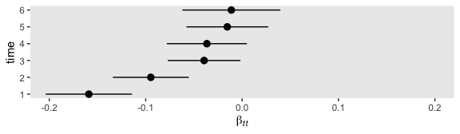

07
================
A Solomon Kurz
2019-07-21

# Linear Latent Growth Curve Models

> Growth curve models investigate level change in a variable over time.
> The two general approaches, growth curve analysis using multilevel
> regression (hierarchical linear modeling) and latent growth curve
> models using SEM, have undoubtedly become the most popular method of
> analyzing longitudinal data. Growth curve models, in general,
> represent a very flexible approach to modeling change that allows for
> investigation of linear and nonlinear trends and individual
> differences in these trends. For basic models, the two methods of
> estimating them are equivalent, but latent growth curve models offer
> some additional flexibility as well as the potential for incorporating
> growth curves into the general SEM framework, making it possible to
> investigate the relationship between latent predictor variables on
> growth, the effects of growth on other factors, mediational
> hypotheses, and modeling of parallel growth curves. (p. 171)

## Latent growth curve models with observed continuous variables

### General concepts.

“The goal of latent growth curve modeling is to describe the
relationship between repeated measurement of a variable and some metric
of time” (p. 171).

Starting simple consider the case of a single variable \(y\) assessed
over multiple individuals indexed by \(i\) across multiple time points
\(t\):

\[
y_{ti} = \beta_{0i} + \beta_{1i} x_{ti} + r_{ti}.
\]

Here \(\beta_{0}\) and \(\beta_{1}\) are the intercepts and slopes,
respectively, and they vary across individuals, as indicated by the
\(i\) subscripts. The residual variance is captured by \(r\). We can
simulate data following this for for a single case like so.

``` r
library(tidyverse)

b0 <- 1
b1 <- .25
r  <- .25

set.seed(1)
d <-
  tibble(time = 0:5,
         b0   = b0,
         b1   = b1,
         r    = r) %>% 
  mutate(y    = rnorm(n = 6, mean = b0 + b1 * time, sd = r))

head(d)
```

    ## # A tibble: 6 x 5
    ##    time    b0    b1     r     y
    ##   <int> <dbl> <dbl> <dbl> <dbl>
    ## 1     0     1  0.25  0.25 0.843
    ## 2     1     1  0.25  0.25 1.30 
    ## 3     2     1  0.25  0.25 1.29 
    ## 4     3     1  0.25  0.25 2.15 
    ## 5     4     1  0.25  0.25 2.08 
    ## 6     5     1  0.25  0.25 2.04

Here we’ll use the OLS-based `lm()` function to get a quick and dirty
model for the data.

``` r
fit <- lm(data = d,
          y ~ 1 + time)

summary(fit)
```

    ## 
    ## Call:
    ## lm(formula = y ~ 1 + time, data = d)
    ## 
    ## Residuals:
    ##        1        2        3        4        5        6 
    ## -0.11546  0.07351 -0.19487  0.39930  0.06929 -0.23176 
    ## 
    ## Coefficients:
    ##             Estimate Std. Error t value Pr(>|t|)   
    ## (Intercept)  0.95884    0.18965   5.056   0.0072 **
    ## time         0.26356    0.06264   4.208   0.0136 * 
    ## ---
    ## Signif. codes:  0 '***' 0.001 '**' 0.01 '*' 0.05 '.' 0.1 ' ' 1
    ## 
    ## Residual standard error: 0.262 on 4 degrees of freedom
    ## Multiple R-squared:  0.8157, Adjusted R-squared:  0.7696 
    ## F-statistic:  17.7 on 1 and 4 DF,  p-value: 0.01361

Now we have the `fit` object, we can use the `fitted()` function to
derive the fitted values.

``` r
fitted(fit)
```

    ##         1         2         3         4         5         6 
    ## 0.9588445 1.2224047 1.4859649 1.7495252 2.0130854 2.2766456

We can use them to make our version of Figure 7.1.

``` r
# add the `fitted()` values
d <-
  d %>% 
  mutate(f = fitted(fit)) 

# make an intermediary tibble for the annotation
text <-
  d %>%
  filter(time == 3 | time == 5) %>% 
  mutate(offset = c(-.5, .15)) %>% 
  mutate(time = time + offset,
         y    = ifelse(time == 2.5, (y + f) / 2, f),
         label = c("italic(r[ti])", "hat(italic(y))[italic(ti)]"))

# plot!
d %>% 
  ggplot(aes(x = time)) +
  geom_point(aes(y = y)) +
  geom_line(aes(y = f)) +
  geom_linerange(aes(ymin = y, ymax = f),
                 color = "grey50", linetype = 3) +
  geom_segment(x = 2.67, xend = 2.95,
               y = 1.95, yend = 1.95,
               arrow = arrow(length = unit(0.15, "cm"))) +
  geom_text(data = text,
            aes(y = y, label = label),
            parse = T) +
  labs(x = expression(paste("Time (", italic(x[ti]), ")")),
       y = expression(italic(y[ti]))) +
  coord_cartesian(ylim = 0:3) +
  theme(panel.grid = element_blank())
```

<!-- -->

The figure is an attempt to show how \(r_{ti} = y_{ti} - \hat y_{ti}\).
Above, we already pulled the \(\hat y_{ti}\) values with the `fitted()`
function. We can similarly use the `residuals()` function to pull the
estimates for \(r_{ti}\). We might add those to the `d` data.

``` r
d %>% 
  select(y:f) %>% 
  rename(y_hat = f) %>% 
  mutate(r = residuals(fit)) %>% 
  mutate(`y - y_hat` = y - y_hat)
```

    ## # A tibble: 6 x 4
    ##       y y_hat       r `y - y_hat`
    ##   <dbl> <dbl>   <dbl>       <dbl>
    ## 1 0.843 0.959 -0.115      -0.115 
    ## 2 1.30  1.22   0.0735      0.0735
    ## 3 1.29  1.49  -0.195      -0.195 
    ## 4 2.15  1.75   0.399       0.399 
    ## 5 2.08  2.01   0.0693      0.0693
    ## 6 2.04  2.28  -0.232      -0.232

Did you notice how our last column, `y - y_hat` ended up with the same
values as in the `r` column? Yep, that’s another way of showing how the
\(r_{ti} = y_{ti} - \hat y_{ti}\) equation works. “The variance of these
residuals can be used to quantify the degree to which there is variance
within each case that is unexplained by the time variable, often
described as within-person variance when cases are people” (p. 172). But
so far, we’ve been playing with an example of only level of \(i\)
participants. Once we have several values for \(i\) (i.e.,
\(i = 1, 2, ..., n - 1, n\)), we’ll want to generalize.

> To describe the entire data set, we estimate the expected value of
> \(y_{ti}\) at the beginning of the study, by taking the average of all
> the intercepts, \(\gamma_{00}\), where the intercept for any given
> case may deviate from that average by \(u_0\).
> 
> \(\beta_0 = \gamma_{00} + u_0\)
> 
> The variance of the residual, \(\text{Var}(u_{0i})\), gives the
> variability across cases of the expected value of \(y_{ti}\) at the
> beginning of the study assuming the above-mentioned coding of the time
> variable. Similarly, we could estimate the average slope by using
> \(\gamma_{10}\) and the deviation of any individual’s slope from that
> average by \(u_{1i}\), having variance \(\text{Var}(u_{1i})\).
> 
> \(\beta_1 = \gamma_{10} + u_1\)
> 
> The variability of the intercepts and the slopes are illustrated in
> \[our version of\] Figure 7.2, a plot of a set of hypothetical linear
> growth curves. (pp. 172–173)

``` r
b0 <- 1
b1 <- .25
r  <- .25

gamma00 <- b0
gamma10 <- b1

set.seed(1)
d <-
  tibble(time = 0:5,
         b0   = b0,
         b1   = b1,
         r    = r) %>% 
  mutate(y    = rnorm(n = 6, mean = b0 + b1 * time, sd = r))

head(d)
```

    ## # A tibble: 6 x 5
    ##    time    b0    b1     r     y
    ##   <int> <dbl> <dbl> <dbl> <dbl>
    ## 1     0     1  0.25  0.25 0.843
    ## 2     1     1  0.25  0.25 1.30 
    ## 3     2     1  0.25  0.25 1.29 
    ## 4     3     1  0.25  0.25 2.15 
    ## 5     4     1  0.25  0.25 2.08 
    ## 6     5     1  0.25  0.25 2.04

``` r
# how many participants would you like?
n <- 8

# define your gamma parameters
gamma00 <- b0
gamma10 <- b1

# set the seed and simulate
set.seed(7)

d <-
  tibble(i       = 1:n,
         gamma00 = gamma00,
         gamma10 = gamma10) %>% 
  # the two `sd` values were chosen based on trial and error
  mutate(u0      = rnorm(n, mean = 0, sd = .2),
         u1      = rnorm(n, mean = 0, sd = .1)) %>% 
  expand(nesting(i, gamma00, gamma10, u0, u1),
         time = 0:5)

head(d, n = 10)
```

    ## # A tibble: 10 x 6
    ##        i gamma00 gamma10     u0     u1  time
    ##    <int>   <dbl>   <dbl>  <dbl>  <dbl> <int>
    ##  1     1       1    0.25  0.457 0.0153     0
    ##  2     1       1    0.25  0.457 0.0153     1
    ##  3     1       1    0.25  0.457 0.0153     2
    ##  4     1       1    0.25  0.457 0.0153     3
    ##  5     1       1    0.25  0.457 0.0153     4
    ##  6     1       1    0.25  0.457 0.0153     5
    ##  7     2       1    0.25 -0.239 0.219      0
    ##  8     2       1    0.25 -0.239 0.219      1
    ##  9     2       1    0.25 -0.239 0.219      2
    ## 10     2       1    0.25 -0.239 0.219      3

Following the equation a little further down on page 173,

\[
y_{ti} = (\gamma_{00} + u_{0i}) + (\gamma_{10} + u_{1i}) x_{ti} + r_{ti}, 
\]

here is how we might define our \(\hat y_{ti}\) values and then make the
plot.

``` r
d <-
  d %>% 
  mutate(y_hat = (gamma00 + u0) + (gamma10 + u1) * time)

d %>% 
  ggplot(aes(x = time, y_hat, group = i)) +
  geom_line(alpha = 2/3) +
  labs(x = expression(paste("Time (", italic(x[ti]), ")")),
       y = expression(italic(y[ti]))) +
  coord_cartesian(ylim = 0:3) +
  theme(panel.grid = element_blank())
```

<!-- -->

Though not explicated in this part of the text, it’s worth mentioning
that \(u_0\) and \(u_1\) follow a multivariate normal distribution,
which may be expressed as

$$ \\begin{bmatrix} u\_0 \\ u\_1 \\end{bmatrix}  \\begin{pmatrix}

,

\\begin{bmatrix} *0 & *{01} \\ \_{01} & \_1 \\end{bmatrix}

\\end{pmatrix}, $$

where \(\sigma_0\) and \(\sigma_1\) are variances and \(\sigma_{01}\) is
their covariance. Since we estimated the `u0` and `u1` values
independently, above, they ended up with a covariance near zero.

``` r
d %>% 
  group_by(i) %>% 
  slice(1) %>%
  ungroup() %>% 
  select(u0:u1) %>% 
  cov()
```

    ##              u0           u1
    ## u0  0.054380228 -0.008874142
    ## u1 -0.008874142  0.011383894

The empirical covariance is on the off-diagonal.

### Latent growth curve model.

As an alternative to the multilevel growth model, above, we can express
the measurement model for the latent growth curve model
as

\[y_{ti} = \lambda_{t0} \eta_{0i} + \lambda_{t1} \eta_{1i} + \epsilon_{ti},\]

where all the loadings for \(\eta_{0i}\) (i.e., the \(\lambda_{0t}\)
values) are constrained to 1, making \(\eta_{0i}\) the model constant
(i.e., intercept). Bringing in familiar terms from the latent variable
model, we can then substitute in an \(a\) term and simplify the equation
to

\[y_{ti} = a_{0i} + \lambda_{t1} \eta_{1i} + \epsilon_{ti},\]

In the case where the latent growth curve model is equivalent to the
multilevel growth model, you then define the \(\lambda_{1t}\) elements
by values representing time. With the simulated example from the
previous section, those would be \(0, 1, 2, 3, 4,\) and \(5\). The
equations for the \(\eta\) parameters follow the form

$$  $$

Thus we can express the full equation as

$$  $$

Or more simply, we can express the latent growth model in terms of a
typical SEM like

\[y_{ti} = \eta_{0} + \eta_{1} \lambda_{t1} + \epsilon_{ti}.\]

### Interpretation of coefficients.

Whereas \(a_0\) and \(a_1\) are the average intercepts and slopes,
respectively, \(\psi_{00}\) and \(\psi_{11}\) are their variances, for
which greater values indicate greater heterogeneity. Recall that if
variances are a difficult metric to interpret, that squaring them
converts them to a standard deviation metric. The \(a\) and \(\psi\)
parameters are also frequently referred to as *fixed* and *random*
effects, respectively.

To make our data for Figure 7.4, we’ll be using the full equation for a
growth model. The trickiest part is getting the variance/covariance
matrix part correct for the \(\zeta\)s. The `rmvnorm()` function from
the [mvtnorm package]() will, as the name implies, allow us to simulate
multivariate normal data based on prechosen means and a
variance/covariance matrix. Because the multivariate normal distribution
for the \(\zeta\)s has a mean vector of zeros, those are easy to define.

``` r
library(mvtnorm)

mu_zeta <- c(0, 0)
```

I find it hard to think in terms of variances and covariances, we’ll
just define them using standard deviations and correlations, instead.
Recall that a variance \(\sigma^2\) is just a standard deviation
\(\sigma\) squared and recall further that a covariance is the
correlation between two variables, \(\rho_{ij}\) multiplied by the
standard deviations of those variables (i.e., \(\sigma_i\) and
\(\sigma_j\)).

``` r
# the sigmas (i.e., $\psi^2$)
s <- c(.33, .33)

# the correlation (i.w., $\rho_{01}$)
r <- .5 

# here's the variance/covariance matrix
v <- 
  matrix(c((s[1] * s[1]),     (s[2] * s[1] * r),
           (s[2] * s[1] * r), (s[2] * s[2])),
         nrow = 2, ncol = 2)
```

Now all we need to do is set our seed and we’re ready to simulate with
`rmvnorm()`.

``` r
set.seed(7)
d1 <- 
  rmvnorm(n = 100, mean = mu_zeta, sigma = v) %>% 
  data.frame() %>% 
  set_names(str_c("zeta", 0:1))

head(d1)
```

    ##        zeta0       zeta1
    ## 1  0.6268561 -0.18612315
    ## 2 -0.2565236 -0.19072038
    ## 3 -0.3903149 -0.38485620
    ## 4  0.2284844  0.02661867
    ## 5  0.2357071  0.71110615
    ## 6  0.3458299  0.89646993

This `d1` data will be for the panel in the upper left of Figure 7.4.
Note that we simulated 100 values. Use whatever \(n\) you like. Before
we fully flesh out `d1`, let’s go ahead and reset a couple parameters to
simulate the \(\zeta\)s for the upper right panel. We’ll save them as
`d2`.

``` r
# redifine the sigmas (i.e., $\psi^2$)
s <- c(.33, 1)

# redefine the correlation
r <- -.9

# here's the variance/covariance matrix
v <- 
  matrix(c((s[1] * s[1]),     (s[2] * s[1] * r),
           (s[2] * s[1] * r), (s[2] * s[2])),
         nrow = 2, ncol = 2)

# after setting our seed, we're ready to simulate with `rmvnorm()`
set.seed(7)
d2 <- 
  rmvnorm(n = 100, mean = mu_zeta, sigma = v) %>% 
  data.frame() %>% 
  set_names(str_c("zeta", 0:1))
```

Since it’s handy to plot both panels at once, we’ll join those two data
frames together. Then we’ll use the rest of the equation for the
multilevel growth model to make the predicted values for Economic
Security based on Time.

``` r
# the grand means
a0 <- 1.5
a1 <- .5

# combine
d <-
  bind_rows(d1, d2) %>% 
  # wrangle
  mutate(r = str_c("r = ", c(".5", "-.9")) %>% rep(., each = 100),
         i = rep(1:100, times = 2)) %>%
  mutate(r = factor(r, levels = str_c("r = ", c(".5", "-.9")))) %>% 
  expand(nesting(r, i, zeta0, zeta1),
         time = 0:1) %>% 
  # use the equations
  mutate(a0 = a0,
         a1 = a1) %>% 
  mutate(y  = (a0 + zeta0) + (a1 + zeta1) * time)

head(d)
```

    ## # A tibble: 6 x 8
    ##   r          i  zeta0  zeta1  time    a0    a1     y
    ##   <fct>  <int>  <dbl>  <dbl> <int> <dbl> <dbl> <dbl>
    ## 1 r = .5     1  0.627 -0.186     0   1.5   0.5  2.13
    ## 2 r = .5     1  0.627 -0.186     1   1.5   0.5  2.44
    ## 3 r = .5     2 -0.257 -0.191     0   1.5   0.5  1.24
    ## 4 r = .5     2 -0.257 -0.191     1   1.5   0.5  1.55
    ## 5 r = .5     3 -0.390 -0.385     0   1.5   0.5  1.11
    ## 6 r = .5     3 -0.390 -0.385     1   1.5   0.5  1.22

We kept things simple and just referred to Economic Security as `y`.
Here’s the plot.

``` r
d %>% 
  ggplot() +
  geom_line(aes(x = time, y = y, group = i),
            size = 1/4, alpha = 1/4, color = "grey25") +
  geom_line(aes(x = time, y = a0 + (a1 * time)),
            size = 1.5) +
  scale_x_continuous(breaks = NULL) +
  scale_y_continuous("economic security", 
                     breaks = NULL, limits = c(0, 4)) +
  theme(panel.grid = element_blank()) +
  facet_wrap(~r, ncol = 2)
```

<!-- -->

The grand means (i.e., the \(a\)s) are depicted by the bolder lines. The
thinner gray lines are the \(i\)-specific trajectories. We can largely
reuse our `d` data to make the plots in the lower panels. All we need to
do is update our \(a\) parameters and redefine `y`. Then we’re ready to
plot.

``` r
d %>% 
  mutate(a0 = 2,
         a1 = -0.5) %>% 
  mutate(y  = (a0 + zeta0) + (a1 + zeta1) * time) %>% 
  
  ggplot() +
  geom_line(aes(x = time, y = y, group = i),
            size = 1/4, alpha = 1/4, color = "grey25") +
  geom_line(aes(x = time, y = a0 + (a1 * time)),
            size = 1.5) +
  scale_x_continuous(breaks = NULL) +
  scale_y_continuous("economic security", 
                     breaks = NULL, limits = c(0, 4)) +
  theme(panel.grid = element_blank()) +
  facet_wrap(~r, ncol = 2)
```

<!-- -->

### Time coding.

> Because we can interpret Equation (7.4) as any other regression, the
> intercept is the expected value for \(y_{ti}\), when \(x_{ti}\) equals
> 0. If the loadings for \(\eta_1\) are specified so that they begin
> with 0, then the intercept mean, \(a_0\), can be interpreted as the
> expected value or sample average of \(y_{ti}\) at the first time
> point. (p. 176)

Say we have 5 time points. Some common coding schemes are:

  - \(0, 1, 2, 3, 4\) (i.e., the one just mentioned),
  - \(-2, -1, 0, 1, 2\), which puts \(a_0\) in the metric of the middle
    time, and
  - \(-4, -3, -2, -1, 0\), which centers \(a_0\) on the last time point.

I’m also a frequent user of
\(\frac{0}{4}, \frac{1}{4}, \frac{2}{4}, \frac{3}{4}, \frac{4}{4}\),
which puts \(a_0\) and \(a_1\) in a beginning-to-end metric.

### Relation to other models.

To my eye, the most interesting part of this section was the first
paragraph.

> It is interesting to note that if the slope factor is omitted and only
> a single “intercept” factor is specified with loadings equal to 1,
> then the model is the same as a trait factor concept used in latent
> state-trait models discussed in Chapter 6. Without the slope factor,
> the single latent variable is equally weighted by all the repeated
> measures, and, therefore, represents a sole underlying, stable cause
> of responses at every time point. Any occasion-specific variance is
> estimated in the measurement residual for each time point. The
> relation of the latent growth curve model to latent state-trait models
> suggests several extensions, such as incorp- orating method factors,
> multiple indicators at each occasion, and autoregressive processes.
> (p. 177)

### Intraclass correlation coefficient.

“The ICC is the proportion of between-group variance relative to total
variance and can be calculated by a ratio of the variance of the
intercept factor, Var(η0) = ψ00, to total variance” (p. 178). Within the
context of the intercept-only latent growth model, it follows the
formula

\[
\rho = \frac{\psi_{00}}{\psi_{00} + \text{Var}(y_{ti})} = \frac{\psi_{00}}{\psi_{00} + \theta_{(tt)}}
\]

This formula carries the assumpiton of equality of residual variances
across time points “so that there is a single value for the residual,
with \(\text{Var}(\epsilon_{ti}) = \theta_{(tt)}\)” (p. 178). In
addition

> using the same formula, the ICC can be computed for a model with the
> growth factor included, which can be called a *conditional intraclass
> correlation coefficient*. The latter can be interpreted as the
> proportion of variance between cases in the intercept (e.g., scores at
> baseline) relative to the total variance of \(y_{ti}\) after taking
> into account variance due to linear change over time. (p. 178,
> *emphasis* in the original)

### Reliability.

> Another useful index that is conceptually distinguished from ICC but
> is closely related mathematically is the *reliability coefficient*.
> Reliability, in this case, does not refer to psychometric properties
> (although see
> [Kreft 1997](https://psycnet.apa.org/record/1997-05114-000) for a
> discussion of psychometric analyses with multilevel regression), but
> refers to the stability of the estimate of either the intercept or the
> slope. With higher reliability of the estimate, the standard error for
> the estimate will be smaller, indicating more precise population
> inferences
> ([Raudenbush, 1988](https://journals.sagepub.com/doi/pdf/10.3102/10769986013002085)).
> (p. 179, *emphasis* in the original)

This version of \(\rho\) for the intercept follows the form

\[
\rho = \frac{\psi_{00}}{\psi_{00} + \theta_{(tt)} / T}, 
\]

where \(T\) is the number of time points. Further connecting back to the
prior section, this equation implies that reliability for the intercept
will be higher in models with higher ICCs. Here’s the equation for the
reliability of the slope:

\[
\rho_{RB} = \frac{\psi_{11}}{\psi_{11} + \theta_{(tt)} / T}, 
\]

> [McArdle and Epstein
> (1987)](https://www.jstor.org/stable/pdf/1130295.pdf) proposed an
> index of reliability that combines the estimates of variability of the
> intercepts, \(\psi_{00}\), slopes, \(\psi_{11}\), and their
> covariance, \(\psi_{01}\). It is an occasion-specific index which can
> be computed using the following
> formula:
> 
> \[\rho_{ME} = \frac{\psi_{00} + 2 \lambda_{t1} \psi_{01} + \lambda_{t1}^2 \psi_{11}}{ \psi_{00} + 2 \lambda_{t1} \psi_{01} + \lambda_{t1}^2 \psi_{11} + \theta_{(tt)}}\]
> 
> The index is specific to the time point where the value of the slope
> loading, \(\lambda_{t1}\), for a particular time point must be
> inserted…
> 
> Another alternative reliability index, proposed by [Willett
> (1989)](https://journals.sagepub.com/doi/pdf/10.1177/001316448904900309),
> is specific to intercepts *or* slopes but takes into account the
> spacing of the time metric, based on the rationale that greater
> variance of the independent variable should increase reliability and
> power. (pp. 179–180, *emphasis* added)

Within the context of \(\psi_{11}\), this coefficient follows the
formula

\[
\begin{align*}
\rho_W & = \frac{\psi_{11}}{\psi_{11} + \theta_{(tt)} / SST} \\
SST    & = \sum(t - \overline t)^2,
\end{align*}
\]

where \(t\) indexes individual time points, \(\overline t\) is their
mean, and \(SST\) is short for the *sum of squared deviations from the
mean time point*.

### Comments.

> In a simulation, [Rast and Hofer
> (2014)](https://www.ncbi.nlm.nih.gov/pmc/articles/PMC4080819/pdf/nihms597036.pdf)
> examine power comparing \(\rho_{ME}\) and \(\rho_W\), and they
> concluded that \(\rho_W\), which is based only on slope variability,
> is a more appropriate indicator of power to detect variability in
> change than \(\rho_{ME}\). There is less to go on in terms of choosing
> between \(\rho_W\) and \(\rho_{RB}\). Use of \(SST\) in the
> denominator gives exponentially increasing weight to the number of
> waves and the length of interval between waves (e.g., 1 year vs. 2
> years) as compared with just using \(T\). With equal spacing,
> researchers typically use arbitrary time scores for loadings of the
> growth curve factor rather than coding based on the original interval
> spacing, so it is important to take this into account if using the
> reliability computation based on \(SST\).
> 
> The difference between \(\rho_W\) and \(\rho_{RB}\) is that
> \(\rho_{RB}\) is unconcerned with the actual time interval underlying
> the occasions of measurement, whereas \(\rho_W\) gives heavy weight to
> the actual time interval. In other words, with \(\rho_{RB}\), three
> waves are treated the same in terms of reliability whether waves are
> semiannual, annual, bienniel, or once every 10 years. The \(\rho_W\)
> index, on the other hand, will show dramatically different values for
> reliability when the actual time interval differs (Rast & Hofer, 2014,
> figure 1). Underlying the Willett’s conceptualization of \(\rho_W\) is
> the implication that larger increments in actual time should afford
> greater sensitivity for detecting change. (p, 180)

### Model fit.

Given \(J\) observed variables and \(q\) freely-estimated parameters,
the degrees fo freedom of a frequentist latent growth model are

\[
df = \frac{J (J + 1)}{2} + J - q.
\]

In the unconditional univariate growth model, \(J = T\). The parameters
to estimate are

  - \(a_0\) (i.e., the mean of the intercept factor),
  - \(a_1\) (i.e., the mean of the slope factor),
  - \(\psi_{00}\) (i.e., the variance of the intercept factor),
  - \(\psi_{11}\) (i.e., the variance of the slope factor),
  - \(\psi_{01}\) (i.e., the covariance between the intercept and slope
    factors), and
  - \(\epsilon\) (i.e., the residual variance for each of the observed
    variables),

making \(q = T + 5\). Here’s how that works out when \(T = 2\).

``` r
t <- 2
j <- t
q <- t + 5

(j * (j + 1)) / 2 + j - q
```

    ## [1] -2

You need at least \(T = 3\) for a positive \(df\).

``` r
t <- 3
j <- t
q <- t + 5

(j * (j + 1)) / 2 + j - q
```

    ## [1] 1

Here’s what that looks like through \(T = 10\).

``` r
tibble(t = 1:10) %>% 
  mutate(j = t,
         q = t + 5) %>% 
  mutate(df = (j * (j + 1)) / 2 + j - q) %>% 
  
  ggplot(aes(x = t, y = df, label = df)) +
  geom_linerange(aes(ymin = 0, ymax = df),
                 color = "white") +
  geom_text() +
  scale_x_continuous(expression(italic(T)), breaks = 1:10) +
  scale_y_continuous(expression(italic(df)), breaks = NULL) +
  theme(panel.grid = element_blank())
```

<!-- -->

> Measurement residuals are usually freely estimated at each time point,
> allowing for *heterogeneity of variance*. By default, multilevel
> regression programs nearly universally assume that variances at each
> time point are equal. This *homogeneity of variance* assumption can be
> lifted in most multilevel software programs, however, given a
> sufficient number of variance–covariance elements to free parameters.
> By default, measurement residual variances in SEM software programs
> will estimate each measurement residual variance individually, so that
> heterogeneity of variances is specified by default. (p. 181,
> *emphasis* in the original)

### Correlated measurement residuals.

> Inclusion of an autoregression correlation structure will generally
> have little impact on the estimates of the average intercept or
> average slope, because the estimate of the mean at baseline (and any
> other chosen referent point for the intercept) or level changes over
> time are based on observed means rather than covariances. Variance
> estimates for the intercept and slope factors and their covariance may
> be affected by inclusion of correlated measurement residuals, however.
> In particular, because the estimates of the variances of the factors
> and their covariances are a function of the covariances among the
> observed variables, any estimated covariance between measurement
> residuals of any two observed variables will absorb some of the
> covariance between the growth factors. (p. 182)

### Example 7.1: Growth curve model with observed variables .

Here we load the `health` data.

``` r
library(tidyverse)


health1_names <- c("age", "srh1", "srh2", "srh3", "srh4", "srh5", "srh6", "bmi1",
"bmi2", "bmi3", "bmi4", "bmi5", "bmi6", "cesdna1", "cesdpa1", "cesdso1",
"cesdna2", "cesdpa2", "cesdso2", "cesdna3", "cesdpa3", "cesdso3",
"cesdna4", "cesdpa4", "cesdso4", "cesdna5", "cesdpa5", "cesdso5",
"cesdna6", "cesdpa6", "cesdso6", "diab1", "diab2", "diab3", "diab4", "diab5", "diab6")

health1 <- 
  read_table2("data/health.dat",
              col_names = F) %>% 
  set_names(health1_names)

glimpse(health1)
```

    ## Observations: 5,335
    ## Variables: 37
    ## $ age     <dbl> 55.14051, 63.33294, 58.57362, 62.28161, 59.67750, 54.28464, 52.55816, 57.86435, 4…
    ## $ srh1    <dbl> 3.2198275, 2.9382677, 2.0597007, 3.0955038, 5.0433826, 3.5554657, 5.5763941, 2.52…
    ## $ srh2    <dbl> 2.8445559, 0.4750199, 2.9808080, 5.1865756, 4.8425321, 3.1431942, 5.8039766, 1.72…
    ## $ srh3    <dbl> 1.5812505, 0.6661576, 3.3965038, 3.9656595, 3.4228102, 4.3778358, 4.2649820, 2.44…
    ## $ srh4    <dbl> 1.246121, 3.082019, 2.927770, 3.111632, 4.037927, 4.864917, 4.987574, 2.826647, 2…
    ## $ srh5    <dbl> 2.109169, 3.313588, 2.910595, 3.385376, 3.679832, 3.939745, 4.714705, 2.041515, 1…
    ## $ srh6    <dbl> 0.7174636, 3.4266173, 2.2108723, 4.0888979, 2.8907116, 5.4200764, 4.1951033, 1.80…
    ## $ bmi1    <dbl> 27.07684, 24.73399, 13.92317, 23.66202, 23.77539, 24.20106, 30.58369, 20.77051, 2…
    ## $ bmi2    <dbl> 29.36844, 27.05468, 12.46290, 24.68125, 25.61055, 22.28988, 29.87928, 20.09698, 2…
    ## $ bmi3    <dbl> 29.66096, 27.94157, 13.35623, 24.15629, 25.38682, 22.66508, 30.93980, 20.45760, 2…
    ## $ bmi4    <dbl> 29.17343, 25.27107, 15.84282, 26.11209, 25.27067, 22.91192, 29.27698, 22.85022, 2…
    ## $ bmi5    <dbl> 27.89252, 26.70287, 15.94613, 25.38515, 28.23984, 24.07524, 29.91350, 21.36999, 2…
    ## $ bmi6    <dbl> 27.84005, 28.03522, 15.36183, 24.78045, 31.23735, 23.05708, 28.44048, 21.13281, 2…
    ## $ cesdna1 <dbl> 0.74303571, 0.16488355, 1.87221256, 1.31373798, 0.09486535, 0.12510548, -0.915756…
    ## $ cesdpa1 <dbl> 0.436906701, -0.033533830, 1.475101223, 0.401203350, -0.842562892, 0.417105784, -…
    ## $ cesdso1 <dbl> 1.011333702, 1.545492577, 2.193678046, 1.510663107, 1.026094881, -0.637535959, -0…
    ## $ cesdna2 <dbl> 0.12849876, 1.34096676, 1.13514402, 0.23508332, -0.11428990, 0.29573280, -0.85329…
    ## $ cesdpa2 <dbl> 0.038760982, 0.324536201, 0.563480932, 0.891357097, -0.259453742, 0.087950132, -0…
    ## $ cesdso2 <dbl> 0.565636114, 1.445836063, 0.897660059, 1.029471024, 0.121380560, 0.119198506, -0.…
    ## $ cesdna3 <dbl> 1.28247129, 0.64601176, 1.65421496, 1.11993582, -0.33731809, -0.05723795, -0.2395…
    ## $ cesdpa3 <dbl> 0.00449714, 0.11487274, 0.97725106, 0.06974150, -0.59886001, -0.17291847, 0.32511…
    ## $ cesdso3 <dbl> 0.98245704, 1.14681368, 0.54377474, 1.09111187, -0.22315701, -0.84097531, 0.29798…
    ## $ cesdna4 <dbl> 0.76634368, 0.45245331, 0.94656252, 0.90004914, -0.21023571, -0.62962542, -0.2955…
    ## $ cesdpa4 <dbl> 1.06791063, 0.42990375, 1.13790307, -0.28098070, -0.21969694, -0.45545507, -0.131…
    ## $ cesdso4 <dbl> 1.344636026, 1.920672847, 0.779635300, 1.279747533, 0.533762378, -0.869282164, 1.…
    ## $ cesdna5 <dbl> 1.662771683, 0.485716594, 1.039801515, 1.849047774, -0.978267122, -0.154426006, -…
    ## $ cesdpa5 <dbl> 0.47487035, 0.07592504, 0.85403794, 0.33552042, -0.35155820, 0.29087568, -0.59251…
    ## $ cesdso5 <dbl> 1.149128170, 1.395302757, 1.148873191, 0.909460004, 0.309136029, -0.781009273, -0…
    ## $ cesdna6 <dbl> 0.775151864, -0.657313881, 1.104759377, 1.008838723, 0.290811382, -0.130866419, -…
    ## $ cesdpa6 <dbl> 0.92909329, -0.58094074, 0.82054117, 0.58563043, 0.85744930, -0.19660509, 0.07765…
    ## $ cesdso6 <dbl> 0.52176789, 1.07739169, 1.34071571, 1.25569779, 0.95729093, -0.45461663, 0.381784…
    ## $ diab1   <dbl> 0, 0, 0, 0, 0, 0, 0, 0, 0, 0, 0, 0, 0, 0, 0, 0, 0, 0, 0, 0, 0, 0, 0, 0, 0, 1, 0, …
    ## $ diab2   <dbl> 0, 0, 0, 0, 0, 0, 0, 0, 0, 0, 0, 0, 0, 0, 0, 0, 0, 0, 0, 0, 1, 0, 0, 0, 0, 1, 0, …
    ## $ diab3   <dbl> 0, 0, 0, 0, 0, 0, 0, 0, 0, 0, 0, 0, 0, 0, 0, 0, 0, 0, 0, 0, 0, 0, 0, 0, 0, 1, 0, …
    ## $ diab4   <dbl> 0, 0, 0, 0, 0, 0, 0, 0, 0, 0, 1, 0, 0, 0, 0, 0, 0, 0, 0, 0, 1, 0, 0, 0, 0, 1, 0, …
    ## $ diab5   <dbl> 0, 0, 0, 0, 0, 0, 0, 0, 0, 0, 1, 0, 0, 0, 0, 0, 0, 0, 0, 0, 1, 0, 0, 0, 0, 1, 0, …
    ## $ diab6   <dbl> 0, 0, 0, 0, 0, 0, 0, 0, 0, 0, 0, 0, 0, 0, 0, 0, 0, 0, 0, 0, 0, 0, 0, 0, 0, 1, 0, …

We’ll be modeling BMI trajectories across the 5,335 participants. To get
a sense of the data, here we’ll sample a random 250 cases and plot their
empirical trajectories.

``` r
set.seed(7)

health1 %>% 
  sample_n(size = 250) %>% 
  mutate(id = 1:n()) %>% 
  select(bmi1:bmi6, id) %>% 
  gather(key, bmi, -id) %>% 
  mutate(time = str_remove(key, "bmi") %>% as.double()) %>% 
  
  ggplot(aes(x = time, y = bmi, group = id)) +
  geom_line(size = 1/4, alpha = 1/4) +
  theme(panel.grid = element_blank())
```

<!-- -->

They vary a little across time, but generally appear stable within
individuals and in aggregate. Time to fire up lavaan.

``` r
library(lavaan)
```

We get the code for the first model from Newsom’s `ex7-1.a.R` file.

``` r
model7.1a <- '  
i =~ 1*bmi1 + 1*bmi2 + 1*bmi3 + 1*bmi4 + 1*bmi5 + 1*bmi6
s =~ 0*bmi1 + 1*bmi2 + 2*bmi3 + 3*bmi4 + 4*bmi5 + 5*bmi6

# variances/covariances
i ~~ i
s ~~ s
i ~~ s

# intercepts
i ~ 1
s ~ 1 

bmi1 ~ 0
bmi2 ~ 0
bmi3 ~ 0
bmi4 ~ 0
bmi5 ~ 0
bmi6 ~ 0
'

fit_7.1a <- 
  growth(model7.1a, 
         data = health1)

summary(fit_7.1a, 
        fit.measures = T, 
        standardized = T, 
        rsquare = T)
```

    ## lavaan 0.6-3 ended normally after 99 iterations
    ## 
    ##   Optimization method                           NLMINB
    ##   Number of free parameters                         11
    ## 
    ##   Number of observations                          5335
    ## 
    ##   Estimator                                         ML
    ##   Model Fit Test Statistic                     623.877
    ##   Degrees of freedom                                16
    ##   P-value (Chi-square)                           0.000
    ## 
    ## Model test baseline model:
    ## 
    ##   Minimum Function Test Statistic            59047.311
    ##   Degrees of freedom                                15
    ##   P-value                                        0.000
    ## 
    ## User model versus baseline model:
    ## 
    ##   Comparative Fit Index (CFI)                    0.990
    ##   Tucker-Lewis Index (TLI)                       0.990
    ## 
    ## Loglikelihood and Information Criteria:
    ## 
    ##   Loglikelihood user model (H0)             -68667.974
    ##   Loglikelihood unrestricted model (H1)     -68356.036
    ## 
    ##   Number of free parameters                         11
    ##   Akaike (AIC)                              137357.949
    ##   Bayesian (BIC)                            137430.351
    ##   Sample-size adjusted Bayesian (BIC)       137395.397
    ## 
    ## Root Mean Square Error of Approximation:
    ## 
    ##   RMSEA                                          0.084
    ##   90 Percent Confidence Interval          0.079  0.090
    ##   P-value RMSEA <= 0.05                          0.000
    ## 
    ## Standardized Root Mean Square Residual:
    ## 
    ##   SRMR                                           0.016
    ## 
    ## Parameter Estimates:
    ## 
    ##   Information                                 Expected
    ##   Information saturated (h1) model          Structured
    ##   Standard Errors                             Standard
    ## 
    ## Latent Variables:
    ##                    Estimate  Std.Err  z-value  P(>|z|)   Std.lv  Std.all
    ##   i =~                                                                  
    ##     bmi1              1.000                               4.835    0.967
    ##     bmi2              1.000                               4.835    0.970
    ##     bmi3              1.000                               4.835    0.957
    ##     bmi4              1.000                               4.835    0.937
    ##     bmi5              1.000                               4.835    0.921
    ##     bmi6              1.000                               4.835    0.877
    ##   s =~                                                                  
    ##     bmi1              0.000                               0.000    0.000
    ##     bmi2              1.000                               0.444    0.089
    ##     bmi3              2.000                               0.888    0.176
    ##     bmi4              3.000                               1.332    0.258
    ##     bmi5              4.000                               1.776    0.338
    ##     bmi6              5.000                               2.220    0.403
    ## 
    ## Covariances:
    ##                    Estimate  Std.Err  z-value  P(>|z|)   Std.lv  Std.all
    ##   i ~~                                                                  
    ##     s                -0.057    0.037   -1.512    0.130   -0.026   -0.026
    ## 
    ## Intercepts:
    ##                    Estimate  Std.Err  z-value  P(>|z|)   Std.lv  Std.all
    ##     i                27.211    0.067  403.933    0.000    5.628    5.628
    ##     s                 0.150    0.008   19.884    0.000    0.337    0.337
    ##    .bmi1              0.000                               0.000    0.000
    ##    .bmi2              0.000                               0.000    0.000
    ##    .bmi3              0.000                               0.000    0.000
    ##    .bmi4              0.000                               0.000    0.000
    ##    .bmi5              0.000                               0.000    0.000
    ##    .bmi6              0.000                               0.000    0.000
    ## 
    ## Variances:
    ##                    Estimate  Std.Err  z-value  P(>|z|)   Std.lv  Std.all
    ##     i                23.377    0.469   49.846    0.000    1.000    1.000
    ##     s                 0.197    0.006   32.627    0.000    1.000    1.000
    ##    .bmi1              1.632    0.054   30.325    0.000    1.632    0.065
    ##    .bmi2              1.360    0.038   35.955    0.000    1.360    0.055
    ##    .bmi3              1.567    0.037   42.142    0.000    1.567    0.061
    ##    .bmi4              1.823    0.043   42.616    0.000    1.823    0.068
    ##    .bmi5              1.478    0.043   34.149    0.000    1.478    0.054
    ##    .bmi6              2.626    0.074   35.390    0.000    2.626    0.086
    ## 
    ## R-Square:
    ##                    Estimate
    ##     bmi1              0.935
    ##     bmi2              0.945
    ##     bmi3              0.939
    ##     bmi4              0.932
    ##     bmi5              0.946
    ##     bmi6              0.914

Our results cohere with those in the text. Here’s the empirical mean for
BMI at the first wave.

``` r
mean(health1$bmi1)
```

    ## [1] 27.17634

Here’s a focused summary of the model-implied slope.

``` r
parameterestimates(fit_7.1a) %>% 
  filter(str_detect(lhs, "s") & str_detect(op, "~1")) %>% 
  select(lhs, op,  est, starts_with("ci.")) %>% 
  mutate_if(is.double, round, digits = 3)
```

    ##   lhs op  est ci.lower ci.upper
    ## 1   s ~1 0.15    0.135    0.164

Here’s the alternate version with time coded 0, 2, 4, 6, 8, 10.

``` r
model7.1a_alt <- '  
i =~ 1*bmi1 + 1*bmi2 + 1*bmi3 + 1*bmi4 + 1*bmi5 + 1*bmi6
# the only difference in the code is here
s =~ 0*bmi1 + 2*bmi2 + 4*bmi3 + 6*bmi4 + 8*bmi5 + 10*bmi6

# variances/covariances
i ~~ i
s ~~ s
i ~~ s

# intercepts
i ~ 1
s ~ 1 

bmi1 ~ 0
bmi2 ~ 0
bmi3 ~ 0
bmi4 ~ 0
bmi5 ~ 0
bmi6 ~ 0
'

fit_7.1a_alt <- 
  growth(model7.1a, 
         data = health1)

summary(fit_7.1a_alt, 
        fit.measures = T, 
        standardized = T, 
        rsquare = T)
```

    ## lavaan 0.6-3 ended normally after 99 iterations
    ## 
    ##   Optimization method                           NLMINB
    ##   Number of free parameters                         11
    ## 
    ##   Number of observations                          5335
    ## 
    ##   Estimator                                         ML
    ##   Model Fit Test Statistic                     623.877
    ##   Degrees of freedom                                16
    ##   P-value (Chi-square)                           0.000
    ## 
    ## Model test baseline model:
    ## 
    ##   Minimum Function Test Statistic            59047.311
    ##   Degrees of freedom                                15
    ##   P-value                                        0.000
    ## 
    ## User model versus baseline model:
    ## 
    ##   Comparative Fit Index (CFI)                    0.990
    ##   Tucker-Lewis Index (TLI)                       0.990
    ## 
    ## Loglikelihood and Information Criteria:
    ## 
    ##   Loglikelihood user model (H0)             -68667.974
    ##   Loglikelihood unrestricted model (H1)     -68356.036
    ## 
    ##   Number of free parameters                         11
    ##   Akaike (AIC)                              137357.949
    ##   Bayesian (BIC)                            137430.351
    ##   Sample-size adjusted Bayesian (BIC)       137395.397
    ## 
    ## Root Mean Square Error of Approximation:
    ## 
    ##   RMSEA                                          0.084
    ##   90 Percent Confidence Interval          0.079  0.090
    ##   P-value RMSEA <= 0.05                          0.000
    ## 
    ## Standardized Root Mean Square Residual:
    ## 
    ##   SRMR                                           0.016
    ## 
    ## Parameter Estimates:
    ## 
    ##   Information                                 Expected
    ##   Information saturated (h1) model          Structured
    ##   Standard Errors                             Standard
    ## 
    ## Latent Variables:
    ##                    Estimate  Std.Err  z-value  P(>|z|)   Std.lv  Std.all
    ##   i =~                                                                  
    ##     bmi1              1.000                               4.835    0.967
    ##     bmi2              1.000                               4.835    0.970
    ##     bmi3              1.000                               4.835    0.957
    ##     bmi4              1.000                               4.835    0.937
    ##     bmi5              1.000                               4.835    0.921
    ##     bmi6              1.000                               4.835    0.877
    ##   s =~                                                                  
    ##     bmi1              0.000                               0.000    0.000
    ##     bmi2              1.000                               0.444    0.089
    ##     bmi3              2.000                               0.888    0.176
    ##     bmi4              3.000                               1.332    0.258
    ##     bmi5              4.000                               1.776    0.338
    ##     bmi6              5.000                               2.220    0.403
    ## 
    ## Covariances:
    ##                    Estimate  Std.Err  z-value  P(>|z|)   Std.lv  Std.all
    ##   i ~~                                                                  
    ##     s                -0.057    0.037   -1.512    0.130   -0.026   -0.026
    ## 
    ## Intercepts:
    ##                    Estimate  Std.Err  z-value  P(>|z|)   Std.lv  Std.all
    ##     i                27.211    0.067  403.933    0.000    5.628    5.628
    ##     s                 0.150    0.008   19.884    0.000    0.337    0.337
    ##    .bmi1              0.000                               0.000    0.000
    ##    .bmi2              0.000                               0.000    0.000
    ##    .bmi3              0.000                               0.000    0.000
    ##    .bmi4              0.000                               0.000    0.000
    ##    .bmi5              0.000                               0.000    0.000
    ##    .bmi6              0.000                               0.000    0.000
    ## 
    ## Variances:
    ##                    Estimate  Std.Err  z-value  P(>|z|)   Std.lv  Std.all
    ##     i                23.377    0.469   49.846    0.000    1.000    1.000
    ##     s                 0.197    0.006   32.627    0.000    1.000    1.000
    ##    .bmi1              1.632    0.054   30.325    0.000    1.632    0.065
    ##    .bmi2              1.360    0.038   35.955    0.000    1.360    0.055
    ##    .bmi3              1.567    0.037   42.142    0.000    1.567    0.061
    ##    .bmi4              1.823    0.043   42.616    0.000    1.823    0.068
    ##    .bmi5              1.478    0.043   34.149    0.000    1.478    0.054
    ##    .bmi6              2.626    0.074   35.390    0.000    2.626    0.086
    ## 
    ## R-Square:
    ##                    Estimate
    ##     bmi1              0.935
    ##     bmi2              0.945
    ##     bmi3              0.939
    ##     bmi4              0.932
    ##     bmi5              0.946
    ##     bmi6              0.914

The fit and many of the parameter estimates are the same. Here’s a
focused look at the unstandardized and standardized estimates for the
slope mean.

``` r
parameterestimates(fit_7.1a_alt) %>% 
  filter(str_detect(lhs, "s") & str_detect(op, "~1")) %>% 
  select(lhs, op, est, starts_with("ci.")) %>% 
  mutate_if(is.double, round, digits = 3)
```

    ##   lhs op  est ci.lower ci.upper
    ## 1   s ~1 0.15    0.135    0.164

``` r
standardizedsolution(fit_7.1a_alt) %>% 
  filter(str_detect(lhs, "s") & str_detect(op, "~1")) %>% 
  select(lhs, op, est.std, starts_with("ci.")) %>% 
  mutate_if(is.double, round, digits = 3)
```

    ##   lhs op est.std ci.lower ci.upper
    ## 1   s ~1   0.337    0.302    0.372

Returning to the original fit, `fit_7.1a`, here is a focused look at the
estimates for the latent variances and their covariance.

``` r
parameterestimates(fit_7.1a) %>% 
  filter(str_detect(op, "~~") & lhs %in% c("i", "s")) %>% 
  select(lhs:est, starts_with("ci.")) %>%
  mutate_if(is.double, round, digits = 3)
```

    ##   lhs op rhs    est ci.lower ci.upper
    ## 1   i ~~   i 23.377   22.458   24.297
    ## 2   s ~~   s  0.197    0.185    0.209
    ## 3   i ~~   s -0.057   -0.130    0.017

In Figure 7.5, Newsom them displayed “a plot of predicted slopes from
the model for a random sample of 20 cases” (p. 184). In footnote, he
explained “plots of predicted growth curve lines are not available in
most SEM software programs” (p. 210). Luckily for us, lavaan allows
users to do this with the `lavPredict()` function.

``` r
p <-
  lavPredict(fit_7.1a) %>% 
  data.frame()

str(p)
```

    ## 'data.frame':    5335 obs. of  2 variables:
    ##  $ i: num  28.4 26 13.6 24.3 24.5 ...
    ##  $ s: num  0.0476 0.2519 0.3858 0.2398 0.8104 ...

In our case, it yielded a \(5,335 \times 2\) array with columns `i` and
`s`. Since we wanted to work within the tidyverse, we just went ahead
and converted it to a data frame. Here’s a look at the distributions of
the estimates.

``` r
p %>% 
  gather() %>% 
  
  ggplot(aes(x = value)) +
  geom_histogram() +
  theme(panel.grid = element_blank()) +
  facet_wrap(~key, scales = "free")
```

    ## `stat_bin()` using `bins = 30`. Pick better value with `binwidth`.

<!-- -->

To get ready for the plot, we’ll sample 20 cases, add an `id` index,
`expand()` the data to include `time` values, and then use the `i`, `s`,
and `time` values and the model equation to compute the model-implied
predicted values for BMI.

``` r
set.seed(7)
p <-
  p %>% 
  mutate(id = 1:n()) %>% 
  sample_n(20) %>% 
  expand(nesting(id, i, s),
         time = c(0, 5)) %>% 
  mutate(bmi  = i + time * s)

head(p)
```

    ## # A tibble: 6 x 5
    ##      id     i      s  time   bmi
    ##   <int> <dbl>  <dbl> <dbl> <dbl>
    ## 1   134  31.5 -0.194     0  31.5
    ## 2   134  31.5 -0.194     5  30.5
    ## 3   282  29.8  0.481     0  29.8
    ## 4   282  29.8  0.481     5  32.2
    ## 5   571  27.0  0.394     0  27.0
    ## 6   571  27.0  0.394     5  29.0

We’ll do something similar to save the model-implied average trajectory.

``` r
average <-
  parameterestimates(fit_7.1a) %>% 
  filter(lhs %in% c("i", "s"), str_detect(op, "~1")) %>% 
  select(lhs, est) %>% 
  spread(key = lhs, value = est) %>% 
  expand(nesting(i, s),
         time = c(0, 5)) %>% 
  mutate(bmi = i + time * s)

average
```

    ## # A tibble: 2 x 4
    ##       i     s  time   bmi
    ##   <dbl> <dbl> <dbl> <dbl>
    ## 1  27.2 0.150     0  27.2
    ## 2  27.2 0.150     5  28.0

Finally, here’s our version of Figure 7.5.

``` r
p %>% 
  ggplot(aes(x = time, y = bmi)) +
  geom_line(aes(group = id), 
            size = 1/4, color = "grey50") +
  geom_line(data = average,
            size = 2) +
  coord_cartesian(ylim = 0:45) +
  theme(panel.grid = element_blank())
```

<!-- -->

If you look closely, you’ll see our predictions are shifted up about 5
BMI-values compared to those Newsome showed in his Figure 5.7. I’m not
sure where his values came from. But if you look at the intercept for
his darker line in the middle, presumably his average trajectory, it’s
about at BMI = 23. This contradicts what he reported earlier in the
text: “The mean of the intercept factor was 27.211” (p. 183).

Here is the standardized estimate for \(\psi_{01}\) (i.e., the
correlation between the intercepts and slopes).

``` r
standardizedsolution(fit_7.1a) %>% 
  filter(lhs == "i" & rhs == "s") %>% 
  select(lhs:est.std, starts_with("ci.")) %>%
  mutate_if(is.double, round, digits = 3)
```

    ##   lhs op rhs est.std ci.lower ci.upper
    ## 1   i ~~   s  -0.026    -0.06    0.008

“The slight negative correlation would suggest that higher baseline BMI
tended to be associated with less increase in BMI over time” (p. 183).

With the next model, Newsom “added autocorrelations among adjacent time
points of measurement residuals (\(\epsilon_1\) with \(\epsilon_2\),
\(\epsilon_2\) with \(\epsilon_3\), etc)” (p. 183). We get the code from
his `ex7-1.b.R` file.

``` r
model7.1b <- '  
i =~ 1*bmi1 + 1*bmi2 + 1*bmi3 + 1*bmi4 + 1*bmi5 + 1*bmi6
s =~ 0*bmi1 + 1*bmi2 + 2*bmi3 + 3*bmi4 + 4*bmi5 + 5*bmi6

# variances/covariances
i ~~ i
s ~~ s
i ~~ s

# intercepts
i ~ 1
s ~ 1 

bmi1 ~ 0
bmi2 ~ 0
bmi3 ~ 0
bmi4 ~ 0
bmi5 ~ 0
bmi6 ~ 0

# add adjacent correlated residuals
bmi1 ~~ bmi2
bmi2 ~~ bmi3
bmi3 ~~ bmi4
bmi4 ~~ bmi5
bmi5 ~~ bmi6 
'

fit_7.1b <- 
  growth(model7.1b, 
         data = health1)

summary(fit_7.1b, 
        fit.measures = T, 
        standardized = T, 
        rsquare = T)
```

    ## lavaan 0.6-3 ended normally after 132 iterations
    ## 
    ##   Optimization method                           NLMINB
    ##   Number of free parameters                         16
    ## 
    ##   Number of observations                          5335
    ## 
    ##   Estimator                                         ML
    ##   Model Fit Test Statistic                     187.542
    ##   Degrees of freedom                                11
    ##   P-value (Chi-square)                           0.000
    ## 
    ## Model test baseline model:
    ## 
    ##   Minimum Function Test Statistic            59047.311
    ##   Degrees of freedom                                15
    ##   P-value                                        0.000
    ## 
    ## User model versus baseline model:
    ## 
    ##   Comparative Fit Index (CFI)                    0.997
    ##   Tucker-Lewis Index (TLI)                       0.996
    ## 
    ## Loglikelihood and Information Criteria:
    ## 
    ##   Loglikelihood user model (H0)             -68449.807
    ##   Loglikelihood unrestricted model (H1)     -68356.036
    ## 
    ##   Number of free parameters                         16
    ##   Akaike (AIC)                              136931.614
    ##   Bayesian (BIC)                            137036.927
    ##   Sample-size adjusted Bayesian (BIC)       136986.084
    ## 
    ## Root Mean Square Error of Approximation:
    ## 
    ##   RMSEA                                          0.055
    ##   90 Percent Confidence Interval          0.048  0.062
    ##   P-value RMSEA <= 0.05                          0.116
    ## 
    ## Standardized Root Mean Square Residual:
    ## 
    ##   SRMR                                           0.018
    ## 
    ## Parameter Estimates:
    ## 
    ##   Information                                 Expected
    ##   Information saturated (h1) model          Structured
    ##   Standard Errors                             Standard
    ## 
    ## Latent Variables:
    ##                    Estimate  Std.Err  z-value  P(>|z|)   Std.lv  Std.all
    ##   i =~                                                                  
    ##     bmi1              1.000                               4.773    0.957
    ##     bmi2              1.000                               4.773    0.953
    ##     bmi3              1.000                               4.773    0.948
    ##     bmi4              1.000                               4.773    0.927
    ##     bmi5              1.000                               4.773    0.901
    ##     bmi6              1.000                               4.773    0.864
    ##   s =~                                                                  
    ##     bmi1              0.000                               0.000    0.000
    ##     bmi2              1.000                               0.332    0.066
    ##     bmi3              2.000                               0.664    0.132
    ##     bmi4              3.000                               0.996    0.193
    ##     bmi5              4.000                               1.328    0.251
    ##     bmi6              5.000                               1.659    0.300
    ## 
    ## Covariances:
    ##                    Estimate  Std.Err  z-value  P(>|z|)   Std.lv  Std.all
    ##   i ~~                                                                  
    ##     s                 0.150    0.042    3.579    0.000    0.095    0.095
    ##  .bmi1 ~~                                                               
    ##    .bmi2              0.552    0.073    7.522    0.000    0.552    0.278
    ##  .bmi2 ~~                                                               
    ##    .bmi3              0.268    0.035    7.650    0.000    0.268    0.159
    ##  .bmi3 ~~                                                               
    ##    .bmi4              0.125    0.044    2.852    0.004    0.125    0.075
    ##  .bmi4 ~~                                                               
    ##    .bmi5              0.384    0.039    9.756    0.000    0.384    0.186
    ##  .bmi5 ~~                                                               
    ##    .bmi6              1.010    0.088   11.489    0.000    1.010    0.357
    ## 
    ## Intercepts:
    ##                    Estimate  Std.Err  z-value  P(>|z|)   Std.lv  Std.all
    ##     i                27.214    0.067  404.569    0.000    5.702    5.702
    ##     s                 0.151    0.007   20.357    0.000    0.454    0.454
    ##    .bmi1              0.000                               0.000    0.000
    ##    .bmi2              0.000                               0.000    0.000
    ##    .bmi3              0.000                               0.000    0.000
    ##    .bmi4              0.000                               0.000    0.000
    ##    .bmi5              0.000                               0.000    0.000
    ##    .bmi6              0.000                               0.000    0.000
    ## 
    ## Variances:
    ##                    Estimate  Std.Err  z-value  P(>|z|)   Std.lv  Std.all
    ##     i                22.783    0.471   48.340    0.000    1.000    1.000
    ##     s                 0.110    0.010   11.569    0.000    1.000    1.000
    ##    .bmi1              2.114    0.104   20.288    0.000    2.114    0.085
    ##    .bmi2              1.869    0.073   25.656    0.000    1.869    0.075
    ##    .bmi3              1.523    0.057   26.789    0.000    1.523    0.060
    ##    .bmi4              1.841    0.061   30.121    0.000    1.841    0.069
    ##    .bmi5              2.308    0.084   27.595    0.000    2.308    0.082
    ##    .bmi6              3.462    0.131   26.508    0.000    3.462    0.114
    ## 
    ## R-Square:
    ##                    Estimate
    ##     bmi1              0.915
    ##     bmi2              0.925
    ##     bmi3              0.940
    ##     bmi4              0.931
    ##     bmi5              0.918
    ##     bmi6              0.886

Our fit statistics are identical to those he reported with the exception
of the SRMR. I don’t know what to say. Happily, our model estimates
cohere well this those in text.

Based on the code from his `ex7-1.c.R` file, we can fit a model imposing
heterogeneity of residual variances.

``` r
model7.1c <- '  
i =~ 1*bmi1 + 1*bmi2 + 1*bmi3 + 1*bmi4 + 1*bmi5 + 1*bmi6
s =~ 0*bmi1 + 1*bmi2 + 2*bmi3 + 3*bmi4 + 4*bmi5 + 5*bmi6

# variances/covariances
i ~~ i
s ~~ s
i ~~ s

# intercepts
i ~ 1
s ~ 1 

bmi1 ~ 0
bmi2 ~ 0
bmi3 ~ 0
bmi4 ~ 0
bmi5 ~ 0
bmi6 ~ 0

# set residuals equal for homogeneity test
bmi1 ~~ a*bmi1
bmi2 ~~ a*bmi2
bmi3 ~~ a*bmi3
bmi4 ~~ a*bmi4
bmi5 ~~ a*bmi5
bmi6 ~~ a*bmi6 
'

fit_7.1c <- 
  growth(model7.1c, 
         data = health1)

summary(fit_7.1c, 
        fit.measures = T, 
        standardized = T, 
        rsquare = T)
```

    ## lavaan 0.6-3 ended normally after 40 iterations
    ## 
    ##   Optimization method                           NLMINB
    ##   Number of free parameters                         11
    ##   Number of equality constraints                     5
    ## 
    ##   Number of observations                          5335
    ## 
    ##   Estimator                                         ML
    ##   Model Fit Test Statistic                     969.387
    ##   Degrees of freedom                                21
    ##   P-value (Chi-square)                           0.000
    ## 
    ## Model test baseline model:
    ## 
    ##   Minimum Function Test Statistic            59047.311
    ##   Degrees of freedom                                15
    ##   P-value                                        0.000
    ## 
    ## User model versus baseline model:
    ## 
    ##   Comparative Fit Index (CFI)                    0.984
    ##   Tucker-Lewis Index (TLI)                       0.989
    ## 
    ## Loglikelihood and Information Criteria:
    ## 
    ##   Loglikelihood user model (H0)             -68840.729
    ##   Loglikelihood unrestricted model (H1)     -68356.036
    ## 
    ##   Number of free parameters                          6
    ##   Akaike (AIC)                              137693.459
    ##   Bayesian (BIC)                            137732.951
    ##   Sample-size adjusted Bayesian (BIC)       137713.885
    ## 
    ## Root Mean Square Error of Approximation:
    ## 
    ##   RMSEA                                          0.092
    ##   90 Percent Confidence Interval          0.087  0.097
    ##   P-value RMSEA <= 0.05                          0.000
    ## 
    ## Standardized Root Mean Square Residual:
    ## 
    ##   SRMR                                           0.015
    ## 
    ## Parameter Estimates:
    ## 
    ##   Information                                 Expected
    ##   Information saturated (h1) model          Structured
    ##   Standard Errors                             Standard
    ## 
    ## Latent Variables:
    ##                    Estimate  Std.Err  z-value  P(>|z|)   Std.lv  Std.all
    ##   i =~                                                                  
    ##     bmi1              1.000                               4.827    0.965
    ##     bmi2              1.000                               4.827    0.963
    ##     bmi3              1.000                               4.827    0.954
    ##     bmi4              1.000                               4.827    0.938
    ##     bmi5              1.000                               4.827    0.916
    ##     bmi6              1.000                               4.827    0.889
    ##   s =~                                                                  
    ##     bmi1              0.000                               0.000    0.000
    ##     bmi2              1.000                               0.446    0.089
    ##     bmi3              2.000                               0.892    0.176
    ##     bmi4              3.000                               1.338    0.260
    ##     bmi5              4.000                               1.785    0.339
    ##     bmi6              5.000                               2.231    0.411
    ## 
    ## Covariances:
    ##                    Estimate  Std.Err  z-value  P(>|z|)   Std.lv  Std.all
    ##   i ~~                                                                  
    ##     s                -0.053    0.037   -1.434    0.152   -0.025   -0.025
    ## 
    ## Intercepts:
    ##                    Estimate  Std.Err  z-value  P(>|z|)   Std.lv  Std.all
    ##     i                27.219    0.067  404.180    0.000    5.639    5.639
    ##     s                 0.145    0.007   19.378    0.000    0.324    0.324
    ##    .bmi1              0.000                               0.000    0.000
    ##    .bmi2              0.000                               0.000    0.000
    ##    .bmi3              0.000                               0.000    0.000
    ##    .bmi4              0.000                               0.000    0.000
    ##    .bmi5              0.000                               0.000    0.000
    ##    .bmi6              0.000                               0.000    0.000
    ## 
    ## Variances:
    ##                    Estimate  Std.Err  z-value  P(>|z|)   Std.lv  Std.all
    ##     i                23.296    0.469   49.718    0.000    1.000    1.000
    ##     s                 0.199    0.006   34.125    0.000    1.000    1.000
    ##    .bmi1       (a)    1.718    0.017  103.296    0.000    1.718    0.069
    ##    .bmi2       (a)    1.718    0.017  103.296    0.000    1.718    0.068
    ##    .bmi3       (a)    1.718    0.017  103.296    0.000    1.718    0.067
    ##    .bmi4       (a)    1.718    0.017  103.296    0.000    1.718    0.065
    ##    .bmi5       (a)    1.718    0.017  103.296    0.000    1.718    0.062
    ##    .bmi6       (a)    1.718    0.017  103.296    0.000    1.718    0.058
    ## 
    ## R-Square:
    ##                    Estimate
    ##     bmi1              0.931
    ##     bmi2              0.932
    ##     bmi3              0.933
    ##     bmi4              0.935
    ##     bmi5              0.938
    ##     bmi6              0.942

Our fit continues to match the results in the text, with the exception
of the SRMR. Here we use the `lavTestLRT()` function to compare
`fit_7.1a` with `fit_7.1c`.

``` r
lavTestLRT(fit_7.1a, fit_7.1c)
```

    ## Chi Square Difference Test
    ## 
    ##          Df    AIC    BIC  Chisq Chisq diff Df diff Pr(>Chisq)    
    ## fit_7.1a 16 137358 137430 623.88                                  
    ## fit_7.1c 21 137693 137733 969.39     345.51       5  < 2.2e-16 ***
    ## ---
    ## Signif. codes:  0 '***' 0.001 '**' 0.01 '*' 0.05 '.' 0.1 ' ' 1

From way back in chapter 2 (p. 29), the \(w\) statistic for effect sizes
follows the formula

\[w = \sqrt{\frac{\Delta \chi^2}{N (\Delta df)}}.\]

We just computed the \(\Delta \chi^2\) and \(\Delta df\) values. \(N\),
recall, is just the number of unique cases.

``` r
health1 %>% 
  nrow()
```

    ## [1] 5335

Here’s our estimate for \(w\).

``` r
sqrt(345.51 / (5335 * 5))
```

    ## [1] 0.1138094

Recalling the formula for
\(\Delta \text{Mc}\),

\[\text{Mc} = \text{exp} \bigg[ - \frac{1}{2} \bigg( \frac{\chi^2 - df}{N - 1} \bigg) \bigg], \]

here’s our result for \(\Delta \text{Mc}\).

``` r
chisq_M1 <- fitmeasures(fit_7.1a, "chisq") 
chisq_M0 <- fitmeasures(fit_7.1c, "chisq")
df_M1    <- fitmeasures(fit_7.1a, "df")
df_M0    <- fitmeasures(fit_7.1c, "df")

n <- 5335

Mc_M1 <- exp(-.5 * ((chisq_M1 - df_M1) / (n - 1))) %>% as.numeric()
Mc_M0 <- exp(-.5 * ((chisq_M0 - df_M0) / (n - 1))) %>% as.numeric()

Mc_M1 - Mc_M0
```

    ## [1] 0.0296748

It’s unclear to me why our \(w\) and \(\Delta \text{Mc}\) estimates
differ from those in the text.

### Comments.

> There are several features of the latent growth curve model that
> distinguish it from other longitudinal analysis methods. First,
> compared to trend analysis with repeated measures ANOVA, the growth
> curve model provides additional information. Not only do growth curve
> models provide information about average increase or decrease on the
> level of a variable over time, they also provide information about
> individual variation in changes. (p. 184)

## Latent growth curves with binary and ordinal observed variables

> Taking the simple case of a binary outcome and the logit model, the
> predicted growth curve for an individual case is a logistic regression
> model.
> 
> \[\text{ln} \Bigg [ \frac{P(y_{ti} = 1)}{P(y_{ti} = 0)} \Bigg ] = \eta_{0i} + \lambda_{t1} \eta_{1i}\]
> 
> It may seem odd, however, to contemplate individual growth over a
> series of 0s and 1s, so it is often easier to imagine an increasing or
> decreasing propensity for an individual’s observed score to be equal
> to 1 given what we know about the other cases in the data set for any
> given time point. More generally, then, we can consider the individual
> linearized growth curve in terms of the underlying continuous variable
> \(y^*\).
> 
> \[y^* = \eta_{0i} + \lambda_{t1} \eta_{1i} + \epsilon_{ti}\]
> 
> Growth can then be interpreted as an increase in the underlying
> continuous \(y^*\) for every unit increment in time.
> 
> With the y\* conceptualization, the logistic regression with binary
> variables is easily generalized to any observed variables with two or
> more ordinal values. (p. 185)

Within the context of binary variables and logistic regression,
“conceptually, at the individual case level, the probability that
\(y_{ti} = 1\) is an exponential function of the case-level intercept”
(p. 186). This follows the formula

\[
P(y_{ti} = 1) = \frac{1}{1 + e ^{a_{0i} + \lambda_{t1} a_{1i}}}.
\]

### Example 7.2: Growth curves with binary and ordinal variables.

Sadly, Newsom didn’t provide us with an `ex7-2.a.R` file. We’ll just
have to do our best. He described the model as of

> whether the respondent had diabetes or not. The model was estimated
> with WLSMV and delta parameterization. To identify the model and
> obtain an estimate of the intercept factor mean, the measurement
> intercept threshold for the first indicator was set to 0, a scaling
> constraint of 1 was placed on the \(y^*\) distribution for the first
> indicator, the remaining thresholds for Times 2–6 were set equal, and
> the intercept factor mean was estimated. (p. 186)

``` r
model7.2a <- '  
i =~ 1*diab1 + 1*diab2 + 1*diab3 + 1*diab4 + 1*diab5 + 1*diab6
s =~ 0*diab1 + 1*diab2 + 2*diab3 + 3*diab4 + 4*diab5 + 5*diab6

# variances/covariances
i ~~ i
s ~~ psi11*s
i ~~ s

# intercepts
i ~ 1
s ~ 1 

# intercept thresholds
diab1 | 0*t1  # set the first to 0
diab2 | a*t1  # constrain the next 5 to equality
diab3 | a*t1
diab4 | a*t1
diab5 | a*t1
diab6 | a*t1

# scaling constant for y*
diab1 ~*~ 1*diab1  # set the first to 1
diab2 ~*~ diab2    # freely estimate the next 5
diab3 ~*~ diab3
diab4 ~*~ diab4
diab5 ~*~ diab5
diab6 ~*~ diab6

# compute reliability
rho1 := psi11 / (psi11 + 1/6)
'

fit_7.2a <- 
  growth(model7.2a, 
         data = health1,
         parameterization = "delta", 
         estimator = "wlsmv",
         ordered = c("diab1", "diab2", "diab3", "diab4", "diab5", "diab6"))

summary(fit_7.2a, 
        fit.measures = T, 
        standardized = T, 
        rsquare = T)
```

    ## lavaan 0.6-3 ended normally after 64 iterations
    ## 
    ##   Optimization method                           NLMINB
    ##   Number of free parameters                         15
    ##   Number of equality constraints                     4
    ## 
    ##   Number of observations                          5335
    ## 
    ##   Estimator                                       DWLS      Robust
    ##   Model Fit Test Statistic                      48.527     117.258
    ##   Degrees of freedom                                10          10
    ##   P-value (Chi-square)                           0.000       0.000
    ##   Scaling correction factor                                  0.418
    ##   Shift parameter                                            1.214
    ##     for simple second-order correction (Mplus variant)
    ## 
    ## Model test baseline model:
    ## 
    ##   Minimum Function Test Statistic            80618.621   49071.564
    ##   Degrees of freedom                                15          15
    ##   P-value                                        0.000       0.000
    ## 
    ## User model versus baseline model:
    ## 
    ##   Comparative Fit Index (CFI)                    1.000       0.998
    ##   Tucker-Lewis Index (TLI)                       0.999       0.997
    ## 
    ##   Robust Comparative Fit Index (CFI)                            NA
    ##   Robust Tucker-Lewis Index (TLI)                               NA
    ## 
    ## Root Mean Square Error of Approximation:
    ## 
    ##   RMSEA                                          0.027       0.045
    ##   90 Percent Confidence Interval          0.020  0.035       0.038  0.052
    ##   P-value RMSEA <= 0.05                          1.000       0.869
    ## 
    ##   Robust RMSEA                                                  NA
    ##   90 Percent Confidence Interval                                NA     NA
    ## 
    ## Standardized Root Mean Square Residual:
    ## 
    ##   SRMR                                           0.023       0.023
    ## 
    ## Parameter Estimates:
    ## 
    ##   Information                                 Expected
    ##   Information saturated (h1) model        Unstructured
    ##   Standard Errors                           Robust.sem
    ## 
    ## Latent Variables:
    ##                    Estimate  Std.Err  z-value  P(>|z|)   Std.lv  Std.all
    ##   i =~                                                                  
    ##     diab1             1.000                               0.958    0.958
    ##     diab2             1.000                               0.958    1.034
    ##     diab3             1.000                               0.958    1.052
    ##     diab4             1.000                               0.958    1.058
    ##     diab5             1.000                               0.958    1.032
    ##     diab6             1.000                               0.958    0.954
    ##   s =~                                                                  
    ##     diab1             0.000                               0.000    0.000
    ##     diab2             1.000                               0.163    0.177
    ##     diab3             2.000                               0.327    0.359
    ##     diab4             3.000                               0.490    0.541
    ##     diab5             4.000                               0.654    0.704
    ##     diab6             5.000                               0.817    0.814
    ## 
    ## Covariances:
    ##                    Estimate  Std.Err  z-value  P(>|z|)   Std.lv  Std.all
    ##   i ~~                                                                  
    ##     s                -0.069    0.012   -5.754    0.000   -0.443   -0.443
    ## 
    ## Intercepts:
    ##                    Estimate  Std.Err  z-value  P(>|z|)   Std.lv  Std.all
    ##     i                -1.336    0.024  -55.510    0.000   -1.396   -1.396
    ##     s                 0.081    0.018    4.479    0.000    0.494    0.494
    ##    .diab1             0.000                               0.000    0.000
    ##    .diab2             0.000                               0.000    0.000
    ##    .diab3             0.000                               0.000    0.000
    ##    .diab4             0.000                               0.000    0.000
    ##    .diab5             0.000                               0.000    0.000
    ##    .diab6             0.000                               0.000    0.000
    ## 
    ## Thresholds:
    ##                    Estimate  Std.Err  z-value  P(>|z|)   Std.lv  Std.all
    ##     diab1|t1          0.000                               0.000    0.000
    ##     diab2|t1   (a)   -0.124    0.029   -4.321    0.000   -0.124   -0.134
    ##     diab3|t1   (a)   -0.124    0.029   -4.321    0.000   -0.124   -0.137
    ##     diab4|t1   (a)   -0.124    0.029   -4.321    0.000   -0.124   -0.137
    ##     diab5|t1   (a)   -0.124    0.029   -4.321    0.000   -0.124   -0.134
    ##     diab6|t1   (a)   -0.124    0.029   -4.321    0.000   -0.124   -0.124
    ## 
    ## Variances:
    ##                    Estimate  Std.Err  z-value  P(>|z|)   Std.lv  Std.all
    ##     i                 0.917    0.020   45.546    0.000    1.000    1.000
    ##     s       (ps11)    0.027    0.004    7.373    0.000    1.000    1.000
    ##    .diab1             0.083                               0.083    0.083
    ##    .diab2             0.052                               0.052    0.061
    ##    .diab3             0.082                               0.082    0.099
    ##    .diab4             0.079                               0.079    0.096
    ##    .diab5             0.072                               0.072    0.084
    ##    .diab6             0.116                               0.116    0.115
    ## 
    ## Scales y*:
    ##                    Estimate  Std.Err  z-value  P(>|z|)   Std.lv  Std.all
    ##     diab1             1.000                               1.000    1.000
    ##     diab2             1.080    0.029   36.884    0.000    1.080    1.000
    ##     diab3             1.099    0.051   21.691    0.000    1.099    1.000
    ##     diab4             1.105    0.078   14.103    0.000    1.105    1.000
    ##     diab5             1.077    0.100   10.735    0.000    1.077    1.000
    ##     diab6             0.997    0.118    8.454    0.000    0.997    1.000
    ## 
    ## R-Square:
    ##                    Estimate
    ##     diab1             0.917
    ##     diab2             0.939
    ##     diab3             0.901
    ##     diab4             0.904
    ##     diab5             0.916
    ##     diab6             0.885
    ## 
    ## Defined Parameters:
    ##                    Estimate  Std.Err  z-value  P(>|z|)   Std.lv  Std.all
    ##     rho1              0.138    0.016    8.554    0.000    0.857    0.857

Here’s a focused look at our model
fit.

``` r
fitmeasures(fit_7.2a, c("chisq.scaled", "df.scaled", "pvalue.scaled", "cfi.scaled", "rmsea.scaled", "wrmr")) 
```

    ##  chisq.scaled     df.scaled pvalue.scaled    cfi.scaled  rmsea.scaled          wrmr 
    ##       117.258        10.000         0.000         0.998         0.045         1.520

With a more focused look at the fit statistics, you can see our model
came very close the what Newsom reported in the text. Here’s a focused
look at the estimates for the mean intercept and slope.

``` r
parameterestimates(fit_7.2a) %>% 
  filter(str_detect(op, "~1") & lhs %in% c("i", "s")) %>% 
  select(lhs:est, starts_with("ci.")) %>%
  mutate_if(is.double, round, digits = 3)
```

    ##   lhs op rhs label    est ci.lower ci.upper
    ## 1   i ~1           -1.336   -1.384   -1.289
    ## 2   s ~1            0.081    0.045    0.116

We can use the standard normal cdf like Newsome did, like so.

``` r
pnorm(-1.336, mean = 0, sd = 1)
```

    ## [1] 0.09077464

Now we take a focused look at the estimates for the latent variances and
their covariance.

``` r
parameterestimates(fit_7.2a) %>% 
  filter(str_detect(op, "~~") & lhs %in% c("i", "s")) %>% 
  select(lhs:est, starts_with("ci.")) %>%
  mutate_if(is.double, round, digits = 3)
```

    ##   lhs op rhs label    est ci.lower ci.upper
    ## 1   i ~~   i        0.917    0.877    0.956
    ## 2   s ~~   s psi11  0.027    0.020    0.034
    ## 3   i ~~   s       -0.069   -0.093   -0.046

If you looked closely at our `model7.2a` syntax, we defined \(\rho_1\)
and computed it along with the rest of the model. Here’s the estimate
and its 95% intervals.

``` r
parameterestimates(fit_7.2a) %>% 
  filter(str_detect(op, ":=")) %>% 
  select(lhs:est, starts_with("ci.")) %>%
  mutate_if(is.double, round, digits = 3)
```

    ##    lhs op               rhs label   est ci.lower ci.upper
    ## 1 rho1 := psi11/(psi11+1/6)  rho1 0.138    0.106     0.17

Happily, Newsom did provide us with an `ex7-2.b.R` file. As did Newsom,
we’ll need to discretize our BMI variables. Rather than the tedious base
R code in the `ex7-2.b.R` file, we’ll use the `cue()` function, which
you might learn more about
[here](https://rpubs.com/pierrelafortune/cutdocumentation). To simplify
the code, we’ll wrap `cut()` into a custom function called
`categorize_bmi()`.

``` r
categorize_bmi <- function(x) {
  cut(x, 
      breaks = c(-Inf, 18.5, 25, 30, Inf),
      labels = 1:4,
      include.lowest = T, right = F)
}
```

How put `categorize_bmi()` to use.

``` r
health1 <-
  health1 %>% 
  mutate(wtcat1 = categorize_bmi(bmi1),
         wtcat2 = categorize_bmi(bmi2),
         wtcat3 = categorize_bmi(bmi3),
         wtcat4 = categorize_bmi(bmi4),
         wtcat5 = categorize_bmi(bmi5),
         wtcat6 = categorize_bmi(bmi6))
```

Fit and summarize `model7.2b`.

``` r
model7.2b <- '  
i =~ 1*wtcat1 + 1*wtcat2 + 1*wtcat3 + 1*wtcat4 + 1*wtcat5 + 1*wtcat6
s =~ 0*wtcat1 + 1*wtcat2 + 2*wtcat3 + 3*wtcat4 + 4*wtcat5 + 5*wtcat6

# variances/covariances
i ~~ i
s ~~ psi11*s
i ~~ s

# intercepts
i ~ 1
s ~ 1 

# intercept thresholds
wtcat1 | 0*t1
wtcat1 | a*t2
wtcat1 | b*t3

wtcat2 | 0*t1
wtcat2 | a*t2
wtcat2 | b*t3

wtcat3 | 0*t1
wtcat3 | a*t2
wtcat3 | b*t3

wtcat4 | 0*t1
wtcat4 | a*t2
wtcat4 | b*t3

wtcat5 | 0*t1
wtcat5 | a*t2
wtcat5 | b*t3

wtcat6 | 0*t1
wtcat6 | a*t2
wtcat6 | b*t3  
'

fit_7.2b <- 
  growth(model7.2b, 
         data = health1,
         parameterization = "theta", 
         estimator = "wlsmv",
         ordered = c("wtcat1", "wtcat2", "wtcat3", "wtcat4", "wtcat5", "wtcat6"))

summary(fit_7.2b, 
        fit.measures = T, 
        standardized = T, 
        rsquare = T)
```

    ## lavaan 0.6-3 ended normally after 50 iterations
    ## 
    ##   Optimization method                           NLMINB
    ##   Number of free parameters                         17
    ##   Number of equality constraints                    10
    ## 
    ##   Number of observations                          5335
    ## 
    ##   Estimator                                       DWLS      Robust
    ##   Model Fit Test Statistic                     103.743     202.907
    ##   Degrees of freedom                                26          26
    ##   P-value (Chi-square)                           0.000       0.000
    ##   Scaling correction factor                                  0.522
    ##   Shift parameter                                            4.203
    ##     for simple second-order correction (Mplus variant)
    ## 
    ## Model test baseline model:
    ## 
    ##   Minimum Function Test Statistic           932910.355  550445.523
    ##   Degrees of freedom                                15          15
    ##   P-value                                        0.000       0.000
    ## 
    ## User model versus baseline model:
    ## 
    ##   Comparative Fit Index (CFI)                    1.000       1.000
    ##   Tucker-Lewis Index (TLI)                       1.000       1.000
    ## 
    ##   Robust Comparative Fit Index (CFI)                            NA
    ##   Robust Tucker-Lewis Index (TLI)                               NA
    ## 
    ## Root Mean Square Error of Approximation:
    ## 
    ##   RMSEA                                          0.024       0.036
    ##   90 Percent Confidence Interval          0.019  0.029       0.031  0.040
    ##   P-value RMSEA <= 0.05                          1.000       1.000
    ## 
    ##   Robust RMSEA                                                  NA
    ##   90 Percent Confidence Interval                                NA     NA
    ## 
    ## Standardized Root Mean Square Residual:
    ## 
    ##   SRMR                                           0.008       0.008
    ## 
    ## Parameter Estimates:
    ## 
    ##   Information                                 Expected
    ##   Information saturated (h1) model        Unstructured
    ##   Standard Errors                           Robust.sem
    ## 
    ## Latent Variables:
    ##                    Estimate  Std.Err  z-value  P(>|z|)   Std.lv  Std.all
    ##   i =~                                                                  
    ##     wtcat1            1.000                               4.067    0.971
    ##     wtcat2            1.000                               4.067    0.983
    ##     wtcat3            1.000                               4.067    0.988
    ##     wtcat4            1.000                               4.067    0.984
    ##     wtcat5            1.000                               4.067    0.972
    ##     wtcat6            1.000                               4.067    0.953
    ##   s =~                                                                  
    ##     wtcat1            0.000                               0.000    0.000
    ##     wtcat2            1.000                               0.377    0.091
    ##     wtcat3            2.000                               0.755    0.183
    ##     wtcat4            3.000                               1.132    0.274
    ##     wtcat5            4.000                               1.510    0.361
    ##     wtcat6            5.000                               1.887    0.442
    ## 
    ## Covariances:
    ##                    Estimate  Std.Err  z-value  P(>|z|)   Std.lv  Std.all
    ##   i ~~                                                                  
    ##     s                -0.290    0.054   -5.316    0.000   -0.189   -0.189
    ## 
    ## Intercepts:
    ##                    Estimate  Std.Err  z-value  P(>|z|)   Std.lv  Std.all
    ##     i                 7.153    0.139   51.569    0.000    1.759    1.759
    ##     s                 0.107    0.009   12.496    0.000    0.284    0.284
    ##    .wtcat1            0.000                               0.000    0.000
    ##    .wtcat2            0.000                               0.000    0.000
    ##    .wtcat3            0.000                               0.000    0.000
    ##    .wtcat4            0.000                               0.000    0.000
    ##    .wtcat5            0.000                               0.000    0.000
    ##    .wtcat6            0.000                               0.000    0.000
    ## 
    ## Thresholds:
    ##                    Estimate  Std.Err  z-value  P(>|z|)   Std.lv  Std.all
    ##     wtcat1|t1         0.000                               0.000    0.000
    ##     wtcat1|t2  (a)    5.364    0.123   43.498    0.000    5.364    1.281
    ##     wtcat1|t3  (b)    9.385    0.151   62.071    0.000    9.385    2.241
    ##     wtcat2|t1         0.000                               0.000    0.000
    ##     wtcat2|t2  (a)    5.364    0.123   43.498    0.000    5.364    1.297
    ##     wtcat2|t3  (b)    9.385    0.151   62.071    0.000    9.385    2.269
    ##     wtcat3|t1         0.000                               0.000    0.000
    ##     wtcat3|t2  (a)    5.364    0.123   43.498    0.000    5.364    1.303
    ##     wtcat3|t3  (b)    9.385    0.151   62.071    0.000    9.385    2.279
    ##     wtcat4|t1         0.000                               0.000    0.000
    ##     wtcat4|t2  (a)    5.364    0.123   43.498    0.000    5.364    1.298
    ##     wtcat4|t3  (b)    9.385    0.151   62.071    0.000    9.385    2.270
    ##     wtcat5|t1         0.000                               0.000    0.000
    ##     wtcat5|t2  (a)    5.364    0.123   43.498    0.000    5.364    1.282
    ##     wtcat5|t3  (b)    9.385    0.151   62.071    0.000    9.385    2.243
    ##     wtcat6|t1         0.000                               0.000    0.000
    ##     wtcat6|t2  (a)    5.364    0.123   43.498    0.000    5.364    1.257
    ##     wtcat6|t3  (b)    9.385    0.151   62.071    0.000    9.385    2.199
    ## 
    ## Variances:
    ##                    Estimate  Std.Err  z-value  P(>|z|)   Std.lv  Std.all
    ##     i                16.541    0.635   26.058    0.000    1.000    1.000
    ##     s       (ps11)    0.142    0.008   17.403    0.000    1.000    1.000
    ##    .wtcat1            1.000                               1.000    0.057
    ##    .wtcat2            1.000                               1.000    0.058
    ##    .wtcat3            1.000                               1.000    0.059
    ##    .wtcat4            1.000                               1.000    0.059
    ##    .wtcat5            1.000                               1.000    0.057
    ##    .wtcat6            1.000                               1.000    0.055
    ## 
    ## Scales y*:
    ##                    Estimate  Std.Err  z-value  P(>|z|)   Std.lv  Std.all
    ##     wtcat1            0.239                               0.239    1.000
    ##     wtcat2            0.242                               0.242    1.000
    ##     wtcat3            0.243                               0.243    1.000
    ##     wtcat4            0.242                               0.242    1.000
    ##     wtcat5            0.239                               0.239    1.000
    ##     wtcat6            0.234                               0.234    1.000
    ## 
    ## R-Square:
    ##                    Estimate
    ##     wtcat1            0.943
    ##     wtcat2            0.942
    ##     wtcat3            0.941
    ##     wtcat4            0.941
    ##     wtcat5            0.943
    ##     wtcat6            0.945

Here’s a focused look at our model
fit.

``` r
fitmeasures(fit_7.2b, c("chisq.scaled", "df.scaled", "pvalue.scaled", "cfi.scaled", "wrmr")) 
```

    ##  chisq.scaled     df.scaled pvalue.scaled    cfi.scaled          wrmr 
    ##       202.907        26.000         0.000         1.000         1.773

Our results are very close to those in the text. The difference is not
due to our alternative approach to defining the `wtcat` variables. I
checked.

Here’s a focused look at the estimates for the mean intercept and slope,
unstandardized and standardized.

``` r
parameterestimates(fit_7.2b) %>% 
  filter(str_detect(op, "~1") & lhs %in% c("i", "s")) %>% 
  select(lhs:est, starts_with("ci.")) %>%
  mutate_if(is.double, round, digits = 3)
```

    ##   lhs op rhs label   est ci.lower ci.upper
    ## 1   i ~1           7.153    6.882    7.425
    ## 2   s ~1           0.107    0.090    0.124

``` r
standardizedsolution(fit_7.2b) %>% 
  filter(str_detect(op, "~1") & lhs %in% c("i", "s")) %>% 
  select(lhs:est.std, starts_with("ci.")) %>%
  mutate_if(is.double, round, digits = 3)
```

    ##   lhs op rhs est.std ci.lower ci.upper
    ## 1   i ~1       1.759    1.701    1.817
    ## 2   s ~1       0.284    0.238    0.330

Now take a focused look at the estimates for the latent variances and
their covariance.

``` r
parameterestimates(fit_7.2b) %>% 
  filter(str_detect(op, "~~") & lhs %in% c("i", "s")) %>% 
  select(lhs:est, starts_with("ci.")) %>%
  mutate_if(is.double, round, digits = 3)
```

    ##   lhs op rhs label    est ci.lower ci.upper
    ## 1   i ~~   i       16.541   15.297   17.785
    ## 2   s ~~   s psi11  0.142    0.126    0.159
    ## 3   i ~~   s       -0.290   -0.396   -0.183

## Time-invariant covariates and cross-level interactions

Adding a single time-invariant predictor \(x_{1i}\), we can re-express
the equation for the latent growth model to

$$  $$

In case you missed it, the new portions are the \(\beta\) coefficients
in the second and third lines. If we re-express the first three lines
into the compound version of the equation, we can more easily see this
constitutes a *cross-level interaction*.

\[
\begin{align*}
y_{ti} & = (\alpha_0 + \beta_{01} x_{1i} + \zeta_{0i}) + \lambda_{t1} (\alpha_1 + \beta_{11} x_{1i} + \zeta_{1i}) + \epsilon_{ti} \\
& = \alpha_0 + \beta_{01} x_{1i} + \zeta_{0i} + \alpha_1 \lambda_{t1} + \beta_{11} \lambda_{t1} x_{1i} + \zeta_{1i} \lambda_{t1} + \epsilon_{ti} \\
& = \alpha_0 + \alpha_1 \lambda_{t1} + \beta_{01} x_{1i} + \beta_{11} \lambda_{t1} x_{1i} + \zeta_{0i} + \zeta_{1i} \lambda_{t1} + \epsilon_{ti}
\end{align*}
\]

> with the term \(\lambda_{ti} x_{1i}\) representing a product of the
> time score, \(\lambda_{ti}\), with the independent variable,
> \(x_{1i}\), and \(\beta_{11}\) representing the coefficient for the
> interaction. In conceptual terms, this cross-level interaction
> signifies that the change in \(y_{ti}\) over time depends on the
> independent variable. (p. 187)

### Predictor variable scaling.

> As when testing interactions in regression analysis, the scaling of
> the independent variables may need to be considered. Although the
> interaction coefficient (i.e., the highest-order term) or its
> significance is not impacted by multicollinearity that occurs when
> including the product variable and the main effect variables in the
> equation, the standard errors for the main effects will tend to be
> inflated ([Aiken &
> West, 1991](http://us.sagepub.com/en-us/nam/multiple-regression/book3045)).
> Centering the predictors (i.e., creating deviation scores by
> subtracting the mean) will tend to reduce this non-essential
> multicollinearity. If the predictor variable is latent, centering the
> indicators is one method of centering the factor mean. (p. 188)

### Probing cross-level interactions.

> In the context of a growth curve model, a simple slope describes the
> relationship between the time variable and the outcome at particular
> values of the predictor. In other words, we estimate a simple growth
> curve to describe change over time for certain values of the
> covariate. Theoretically chosen values may be used for the covariate,
> but often the arbitrary points of one standard deviation below the
> mean, the mean, and one standard deviation above the mean are used.
> (p. 189)

Given predictor \(x_i\), the formulas for the expected intercept and
slope values conditional on a given value of \(x\) are

\[
\begin{align*}
\alpha_{0 | x_1} & = \alpha_0 + \beta_{01} x_{1} \text{ and} \\
\alpha_{1 | x_1} & = \alpha_1 + \beta_{11} x_{1}.
\end{align*}
\]

One could focus on the Wald test using the formula

\[
\frac{\alpha_{1 | x_1}}{SE_{\alpha_1 | x_1}}.
\]

## Investigating group differences in trajectories

Three approach for examining group differences include

  - MIMIC,
  - multigroup SEM, and
  - trajectory grouping analysis.

### The MIMIC approach.

The simplest version of the MIMIC approach is when group is a \(G - 1\)
series of dummy variables (i.e., a sole dummy with 2 groups). Given a
single binary \(x\) dummy, the \(\beta_{00}\) coefficient is the group
difference in the intercept, \(\alpha_{0g_1} - \alpha_{0g_0}\).
Similarly, the \(\beta_{11}\) coefficient is the group difference in the
time slope, \(\alpha_{1g_1} - \alpha_{1g_0}\).

### The multigroup approach.

> The multigroup approach offers a few advantages in that variances can
> be compared among the groups to answer questions about whether
> variability in baseline values or variability in slopes differs in the
> two groups, a type of question that cannot be investigated with the
> MIMIC model. Inclusion of covariates within each of the group-specific
> models would allow for testing of three-way interactions. (p. 191)

### Exploratory approach.

> The third approach to investigating group differences in growth
> involves deriving a classification of cases from their patterns of
> change. It may be of interest, for example, to classify individuals
> into groups who increase, decrease, remain low, or remain high over
> time on perceived economic security. Once classified, it is then
> possible to exam- ine the sociodemographic or other characteristics of
> such groups. (p. 191)

A more sophisticated variant is with mixture models.

### Example 7.3: Growth curve with time-invariant covariate.

Sadly, Newsom did not provide us with an `ex7-3.a.R` file. He described
the model as “a conditional growth curve model of BMI was tested using
age of the participant at baseline as a time-invariant covariate. This
model builds on the unconditional model in Example 7.1” (p. 192). Thus
we’ll use `model7.1a` as a starting point. Since he indicated using a
mean-centered verion of `age`, here we’ll compute our version.

``` r
health1 <-
  health1 %>% 
  mutate(age_c = age - mean(age))
```

Fit the model.

``` r
model7.3a <- ' 
i =~ 1*bmi1 + 1*bmi2 + 1*bmi3 + 1*bmi4 + 1*bmi5 + 1*bmi6
s =~ 0*bmi1 + 1*bmi2 + 2*bmi3 + 3*bmi4 + 4*bmi5 + 5*bmi6

# variances/covariances
i ~~ i
s ~~ s
i ~~ s

# intercepts
i ~ 1
s ~ a1*1 

bmi1 ~ 0
bmi2 ~ 0
bmi3 ~ 0
bmi4 ~ 0
bmi5 ~ 0
bmi6 ~ 0

i ~ age_c
s ~ b1*age_c

# probing the interaction with defined parameters
a1_1 := a1 - (-4.095 * b1)
a1_2 := a1 - (0      * b1)
a1_3 := a1 - (4.095  * b1)
' 

fit_7.3a <- 
  growth(model7.3a, 
         data = health1)

summary(fit_7.3a, 
        fit.measures = T, 
        standardized = T, 
        rsquare = T)
```

    ## lavaan 0.6-3 ended normally after 96 iterations
    ## 
    ##   Optimization method                           NLMINB
    ##   Number of free parameters                         13
    ## 
    ##   Number of observations                          5335
    ## 
    ##   Estimator                                         ML
    ##   Model Fit Test Statistic                     641.026
    ##   Degrees of freedom                                20
    ##   P-value (Chi-square)                           0.000
    ## 
    ## Model test baseline model:
    ## 
    ##   Minimum Function Test Statistic            59137.092
    ##   Degrees of freedom                                21
    ##   P-value                                        0.000
    ## 
    ## User model versus baseline model:
    ## 
    ##   Comparative Fit Index (CFI)                    0.989
    ##   Tucker-Lewis Index (TLI)                       0.989
    ## 
    ## Loglikelihood and Information Criteria:
    ## 
    ##   Loglikelihood user model (H0)             -68631.659
    ##   Loglikelihood unrestricted model (H1)     -68311.146
    ## 
    ##   Number of free parameters                         13
    ##   Akaike (AIC)                              137289.318
    ##   Bayesian (BIC)                            137374.885
    ##   Sample-size adjusted Bayesian (BIC)       137333.575
    ## 
    ## Root Mean Square Error of Approximation:
    ## 
    ##   RMSEA                                          0.076
    ##   90 Percent Confidence Interval          0.071  0.081
    ##   P-value RMSEA <= 0.05                          0.000
    ## 
    ## Standardized Root Mean Square Residual:
    ## 
    ##   SRMR                                           0.014
    ## 
    ## Parameter Estimates:
    ## 
    ##   Information                                 Expected
    ##   Information saturated (h1) model          Structured
    ##   Standard Errors                             Standard
    ## 
    ## Latent Variables:
    ##                    Estimate  Std.Err  z-value  P(>|z|)   Std.lv  Std.all
    ##   i =~                                                                  
    ##     bmi1              1.000                               4.835    0.967
    ##     bmi2              1.000                               4.835    0.970
    ##     bmi3              1.000                               4.835    0.957
    ##     bmi4              1.000                               4.835    0.937
    ##     bmi5              1.000                               4.835    0.921
    ##     bmi6              1.000                               4.835    0.878
    ##   s =~                                                                  
    ##     bmi1              0.000                               0.000    0.000
    ##     bmi2              1.000                               0.444    0.089
    ##     bmi3              2.000                               0.888    0.176
    ##     bmi4              3.000                               1.332    0.258
    ##     bmi5              4.000                               1.776    0.338
    ##     bmi6              5.000                               2.220    0.403
    ## 
    ## Regressions:
    ##                    Estimate  Std.Err  z-value  P(>|z|)   Std.lv  Std.all
    ##   i ~                                                                   
    ##     age_c            -0.011    0.016   -0.652    0.514   -0.002   -0.009
    ##   s ~                                                                   
    ##     age_c     (b1)   -0.015    0.002   -8.403    0.000   -0.035   -0.141
    ## 
    ## Covariances:
    ##                    Estimate  Std.Err  z-value  P(>|z|)   Std.lv  Std.all
    ##  .i ~~                                                                  
    ##    .s                -0.060    0.037   -1.598    0.110   -0.028   -0.028
    ## 
    ## Intercepts:
    ##                    Estimate  Std.Err  z-value  P(>|z|)   Std.lv  Std.all
    ##    .i                27.211    0.067  403.954    0.000    5.628    5.628
    ##    .s         (a1)    0.150    0.007   20.012    0.000    0.337    0.337
    ##    .bmi1              0.000                               0.000    0.000
    ##    .bmi2              0.000                               0.000    0.000
    ##    .bmi3              0.000                               0.000    0.000
    ##    .bmi4              0.000                               0.000    0.000
    ##    .bmi5              0.000                               0.000    0.000
    ##    .bmi6              0.000                               0.000    0.000
    ## 
    ## Variances:
    ##                    Estimate  Std.Err  z-value  P(>|z|)   Std.lv  Std.all
    ##    .i                23.375    0.469   49.846    0.000    1.000    1.000
    ##    .s                 0.193    0.006   32.379    0.000    0.980    0.980
    ##    .bmi1              1.631    0.054   30.386    0.000    1.631    0.065
    ##    .bmi2              1.361    0.038   36.002    0.000    1.361    0.055
    ##    .bmi3              1.568    0.037   42.144    0.000    1.568    0.061
    ##    .bmi4              1.826    0.043   42.640    0.000    1.826    0.069
    ##    .bmi5              1.483    0.043   34.263    0.000    1.483    0.054
    ##    .bmi6              2.612    0.074   35.383    0.000    2.612    0.086
    ## 
    ## R-Square:
    ##                    Estimate
    ##     i                 0.000
    ##     s                 0.020
    ##     bmi1              0.935
    ##     bmi2              0.945
    ##     bmi3              0.939
    ##     bmi4              0.931
    ##     bmi5              0.946
    ##     bmi6              0.914
    ## 
    ## Defined Parameters:
    ##                    Estimate  Std.Err  z-value  P(>|z|)   Std.lv  Std.all
    ##     a1_1              0.087    0.011    8.208    0.000    0.195   -0.242
    ##     a1_2              0.150    0.007   20.012    0.000    0.337    0.337
    ##     a1_3              0.212    0.011   20.092    0.000    0.478    0.916

With the exception of the SRMR, our model fits the same as the one in
the text. Here’s a focused look at the estimates for \(\beta_{01}\) and
\(\beta_{11}\), unstandardized and standardized.

``` r
parameterestimates(fit_7.3a) %>% 
  filter(op == "~") %>% 
  select(lhs:est, starts_with("ci.")) %>%
  mutate_if(is.double, round, digits = 3)
```

    ##   lhs op   rhs label    est ci.lower ci.upper
    ## 1   i  ~ age_c       -0.011   -0.043    0.022
    ## 2   s  ~ age_c    b1 -0.015   -0.019   -0.012

``` r
standardizedsolution(fit_7.3a) %>% 
  filter(op == "~") %>% 
  select(lhs:est.std, starts_with("ci.")) %>%
  mutate_if(is.double, round, digits = 3)
```

    ##   lhs op   rhs est.std ci.lower ci.upper
    ## 1   i  ~ age_c  -0.009   -0.036    0.018
    ## 2   s  ~ age_c  -0.141   -0.174   -0.109

And here are the conditional means for the average intercept and slope.

``` r
parameterestimates(fit_7.3a) %>% 
  filter(op == "~1" & lhs %in% c("i", "s")) %>% 
  select(lhs:est, starts_with("ci.")) %>%
  mutate_if(is.double, round, digits = 3)
```

    ##   lhs op rhs label    est ci.lower ci.upper
    ## 1   i ~1           27.211   27.079   27.343
    ## 2   s ~1        a1  0.150    0.135    0.164

``` r
standardizedsolution(fit_7.3a) %>% 
  filter(op == "~1" & lhs %in% c("i", "s")) %>% 
  select(lhs:est.std, starts_with("ci.")) %>%
  mutate_if(is.double, round, digits = 3)
```

    ##   lhs op rhs est.std ci.lower ci.upper
    ## 1   i ~1       5.628    5.514    5.742
    ## 2   s ~1       0.337    0.302    0.371

As to the conditional mean trajectory values, we already computed those
with the last few lines in our model code, above. Those were the
parameters we defined with the `:=` operator.

``` r
parameterestimates(fit_7.3a) %>% 
  filter(op == ":=") %>% 
  select(lhs:est, starts_with("ci.")) %>%
  mutate_if(is.double, round, digits = 3)
```

    ##    lhs op            rhs label   est ci.lower ci.upper
    ## 1 a1_1 := a1-(-4.095*b1)  a1_1 0.087    0.066    0.107
    ## 2 a1_2 :=      a1-(0*b1)  a1_2 0.150    0.135    0.164
    ## 3 a1_3 :=  a1-(4.095*b1)  a1_3 0.212    0.192    0.233

As is turns out, Newsom has got these calculations incorrect in the
text. If you look closely, he switched the values of the first and the
third. If you’d like to check my math, here we walk out the numbers he
displayed in the middle of page 192.

``` r
.150 - (-4.095) * (-.015)
```

    ## [1] 0.088575

``` r
.150 - (0) * (-.015)
```

    ## [1] 0.15

``` r
.150 - (4.095) * (-.015)
```

    ## [1] 0.211425

Happily, Newsom did provide us with the code for the next model in tha
`ex7-3.b.R` file. First we’ll dichotomize `age`.

``` r
health1 <-
  health1 %>% 
  mutate(age_cat = ifelse(age >= 65, 1, 0))
```

Fit the model.

``` r
model7.3b <- ' 
i =~ 1*bmi1 + 1*bmi2 + 1*bmi3 + 1*bmi4 + 1*bmi5 + 1*bmi6
s =~ 0*bmi1 + 1*bmi2 + 2*bmi3 + 3*bmi4 + 4*bmi5 + 5*bmi6

# variances/covariances
i ~~ i
s ~~ s
i ~~ s

# intercepts
i ~ 1
s ~ 1 

bmi1 ~ 0
bmi2 ~ 0
bmi3 ~ 0
bmi4 ~ 0
bmi5 ~ 0
bmi6 ~ 0

i ~ age_cat
s ~ age_cat
' 

fit_7.3b <- 
  growth(model7.3b, 
         data = health1)

summary(fit_7.3b, 
        fit.measures = T, 
        standardized = T, 
        rsquare = T)
```

    ## lavaan 0.6-3 ended normally after 109 iterations
    ## 
    ##   Optimization method                           NLMINB
    ##   Number of free parameters                         13
    ## 
    ##   Number of observations                          5335
    ## 
    ##   Estimator                                         ML
    ##   Model Fit Test Statistic                     626.009
    ##   Degrees of freedom                                20
    ##   P-value (Chi-square)                           0.000
    ## 
    ## Model test baseline model:
    ## 
    ##   Minimum Function Test Statistic            59056.866
    ##   Degrees of freedom                                21
    ##   P-value                                        0.000
    ## 
    ## User model versus baseline model:
    ## 
    ##   Comparative Fit Index (CFI)                    0.990
    ##   Tucker-Lewis Index (TLI)                       0.989
    ## 
    ## Loglikelihood and Information Criteria:
    ## 
    ##   Loglikelihood user model (H0)             -68664.263
    ##   Loglikelihood unrestricted model (H1)     -68351.259
    ## 
    ##   Number of free parameters                         13
    ##   Akaike (AIC)                              137354.526
    ##   Bayesian (BIC)                            137440.093
    ##   Sample-size adjusted Bayesian (BIC)       137398.783
    ## 
    ## Root Mean Square Error of Approximation:
    ## 
    ##   RMSEA                                          0.075
    ##   90 Percent Confidence Interval          0.070  0.080
    ##   P-value RMSEA <= 0.05                          0.000
    ## 
    ## Standardized Root Mean Square Residual:
    ## 
    ##   SRMR                                           0.014
    ## 
    ## Parameter Estimates:
    ## 
    ##   Information                                 Expected
    ##   Information saturated (h1) model          Structured
    ##   Standard Errors                             Standard
    ## 
    ## Latent Variables:
    ##                    Estimate  Std.Err  z-value  P(>|z|)   Std.lv  Std.all
    ##   i =~                                                                  
    ##     bmi1              1.000                               4.835    0.967
    ##     bmi2              1.000                               4.835    0.970
    ##     bmi3              1.000                               4.835    0.957
    ##     bmi4              1.000                               4.835    0.937
    ##     bmi5              1.000                               4.835    0.921
    ##     bmi6              1.000                               4.835    0.877
    ##   s =~                                                                  
    ##     bmi1              0.000                               0.000    0.000
    ##     bmi2              1.000                               0.444    0.089
    ##     bmi3              2.000                               0.888    0.176
    ##     bmi4              3.000                               1.332    0.258
    ##     bmi5              4.000                               1.776    0.338
    ##     bmi6              5.000                               2.220    0.403
    ## 
    ## Regressions:
    ##                    Estimate  Std.Err  z-value  P(>|z|)   Std.lv  Std.all
    ##   i ~                                                                   
    ##     age_cat          -0.569    0.580   -0.981    0.327   -0.118   -0.014
    ##   s ~                                                                   
    ##     age_cat          -0.157    0.065   -2.419    0.016   -0.353   -0.041
    ## 
    ## Covariances:
    ##                    Estimate  Std.Err  z-value  P(>|z|)   Std.lv  Std.all
    ##  .i ~~                                                                  
    ##    .s                -0.058    0.037   -1.545    0.122   -0.027   -0.027
    ## 
    ## Intercepts:
    ##                    Estimate  Std.Err  z-value  P(>|z|)   Std.lv  Std.all
    ##    .i                27.219    0.068  401.313    0.000    5.630    5.630
    ##    .s                 0.152    0.008   20.042    0.000    0.342    0.342
    ##    .bmi1              0.000                               0.000    0.000
    ##    .bmi2              0.000                               0.000    0.000
    ##    .bmi3              0.000                               0.000    0.000
    ##    .bmi4              0.000                               0.000    0.000
    ##    .bmi5              0.000                               0.000    0.000
    ##    .bmi6              0.000                               0.000    0.000
    ## 
    ## Variances:
    ##                    Estimate  Std.Err  z-value  P(>|z|)   Std.lv  Std.all
    ##    .i                23.373    0.469   49.846    0.000    1.000    1.000
    ##    .s                 0.197    0.006   32.607    0.000    0.998    0.998
    ##    .bmi1              1.632    0.054   30.323    0.000    1.632    0.065
    ##    .bmi2              1.361    0.038   35.962    0.000    1.361    0.055
    ##    .bmi3              1.567    0.037   42.143    0.000    1.567    0.061
    ##    .bmi4              1.823    0.043   42.619    0.000    1.823    0.068
    ##    .bmi5              1.478    0.043   34.148    0.000    1.478    0.054
    ##    .bmi6              2.626    0.074   35.399    0.000    2.626    0.086
    ## 
    ## R-Square:
    ##                    Estimate
    ##     i                 0.000
    ##     s                 0.002
    ##     bmi1              0.935
    ##     bmi2              0.945
    ##     bmi3              0.939
    ##     bmi4              0.932
    ##     bmi5              0.946
    ##     bmi6              0.914

Look at the unstandardized estimates for \(\beta_{01}\) and
\(\beta_{11}\).

``` r
parameterestimates(fit_7.3b) %>% 
  filter(op == "~") %>% 
  select(lhs:est, starts_with("ci.")) %>%
  mutate_if(is.double, round, digits = 3)
```

    ##   lhs op     rhs    est ci.lower ci.upper
    ## 1   i  ~ age_cat -0.569   -1.705    0.568
    ## 2   s  ~ age_cat -0.157   -0.283   -0.030

Now check the conditional mean for the average slope.

``` r
parameterestimates(fit_7.3b) %>% 
  filter(op == "~1" & lhs == "s") %>% 
  select(lhs:est, starts_with("ci.")) %>%
  mutate_if(is.double, round, digits = 3)
```

    ##   lhs op rhs   est ci.lower ci.upper
    ## 1   s ~1     0.152    0.137    0.167

Following Newsom’s lead, here’s how we might reverse-code the `age_cat`
dummy to get the conditional mean for the slope in the metric of the
other age category.

``` r
health1 <-
  health1 %>% 
  mutate(age_cat_recoded = age_cat - 1)
  
model7.3b_recoded <- ' 
i =~ 1*bmi1 + 1*bmi2 + 1*bmi3 + 1*bmi4 + 1*bmi5 + 1*bmi6
s =~ 0*bmi1 + 1*bmi2 + 2*bmi3 + 3*bmi4 + 4*bmi5 + 5*bmi6

# variances/covariances
i ~~ i
s ~~ s
i ~~ s

# intercepts
i ~ 1
s ~ 1 

bmi1 ~ 0
bmi2 ~ 0
bmi3 ~ 0
bmi4 ~ 0
bmi5 ~ 0
bmi6 ~ 0

i ~ age_cat_recoded
s ~ age_cat_recoded
' 

fit_7.3b_recoded <- 
  growth(model7.3b_recoded, 
         data = health1)

parameterestimates(fit_7.3b_recoded) %>% 
  filter(op == "~1" & lhs == "s") %>% 
  select(lhs:est, starts_with("ci.")) %>%
  mutate_if(is.double, round, digits = 3)
```

    ##   lhs op rhs    est ci.lower ci.upper
    ## 1   s ~1     -0.005   -0.131    0.121

We might compare those conditional average slopes with a coefficient
plot.

``` r
bind_rows(
  parameterestimates(fit_7.3b) %>% filter(op == "~1" & lhs == "s"),
  parameterestimates(fit_7.3b_recoded) %>% filter(op == "~1" & lhs == "s")
  ) %>% 
  mutate(age = c("> 65", "<= 65")) %>% 
  
  ggplot(aes(x = age, y = est, ymin = ci.lower, ymax = ci.upper)) +
  geom_pointrange() +
  ylab(expression(alpha[1])) +
  coord_flip(ylim = c(-.2, .2)) +
  theme(panel.grid = element_blank())
```

<!-- -->

Newsom provided the code for the alternative model using the multigroup
approach in the `ex7-3.c.R` file.

``` r
model7.3c <- ' 
i =~ 1*bmi1 + 1*bmi2 + 1*bmi3 + 1*bmi4 + 1*bmi5 + 1*bmi6
s =~ 0*bmi1 + 1*bmi2 + 2*bmi3 + 3*bmi4 + 4*bmi5 + 5*bmi6

# variances/covariances
i ~~ i
s ~~ s
i ~~ s

# intercepts
i ~ 1
s ~ 1  # do s ~ c(a, a)*1 to test for group difference (adding equality constraint)

bmi1 ~ 0
bmi2 ~ 0
bmi3 ~ 0
bmi4 ~ 0
bmi5 ~ 0
bmi6 ~ 0
' 

fit_7.3c <- 
  growth(model7.3c, 
         data = health1,
         group = "age_cat", 
         group.equal = "lv.variances")

summary(fit_7.3c, 
        fit.measures = T, 
        standardized = T, 
        rsquare = T)
```

    ## lavaan 0.6-3 ended normally after 231 iterations
    ## 
    ##   Optimization method                           NLMINB
    ##   Number of free parameters                         22
    ##   Number of equality constraints                     2
    ## 
    ##   Number of observations per group         
    ##   0                                               5262
    ##   1                                                 73
    ## 
    ##   Estimator                                         ML
    ##   Model Fit Test Statistic                     633.350
    ##   Degrees of freedom                                34
    ##   P-value (Chi-square)                           0.000
    ## 
    ## Chi-square for each group:
    ## 
    ##   0                                            617.660
    ##   1                                             15.691
    ## 
    ## Model test baseline model:
    ## 
    ##   Minimum Function Test Statistic            59039.139
    ##   Degrees of freedom                                30
    ##   P-value                                        0.000
    ## 
    ## User model versus baseline model:
    ## 
    ##   Comparative Fit Index (CFI)                    0.990
    ##   Tucker-Lewis Index (TLI)                       0.991
    ## 
    ## Loglikelihood and Information Criteria:
    ## 
    ##   Loglikelihood user model (H0)             -68662.076
    ##   Loglikelihood unrestricted model (H1)     -68345.401
    ## 
    ##   Number of free parameters                         20
    ##   Akaike (AIC)                              137364.153
    ##   Bayesian (BIC)                            137495.794
    ##   Sample-size adjusted Bayesian (BIC)       137432.240
    ## 
    ## Root Mean Square Error of Approximation:
    ## 
    ##   RMSEA                                          0.081
    ##   90 Percent Confidence Interval          0.076  0.087
    ##   P-value RMSEA <= 0.05                          0.000
    ## 
    ## Standardized Root Mean Square Residual:
    ## 
    ##   SRMR                                           0.019
    ## 
    ## Parameter Estimates:
    ## 
    ##   Information                                 Expected
    ##   Information saturated (h1) model          Structured
    ##   Standard Errors                             Standard
    ## 
    ## 
    ## Group 1 [0]:
    ## 
    ## Latent Variables:
    ##                    Estimate  Std.Err  z-value  P(>|z|)   Std.lv  Std.all
    ##   i =~                                                                  
    ##     bmi1              1.000                               4.835    0.967
    ##     bmi2              1.000                               4.835    0.970
    ##     bmi3              1.000                               4.835    0.957
    ##     bmi4              1.000                               4.835    0.937
    ##     bmi5              1.000                               4.835    0.921
    ##     bmi6              1.000                               4.835    0.877
    ##   s =~                                                                  
    ##     bmi1              0.000                               0.000    0.000
    ##     bmi2              1.000                               0.444    0.089
    ##     bmi3              2.000                               0.888    0.176
    ##     bmi4              3.000                               1.331    0.258
    ##     bmi5              4.000                               1.775    0.338
    ##     bmi6              5.000                               2.219    0.403
    ## 
    ## Covariances:
    ##                    Estimate  Std.Err  z-value  P(>|z|)   Std.lv  Std.all
    ##   i ~~                                                                  
    ##     s                -0.054    0.038   -1.443    0.149   -0.025   -0.025
    ## 
    ## Intercepts:
    ##                    Estimate  Std.Err  z-value  P(>|z|)   Std.lv  Std.all
    ##     i                27.219    0.068  401.310    0.000    5.630    5.630
    ##     s                 0.152    0.008   20.043    0.000    0.342    0.342
    ##    .bmi1              0.000                               0.000    0.000
    ##    .bmi2              0.000                               0.000    0.000
    ##    .bmi3              0.000                               0.000    0.000
    ##    .bmi4              0.000                               0.000    0.000
    ##    .bmi5              0.000                               0.000    0.000
    ##    .bmi6              0.000                               0.000    0.000
    ## 
    ## Variances:
    ##                    Estimate  Std.Err  z-value  P(>|z|)   Std.lv  Std.all
    ##     i       (.13.)   23.373    0.469   49.846    0.000    1.000    1.000
    ##     s       (.14.)    0.197    0.006   32.612    0.000    1.000    1.000
    ##    .bmi1              1.632    0.054   30.137    0.000    1.632    0.065
    ##    .bmi2              1.360    0.038   35.716    0.000    1.360    0.055
    ##    .bmi3              1.567    0.037   41.858    0.000    1.567    0.061
    ##    .bmi4              1.813    0.043   42.280    0.000    1.813    0.068
    ##    .bmi5              1.479    0.044   33.939    0.000    1.479    0.054
    ##    .bmi6              2.628    0.075   35.176    0.000    2.628    0.087
    ## 
    ## R-Square:
    ##                    Estimate
    ##     bmi1              0.935
    ##     bmi2              0.945
    ##     bmi3              0.939
    ##     bmi4              0.932
    ##     bmi5              0.946
    ##     bmi6              0.913
    ## 
    ## 
    ## Group 2 [1]:
    ## 
    ## Latent Variables:
    ##                    Estimate  Std.Err  z-value  P(>|z|)   Std.lv  Std.all
    ##   i =~                                                                  
    ##     bmi1              1.000                               4.835    0.967
    ##     bmi2              1.000                               4.835    0.983
    ##     bmi3              1.000                               4.835    0.982
    ##     bmi4              1.000                               4.835    0.959
    ##     bmi5              1.000                               4.835    0.971
    ##     bmi6              1.000                               4.835    0.930
    ##   s =~                                                                  
    ##     bmi1              0.000                               0.000    0.000
    ##     bmi2              1.000                               0.444    0.090
    ##     bmi3              2.000                               0.888    0.180
    ##     bmi4              3.000                               1.331    0.264
    ##     bmi5              4.000                               1.775    0.356
    ##     bmi6              5.000                               2.219    0.427
    ## 
    ## Covariances:
    ##                    Estimate  Std.Err  z-value  P(>|z|)   Std.lv  Std.all
    ##   i ~~                                                                  
    ##     s                -0.385    0.292   -1.319    0.187   -0.179   -0.179
    ## 
    ## Intercepts:
    ##                    Estimate  Std.Err  z-value  P(>|z|)   Std.lv  Std.all
    ##     i                26.648    0.576   46.268    0.000    5.512    5.512
    ##     s                -0.009    0.064   -0.137    0.891   -0.020   -0.020
    ##    .bmi1              0.000                               0.000    0.000
    ##    .bmi2              0.000                               0.000    0.000
    ##    .bmi3              0.000                               0.000    0.000
    ##    .bmi4              0.000                               0.000    0.000
    ##    .bmi5              0.000                               0.000    0.000
    ##    .bmi6              0.000                               0.000    0.000
    ## 
    ## Variances:
    ##                    Estimate  Std.Err  z-value  P(>|z|)   Std.lv  Std.all
    ##     i       (.13.)   23.373    0.469   49.846    0.000    1.000    1.000
    ##     s       (.14.)    0.197    0.006   32.612    0.000    1.000    1.000
    ##    .bmi1              1.632    0.463    3.525    0.000    1.632    0.065
    ##    .bmi2              1.397    0.335    4.169    0.000    1.397    0.058
    ##    .bmi3              1.605    0.327    4.913    0.000    1.605    0.066
    ##    .bmi4              2.559    0.485    5.279    0.000    2.559    0.101
    ##    .bmi5              1.350    0.356    3.797    0.000    1.350    0.054
    ##    .bmi6              2.549    0.622    4.101    0.000    2.549    0.094
    ## 
    ## R-Square:
    ##                    Estimate
    ##     bmi1              0.935
    ##     bmi2              0.942
    ##     bmi3              0.934
    ##     bmi4              0.899
    ##     bmi5              0.946
    ##     bmi6              0.906

With the exception of the SRMR, our results mirror his.

The way you include additional constraints with parameter labels within
this version of the multigroup approach in lavaan has changed a bit
since Newsom published the book. Rather than adding a single parameter
label of the form `s ~ a*1`, we would now code `s ~ c(a, a)*1`. The
former would only give the label to the first group. The latter assigns
the label for both groups.

``` r
model7.3c_alt <- ' 
i =~ 1*bmi1 + 1*bmi2 + 1*bmi3 + 1*bmi4 + 1*bmi5 + 1*bmi6
s =~ 0*bmi1 + 1*bmi2 + 2*bmi3 + 3*bmi4 + 4*bmi5 + 5*bmi6

# variances/covariances
i ~~ i
s ~~ s
i ~~ s

# intercepts
i ~ 1
s ~ c(a, a)*1  # we added the equality constraint

bmi1 ~ 0
bmi2 ~ 0
bmi3 ~ 0
bmi4 ~ 0
bmi5 ~ 0
bmi6 ~ 0
' 

fit_7.3c_alt <- 
  growth(model7.3c_alt, 
         data = health1,
         group = "age_cat", 
         group.equal = "lv.variances")

summary(fit_7.3c_alt, 
        fit.measures = T, 
        standardized = T, 
        rsquare = T)
```

    ## lavaan 0.6-3 ended normally after 234 iterations
    ## 
    ##   Optimization method                           NLMINB
    ##   Number of free parameters                         22
    ##   Number of equality constraints                     3
    ## 
    ##   Number of observations per group         
    ##   0                                               5262
    ##   1                                                 73
    ## 
    ##   Estimator                                         ML
    ##   Model Fit Test Statistic                     639.474
    ##   Degrees of freedom                                35
    ##   P-value (Chi-square)                           0.000
    ## 
    ## Chi-square for each group:
    ## 
    ##   0                                            617.744
    ##   1                                             21.730
    ## 
    ## Model test baseline model:
    ## 
    ##   Minimum Function Test Statistic            59039.139
    ##   Degrees of freedom                                30
    ##   P-value                                        0.000
    ## 
    ## User model versus baseline model:
    ## 
    ##   Comparative Fit Index (CFI)                    0.990
    ##   Tucker-Lewis Index (TLI)                       0.991
    ## 
    ## Loglikelihood and Information Criteria:
    ## 
    ##   Loglikelihood user model (H0)             -68665.138
    ##   Loglikelihood unrestricted model (H1)     -68345.401
    ## 
    ##   Number of free parameters                         19
    ##   Akaike (AIC)                              137368.276
    ##   Bayesian (BIC)                            137493.335
    ##   Sample-size adjusted Bayesian (BIC)       137432.959
    ## 
    ## Root Mean Square Error of Approximation:
    ## 
    ##   RMSEA                                          0.080
    ##   90 Percent Confidence Interval          0.075  0.086
    ##   P-value RMSEA <= 0.05                          0.000
    ## 
    ## Standardized Root Mean Square Residual:
    ## 
    ##   SRMR                                           0.019
    ## 
    ## Parameter Estimates:
    ## 
    ##   Information                                 Expected
    ##   Information saturated (h1) model          Structured
    ##   Standard Errors                             Standard
    ## 
    ## 
    ## Group 1 [0]:
    ## 
    ## Latent Variables:
    ##                    Estimate  Std.Err  z-value  P(>|z|)   Std.lv  Std.all
    ##   i =~                                                                  
    ##     bmi1              1.000                               4.835    0.967
    ##     bmi2              1.000                               4.835    0.970
    ##     bmi3              1.000                               4.835    0.957
    ##     bmi4              1.000                               4.835    0.937
    ##     bmi5              1.000                               4.835    0.921
    ##     bmi6              1.000                               4.835    0.877
    ##   s =~                                                                  
    ##     bmi1              0.000                               0.000    0.000
    ##     bmi2              1.000                               0.444    0.089
    ##     bmi3              2.000                               0.888    0.176
    ##     bmi4              3.000                               1.332    0.258
    ##     bmi5              4.000                               1.777    0.338
    ##     bmi6              5.000                               2.221    0.403
    ## 
    ## Covariances:
    ##                    Estimate  Std.Err  z-value  P(>|z|)   Std.lv  Std.all
    ##   i ~~                                                                  
    ##     s                -0.055    0.038   -1.452    0.147   -0.026   -0.026
    ## 
    ## Intercepts:
    ##                    Estimate  Std.Err  z-value  P(>|z|)   Std.lv  Std.all
    ##     i                27.221    0.068  401.367    0.000    5.630    5.630
    ##     s          (a)    0.150    0.008   19.880    0.000    0.337    0.337
    ##    .bmi1              0.000                               0.000    0.000
    ##    .bmi2              0.000                               0.000    0.000
    ##    .bmi3              0.000                               0.000    0.000
    ##    .bmi4              0.000                               0.000    0.000
    ##    .bmi5              0.000                               0.000    0.000
    ##    .bmi6              0.000                               0.000    0.000
    ## 
    ## Variances:
    ##                    Estimate  Std.Err  z-value  P(>|z|)   Std.lv  Std.all
    ##     i       (.13.)   23.374    0.469   49.846    0.000    1.000    1.000
    ##     s       (.14.)    0.197    0.006   32.632    0.000    1.000    1.000
    ##    .bmi1              1.632    0.054   30.132    0.000    1.632    0.065
    ##    .bmi2              1.360    0.038   35.709    0.000    1.360    0.055
    ##    .bmi3              1.567    0.037   41.859    0.000    1.567    0.061
    ##    .bmi4              1.813    0.043   42.282    0.000    1.813    0.068
    ##    .bmi5              1.479    0.044   33.933    0.000    1.479    0.054
    ##    .bmi6              2.627    0.075   35.165    0.000    2.627    0.086
    ## 
    ## R-Square:
    ##                    Estimate
    ##     bmi1              0.935
    ##     bmi2              0.945
    ##     bmi3              0.939
    ##     bmi4              0.932
    ##     bmi5              0.946
    ##     bmi6              0.914
    ## 
    ## 
    ## Group 2 [1]:
    ## 
    ## Latent Variables:
    ##                    Estimate  Std.Err  z-value  P(>|z|)   Std.lv  Std.all
    ##   i =~                                                                  
    ##     bmi1              1.000                               4.835    0.966
    ##     bmi2              1.000                               4.835    0.984
    ##     bmi3              1.000                               4.835    0.983
    ##     bmi4              1.000                               4.835    0.961
    ##     bmi5              1.000                               4.835    0.971
    ##     bmi6              1.000                               4.835    0.931
    ##   s =~                                                                  
    ##     bmi1              0.000                               0.000    0.000
    ##     bmi2              1.000                               0.444    0.090
    ##     bmi3              2.000                               0.888    0.181
    ##     bmi4              3.000                               1.332    0.265
    ##     bmi5              4.000                               1.777    0.357
    ##     bmi6              5.000                               2.221    0.428
    ## 
    ## Covariances:
    ##                    Estimate  Std.Err  z-value  P(>|z|)   Std.lv  Std.all
    ##   i ~~                                                                  
    ##     s                -0.393    0.292   -1.344    0.179   -0.183   -0.183
    ## 
    ## Intercepts:
    ##                    Estimate  Std.Err  z-value  P(>|z|)   Std.lv  Std.all
    ##     i                26.315    0.560   46.977    0.000    5.443    5.443
    ##     s          (a)    0.150    0.008   19.880    0.000    0.337    0.337
    ##    .bmi1              0.000                               0.000    0.000
    ##    .bmi2              0.000                               0.000    0.000
    ##    .bmi3              0.000                               0.000    0.000
    ##    .bmi4              0.000                               0.000    0.000
    ##    .bmi5              0.000                               0.000    0.000
    ##    .bmi6              0.000                               0.000    0.000
    ## 
    ## Variances:
    ##                    Estimate  Std.Err  z-value  P(>|z|)   Std.lv  Std.all
    ##     i       (.13.)   23.374    0.469   49.846    0.000    1.000    1.000
    ##     s       (.14.)    0.197    0.006   32.632    0.000    1.000    1.000
    ##    .bmi1              1.695    0.472    3.593    0.000    1.695    0.068
    ##    .bmi2              1.372    0.333    4.124    0.000    1.372    0.057
    ##    .bmi3              1.592    0.325    4.893    0.000    1.592    0.066
    ##    .bmi4              2.531    0.481    5.260    0.000    2.531    0.100
    ##    .bmi5              1.416    0.366    3.866    0.000    1.416    0.057
    ##    .bmi6              2.578    0.630    4.095    0.000    2.578    0.096
    ## 
    ## R-Square:
    ##                    Estimate
    ##     bmi1              0.932
    ##     bmi2              0.943
    ##     bmi3              0.934
    ##     bmi4              0.900
    ##     bmi5              0.943
    ##     bmi6              0.904

Here’s the likelihood ratio test.

``` r
lavTestLRT(fit_7.3c, fit_7.3c_alt)
```

    ## Chi Square Difference Test
    ## 
    ##              Df    AIC    BIC  Chisq Chisq diff Df diff Pr(>Chisq)  
    ## fit_7.3c     34 137364 137496 633.35                                
    ## fit_7.3c_alt 35 137368 137493 639.47     6.1233       1    0.01334 *
    ## ---
    ## Signif. codes:  0 '***' 0.001 '**' 0.01 '*' 0.05 '.' 0.1 ' ' 1

Take a focused look at the \(\alpha_1\) estimates for the two groups
from `fit_7.3c`.

``` r
parameterestimates(fit_7.3c) %>% 
  filter(op == "~1" & lhs == "s") %>% 
  select(lhs:op, group, est, starts_with("ci.")) %>%
  mutate_if(is.double, round, digits = 3)
```

    ##   lhs op group    est ci.lower ci.upper
    ## 1   s ~1     1  0.152    0.137    0.167
    ## 2   s ~1     2 -0.009   -0.134    0.117

These results make for a very similar coefficient plot to the one from
the `fit_7.3b` and `fit_7.3b_recoded` models.

``` r
parameterestimates(fit_7.3c) %>% 
  filter(op == "~1" & lhs == "s") %>% 
  mutate(age = ifelse(group == 2, "> 65", "<= 65")) %>% 
  
  ggplot(aes(x = age, y = est, ymin = ci.lower, ymax = ci.upper)) +
  geom_pointrange() +
  ylab(expression(alpha[1])) +
  coord_flip(ylim = c(-.2, .2)) +
  theme(panel.grid = element_blank())
```

<!-- -->

If you’re wondering why the estimate is so uncertain for the
older-than-65 group, it’s because of the \(n\).

``` r
health1 %>% 
  group_by(age_cat) %>% 
  count()
```

    ## # A tibble: 2 x 2
    ## # Groups:   age_cat [2]
    ##   age_cat     n
    ##     <dbl> <int>
    ## 1       0  5262
    ## 2       1    73

### Time-varying covariates.

We can also add time-varying covariates, which are predictors that vary
across time points. The modified level-1 equation follows the form

\[
\begin{align*}
y_{ti} & = \alpha_0 + \lambda_{t1} \alpha_1 + \lambda_{t1} \zeta_{1i} + \beta_{tti} x_{ti} + \zeta_{0i} + \epsilon_{ti} \\
       & = \alpha_0 + \lambda_{t1} \alpha_1 + \beta_{tti} x_{ti} + \lambda_{t1} \zeta_{1i} + \zeta_{0i} + \epsilon_{ti}, \text{where}
\end{align*}
\]

> the subscript for synchronous path \(\beta_{tti}\) has a double \(t\)
> subscript to represent \(y_t\) predicted by \(x_t\) at each time
> point, a value that may vary across cases in the data set. The model
> assumes each \(x_{ti}\) is independent of \(\epsilon_{ti}\) as in any
> regression model. It should also be mentioned that modeling the
> independent effects of \(x_{ti}\), \(\eta_{0i}\), and \(\eta_{1i}\)
> implies estimating the covariances among these exogenous variables
> (p. 194)

### Predictor variable scaling.

As in other kinds of regression models, how we center our predictors can
influence how we interpret latent growth models with time-varying
predictors. Some options:

  - Mean-center the covariate separately at each time point
    (\(x_{ti}^* = x_{ti} - \overline x_t\)). “The mean of the centered
    scores, \(\overline x_t^*\), would then be equal to 0 for all time
    points, and *any change in the level of the covariate over time
    would not be taken into account* in the estimation of the growth
    parameters” (p. 194, *emphasis* added)
  - Center the covariate at each time on the mean of the first
    (\(x_{ti}^* = x_{ti} - \overline x_1\)). “The average distance from
    the score at the first time point as well as the covariance among
    the scores is retained with this method” (p. 195).
  - Center the covariate at each time on the grand mean
    (\(x_{ti}^* = x_{ti} - \overline x\)).
  - Center the covariate around the mean scores within individuals over
    time (\(x_{ti}^* = x_{ti} - \overline x_i\)), called *group-mean
    centering*. \> If the mean for each case (i.e., averaging across the
    time points within each case), is used, the interpretation of the
    intercept in reference to the first time point is altered, because
    the centering of the covariate is no longer in reference to the
    first time point. (p. 195)
  - As an alternative, combind group-mean centering with centering on
    the first time point
    (\(x_{ti}^* = x_{ti} - x_{1i} - \overline x_i\)). This “would center
    within context while retaining reference to the covariate score at
    the first time point (p. 195)”.

> Each of the centering approaches will produce different
> interpretations of the adjusted means, and none are necessarily
> incorrect. The interpretation can be incorrect, however, given the
> method of centering that used, so great care is needed to ensure the
> proper interpretation (see [Enders &
> Tofighi, 2007](http://citeseerx.ist.psu.edu/viewdoc/download?doi=10.1.1.928.9848&rep=rep1&type=pdf)
> and [Algina &
> Swaminathan, 2011](https://www.researchgate.net/publication/271587783_Centering_in_two-level_nested_designs),
> for in-depth discussions of centering).

### Interpretation of the synchronous path.

> The synchronous path between the time-varying covariate and the
> dependent variable, \(\beta_{tt}\), represents the synchronous
> relationship between the two variables and not a prediction of change
> in the dependent variable. The paths may be set equal across time for
> theoretical reasons or if there are problems with empirical
> underidentification, and their equivalence can be tested with a nested
> model comparison. In some instances, such a constraint may be
> necessary for the model to be empirically identified. (pp. 195–196)

### Example 7.4: Time-varying covariate.

In the `health1` data set, self-related health is coded in the columns
`srh1:srh6`.

``` r
health1 %>% 
  select(srh1:srh6)
```

    ## # A tibble: 5,335 x 6
    ##     srh1  srh2  srh3  srh4  srh5  srh6
    ##    <dbl> <dbl> <dbl> <dbl> <dbl> <dbl>
    ##  1  3.22 2.84  1.58   1.25  2.11 0.717
    ##  2  2.94 0.475 0.666  3.08  3.31 3.43 
    ##  3  2.06 2.98  3.40   2.93  2.91 2.21 
    ##  4  3.10 5.19  3.97   3.11  3.39 4.09 
    ##  5  5.04 4.84  3.42   4.04  3.68 2.89 
    ##  6  3.56 3.14  4.38   4.86  3.94 5.42 
    ##  7  5.58 5.80  4.26   4.99  4.71 4.20 
    ##  8  2.53 1.72  2.44   2.83  2.04 1.81 
    ##  9  1.63 1.72  0.874  2.87  1.35 0.803
    ## 10  3.68 3.25  2.06   3.14  2.71 3.52 
    ## # … with 5,325 more rows

Here’s how to code
\(\text{srh}_t^* = \text{srh}_{ti} - \overline{\text{srh}}_1\), which
we’ll can `srh_c[t]`, where `[t]` is a placeholder for 1 through 6.

``` r
# save the relevant mean
mu_srh1 <- mean(health1$srh1)

# compute
health1 <-
  health1 %>% 
  mutate(srh_c1 = srh1 - mu_srh1,
         srh_c2 = srh2 - mu_srh1,
         srh_c3 = srh3 - mu_srh1,
         srh_c4 = srh4 - mu_srh1,
         srh_c5 = srh5 - mu_srh1,
         srh_c6 = srh6 - mu_srh1)
  
# take a focused look
health1 %>% 
  select(starts_with("srh")) %>% 
  glimpse()
```

    ## Observations: 5,335
    ## Variables: 12
    ## $ srh1   <dbl> 3.2198275, 2.9382677, 2.0597007, 3.0955038, 5.0433826, 3.5554657, 5.5763941, 2.529…
    ## $ srh2   <dbl> 2.8445559, 0.4750199, 2.9808080, 5.1865756, 4.8425321, 3.1431942, 5.8039766, 1.723…
    ## $ srh3   <dbl> 1.5812505, 0.6661576, 3.3965038, 3.9656595, 3.4228102, 4.3778358, 4.2649820, 2.442…
    ## $ srh4   <dbl> 1.246121, 3.082019, 2.927770, 3.111632, 4.037927, 4.864917, 4.987574, 2.826647, 2.…
    ## $ srh5   <dbl> 2.109169, 3.313588, 2.910595, 3.385376, 3.679832, 3.939745, 4.714705, 2.041515, 1.…
    ## $ srh6   <dbl> 0.7174636, 3.4266173, 2.2108723, 4.0888979, 2.8907116, 5.4200764, 4.1951033, 1.808…
    ## $ srh_c1 <dbl> -0.30071740, -0.58227718, -1.46084423, -0.42504107, 1.52283768, 0.03492079, 2.0558…
    ## $ srh_c2 <dbl> -0.67598899, -3.04552500, -0.53973686, 1.66603074, 1.32198720, -0.37735066, 2.2834…
    ## $ srh_c3 <dbl> -1.93929440, -2.85438728, -0.12404111, 0.44511456, -0.09773469, 0.85729094, 0.7444…
    ## $ srh_c4 <dbl> -2.27442413, -0.43852569, -0.59277486, -0.40891339, 0.51738182, 1.34437203, 1.4670…
    ## $ srh_c5 <dbl> -1.41137618, -0.20695667, -0.60994968, -0.13516843, 0.15928725, 0.41919999, 1.1941…
    ## $ srh_c6 <dbl> -2.803081269, -0.093927586, -1.309672623, 0.568353046, -0.629833260, 1.899531484, …

Newsom didn’t provide the code for this model in a `.R` file. But we can
build on the code from prior models and a preview of the next model from
the `ex7-4b.R` file.

``` r
model7.4a <- '  
i =~ 1*bmi1 + 1*bmi2 + 1*bmi3 + 1*bmi4 + 1*bmi5 + 1*bmi6
s =~ 0*bmi1 + 1*bmi2 + 2*bmi3 + 3*bmi4 + 4*bmi5 + 5*bmi6

# variances/covariances
i ~~ i
s ~~ s
i ~~ s

# intercepts
i ~ 1
s ~ 1 

# bmi1 ~ 0
# bmi2 ~ 0
# bmi3 ~ 0
# bmi4 ~ 0
# bmi5 ~ 0
# bmi6 ~ 0

bmi1 ~ srh_c1
bmi2 ~ srh_c2
bmi3 ~ srh_c3
bmi4 ~ srh_c4
bmi5 ~ srh_c5
bmi6 ~ srh_c6
'

fit_7.4a <- 
  growth(model7.4a, 
         data = health1,
         information = "observed")

summary(fit_7.4a, 
        fit.measures = T, 
        standardized = T, 
        rsquare = T)
```

    ## lavaan 0.6-3 ended normally after 101 iterations
    ## 
    ##   Optimization method                           NLMINB
    ##   Number of free parameters                         17
    ## 
    ##   Number of observations                          5335
    ## 
    ##   Estimator                                         ML
    ##   Model Fit Test Statistic                    1063.610
    ##   Degrees of freedom                                46
    ##   P-value (Chi-square)                           0.000
    ## 
    ## Model test baseline model:
    ## 
    ##   Minimum Function Test Statistic            59539.835
    ##   Degrees of freedom                                51
    ##   P-value                                        0.000
    ## 
    ## User model versus baseline model:
    ## 
    ##   Comparative Fit Index (CFI)                    0.983
    ##   Tucker-Lewis Index (TLI)                       0.981
    ## 
    ## Loglikelihood and Information Criteria:
    ## 
    ##   Loglikelihood user model (H0)             -68641.579
    ##   Loglikelihood unrestricted model (H1)     -68109.774
    ## 
    ##   Number of free parameters                         17
    ##   Akaike (AIC)                              137317.159
    ##   Bayesian (BIC)                            137429.054
    ##   Sample-size adjusted Bayesian (BIC)       137375.033
    ## 
    ## Root Mean Square Error of Approximation:
    ## 
    ##   RMSEA                                          0.064
    ##   90 Percent Confidence Interval          0.061  0.068
    ##   P-value RMSEA <= 0.05                          0.000
    ## 
    ## Standardized Root Mean Square Residual:
    ## 
    ##   SRMR                                           0.128
    ## 
    ## Parameter Estimates:
    ## 
    ##   Information                                 Observed
    ##   Observed information based on                Hessian
    ##   Standard Errors                             Standard
    ## 
    ## Latent Variables:
    ##                    Estimate  Std.Err  z-value  P(>|z|)   Std.lv  Std.all
    ##   i =~                                                                  
    ##     bmi1              1.000                               4.803    0.966
    ##     bmi2              1.000                               4.803    0.968
    ##     bmi3              1.000                               4.803    0.954
    ##     bmi4              1.000                               4.803    0.932
    ##     bmi5              1.000                               4.803    0.916
    ##     bmi6              1.000                               4.803    0.871
    ##   s =~                                                                  
    ##     bmi1              0.000                               0.000    0.000
    ##     bmi2              1.000                               0.444    0.090
    ##     bmi3              2.000                               0.889    0.177
    ##     bmi4              3.000                               1.333    0.259
    ##     bmi5              4.000                               1.778    0.339
    ##     bmi6              5.000                               2.222    0.403
    ## 
    ## Regressions:
    ##                    Estimate  Std.Err  z-value  P(>|z|)   Std.lv  Std.all
    ##   bmi1 ~                                                                
    ##     srh_c1           -0.159    0.023   -6.962    0.000   -0.159   -0.035
    ##   bmi2 ~                                                                
    ##     srh_c2           -0.095    0.020   -4.712    0.000   -0.095   -0.021
    ##   bmi3 ~                                                                
    ##     srh_c3           -0.039    0.019   -2.052    0.040   -0.039   -0.009
    ##   bmi4 ~                                                                
    ##     srh_c4           -0.037    0.021   -1.726    0.084   -0.037   -0.008
    ##   bmi5 ~                                                                
    ##     srh_c5           -0.015    0.022   -0.710    0.478   -0.015   -0.003
    ##   bmi6 ~                                                                
    ##     srh_c6           -0.011    0.026   -0.431    0.667   -0.011   -0.002
    ## 
    ## Covariances:
    ##                    Estimate  Std.Err  z-value  P(>|z|)   Std.lv  Std.all
    ##   i ~~                                                                  
    ##     s                -0.023    0.038   -0.608    0.543   -0.011   -0.011
    ## 
    ## Intercepts:
    ##                    Estimate  Std.Err  z-value  P(>|z|)   Std.lv  Std.all
    ##     i                27.209    0.067  406.390    0.000    5.665    5.665
    ##     s                 0.149    0.008   19.482    0.000    0.335    0.335
    ##    .bmi1              0.000                               0.000    0.000
    ##    .bmi2              0.000                               0.000    0.000
    ##    .bmi3              0.000                               0.000    0.000
    ##    .bmi4              0.000                               0.000    0.000
    ##    .bmi5              0.000                               0.000    0.000
    ##    .bmi6              0.000                               0.000    0.000
    ## 
    ## Variances:
    ##                    Estimate  Std.Err  z-value  P(>|z|)   Std.lv  Std.all
    ##     i                23.072    0.465   49.605    0.000    1.000    1.000
    ##     s                 0.198    0.006   32.728    0.000    1.000    1.000
    ##    .bmi1              1.612    0.053   30.552    0.000    1.612    0.065
    ##    .bmi2              1.369    0.038   36.083    0.000    1.369    0.056
    ##    .bmi3              1.570    0.038   41.828    0.000    1.570    0.062
    ##    .bmi4              1.825    0.043   42.349    0.000    1.825    0.069
    ##    .bmi5              1.477    0.043   34.076    0.000    1.477    0.054
    ##    .bmi6              2.626    0.073   35.732    0.000    2.626    0.086
    ## 
    ## R-Square:
    ##                    Estimate
    ##     bmi1              0.935
    ##     bmi2              0.944
    ##     bmi3              0.938
    ##     bmi4              0.931
    ##     bmi5              0.946
    ##     bmi6              0.914

Our results are similar with what Newsom reported in the text. Our model
\(\chi^2\) is within the same range and has the same \(df\). The other
fit statistics are similar but different, too. The magnitudes of our
time-varying covariate are similar but different from those Newsom
reported, too. Here they are in a coefficient plot.

``` r
parameterestimates(fit_7.4a) %>% 
  filter(op == "~") %>% 
  mutate(time = 1:n()) %>% 
  
  ggplot(aes(x = time, y = est, ymin = ci.lower, ymax = ci.upper)) +
  geom_pointrange() +
  scale_x_continuous(breaks = 1:6) +
  ylab(expression(beta[italic(tt)])) +
  coord_flip(ylim = c(-.2, .2)) +
  theme(panel.grid = element_blank())
```

<!-- -->

Here’s the same, but standardized.

``` r
standardizedsolution(fit_7.4a) %>% 
  filter(op == "~") %>% 
  mutate(time = 1:n()) %>% 
  
  ggplot(aes(x = time, y = est.std, ymin = ci.lower, ymax = ci.upper)) +
  geom_pointrange() +
  scale_x_continuous(breaks = 1:6) +
  ylab(expression(paste("standardized ", beta[italic(tt)]))) +
  coord_flip(ylim = c(-.05, .05)) +
  theme(panel.grid = element_blank())
```

<!-- -->

Here’s a focused look at the means and variance/covariance estimates for
the latent growth factors.

``` r
parameterestimates(fit_7.4a) %>% 
  filter(op %in% c("~1", "~~") & lhs %in% c("i", "s")) %>% 
  select(lhs:est, starts_with("ci.")) %>%
  mutate_if(is.double, round, digits = 3) %>% 
  arrange(desc(op))
```

    ##   lhs op rhs    est ci.lower ci.upper
    ## 1   i ~1     27.209   27.078   27.341
    ## 2   s ~1      0.149    0.134    0.164
    ## 3   i ~~   i 23.072   22.160   23.983
    ## 4   s ~~   s  0.198    0.186    0.209
    ## 5   i ~~   s -0.023   -0.097    0.051

They’re quite similar to those Newsom reported in the text. It’s unclear
why our results differed this much from those in the text. I checked and
it’s not because of rounding error on how we computed our centered
`srh_c[t]` variables. So it goes.

We can find Newsom’s code for the next model in the `ex7-4b.R` file.

``` r
model7.4b <- '  
i =~ 1*bmi1 + 1*bmi2 + 1*bmi3 + 1*bmi4 + 1*bmi5 + 1*bmi6
s =~ 0*bmi1 + 1*bmi2 + 2*bmi3 + 3*bmi4 + 4*bmi5 + 5*bmi6

# variances/covariances
i ~~ i
s ~~ s
i ~~ s

# intercepts
i ~ 1
s ~ 1 

# bmi1 ~ 0
# bmi2 ~ 0
# bmi3 ~ 0
# bmi4 ~ 0
# bmi5 ~ 0
# bmi6 ~ 0

bmi1 ~ a*srh_c1
bmi2 ~ a*srh_c2
bmi3 ~ a*srh_c3
bmi4 ~ a*srh_c4
bmi5 ~ a*srh_c5
bmi6 ~ a*srh_c6
'

fit_7.4b <- 
  growth(model7.4b, 
         data = health1,
         information = "observed")

summary(fit_7.4b, 
        fit.measures = T, 
        standardized = T, 
        rsquare = T)
```

    ## lavaan 0.6-3 ended normally after 88 iterations
    ## 
    ##   Optimization method                           NLMINB
    ##   Number of free parameters                         17
    ##   Number of equality constraints                     5
    ## 
    ##   Number of observations                          5335
    ## 
    ##   Estimator                                         ML
    ##   Model Fit Test Statistic                    1095.066
    ##   Degrees of freedom                                51
    ##   P-value (Chi-square)                           0.000
    ## 
    ## Model test baseline model:
    ## 
    ##   Minimum Function Test Statistic            59539.835
    ##   Degrees of freedom                                51
    ##   P-value                                        0.000
    ## 
    ## User model versus baseline model:
    ## 
    ##   Comparative Fit Index (CFI)                    0.982
    ##   Tucker-Lewis Index (TLI)                       0.982
    ## 
    ## Loglikelihood and Information Criteria:
    ## 
    ##   Loglikelihood user model (H0)             -68657.308
    ##   Loglikelihood unrestricted model (H1)     -68109.774
    ## 
    ##   Number of free parameters                         12
    ##   Akaike (AIC)                              137338.615
    ##   Bayesian (BIC)                            137417.600
    ##   Sample-size adjusted Bayesian (BIC)       137379.467
    ## 
    ## Root Mean Square Error of Approximation:
    ## 
    ##   RMSEA                                          0.062
    ##   90 Percent Confidence Interval          0.059  0.065
    ##   P-value RMSEA <= 0.05                          0.000
    ## 
    ## Standardized Root Mean Square Residual:
    ## 
    ##   SRMR                                           0.128
    ## 
    ## Parameter Estimates:
    ## 
    ##   Information                                 Observed
    ##   Observed information based on                Hessian
    ##   Standard Errors                             Standard
    ## 
    ## Latent Variables:
    ##                    Estimate  Std.Err  z-value  P(>|z|)   Std.lv  Std.all
    ##   i =~                                                                  
    ##     bmi1              1.000                               4.820    0.967
    ##     bmi2              1.000                               4.820    0.970
    ##     bmi3              1.000                               4.820    0.957
    ##     bmi4              1.000                               4.820    0.936
    ##     bmi5              1.000                               4.820    0.920
    ##     bmi6              1.000                               4.820    0.877
    ##   s =~                                                                  
    ##     bmi1              0.000                               0.000    0.000
    ##     bmi2              1.000                               0.445    0.089
    ##     bmi3              2.000                               0.889    0.177
    ##     bmi4              3.000                               1.334    0.259
    ##     bmi5              4.000                               1.778    0.340
    ##     bmi6              5.000                               2.223    0.404
    ## 
    ## Regressions:
    ##                    Estimate  Std.Err  z-value  P(>|z|)   Std.lv  Std.all
    ##   bmi1 ~                                                                
    ##     srh_c1     (a)   -0.062    0.013   -4.617    0.000   -0.062   -0.014
    ##   bmi2 ~                                                                
    ##     srh_c2     (a)   -0.062    0.013   -4.617    0.000   -0.062   -0.014
    ##   bmi3 ~                                                                
    ##     srh_c3     (a)   -0.062    0.013   -4.617    0.000   -0.062   -0.014
    ##   bmi4 ~                                                                
    ##     srh_c4     (a)   -0.062    0.013   -4.617    0.000   -0.062   -0.013
    ##   bmi5 ~                                                                
    ##     srh_c5     (a)   -0.062    0.013   -4.617    0.000   -0.062   -0.013
    ##   bmi6 ~                                                                
    ##     srh_c6     (a)   -0.062    0.013   -4.617    0.000   -0.062   -0.013
    ## 
    ## Covariances:
    ##                    Estimate  Std.Err  z-value  P(>|z|)   Std.lv  Std.all
    ##   i ~~                                                                  
    ##     s                -0.057    0.037   -1.525    0.127   -0.027   -0.027
    ## 
    ## Intercepts:
    ##                    Estimate  Std.Err  z-value  P(>|z|)   Std.lv  Std.all
    ##     i                27.212    0.067  405.156    0.000    5.646    5.646
    ##     s                 0.146    0.008   19.223    0.000    0.328    0.328
    ##    .bmi1              0.000                               0.000    0.000
    ##    .bmi2              0.000                               0.000    0.000
    ##    .bmi3              0.000                               0.000    0.000
    ##    .bmi4              0.000                               0.000    0.000
    ##    .bmi5              0.000                               0.000    0.000
    ##    .bmi6              0.000                               0.000    0.000
    ## 
    ## Variances:
    ##                    Estimate  Std.Err  z-value  P(>|z|)   Std.lv  Std.all
    ##     i                23.231    0.467   49.712    0.000    1.000    1.000
    ##     s                 0.198    0.006   32.719    0.000    1.000    1.000
    ##    .bmi1              1.624    0.053   30.616    0.000    1.624    0.065
    ##    .bmi2              1.363    0.038   36.002    0.000    1.363    0.055
    ##    .bmi3              1.570    0.038   41.814    0.000    1.570    0.062
    ##    .bmi4              1.826    0.043   42.355    0.000    1.826    0.069
    ##    .bmi5              1.479    0.043   34.097    0.000    1.479    0.054
    ##    .bmi6              2.623    0.073   35.708    0.000    2.623    0.087
    ## 
    ## R-Square:
    ##                    Estimate
    ##     bmi1              0.935
    ##     bmi2              0.945
    ##     bmi3              0.938
    ##     bmi4              0.931
    ##     bmi5              0.946
    ##     bmi6              0.913

Here’s the likelihood ratio test between this and the prior model.

``` r
lavTestLRT(fit_7.4a, fit_7.4b)
```

    ## Chi Square Difference Test
    ## 
    ##          Df    AIC    BIC  Chisq Chisq diff Df diff Pr(>Chisq)    
    ## fit_7.4a 46 137317 137429 1063.6                                  
    ## fit_7.4b 51 137339 137418 1095.1     31.456       5  7.612e-06 ***
    ## ---
    ## Signif. codes:  0 '***' 0.001 '**' 0.01 '*' 0.05 '.' 0.1 ' ' 1

Although the specific values are different, the overall pattern for our
models is the same as Newsom presented in the text. The model with the
equality constraints fit worse.

## Reconsidering time

So far, we have

> implicitly assumed that (a) data are complete, (b) each case has
> equally spaced intervals, and (c) each case starts and ends at the
> same time relative to the desired time metric. The real world of
> research is usually not so perfect. (p. 196)

### Missing data.

“In rough terms, there are two broad patterns of missing data in
longitudinal studies, intermittent missing data and attrition” (p. 197).

### Unequally spaced observations.

> Small deviations from time structure of this nature are unlikely to
> create serious biases, and data are usually treated as time
> structured. Provided that data are time structured (i.e., consistent
> across cases) and there is true unequal spacing of observations, there
> also is no special problem with estimating a latent growth curve.
> Loadings may be altered to appropriately reflect the difference in
> spacing… If there is considerable variation across cases in the
> regularity of the intervals, special estimation of these individually
> varying time points can be used, a method described in greater detail
> shortly. (p. 197)

### Cohorts.

“Depending on the research questions and the data structure, there are
several possible approaches to different cohorts” (p. 197).

#### Time-invariant covariate.

> One approach to dealing with different cohorts, such as age
> differences at the beginning of the college study, is simply to
> control for the cohort in the model. Such a solution would use age as
> a time-invariant covariate in a model with wave of the study as the
> time code (e.g., \(t = 0, 1, 2\), and \(3\)). In this approach, the
> interpretation of the intercept and slope are conditioned on the
> covariate (e.g., age), interpreted as the expected baseline value and
> rate of change for those with a particular value on the covariate
> (e.g., average age if centered). (p. 198)

#### Multigroup approach.

> When cohort differences are of interest, a time-invariant covariate
> would be problematic if the desired interpretation was to consider
> cohort differences as meaningful. A multigroup approach specifying a
> latent growth curve model in each cohort group would allow for
> comparisons of intercept or slopes across cohorts. (p. 198)

This approach could allow for any combination of invariance constraints.

#### Using the time metric.

> Another approach to modeling growth when there are several cohorts is
> to use the time metric, such as age, as a basis for the slope factor
> loadings instead of time codes representing waves of the study. In
> this approach, the full range of ages is used for slope factor
> loadings, using missing estimation to accommodate values where cohorts
> do not overlap. In the college age cohort study, we would use the
> students age for growth curve loadings, with loadings spanning ages 18
> to 25. (p. 198)

### Individually varying time points.

> When there is considerable variability across cases in the start and
> end times, the data can be said to have individually varying time
> points. In this circumstance, a special estimation process, called the
> *variable definition method*, can be used ([Neale, Boker, Xie, &
> Maes., 2002](https://www.researchgate.net/publication/282013537_Mx_Statistical_Modeling_6th_Edition_2004)).
> The method can be viewed as a variant on the approach that sets factor
> loadings according to the full range of a time metric, such as setting
> loadings to student ages in the college example. With the variable
> definition approach, however, special software features allow the user
> to link the desired time metric to factor loadings for the slope
> factor by designating artificial time codes on a case-by-case basis.
> (p. 199, *emphasis* in the original)

### Example 7.5: Some explorations of varying time-points.

Newsom wrote: “The health and aging data set has participants that range
from 50 to 70 at baseline” (p. 200). I’m not sure where he’s getting
those age values from. If we round the `age` values to the nearest whole
number, here is the distribution.

``` r
health1 <-
  health1 %>% 
  mutate(age_round = age %>% round(., digits = 0)) 

health1 %>% 
  ggplot(aes(x = age_round)) +
  geom_bar() +
  scale_x_continuous(breaks = seq(from = 45, to = 70, by = 5)) +
  theme(panel.grid = element_blank())
```

<!-- -->

As Newsom warmed up discussing his first example, he described the
creation of three age categories: “Three age categories were created,
\<65, 65 to 70, and \>70” (p. 201). Here we make those categories and
count their frequencies in the data.

``` r
health1 <-
  health1 %>% 
  mutate(age_cat = ifelse(age < 65, "a",
                          ifelse(age > 70, "c", "b")))

health1 %>% 
  group_by(age_cat) %>% 
  count()
```

    ## # A tibble: 3 x 2
    ## # Groups:   age_cat [3]
    ##   age_cat     n
    ##   <chr>   <int>
    ## 1 a        5262
    ## 2 b          72
    ## 3 c           1

Here’s what the distribution of ages looks like when color coded by
those three categories.

``` r
health1 %>% 
  mutate(age_cat = factor(age_cat,
                          levels = letters[1:3],
                          labels = c("< 65", "65 to 70", "> 70"))) %>% 
  
  ggplot(aes(x = age_round, fill = age_cat)) +
  geom_bar() +
  scale_x_continuous(breaks = seq(from = 45, to = 70, by = 5)) +
  scale_fill_viridis_d(option = "A", direction = 1, begin = .1, end = .6) +
  theme(panel.grid = element_blank(),
        legend.position = c(.87, .75),
        legend.background = element_rect(fill = "grey92"))
```

<!-- -->

I’m not sure what’s going on, here, but this distribution is absurd.
Unfortunately, Newsom did not provide an `ex7-5a.R` file to clear this
up. Happily, Newsom’s second approach seemed more reasonable. Based on
the `ex7-5b.R` file, these are the new categories and their frequencies.

``` r
health1 <-
  health1 %>% 
  mutate(age_cat = ifelse(age <= 54, 0,
                          ifelse(age > 59, 2, 1)))

health1 %>% 
  group_by(age_cat) %>% 
  count()
```

    ## # A tibble: 3 x 2
    ## # Groups:   age_cat [3]
    ##   age_cat     n
    ##     <dbl> <int>
    ## 1       0  1714
    ## 2       1  2391
    ## 3       2  1230

It looks like this.

``` r
health1 %>% 
  mutate(age_cat = factor(age_cat,
                          levels = 0:2,
                          labels = c("<= 54", "54 to 59", "> 59"))) %>% 
  
  ggplot(aes(x = age_round, fill = age_cat)) +
  geom_bar() +
  scale_x_continuous(breaks = seq(from = 45, to = 70, by = 5)) +
  scale_fill_viridis_d(option = "A", direction = 1, begin = .1, end = .6) +
  theme(panel.grid = element_blank(),
        legend.position = c(.87, .75),
        legend.background = element_rect(fill = "grey92"))
```

<!-- -->

Here’s the model based on the code in the file.

``` r
model7.5b <- '
i =~ 1*bmi1 + 1*bmi2 + 1*bmi3 + 1*bmi4 + 1*bmi5 + 1*bmi6
s =~ 0*bmi1 + 1*bmi2 + 2*bmi3 + 3*bmi4 + 4*bmi5 + 5*bmi6

# variances/covariances
i ~~ i
s ~~ s
i ~~ s

# intercepts
i ~ 1
s ~ 1 

bmi1 ~ 0
bmi2 ~ 0
bmi3 ~ 0
bmi4 ~ 0
bmi5 ~ 0
bmi6 ~ 0

i + s ~ age_cat
'

fit_7.5b <- 
  growth(model7.5b, 
         data = health1)

summary(fit_7.5b, 
        fit.measures = T, 
        standardized = T, 
        rsquare = T)
```

    ## lavaan 0.6-3 ended normally after 87 iterations
    ## 
    ##   Optimization method                           NLMINB
    ##   Number of free parameters                         13
    ## 
    ##   Number of observations                          5335
    ## 
    ##   Estimator                                         ML
    ##   Model Fit Test Statistic                     639.833
    ##   Degrees of freedom                                20
    ##   P-value (Chi-square)                           0.000
    ## 
    ## Model test baseline model:
    ## 
    ##   Minimum Function Test Statistic            59110.964
    ##   Degrees of freedom                                21
    ##   P-value                                        0.000
    ## 
    ## User model versus baseline model:
    ## 
    ##   Comparative Fit Index (CFI)                    0.990
    ##   Tucker-Lewis Index (TLI)                       0.989
    ## 
    ## Loglikelihood and Information Criteria:
    ## 
    ##   Loglikelihood user model (H0)             -68644.127
    ##   Loglikelihood unrestricted model (H1)     -68324.210
    ## 
    ##   Number of free parameters                         13
    ##   Akaike (AIC)                              137314.253
    ##   Bayesian (BIC)                            137399.820
    ##   Sample-size adjusted Bayesian (BIC)       137358.510
    ## 
    ## Root Mean Square Error of Approximation:
    ## 
    ##   RMSEA                                          0.076
    ##   90 Percent Confidence Interval          0.071  0.081
    ##   P-value RMSEA <= 0.05                          0.000
    ## 
    ## Standardized Root Mean Square Residual:
    ## 
    ##   SRMR                                           0.014
    ## 
    ## Parameter Estimates:
    ## 
    ##   Information                                 Expected
    ##   Information saturated (h1) model          Structured
    ##   Standard Errors                             Standard
    ## 
    ## Latent Variables:
    ##                    Estimate  Std.Err  z-value  P(>|z|)   Std.lv  Std.all
    ##   i =~                                                                  
    ##     bmi1              1.000                               4.835    0.967
    ##     bmi2              1.000                               4.835    0.970
    ##     bmi3              1.000                               4.835    0.957
    ##     bmi4              1.000                               4.835    0.937
    ##     bmi5              1.000                               4.835    0.921
    ##     bmi6              1.000                               4.835    0.878
    ##   s =~                                                                  
    ##     bmi1              0.000                               0.000    0.000
    ##     bmi2              1.000                               0.444    0.089
    ##     bmi3              2.000                               0.888    0.176
    ##     bmi4              3.000                               1.332    0.258
    ##     bmi5              4.000                               1.776    0.338
    ##     bmi6              5.000                               2.220    0.403
    ## 
    ## Regressions:
    ##                    Estimate  Std.Err  z-value  P(>|z|)   Std.lv  Std.all
    ##   i ~                                                                   
    ##     age_cat           0.004    0.091    0.044    0.965    0.001    0.001
    ##   s ~                                                                   
    ##     age_cat          -0.070    0.010   -6.886    0.000   -0.158   -0.116
    ## 
    ## Covariances:
    ##                    Estimate  Std.Err  z-value  P(>|z|)   Std.lv  Std.all
    ##  .i ~~                                                                  
    ##    .s                -0.057    0.037   -1.517    0.129   -0.027   -0.027
    ## 
    ## Intercepts:
    ##                    Estimate  Std.Err  z-value  P(>|z|)   Std.lv  Std.all
    ##    .i                27.208    0.107  254.371    0.000    5.627    5.627
    ##    .s                 0.213    0.012   17.926    0.000    0.480    0.480
    ##    .bmi1              0.000                               0.000    0.000
    ##    .bmi2              0.000                               0.000    0.000
    ##    .bmi3              0.000                               0.000    0.000
    ##    .bmi4              0.000                               0.000    0.000
    ##    .bmi5              0.000                               0.000    0.000
    ##    .bmi6              0.000                               0.000    0.000
    ## 
    ## Variances:
    ##                    Estimate  Std.Err  z-value  P(>|z|)   Std.lv  Std.all
    ##    .i                23.378    0.469   49.846    0.000    1.000    1.000
    ##    .s                 0.194    0.006   32.458    0.000    0.987    0.987
    ##    .bmi1              1.632    0.054   30.377    0.000    1.632    0.065
    ##    .bmi2              1.360    0.038   35.982    0.000    1.360    0.055
    ##    .bmi3              1.568    0.037   42.143    0.000    1.568    0.061
    ##    .bmi4              1.825    0.043   42.631    0.000    1.825    0.069
    ##    .bmi5              1.483    0.043   34.242    0.000    1.483    0.054
    ##    .bmi6              2.614    0.074   35.372    0.000    2.614    0.086
    ## 
    ## R-Square:
    ##                    Estimate
    ##     i                 0.000
    ##     s                 0.013
    ##     bmi1              0.935
    ##     bmi2              0.945
    ##     bmi3              0.939
    ##     bmi4              0.931
    ##     bmi5              0.946
    ##     bmi6              0.914

Unfortunately, these results do not match up with those in the text.
I’ll calling this set of examples a wash. If you have a better
solution, please [share your
code](https://github.com/ASKurz/Longidutinal-SEMing/issues).

### Comments.

> Bias only exists to the extent that interpretation of the results does
> not match the data analytic strategy, so no method of coding time is
> truly incorrect. Choosing the appropriate time coding for a particular
> problem and arriving at the appropriate interpretation can be
> challenging, so neither of these stages should be taken lightly or be
> concluded without careful consideration.
(pp. 201–202)

## Second-order growth curve models: Multiple indicators at each occasion

> The latent growth curve model can be augmented to include multiple
> indicators at each occasion, models that are variably referred to as
> *second-order growth curve models* ([Sayer &
> Cumsille, 2001](https://psycnet.apa.org/record/2001-01077-006)),
> curve-of-factors models (e.g.,
> [McArdle, 1988](https://link.springer.com/chapter/10.1007/978-1-4613-0893-5_17)),
> multivariate latent curve models ([MacCallum, Kim, Malarkey, &
> Kiecolt-Glaser, 1997](http://pni.osumc.edu/KG%20Publications%20\(pdf\)/114.pdf)),
> or multiple-indicator growth curve models
> ([Chan, 1998](https://journals.sagepub.com/doi/pdf/10.1177/109442819814004?casa_token=RmviSUUTI60AAAAA:QpskyMZcmCuEEcTg2815MRRGTEL0V7kmizUgkTZT37fszRnkkoJa1Q7YHVW4RQPpeZ-pOysM7qoKNw))…
> 
> The intercepts for the regression of the first-order factors on the
> second-order factors (\[\(\alpha_{t1}, \alpha_{t2}\), and
> \(\alpha_{t3}\)\] in Figure 7.10) are generally set equal to 0, so
> that the means of the first-order factors are defined by the
> identification constraints on the first-order factors. An assumption
> that occasion-specific variances are homogeneous over time can be
> imposed on first-order disturbances, \(\psi_{tt}\), and can be tested
> using chi-square differences. The scaling choice for each first-order
> factor then determines how the values or the intercept and slope
> factors are interpreted (see below). Initial steps to establish
> measurement invariance are recommended, and appropriate constraints on
> loadings and measurement intercepts for repeated indicators, at
> minimum, typically would be employed ([Chen, Sousa &
> West, 2005](http://citeseerx.ist.psu.edu/viewdoc/download?doi=10.1.1.457.5719&rep=rep1&type=pdf);
> [Ferrer, Balluerka, &
> Widaman, 2008](https://www.ncbi.nlm.nih.gov/pmc/articles/PMC2799302/)).
> (pp. 202–203, *emphasis* in the original)

### Identification of first-order factors.

“Ferrer and colleagues (2008) point out that the use of referent
identification for loading and intercepts may lead to different results,
depending on the choice of referent” (p. 203). The effects coding
identification approach ([Little, Slegers, &
Card, 2006](http://www.agencylab.ku.edu/~agencylab/manuscripts/\(Little,%20Slegers,%20Card,%202006\).pdf))
will provide a more interpretable solution.

### Advantages of the second-order growth curve model.

Because measurement error does not affect mean estimates, second-order
models will not influence the means of the growth factors, only the
variances/covariances. This has implications for reliability.

> In the second-order growth curve model, measurement residual variance,
> \(\operatorname{Var} (\epsilon_{(j)}) = \theta_{(tt)}\), no longer
> represents occasion-specific variance. Instead, the disturbance
> variance associated with the first-order factors, \(\psi_{(tt)}\),
> represents occasion-specific variance. The reduced estimate of
> occasion-specific variance will increase reliability estimates. For
> example, consider the \(\rho_\text{RB}\) formula for reliability
> (e.g., Raudenbush & Bryk, 2002) as a representative example. Replacing
> the measurement residual variance with the factor disturbance
> variance, gives
> 
> \[\rho_\text{RB} = \frac{\psi_{11}}{\psi_{11} + \psi_{(tt)} / T}\]
> 
> The value used could be a single value derived from a model with
> equality constraints for the parameter or the average of disturbance
> variance estimates. (p. 205)

Another big plus is indicator-specific residual covariances.

> Because autocorrelations among measurement residuals concern the
> covariance structure and not the mean structure, the effect on growth
> parameter estimates from including auto-correlations among measurement
> residuals will mostly be seen in the covariance between intercept and
> slope and the heterogeneity of occasion-specific variance. (p. 205)

### Example 7.6: Second-order growth curve model.

> The initial model used the referent indicator approach to identifying
> the first-order factors with the first loading and the first
> measurement intercept at each time point set equal to 1 and 0,
> respectively. For this particular model, the remaining loadings and
> measurement intercepts were not set equal over time in order to
> illustrate the relationship to the first-order model. Correlated
> measurement residuals were also omitted from the model for purposes of
> illustration. (p. 206)

Newsom provided the lavaan code in the `ex7-6a.R` file.

``` r
model7.6a <- '  
# first loading is referent by default
# equality constraints on loading and intercepts omit for this example

eta1 =~ cesdna1 + cesdpa1 + cesdso1
eta2 =~ cesdna2 + cesdpa2 + cesdso2
eta3 =~ cesdna3 + cesdpa3 + cesdso3
eta4 =~ cesdna4 + cesdpa4 + cesdso4
eta5 =~ cesdna5 + cesdpa5 + cesdso5
eta6 =~ cesdna6 + cesdpa6 + cesdso6

# first-order intercepts
cesdna1 ~ 0*1
cesdpa1 ~ 1
cesdso1 ~ 1
cesdna2 ~ 0*1
cesdpa2 ~ 1
cesdso2 ~ 1
cesdna3 ~ 0*1
cesdpa3 ~ 1
cesdso3 ~ 1
cesdna4 ~ 0*1
cesdpa4 ~ 1
cesdso4 ~ 1
cesdna5 ~ 0*1
cesdpa5 ~ 1
cesdso5 ~ 1
cesdna6 ~ 0*1
cesdpa6 ~ 1
cesdso6 ~ 1

i =~ 1*eta1 + 1*eta2 + 1*eta3 + 1*eta4 + 1*eta5 + 1*eta6
s =~ 0*eta1 + 1*eta2 + 2*eta3 + 3*eta4 + 4*eta5 + 5*eta6

# second-order variances/covariances
i ~~ i
s ~~ s
i ~~ s

# second-order intercepts
i ~ 1
s ~ 1 

# first-order latent intercepts
eta1 ~ 0
eta2 ~ 0
eta3 ~ 0
eta4 ~ 0
eta5 ~ 0
eta6 ~ 0
'

fit_7.6a <- 
  growth(model7.6a, 
         data = health1)

summary(fit_7.6a, 
        fit.measures = T, 
        standardized = T, 
        rsquare = T)
```

    ## lavaan 0.6-3 ended normally after 84 iterations
    ## 
    ##   Optimization method                           NLMINB
    ##   Number of free parameters                         53
    ## 
    ##   Number of observations                          5335
    ## 
    ##   Estimator                                         ML
    ##   Model Fit Test Statistic                    6977.257
    ##   Degrees of freedom                               136
    ##   P-value (Chi-square)                           0.000
    ## 
    ## Model test baseline model:
    ## 
    ##   Minimum Function Test Statistic            38014.882
    ##   Degrees of freedom                               153
    ##   P-value                                        0.000
    ## 
    ## User model versus baseline model:
    ## 
    ##   Comparative Fit Index (CFI)                    0.819
    ##   Tucker-Lewis Index (TLI)                       0.797
    ## 
    ## Loglikelihood and Information Criteria:
    ## 
    ##   Loglikelihood user model (H0)             -70490.328
    ##   Loglikelihood unrestricted model (H1)     -67001.699
    ## 
    ##   Number of free parameters                         53
    ##   Akaike (AIC)                              141086.656
    ##   Bayesian (BIC)                            141435.504
    ##   Sample-size adjusted Bayesian (BIC)       141267.087
    ## 
    ## Root Mean Square Error of Approximation:
    ## 
    ##   RMSEA                                          0.097
    ##   90 Percent Confidence Interval          0.095  0.099
    ##   P-value RMSEA <= 0.05                          0.000
    ## 
    ## Standardized Root Mean Square Residual:
    ## 
    ##   SRMR                                           0.065
    ## 
    ## Parameter Estimates:
    ## 
    ##   Information                                 Expected
    ##   Information saturated (h1) model          Structured
    ##   Standard Errors                             Standard
    ## 
    ## Latent Variables:
    ##                    Estimate  Std.Err  z-value  P(>|z|)   Std.lv  Std.all
    ##   eta1 =~                                                               
    ##     cesdna1           1.000                               0.507    0.817
    ##     cesdpa1           0.641    0.014   46.805    0.000    0.325    0.688
    ##     cesdso1           0.872    0.020   44.037    0.000    0.442    0.645
    ##   eta2 =~                                                               
    ##     cesdna2           1.000                               0.489    0.792
    ##     cesdpa2           0.645    0.014   46.075    0.000    0.316    0.662
    ##     cesdso2           0.912    0.020   46.406    0.000    0.446    0.666
    ##   eta3 =~                                                               
    ##     cesdna3           1.000                               0.460    0.730
    ##     cesdpa3           0.691    0.016   44.051    0.000    0.318    0.630
    ##     cesdso3           0.954    0.021   44.695    0.000    0.439    0.638
    ##   eta4 =~                                                               
    ##     cesdna4           1.000                               0.472    0.752
    ##     cesdpa4           0.603    0.015   41.134    0.000    0.285    0.597
    ##     cesdso4           0.899    0.021   42.572    0.000    0.424    0.616
    ##   eta5 =~                                                               
    ##     cesdna5           1.000                               0.477    0.745
    ##     cesdpa5           0.625    0.014   44.124    0.000    0.298    0.636
    ##     cesdso5           0.963    0.021   45.456    0.000    0.459    0.653
    ##   eta6 =~                                                               
    ##     cesdna6           1.000                               0.515    0.796
    ##     cesdpa6           0.622    0.014   44.904    0.000    0.320    0.661
    ##     cesdso6           0.855    0.020   43.453    0.000    0.441    0.640
    ##   i =~                                                                  
    ##     eta1              1.000                               0.789    0.789
    ##     eta2              1.000                               0.817    0.817
    ##     eta3              1.000                               0.869    0.869
    ##     eta4              1.000                               0.846    0.846
    ##     eta5              1.000                               0.839    0.839
    ##     eta6              1.000                               0.776    0.776
    ##   s =~                                                                  
    ##     eta1              0.000                               0.000    0.000
    ##     eta2              1.000                               0.107    0.107
    ##     eta3              2.000                               0.229    0.229
    ##     eta4              3.000                               0.334    0.334
    ##     eta5              4.000                               0.441    0.441
    ##     eta6              5.000                               0.510    0.510
    ## 
    ## Covariances:
    ##                    Estimate  Std.Err  z-value  P(>|z|)   Std.lv  Std.all
    ##   i ~~                                                                  
    ##     s                -0.005    0.001   -4.708    0.000   -0.218   -0.218
    ## 
    ## Intercepts:
    ##                    Estimate  Std.Err  z-value  P(>|z|)   Std.lv  Std.all
    ##    .cesdna1           0.000                               0.000    0.000
    ##    .cesdpa1          -0.019    0.007   -2.832    0.005   -0.019   -0.040
    ##    .cesdso1           0.215    0.010   22.089    0.000    0.215    0.314
    ##    .cesdna2           0.000                               0.000    0.000
    ##    .cesdpa2          -0.022    0.007   -3.217    0.001   -0.022   -0.046
    ##    .cesdso2           0.181    0.010   18.999    0.000    0.181    0.270
    ##    .cesdna3           0.000                               0.000    0.000
    ##    .cesdpa3          -0.017    0.008   -2.204    0.028   -0.017   -0.033
    ##    .cesdso3           0.241    0.010   23.686    0.000    0.241    0.351
    ##    .cesdna4           0.000                               0.000    0.000
    ##    .cesdpa4          -0.007    0.007   -0.912    0.362   -0.007   -0.014
    ##    .cesdso4           0.224    0.010   21.720    0.000    0.224    0.326
    ##    .cesdna5           0.000                               0.000    0.000
    ##    .cesdpa5          -0.031    0.007   -4.345    0.000   -0.031   -0.066
    ##    .cesdso5           0.170    0.011   16.141    0.000    0.170    0.243
    ##    .cesdna6           0.000                               0.000    0.000
    ##    .cesdpa6          -0.038    0.007   -5.252    0.000   -0.038   -0.078
    ##    .cesdso6           0.188    0.010   18.177    0.000    0.188    0.273
    ##     i                 0.276    0.007   38.125    0.000    0.691    0.691
    ##     s                 0.009    0.002    5.211    0.000    0.172    0.172
    ##     eta1              0.000                               0.000    0.000
    ##     eta2              0.000                               0.000    0.000
    ##     eta3              0.000                               0.000    0.000
    ##     eta4              0.000                               0.000    0.000
    ##     eta5              0.000                               0.000    0.000
    ##     eta6              0.000                               0.000    0.000
    ## 
    ## Variances:
    ##                    Estimate  Std.Err  z-value  P(>|z|)   Std.lv  Std.all
    ##     i                 0.160    0.005   29.976    0.000    1.000    1.000
    ##     s                 0.003    0.000   10.208    0.000    1.000    1.000
    ##    .cesdna1           0.128    0.005   27.282    0.000    0.128    0.333
    ##    .cesdpa1           0.118    0.003   40.420    0.000    0.118    0.527
    ##    .cesdso1           0.275    0.006   42.902    0.000    0.275    0.584
    ##    .cesdna2           0.142    0.005   30.744    0.000    0.142    0.373
    ##    .cesdpa2           0.128    0.003   41.925    0.000    0.128    0.562
    ##    .cesdso2           0.249    0.006   41.672    0.000    0.249    0.556
    ##    .cesdna3           0.185    0.005   36.200    0.000    0.185    0.466
    ##    .cesdpa3           0.154    0.004   42.826    0.000    0.154    0.603
    ##    .cesdso3           0.281    0.007   42.430    0.000    0.281    0.593
    ##    .cesdna4           0.171    0.005   33.292    0.000    0.171    0.434
    ##    .cesdpa4           0.146    0.003   44.094    0.000    0.146    0.643
    ##    .cesdso4           0.294    0.007   43.291    0.000    0.294    0.620
    ##    .cesdna5           0.182    0.005   35.357    0.000    0.182    0.445
    ##    .cesdpa5           0.131    0.003   42.849    0.000    0.131    0.596
    ##    .cesdso5           0.283    0.007   41.967    0.000    0.283    0.573
    ##    .cesdna6           0.154    0.005   29.689    0.000    0.154    0.366
    ##    .cesdpa6           0.132    0.003   41.774    0.000    0.132    0.563
    ##    .cesdso6           0.281    0.007   42.899    0.000    0.281    0.591
    ##     eta1              0.097    0.005   18.288    0.000    0.378    0.378
    ##     eta2              0.086    0.005   18.960    0.000    0.360    0.360
    ##     eta3              0.059    0.004   14.859    0.000    0.280    0.280
    ##     eta4              0.066    0.004   15.200    0.000    0.295    0.295
    ##     eta5              0.060    0.004   14.246    0.000    0.263    0.263
    ##     eta6              0.083    0.005   15.642    0.000    0.311    0.311
    ## 
    ## R-Square:
    ##                    Estimate
    ##     cesdna1           0.667
    ##     cesdpa1           0.473
    ##     cesdso1           0.416
    ##     cesdna2           0.627
    ##     cesdpa2           0.438
    ##     cesdso2           0.444
    ##     cesdna3           0.534
    ##     cesdpa3           0.397
    ##     cesdso3           0.407
    ##     cesdna4           0.566
    ##     cesdpa4           0.357
    ##     cesdso4           0.380
    ##     cesdna5           0.555
    ##     cesdpa5           0.404
    ##     cesdso5           0.427
    ##     cesdna6           0.634
    ##     cesdpa6           0.437
    ##     cesdso6           0.409
    ##     eta1              0.622
    ##     eta2              0.640
    ##     eta3              0.720
    ##     eta4              0.705
    ##     eta5              0.737
    ##     eta6              0.689

Happily, our results mirror those in the text. Here’s a focused look at
the mean estimates for the latent intercept and slope, unstandardized
and standardized.

``` r
parameterestimates(fit_7.6a) %>% 
  filter(op == "~1" & lhs %in% c("i", "s")) %>% 
  select(lhs:op, est, starts_with("ci")) %>% 
  mutate_if(is.double, round, digits = 3)
```

    ##   lhs op   est ci.lower ci.upper
    ## 1   i ~1 0.276    0.262    0.290
    ## 2   s ~1 0.009    0.006    0.012

``` r
standardizedsolution(fit_7.6a) %>% 
  filter(op == "~1" & lhs %in% c("i", "s")) %>% 
  select(lhs:op, est.std, starts_with("ci")) %>% 
  mutate_if(is.double, round, digits = 3)
```

    ##   lhs op est.std ci.lower ci.upper
    ## 1   i ~1   0.691    0.649    0.733
    ## 2   s ~1   0.172    0.105    0.238

Here’s the mean for the \[default\] referent indicator at the first time
point, `cesdna1`.

``` r
mean(health1$cesdna1) %>% 
  round(digits = 3)
```

    ## [1] 0.27

Notice how it’s almost exactly the same as the estimate for
\(\alpha_0\).

``` r
parameterestimates(fit_7.6a) %>% 
  filter(op == "~1" & lhs == "i") %>% 
  select(lhs:op, est, starts_with("ci")) %>% 
  mutate_if(is.double, round, digits = 3)
```

    ##   lhs op   est ci.lower ci.upper
    ## 1   i ~1 0.276    0.262     0.29

Now we take a focused look at the estimates for the latent variances and
their covariance.

``` r
parameterestimates(fit_7.6a) %>% 
  filter(op == "~~" & lhs %in% c("i", "s")) %>% 
  select(lhs:est, starts_with("ci.")) %>%
  mutate_if(is.double, round, digits = 3)
```

    ##   lhs op rhs    est ci.lower ci.upper
    ## 1   i ~~   i  0.160    0.149    0.170
    ## 2   s ~~   s  0.003    0.002    0.003
    ## 3   i ~~   s -0.005   -0.006   -0.003

“For comparison, a first-order latent growth curve model was tested
using only the vari- able that served as the referent indicator
(negative affect) in the second-order model” (p. 206). We find Newsom’s
code in the `ex7-6b.R` file.

``` r
model7.6b <- '  
# model for only the first variable used as an indicator in the second-order model
i =~ 1*cesdna1 + 1*cesdna2 + 1*cesdna3 + 1*cesdna4 + 1*cesdna5 + 1*cesdna6
s =~ 0*cesdna1 + 1*cesdna2 + 2*cesdna3 + 3*cesdna4 + 4*cesdna5 + 5*cesdna6

# variances/covariances
i ~~ i
s ~~ s
i ~~ s

# intercepts
i ~ 1
s ~ 1 

cesdna1 ~ 0*1
cesdna2 ~ 0*1
cesdna3 ~ 0*1
cesdna4 ~ 0*1
cesdna5 ~ 0*1
cesdna6 ~ 0*1
'

fit_7.6b <- 
  growth(model7.6b, 
         data = health1)

summary(fit_7.6b, 
        fit.measures = T, 
        standardized = T, 
        rsquare = T)
```

    ## lavaan 0.6-3 ended normally after 52 iterations
    ## 
    ##   Optimization method                           NLMINB
    ##   Number of free parameters                         11
    ## 
    ##   Number of observations                          5335
    ## 
    ##   Estimator                                         ML
    ##   Model Fit Test Statistic                     176.082
    ##   Degrees of freedom                                16
    ##   P-value (Chi-square)                           0.000
    ## 
    ## Model test baseline model:
    ## 
    ##   Minimum Function Test Statistic             7430.089
    ##   Degrees of freedom                                15
    ##   P-value                                        0.000
    ## 
    ## User model versus baseline model:
    ## 
    ##   Comparative Fit Index (CFI)                    0.978
    ##   Tucker-Lewis Index (TLI)                       0.980
    ## 
    ## Loglikelihood and Information Criteria:
    ## 
    ##   Loglikelihood user model (H0)             -27019.109
    ##   Loglikelihood unrestricted model (H1)     -26931.068
    ## 
    ##   Number of free parameters                         11
    ##   Akaike (AIC)                               54060.218
    ##   Bayesian (BIC)                             54132.621
    ##   Sample-size adjusted Bayesian (BIC)        54097.666
    ## 
    ## Root Mean Square Error of Approximation:
    ## 
    ##   RMSEA                                          0.043
    ##   90 Percent Confidence Interval          0.038  0.049
    ##   P-value RMSEA <= 0.05                          0.970
    ## 
    ## Standardized Root Mean Square Residual:
    ## 
    ##   SRMR                                           0.031
    ## 
    ## Parameter Estimates:
    ## 
    ##   Information                                 Expected
    ##   Information saturated (h1) model          Structured
    ##   Standard Errors                             Standard
    ## 
    ## Latent Variables:
    ##                    Estimate  Std.Err  z-value  P(>|z|)   Std.lv  Std.all
    ##   i =~                                                                  
    ##     cesdna1           1.000                               0.395    0.636
    ##     cesdna2           1.000                               0.395    0.640
    ##     cesdna3           1.000                               0.395    0.627
    ##     cesdna4           1.000                               0.395    0.635
    ##     cesdna5           1.000                               0.395    0.617
    ##     cesdna6           1.000                               0.395    0.609
    ##   s =~                                                                  
    ##     cesdna1           0.000                               0.000    0.000
    ##     cesdna2           1.000                               0.052    0.084
    ##     cesdna3           2.000                               0.104    0.165
    ##     cesdna4           3.000                               0.156    0.251
    ##     cesdna5           4.000                               0.209    0.325
    ##     cesdna6           5.000                               0.261    0.401
    ## 
    ## Covariances:
    ##                    Estimate  Std.Err  z-value  P(>|z|)   Std.lv  Std.all
    ##   i ~~                                                                  
    ##     s                -0.004    0.001   -3.225    0.001   -0.185   -0.185
    ## 
    ## Intercepts:
    ##                    Estimate  Std.Err  z-value  P(>|z|)   Std.lv  Std.all
    ##     i                 0.276    0.007   38.257    0.000    0.699    0.699
    ##     s                 0.009    0.002    5.181    0.000    0.173    0.173
    ##    .cesdna1           0.000                               0.000    0.000
    ##    .cesdna2           0.000                               0.000    0.000
    ##    .cesdna3           0.000                               0.000    0.000
    ##    .cesdna4           0.000                               0.000    0.000
    ##    .cesdna5           0.000                               0.000    0.000
    ##    .cesdna6           0.000                               0.000    0.000
    ## 
    ## Variances:
    ##                    Estimate  Std.Err  z-value  P(>|z|)   Std.lv  Std.all
    ##     i                 0.156    0.006   27.301    0.000    1.000    1.000
    ##     s                 0.003    0.000    7.330    0.000    1.000    1.000
    ##    .cesdna1           0.231    0.006   37.871    0.000    0.231    0.596
    ##    .cesdna2           0.230    0.005   43.145    0.000    0.230    0.603
    ##    .cesdna3           0.246    0.005   44.961    0.000    0.246    0.618
    ##    .cesdna4           0.229    0.005   44.237    0.000    0.229    0.592
    ##    .cesdna5           0.242    0.006   42.983    0.000    0.242    0.588
    ##    .cesdna6           0.235    0.006   37.315    0.000    0.235    0.558
    ## 
    ## R-Square:
    ##                    Estimate
    ##     cesdna1           0.404
    ##     cesdna2           0.397
    ##     cesdna3           0.382
    ##     cesdna4           0.408
    ##     cesdna5           0.412
    ##     cesdna6           0.442

The means for the latent intercept and slope are virtually the same for
`fit_7.6b` as they were for `fit_7.6a`.

``` r
parameterestimates(fit_7.6b) %>% 
  filter(op == "~1" & lhs %in% c("i", "s")) %>% 
  select(lhs:op, est, starts_with("ci")) %>% 
  mutate_if(is.double, round, digits = 3)
```

    ##   lhs op   est ci.lower ci.upper
    ## 1   i ~1 0.276    0.262    0.290
    ## 2   s ~1 0.009    0.006    0.012

The estimates for the latent variances and their covariance were quite
similar, too.

``` r
parameterestimates(fit_7.6b) %>% 
  filter(op == "~~" & lhs %in% c("i", "s")) %>% 
  select(lhs:est, starts_with("ci.")) %>%
  mutate_if(is.double, round, digits = 3)
```

    ##   lhs op rhs    est ci.lower ci.upper
    ## 1   i ~~   i  0.156    0.145    0.168
    ## 2   s ~~   s  0.003    0.002    0.003
    ## 3   i ~~   s -0.004   -0.006   -0.001

Here are the Wald ratios (i.e., `est` / `se`) for the latent slopes for
the two models.

``` r
parameterestimates(fit_7.6a) %>% 
  filter(op == "~1" & lhs == "s") %>% 
  select(lhs:op, est, z) %>% 
  mutate_if(is.double, round, digits = 3)
```

    ##   lhs op   est     z
    ## 1   s ~1 0.009 5.211

``` r
parameterestimates(fit_7.6b) %>% 
  filter(op == "~1" & lhs == "s") %>% 
  select(lhs:op, est, z) %>% 
  mutate_if(is.double, round, digits = 3)
```

    ##   lhs op   est     z
    ## 1   s ~1 0.009 5.181

> Finally, to demonstrate a more optimal model specification, a
> second-order latent growth curve model with effects coding
> identification of the first-order factors was tested. The effects
> coding identification approach will produce growth model estimates
> based on weighted means of the indicators at each occasion, which will
> be more representative of the first-order factor indicators. The model
> included equality constraints on factor loadings and measurement
> intercepts over time as well as correlations among measurement
> residuals for repeated indicators. (p. 206)

Newsom provided the lavaan code in the `ex7-6e.R` file.

``` r
model7.6e <- '  
# first loading is referent by default
# equality constraints on loading and intercepts omit for this example
eta1 =~ NA*cesdna1 + l1*cesdna1 + l2*cesdpa1 + l3*cesdso1
eta2 =~ NA*cesdna2 + l1*cesdna2 + l2*cesdpa2 + l3*cesdso2
eta3 =~ NA*cesdna3 + l1*cesdna3 + l2*cesdpa3 + l3*cesdso3
eta4 =~ NA*cesdna4 + l1*cesdna4 + l2*cesdpa4 + l3*cesdso4
eta5 =~ NA*cesdna5 + l1*cesdna5 + l2*cesdpa5 + l3*cesdso5
eta6 =~ NA*cesdna6 + l1*cesdna6 + l2*cesdpa6 + l3*cesdso6

# first-order intercepts
cesdna1 ~ nu1*1
cesdpa1 ~ nu2*1
cesdso1 ~ nu3*1
cesdna2 ~ nu1*1
cesdpa2 ~ nu2*1
cesdso2 ~ nu3*1
cesdna3 ~ nu1*1
cesdpa3 ~ nu2*1
cesdso3 ~ nu3*1
cesdna4 ~ nu1*1
cesdpa4 ~ nu2*1
cesdso4 ~ nu3*1
cesdna5 ~ nu1*1
cesdpa5 ~ nu2*1
cesdso5 ~ nu3*1
cesdna6 ~ nu1*1
cesdpa6 ~ nu2*1
cesdso6 ~ nu3*1

# residual covariances
cesdna1 ~~ cesdna2 + cesdna3 + cesdna4 + cesdna5 + cesdna6
cesdna2 ~~ cesdna3 + cesdna4 + cesdna5 + cesdna6
cesdna3 ~~ cesdna4 + cesdna5 + cesdna6
cesdna4 ~~ cesdna5 + cesdna6
cesdna5 ~~ cesdna6
cesdpa1 ~~ cesdpa2 + cesdpa3 + cesdpa4 + cesdpa5 + cesdpa6
cesdpa2 ~~ cesdpa3 + cesdpa4 + cesdpa5 + cesdpa6
cesdpa3 ~~ cesdpa4 + cesdpa5 + cesdpa6
cesdpa4 ~~ cesdpa5 + cesdpa6
cesdpa5 ~~ cesdpa6
cesdso1 ~~ cesdso2 + cesdso3 + cesdso4 + cesdso5 + cesdso6
cesdso2 ~~ cesdso3 + cesdso4 + cesdso5 + cesdso6
cesdso3 ~~ cesdso4 + cesdso5 + cesdso6
cesdso4 ~~ cesdso5 + cesdso6
cesdso5 ~~ cesdso6

i =~ 1*eta1 + 1*eta2 + 1*eta3 + 1*eta4 + 1*eta5 + 1*eta6
s =~ 0*eta1 + 1*eta2 + 2*eta3 + 3*eta4 + 4*eta5 + 5*eta6

# second-order variances/covariances
i ~~ i
s ~~ psi11*s
i ~~ s

# second-order intercepts
i ~ 1
s ~ 1 

# first-order latent intercepts
eta1 ~ 0*1
eta2 ~ 0*1
eta3 ~ 0*1
eta4 ~ 0*1
eta5 ~ 0*1
eta6 ~ 0*1

eta1 ~~ psi1*eta1
eta2 ~~ psi2*eta2
eta3 ~~ psi3*eta3
eta4 ~~ psi4*eta4
eta5 ~~ psi5*eta5
eta6 ~~ psi6*eta6

# model constraints
l1  == 3 - l2 - l1
nu1 == 0 - nu2 - nu3

# additional parameters
psi_mu := (psi1 + psi2 + psi3 + psi4 + psi5 + psi6) / 6
rho    := psi11 / (psi11 + psi_mu / 6)
'

fit_7.6e <- 
  growth(model7.6e, 
         data = health1)

summary(fit_7.6e,
        fit.measures = T, 
        standardized = T, 
        rsquare = T)
```

    ## lavaan 0.6-3 ended normally after 103 iterations
    ## 
    ##   Optimization method                           NLMINB
    ##   Number of free parameters                        110
    ##   Number of equality constraints                    32
    ## 
    ##   Number of observations                          5335
    ## 
    ##   Estimator                                         ML
    ##   Model Fit Test Statistic                     815.215
    ##   Degrees of freedom                               111
    ##   P-value (Chi-square)                           0.000
    ## 
    ## Model test baseline model:
    ## 
    ##   Minimum Function Test Statistic            38014.882
    ##   Degrees of freedom                               153
    ##   P-value                                        0.000
    ## 
    ## User model versus baseline model:
    ## 
    ##   Comparative Fit Index (CFI)                    0.981
    ##   Tucker-Lewis Index (TLI)                       0.974
    ## 
    ## Loglikelihood and Information Criteria:
    ## 
    ##   Loglikelihood user model (H0)             -67409.307
    ##   Loglikelihood unrestricted model (H1)     -67001.699
    ## 
    ##   Number of free parameters                         78
    ##   Akaike (AIC)                              134974.614
    ##   Bayesian (BIC)                            135488.013
    ##   Sample-size adjusted Bayesian (BIC)       135240.154
    ## 
    ## Root Mean Square Error of Approximation:
    ## 
    ##   RMSEA                                          0.034
    ##   90 Percent Confidence Interval          0.032  0.037
    ##   P-value RMSEA <= 0.05                          1.000
    ## 
    ## Standardized Root Mean Square Residual:
    ## 
    ##   SRMR                                           0.052
    ## 
    ## Parameter Estimates:
    ## 
    ##   Information                                 Expected
    ##   Information saturated (h1) model          Structured
    ##   Standard Errors                             Standard
    ## 
    ## Latent Variables:
    ##                    Estimate  Std.Err  z-value  P(>|z|)   Std.lv  Std.all
    ##   eta1 =~                                                               
    ##     cesdna1   (l1)    1.171    0.004  276.593    0.000    0.561    0.905
    ##     cesdpa1   (l2)    0.658    0.008   77.728    0.000    0.315    0.660
    ##     cesdso1   (l3)    0.753    0.012   62.729    0.000    0.360    0.540
    ##   eta2 =~                                                               
    ##     cesdna2   (l1)    1.171    0.004  276.593    0.000    0.548    0.889
    ##     cesdpa2   (l2)    0.658    0.008   77.728    0.000    0.308    0.640
    ##     cesdso2   (l3)    0.753    0.012   62.729    0.000    0.352    0.543
    ##   eta3 =~                                                               
    ##     cesdna3   (l1)    1.171    0.004  276.593    0.000    0.530    0.837
    ##     cesdpa3   (l2)    0.658    0.008   77.728    0.000    0.298    0.596
    ##     cesdso3   (l3)    0.753    0.012   62.729    0.000    0.341    0.509
    ##   eta4 =~                                                               
    ##     cesdna4   (l1)    1.171    0.004  276.593    0.000    0.528    0.845
    ##     cesdpa4   (l2)    0.658    0.008   77.728    0.000    0.297    0.607
    ##     cesdso4   (l3)    0.753    0.012   62.729    0.000    0.339    0.503
    ##   eta5 =~                                                               
    ##     cesdna5   (l1)    1.171    0.004  276.593    0.000    0.534    0.835
    ##     cesdpa5   (l2)    0.658    0.008   77.728    0.000    0.300    0.632
    ##     cesdso5   (l3)    0.753    0.012   62.729    0.000    0.343    0.508
    ##   eta6 =~                                                               
    ##     cesdna6   (l1)    1.171    0.004  276.593    0.000    0.562    0.876
    ##     cesdpa6   (l2)    0.658    0.008   77.728    0.000    0.316    0.645
    ##     cesdso6   (l3)    0.753    0.012   62.729    0.000    0.361    0.536
    ##   i =~                                                                  
    ##     eta1              1.000                               0.752    0.752
    ##     eta2              1.000                               0.769    0.769
    ##     eta3              1.000                               0.795    0.795
    ##     eta4              1.000                               0.799    0.799
    ##     eta5              1.000                               0.790    0.790
    ##     eta6              1.000                               0.750    0.750
    ##   s =~                                                                  
    ##     eta1              0.000                               0.000    0.000
    ##     eta2              1.000                               0.104    0.104
    ##     eta3              2.000                               0.214    0.214
    ##     eta4              3.000                               0.323    0.323
    ##     eta5              4.000                               0.426    0.426
    ##     eta6              5.000                               0.506    0.506
    ## 
    ## Covariances:
    ##                    Estimate  Std.Err  z-value  P(>|z|)   Std.lv  Std.all
    ##  .cesdna1 ~~                                                            
    ##    .cesdna2          -0.019    0.004   -5.012    0.000   -0.019   -0.253
    ##    .cesdna3          -0.014    0.004   -3.620    0.000   -0.014   -0.154
    ##    .cesdna4          -0.015    0.004   -3.924    0.000   -0.015   -0.167
    ##    .cesdna5          -0.007    0.004   -1.754    0.079   -0.007   -0.072
    ##    .cesdna6          -0.009    0.004   -2.330    0.020   -0.009   -0.105
    ##  .cesdna2 ~~                                                            
    ##    .cesdna3          -0.007    0.004   -1.815    0.070   -0.007   -0.073
    ##    .cesdna4          -0.012    0.004   -3.210    0.001   -0.012   -0.130
    ##    .cesdna5          -0.019    0.004   -5.032    0.000   -0.019   -0.196
    ##    .cesdna6          -0.007    0.004   -1.984    0.047   -0.007   -0.086
    ##  .cesdna3 ~~                                                            
    ##    .cesdna4           0.008    0.004    1.931    0.053    0.008    0.069
    ##    .cesdna5          -0.003    0.004   -0.742    0.458   -0.003   -0.026
    ##    .cesdna6          -0.013    0.004   -3.314    0.001   -0.013   -0.125
    ##  .cesdna4 ~~                                                            
    ##    .cesdna5          -0.000    0.004   -0.009    0.993   -0.000   -0.000
    ##    .cesdna6          -0.009    0.004   -2.181    0.029   -0.009   -0.087
    ##  .cesdna5 ~~                                                            
    ##    .cesdna6          -0.010    0.004   -2.224    0.026   -0.010   -0.088
    ##  .cesdpa1 ~~                                                            
    ##    .cesdpa2           0.036    0.002   16.038    0.000    0.036    0.271
    ##    .cesdpa3           0.030    0.002   12.539    0.000    0.030    0.207
    ##    .cesdpa4           0.032    0.002   13.962    0.000    0.032    0.231
    ##    .cesdpa5           0.029    0.002   12.951    0.000    0.029    0.216
    ##    .cesdpa6           0.025    0.002   11.442    0.000    0.025    0.189
    ##  .cesdpa2 ~~                                                            
    ##    .cesdpa3           0.035    0.002   14.171    0.000    0.035    0.233
    ##    .cesdpa4           0.031    0.002   13.255    0.000    0.031    0.218
    ##    .cesdpa5           0.031    0.002   13.586    0.000    0.031    0.227
    ##    .cesdpa6           0.031    0.002   13.371    0.000    0.031    0.221
    ##  .cesdpa3 ~~                                                            
    ##    .cesdpa4           0.040    0.003   15.570    0.000    0.040    0.257
    ##    .cesdpa5           0.039    0.002   15.621    0.000    0.039    0.261
    ##    .cesdpa6           0.031    0.002   12.486    0.000    0.031    0.206
    ##  .cesdpa4 ~~                                                            
    ##    .cesdpa5           0.040    0.002   16.504    0.000    0.040    0.280
    ##    .cesdpa6           0.038    0.002   15.705    0.000    0.038    0.264
    ##  .cesdpa5 ~~                                                            
    ##    .cesdpa6           0.041    0.002   17.252    0.000    0.041    0.298
    ##  .cesdso1 ~~                                                            
    ##    .cesdso2           0.103    0.005   21.645    0.000    0.103    0.337
    ##    .cesdso3           0.107    0.005   21.205    0.000    0.107    0.329
    ##    .cesdso4           0.096    0.005   19.115    0.000    0.096    0.293
    ##    .cesdso5           0.099    0.005   19.749    0.000    0.099    0.304
    ##    .cesdso6           0.094    0.005   19.263    0.000    0.094    0.296
    ##  .cesdso2 ~~                                                            
    ##    .cesdso3           0.116    0.005   23.431    0.000    0.116    0.369
    ##    .cesdso4           0.100    0.005   20.404    0.000    0.100    0.316
    ##    .cesdso5           0.112    0.005   22.559    0.000    0.112    0.353
    ##    .cesdso6           0.091    0.005   19.012    0.000    0.091    0.293
    ##  .cesdso3 ~~                                                            
    ##    .cesdso4           0.117    0.005   22.237    0.000    0.117    0.348
    ##    .cesdso5           0.117    0.005   22.227    0.000    0.117    0.348
    ##    .cesdso6           0.105    0.005   20.553    0.000    0.105    0.320
    ##  .cesdso4 ~~                                                            
    ##    .cesdso5           0.132    0.005   24.483    0.000    0.132    0.387
    ##    .cesdso6           0.113    0.005   21.863    0.000    0.113    0.342
    ##  .cesdso5 ~~                                                            
    ##    .cesdso6           0.135    0.005   25.545    0.000    0.135    0.408
    ##   i ~~                                                                  
    ##     s                -0.005    0.001   -5.681    0.000   -0.278   -0.278
    ## 
    ## Intercepts:
    ##                    Estimate  Std.Err  z-value  P(>|z|)   Std.lv  Std.all
    ##    .cesdna1  (nu1)   -0.127    0.005  -28.021    0.000   -0.127   -0.206
    ##    .cesdpa1  (nu2)   -0.072    0.004  -19.850    0.000   -0.072   -0.150
    ##    .cesdso1  (nu3)    0.199    0.005   41.549    0.000    0.199    0.298
    ##    .cesdna2  (nu1)   -0.127    0.005  -28.021    0.000   -0.127   -0.207
    ##    .cesdpa2  (nu2)   -0.072    0.004  -19.850    0.000   -0.072   -0.149
    ##    .cesdso2  (nu3)    0.199    0.005   41.549    0.000    0.199    0.307
    ##    .cesdna3  (nu1)   -0.127    0.005  -28.021    0.000   -0.127   -0.201
    ##    .cesdpa3  (nu2)   -0.072    0.004  -19.850    0.000   -0.072   -0.143
    ##    .cesdso3  (nu3)    0.199    0.005   41.549    0.000    0.199    0.297
    ##    .cesdna4  (nu1)   -0.127    0.005  -28.021    0.000   -0.127   -0.204
    ##    .cesdpa4  (nu2)   -0.072    0.004  -19.850    0.000   -0.072   -0.147
    ##    .cesdso4  (nu3)    0.199    0.005   41.549    0.000    0.199    0.295
    ##    .cesdna5  (nu1)   -0.127    0.005  -28.021    0.000   -0.127   -0.199
    ##    .cesdpa5  (nu2)   -0.072    0.004  -19.850    0.000   -0.072   -0.151
    ##    .cesdso5  (nu3)    0.199    0.005   41.549    0.000    0.199    0.294
    ##    .cesdna6  (nu1)   -0.127    0.005  -28.021    0.000   -0.127   -0.199
    ##    .cesdpa6  (nu2)   -0.072    0.004  -19.850    0.000   -0.072   -0.146
    ##    .cesdso6  (nu3)    0.199    0.005   41.549    0.000    0.199    0.295
    ##     i                 0.349    0.007   51.412    0.000    0.970    0.970
    ##     s                 0.006    0.001    4.128    0.000    0.119    0.119
    ##     eta1              0.000                               0.000    0.000
    ##     eta2              0.000                               0.000    0.000
    ##     eta3              0.000                               0.000    0.000
    ##     eta4              0.000                               0.000    0.000
    ##     eta5              0.000                               0.000    0.000
    ##     eta6              0.000                               0.000    0.000
    ## 
    ## Variances:
    ##                    Estimate  Std.Err  z-value  P(>|z|)   Std.lv  Std.all
    ##     i                 0.130    0.004   29.248    0.000    1.000    1.000
    ##     s       (ps11)    0.002    0.000    9.127    0.000    1.000    1.000
    ##     eta1    (psi1)    0.100    0.004   23.097    0.000    0.434    0.434
    ##     eta2    (psi2)    0.097    0.004   25.717    0.000    0.442    0.442
    ##     eta3    (psi3)    0.085    0.004   23.261    0.000    0.417    0.417
    ##     eta4    (psi4)    0.081    0.004   23.212    0.000    0.401    0.401
    ##     eta5    (psi5)    0.079    0.004   22.144    0.000    0.382    0.382
    ##     eta6    (psi6)    0.090    0.004   21.274    0.000    0.393    0.393
    ##    .cesdna1           0.070    0.006   11.829    0.000    0.070    0.182
    ##    .cesdpa1           0.128    0.003   41.621    0.000    0.128    0.564
    ##    .cesdso1           0.315    0.007   47.420    0.000    0.315    0.708
    ##    .cesdna2           0.080    0.006   13.521    0.000    0.080    0.209
    ##    .cesdpa2           0.137    0.003   42.668    0.000    0.137    0.591
    ##    .cesdso2           0.297    0.006   47.062    0.000    0.297    0.705
    ##    .cesdna3           0.120    0.006   18.555    0.000    0.120    0.299
    ##    .cesdpa3           0.161    0.004   43.708    0.000    0.161    0.645
    ##    .cesdso3           0.333    0.007   47.157    0.000    0.333    0.741
    ##    .cesdna4           0.112    0.006   17.838    0.000    0.112    0.287
    ##    .cesdpa4           0.150    0.003   43.259    0.000    0.150    0.631
    ##    .cesdso4           0.340    0.007   47.465    0.000    0.340    0.747
    ##    .cesdna5           0.124    0.006   19.146    0.000    0.124    0.303
    ##    .cesdpa5           0.136    0.003   41.859    0.000    0.136    0.601
    ##    .cesdso5           0.339    0.007   47.363    0.000    0.339    0.742
    ##    .cesdna6           0.096    0.006   15.007    0.000    0.096    0.233
    ##    .cesdpa6           0.140    0.003   41.889    0.000    0.140    0.584
    ##    .cesdso6           0.323    0.007   47.015    0.000    0.323    0.712
    ## 
    ## R-Square:
    ##                    Estimate
    ##     eta1              0.566
    ##     eta2              0.558
    ##     eta3              0.583
    ##     eta4              0.599
    ##     eta5              0.618
    ##     eta6              0.607
    ##     cesdna1           0.818
    ##     cesdpa1           0.436
    ##     cesdso1           0.292
    ##     cesdna2           0.791
    ##     cesdpa2           0.409
    ##     cesdso2           0.295
    ##     cesdna3           0.701
    ##     cesdpa3           0.355
    ##     cesdso3           0.259
    ##     cesdna4           0.713
    ##     cesdpa4           0.369
    ##     cesdso4           0.253
    ##     cesdna5           0.697
    ##     cesdpa5           0.399
    ##     cesdso5           0.258
    ##     cesdna6           0.767
    ##     cesdpa6           0.416
    ##     cesdso6           0.288
    ## 
    ## Defined Parameters:
    ##                    Estimate  Std.Err  z-value  P(>|z|)   Std.lv  Std.all
    ##     psi_mu            0.089    0.002   50.641    0.000    0.411    0.411
    ##     rho               0.137    0.014    9.857    0.000    0.936    0.936
    ## 
    ## Constraints:
    ##                                                |Slack|
    ##     l1 - (3-l2-l1)                               0.000
    ##     nu1 - (0-nu2-nu3)                            0.000

With the exception of the SRMR, our model fit the same as the one in the
text. Here’s a focused look at the mean estimates for the latent
intercept and slope, unstandardized and standardized.

``` r
parameterestimates(fit_7.6e) %>% 
  filter(op == "~1" & lhs %in% c("i", "s")) %>% 
  select(lhs:op, est, starts_with("ci")) %>% 
  mutate_if(is.double, round, digits = 3)
```

    ##   lhs op   est ci.lower ci.upper
    ## 1   i ~1 0.349    0.336    0.363
    ## 2   s ~1 0.006    0.003    0.009

``` r
standardizedsolution(fit_7.6e) %>% 
  filter(op == "~1" & lhs %in% c("i", "s")) %>% 
  select(lhs:op, est.std, starts_with("ci")) %>% 
  mutate_if(is.double, round, digits = 3)
```

    ##   lhs op est.std ci.lower ci.upper
    ## 1   i ~1   0.970    0.922    1.018
    ## 2   s ~1   0.119    0.061    0.177

Now the estimates for the latent variances and their covariance.

``` r
parameterestimates(fit_7.6e) %>% 
  filter(op == "~~" & lhs %in% c("i", "s")) %>% 
  select(lhs:est, starts_with("ci.")) %>%
  mutate_if(is.double, round, digits = 3)
```

    ##   lhs op rhs label    est ci.lower ci.upper
    ## 1   i ~~   i        0.130    0.121    0.138
    ## 2   s ~~   s psi11  0.002    0.002    0.003
    ## 3   i ~~   s       -0.005   -0.007   -0.003

If you looked closely at our model code, you would have noticed we used
the `:=` operator to define \(\rho_\text{RB}\) as an extra parameter.
Since our approach avoided the rounding error pitfalls of working with
the point estimates, the results will differ a little from what Newsom
reported in the text.

``` r
parameterestimates(fit_7.6e) %>% 
  filter(op == ":=" & lhs == "rho") %>% 
  select(lhs:est, starts_with("ci.")) %>%
  mutate_if(is.double, round, digits = 3)
```

    ##   lhs op                    rhs label   est ci.lower ci.upper
    ## 1 rho := psi11/(psi11+psi_mu/6)   rho 0.137     0.11    0.165

Newsom’s point estimate approach ended up underestimating
\(\rho_\text{RB}\) for the slope.

### Comments.

“Given the several potential advantages of the second-order growth curve
model and the frequent availability of multiple indicators for a
construct, there are few reasons why the second-order growth curve model
should not be applied more often” (p. 207).

## Power, number of time points, and sample size issues

> Minimum sample size guidelines for latent growth curve models should
> follow general recommendations for SEM, often stated in terms of a
> minimum of 100 cases for normally distributed continuous variables or
> 5–10 cases per measured variable (e.g., [Anderson &
> Gerbing, 1988](http://aboomsma.webhosting.rug.nl/csadata/anderson_gerbing_1988.pdf);
> [Finney &
> DiStefano, 2013](https://books.google.com/books?hl=en&lr=&id=VfonDwAAQBAJ&oi=fnd&pg=PA269&dq=Nonnormal+and+categorical+data+in+structural+equation+modeling&ots=-LD8sgFhSH&sig=n2B0O2Ob7WCiqRLK-vUAeFbBRyA#v=onepage&q=Nonnormal%20and%20categorical%20data%20in%20structural%20equation%20modeling&f=false);
> [Hu &
> Bentler, 1999](https://www.researchgate.net/publication/309032267_Cutoff_criteria_for_fit_indexes_in_covariance_structure_analysis_Conventional_criteria_versus_new_alternatives);
> [Tanaka, 1987](https://www.jstor.org/stable/pdf/1130296.pdf?casa_token=MFR8kvuqloEAAAAA:j9mhafWNx0vGGDoPn8ythvI_3ucmcoGhX35nDMYw8bVXIf3-F9Qq6DpVTCeiIhigG5RbCtSqyf0I5Dfj9ccxsZ7gJjbde-7ZX369nr5GISZoLDpOAuID)).
> These are oversimplifications, however, and convergence and power
> depend on model complexity, multivariate distributions, missing data,
> and estimation method (e.g., ML for continuous variables, WLSMV,
> bootstrapping). At minimum, three time points are required for a
> standard linear latent growth curve model with no special constraints,
> but simulation work by [Fan and Fan
> (2005)](https://www.jstor.org/stable/pdf/20157390.pdf?casa_token=CqhnzuKzqiEAAAAA:_FOuFIqzeiYRsqjZNu0RnDe6GIp_jCJ-8kdawSyPAnTOnJe7glgojq-7sjmg3gixhpdLjb2pSM29oL3iKTKHjYiM92YOxMhf41-22Iv8BxI3OwgXWe4-)
> found convergence problems in up to a quarter of the samples for a
> latent growth curve with only three time points…
> 
> When considering statistical power for growth curve models, it is
> imperative to distinguish between tests of significance of fixed
> effects (average intercepts and slopes) and random effects (variances
> of intercepts and slopes). Fewer cases and time points are required
> for tests of fixed effects than for random effects. Based on
> simulation work on multilevel regression models (Maas & Hox,
> [2004](https://onlinelibrary.wiley.com/doi/full/10.1046/j.0039-0402.2003.00252.x?casa_token=lXrTYr4uIjIAAAAA:JBtio7qfaDETmNcnNPFB90vbvTF8Nh3t_FQG6p0X2tTHkgurWLETHM2R3DGvkVTeZHrHta8ZJHItxvY),
> [2005](http://joophox.net/publist/methodology05.pdf)), there will
> typically be unbiased standard errors and sufficient power to test
> fixed effects (average intercept and slope estimates) with a minimum
> of 50 groups with 5 cases per group…
> 
> Sufficient power for tests of variance components appears to require
> more cases. (p. 207)

See the text for further discussions.

## Session info

``` r
sessionInfo()
```

    ## R version 3.6.0 (2019-04-26)
    ## Platform: x86_64-apple-darwin15.6.0 (64-bit)
    ## Running under: macOS High Sierra 10.13.6
    ## 
    ## Matrix products: default
    ## BLAS:   /Library/Frameworks/R.framework/Versions/3.6/Resources/lib/libRblas.0.dylib
    ## LAPACK: /Library/Frameworks/R.framework/Versions/3.6/Resources/lib/libRlapack.dylib
    ## 
    ## locale:
    ## [1] en_US.UTF-8/en_US.UTF-8/en_US.UTF-8/C/en_US.UTF-8/en_US.UTF-8
    ## 
    ## attached base packages:
    ## [1] stats     graphics  grDevices utils     datasets  methods   base     
    ## 
    ## other attached packages:
    ##  [1] lavaan_0.6-3    mvtnorm_1.0-11  forcats_0.4.0   stringr_1.4.0   dplyr_0.8.1     purrr_0.3.2    
    ##  [7] readr_1.3.1     tidyr_0.8.3     tibble_2.1.3    ggplot2_3.2.0   tidyverse_1.2.1
    ## 
    ## loaded via a namespace (and not attached):
    ##  [1] tidyselect_0.2.5  xfun_0.8          haven_2.1.0       lattice_0.20-38   colorspace_1.4-1 
    ##  [6] generics_0.0.2    vctrs_0.1.0       viridisLite_0.3.0 stats4_3.6.0      htmltools_0.3.6  
    ## [11] yaml_2.2.0        utf8_1.1.4        rlang_0.4.0       pillar_1.4.1      glue_1.3.1       
    ## [16] withr_2.1.2       modelr_0.1.4      readxl_1.3.1      munsell_0.5.0     gtable_0.3.0     
    ## [21] cellranger_1.1.0  rvest_0.3.4       evaluate_0.14     labeling_0.3      knitr_1.23       
    ## [26] fansi_0.4.0       broom_0.5.2       Rcpp_1.0.1        scales_1.0.0      backports_1.1.4  
    ## [31] jsonlite_1.6      mnormt_1.5-5      hms_0.4.2         digest_0.6.19     stringi_1.4.3    
    ## [36] grid_3.6.0        cli_1.1.0         tools_3.6.0       magrittr_1.5      lazyeval_0.2.2   
    ## [41] pbivnorm_0.6.0    crayon_1.3.4      pkgconfig_2.0.2   zeallot_0.1.0     MASS_7.3-51.4    
    ## [46] xml2_1.2.0        lubridate_1.7.4   assertthat_0.2.1  rmarkdown_1.13    httr_1.4.0       
    ## [51] rstudioapi_0.10   R6_2.4.0          nlme_3.1-139      compiler_3.6.0
