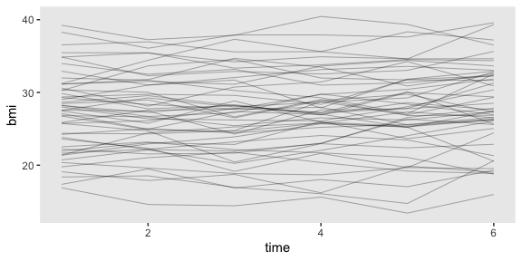
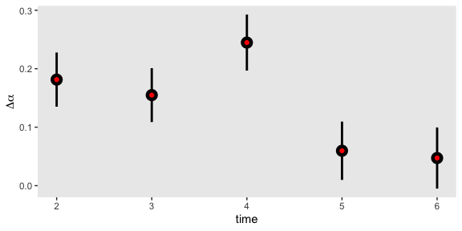
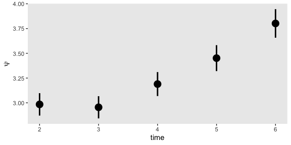
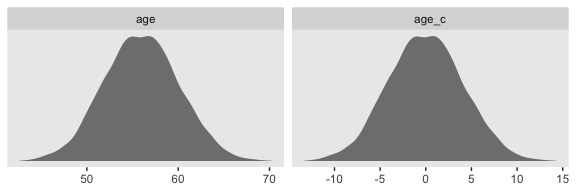
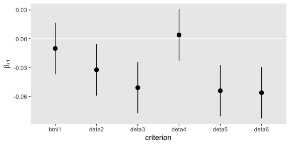
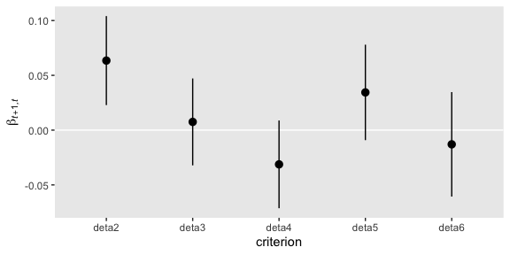
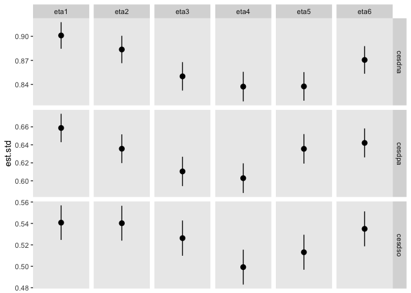

09
================
A Solomon Kurz
2019-08-04

# Latent Difference Score Models

> The latent difference score model ([McArdle &
> Hamagami, 2001](https://pdfs.semanticscholar.org/936f/dd8b2874430efe1f1f264d18b628ca785e99.pdf);
> [McArdle &
> Nesselroade, 1994](https://www.questia.com/library/3195049/life-span-developmental-psychology-methodological))
> is an extension of the simple difference (or gain) score approach to
> the analysis of change. Difference scores are computed by subtracting
> an earlier observed value from a later observed value. The latent
> difference score model extends this simple bivariate difference to
> consecutive intervals over many waves of a study. The result is a
> flexible modeling approach to the investigation of change. (p. 248)

## Review of fundamental concepts

> The central notion of the latent difference score model is that we can
> represent the diffe- rence between two consecutive measurements within
> the autoregressive structure. The residual from a simple
> autoregression is equal to the difference score if \(y_t\) is
> regressed on \(y_{t−1}\) with a regression slope equal to 1 (i.e., a
> perfect relationship). (p. 248)

Given the formula for the simple autoregressive relationship

\[y_{ti} = \beta_{t, t-1} y_{t-1, i} + \zeta_{ti},\]

when \(\beta_{t, t-1} = 1\),

\[
\begin{align*}
y_{ti} & = (1) y_{t-1, i} + \zeta_{ti} \\
y_{ti} & = y_{t-1, i} + \zeta_{ti}, \text{ and thus} \\
\zeta_{ti} & = y_{ti} - y_{t-1, i}.
\end{align*}
\]

If we relable \(\zeta_{ti}\) as \(\Delta y_{t, t-1}\), we get

\[
\begin{align*}
\Delta y_{t, t-1} & = y_{ti} - y_{t-1, i} \\
y_{ti} & = y_{t-1, i} + \Delta y_{t, t-1, i},
\end{align*}
\]

which is the foundation of the latent difference score. Within this
paradigm, the simple difference score \(\Delta y_{t, t-1, i}\) is
reexpressed as \(\Delta \eta_t\). Thus, the equation for the SEM is

\[
\begin{align*}
y_2 & = (\beta_{21}) y_1 + (\lambda_{22}) \Delta \eta_2 + \zeta_2\\
y_2 & = (1) y_1 + (1) \Delta \eta_2 + 0 \\
y_2 & = y_1 + \Delta \eta_2.
\end{align*}
\]

“Estimates obtained from a latent difference factor, therefore, equal
estimates obtained from a simple calculation of differences from
observed scores” (p. 250).

## Latent difference score model for several occasions

### Model specification.

In the absence of across-time equality constraints, the latent
difference score model will always be just identified (i.e.,
\(df = 0\)).

### Interpretation.

“The average difference across all of the contiguous waves should be
recognizable as the interpretation given to the slope in a linear growth
curve analysis” (p. 251). Also, “the latent difference score model is
equivalent to the simplex model if its autoregressive paths have been
set equal to 1” (ibid).

### Example 9.1: Latent difference score model.

Here we load the `health` data.

``` r
library(tidyverse)

health1_names <- c("age", "srh1", "srh2", "srh3", "srh4", "srh5", "srh6", "bmi1",
"bmi2", "bmi3", "bmi4", "bmi5", "bmi6", "cesdna1", "cesdpa1", "cesdso1",
"cesdna2", "cesdpa2", "cesdso2", "cesdna3", "cesdpa3", "cesdso3",
"cesdna4", "cesdpa4", "cesdso4", "cesdna5", "cesdpa5", "cesdso5",
"cesdna6", "cesdpa6", "cesdso6", "diab1", "diab2", "diab3", "diab4", "diab5", "diab6")

health1 <- 
  read_table2("data/health.dat",
              col_names = F) %>% 
  set_names(health1_names)

glimpse(health1)
```

    ## Observations: 5,335
    ## Variables: 37
    ## $ age     <dbl> 55.14051, 63.33294, 58.57362, 62.28161, 59.67750, 54.28464, 52.55816, 57.86435, 4…
    ## $ srh1    <dbl> 3.2198275, 2.9382677, 2.0597007, 3.0955038, 5.0433826, 3.5554657, 5.5763941, 2.52…
    ## $ srh2    <dbl> 2.8445559, 0.4750199, 2.9808080, 5.1865756, 4.8425321, 3.1431942, 5.8039766, 1.72…
    ## $ srh3    <dbl> 1.5812505, 0.6661576, 3.3965038, 3.9656595, 3.4228102, 4.3778358, 4.2649820, 2.44…
    ## $ srh4    <dbl> 1.246121, 3.082019, 2.927770, 3.111632, 4.037927, 4.864917, 4.987574, 2.826647, 2…
    ## $ srh5    <dbl> 2.109169, 3.313588, 2.910595, 3.385376, 3.679832, 3.939745, 4.714705, 2.041515, 1…
    ## $ srh6    <dbl> 0.7174636, 3.4266173, 2.2108723, 4.0888979, 2.8907116, 5.4200764, 4.1951033, 1.80…
    ## $ bmi1    <dbl> 27.07684, 24.73399, 13.92317, 23.66202, 23.77539, 24.20106, 30.58369, 20.77051, 2…
    ## $ bmi2    <dbl> 29.36844, 27.05468, 12.46290, 24.68125, 25.61055, 22.28988, 29.87928, 20.09698, 2…
    ## $ bmi3    <dbl> 29.66096, 27.94157, 13.35623, 24.15629, 25.38682, 22.66508, 30.93980, 20.45760, 2…
    ## $ bmi4    <dbl> 29.17343, 25.27107, 15.84282, 26.11209, 25.27067, 22.91192, 29.27698, 22.85022, 2…
    ## $ bmi5    <dbl> 27.89252, 26.70287, 15.94613, 25.38515, 28.23984, 24.07524, 29.91350, 21.36999, 2…
    ## $ bmi6    <dbl> 27.84005, 28.03522, 15.36183, 24.78045, 31.23735, 23.05708, 28.44048, 21.13281, 2…
    ## $ cesdna1 <dbl> 0.74303571, 0.16488355, 1.87221256, 1.31373798, 0.09486535, 0.12510548, -0.915756…
    ## $ cesdpa1 <dbl> 0.436906701, -0.033533830, 1.475101223, 0.401203350, -0.842562892, 0.417105784, -…
    ## $ cesdso1 <dbl> 1.011333702, 1.545492577, 2.193678046, 1.510663107, 1.026094881, -0.637535959, -0…
    ## $ cesdna2 <dbl> 0.12849876, 1.34096676, 1.13514402, 0.23508332, -0.11428990, 0.29573280, -0.85329…
    ## $ cesdpa2 <dbl> 0.038760982, 0.324536201, 0.563480932, 0.891357097, -0.259453742, 0.087950132, -0…
    ## $ cesdso2 <dbl> 0.565636114, 1.445836063, 0.897660059, 1.029471024, 0.121380560, 0.119198506, -0.…
    ## $ cesdna3 <dbl> 1.28247129, 0.64601176, 1.65421496, 1.11993582, -0.33731809, -0.05723795, -0.2395…
    ## $ cesdpa3 <dbl> 0.00449714, 0.11487274, 0.97725106, 0.06974150, -0.59886001, -0.17291847, 0.32511…
    ## $ cesdso3 <dbl> 0.98245704, 1.14681368, 0.54377474, 1.09111187, -0.22315701, -0.84097531, 0.29798…
    ## $ cesdna4 <dbl> 0.76634368, 0.45245331, 0.94656252, 0.90004914, -0.21023571, -0.62962542, -0.2955…
    ## $ cesdpa4 <dbl> 1.06791063, 0.42990375, 1.13790307, -0.28098070, -0.21969694, -0.45545507, -0.131…
    ## $ cesdso4 <dbl> 1.344636026, 1.920672847, 0.779635300, 1.279747533, 0.533762378, -0.869282164, 1.…
    ## $ cesdna5 <dbl> 1.662771683, 0.485716594, 1.039801515, 1.849047774, -0.978267122, -0.154426006, -…
    ## $ cesdpa5 <dbl> 0.47487035, 0.07592504, 0.85403794, 0.33552042, -0.35155820, 0.29087568, -0.59251…
    ## $ cesdso5 <dbl> 1.149128170, 1.395302757, 1.148873191, 0.909460004, 0.309136029, -0.781009273, -0…
    ## $ cesdna6 <dbl> 0.775151864, -0.657313881, 1.104759377, 1.008838723, 0.290811382, -0.130866419, -…
    ## $ cesdpa6 <dbl> 0.92909329, -0.58094074, 0.82054117, 0.58563043, 0.85744930, -0.19660509, 0.07765…
    ## $ cesdso6 <dbl> 0.52176789, 1.07739169, 1.34071571, 1.25569779, 0.95729093, -0.45461663, 0.381784…
    ## $ diab1   <dbl> 0, 0, 0, 0, 0, 0, 0, 0, 0, 0, 0, 0, 0, 0, 0, 0, 0, 0, 0, 0, 0, 0, 0, 0, 0, 1, 0, …
    ## $ diab2   <dbl> 0, 0, 0, 0, 0, 0, 0, 0, 0, 0, 0, 0, 0, 0, 0, 0, 0, 0, 0, 0, 1, 0, 0, 0, 0, 1, 0, …
    ## $ diab3   <dbl> 0, 0, 0, 0, 0, 0, 0, 0, 0, 0, 0, 0, 0, 0, 0, 0, 0, 0, 0, 0, 0, 0, 0, 0, 0, 1, 0, …
    ## $ diab4   <dbl> 0, 0, 0, 0, 0, 0, 0, 0, 0, 0, 1, 0, 0, 0, 0, 0, 0, 0, 0, 0, 1, 0, 0, 0, 0, 1, 0, …
    ## $ diab5   <dbl> 0, 0, 0, 0, 0, 0, 0, 0, 0, 0, 1, 0, 0, 0, 0, 0, 0, 0, 0, 0, 1, 0, 0, 0, 0, 1, 0, …
    ## $ diab6   <dbl> 0, 0, 0, 0, 0, 0, 0, 0, 0, 0, 0, 0, 0, 0, 0, 0, 0, 0, 0, 0, 0, 0, 0, 0, 0, 1, 0, …

We’ll be modeling BMI trajectories across the 5,335 participants. To get
a sense of the data, here we’ll sample a random 50 cases and plot their
empirical trajectories.

``` r
set.seed(9)

health1 %>% 
  sample_n(size = 50) %>% 
  mutate(id = 1:n()) %>% 
  select(bmi1:bmi6, id) %>% 
  gather(key, bmi, -id) %>% 
  mutate(time = str_remove(key, "bmi") %>% as.double()) %>% 
  
  ggplot(aes(x = time, y = bmi, group = id)) +
  geom_line(size = 1/3, alpha = 1/3) +
  theme(panel.grid = element_blank())
```

<!-- -->

So it looks like the estimates for \(\Delta \text{bmi}_{t, t - 1, i}\)
will be fairly small. Let’s fire up lavaan.

``` r
library(lavaan)
```

We get the code for the first model from Newsom’s `ex9-1.a.R` file.

``` r
model9.1a <- ' 
# define latent difference factors
deta2 =~ 1*bmi2
deta3 =~ 1*bmi3
deta4 =~ 1*bmi4
deta5 =~ 1*bmi5
deta6 =~ 1*bmi6

# autoregressive paths set to 1
bmi2 ~ 1*bmi1
bmi3 ~ 1*bmi2
bmi4 ~ 1*bmi3
bmi5 ~ 1*bmi4
bmi6 ~ 1*bmi5

# means and intercepts
deta2 ~ 1 
deta3 ~ 1
deta4 ~ 1
deta5 ~ 1
deta6 ~ 1

bmi1 ~ 1
bmi2 ~ 0
bmi3 ~ 0
bmi4 ~ 0
bmi5 ~ 0
bmi6 ~ 0

# estimate exogenous covariances
bmi1  ~~ deta2 + deta3 + deta4 + deta5 + deta6
deta2 ~~ deta3 + deta4 + deta5 + deta6
deta3 ~~ deta4 + deta5 + deta6
deta4 ~~ deta5 + deta6
deta5 ~~ deta6

# estimate exogenous variances
bmi1 ~~ bmi1 

deta2 ~~ deta2
deta3 ~~ deta3
deta4 ~~ deta4
deta5 ~~ deta5
deta6 ~~ deta6

# disturbances set to 0
bmi2 ~~ 0*bmi2
bmi3 ~~ 0*bmi3
bmi4 ~~ 0*bmi4
bmi5 ~~ 0*bmi5
bmi6 ~~ 0*bmi6
'

fit_9.1a <- 
  sem(model9.1a,
      data = health1)

summary(fit_9.1a, 
        fit.measures = T, 
        standardized = T, 
        rsquare = T)
```

    ## lavaan 0.6-3 ended normally after 105 iterations
    ## 
    ##   Optimization method                           NLMINB
    ##   Number of free parameters                         27
    ## 
    ##   Number of observations                          5335
    ## 
    ##   Estimator                                         ML
    ##   Model Fit Test Statistic                       0.000
    ##   Degrees of freedom                                 0
    ##   Minimum Function Value               0.0000000000000
    ## 
    ## Model test baseline model:
    ## 
    ##   Minimum Function Test Statistic            59047.311
    ##   Degrees of freedom                                15
    ##   P-value                                        0.000
    ## 
    ## User model versus baseline model:
    ## 
    ##   Comparative Fit Index (CFI)                    1.000
    ##   Tucker-Lewis Index (TLI)                       1.000
    ## 
    ## Loglikelihood and Information Criteria:
    ## 
    ##   Loglikelihood user model (H0)             -68356.036
    ##   Loglikelihood unrestricted model (H1)     -68356.036
    ## 
    ##   Number of free parameters                         27
    ##   Akaike (AIC)                              136766.072
    ##   Bayesian (BIC)                            136943.787
    ##   Sample-size adjusted Bayesian (BIC)       136857.990
    ## 
    ## Root Mean Square Error of Approximation:
    ## 
    ##   RMSEA                                          0.000
    ##   90 Percent Confidence Interval          0.000  0.000
    ##   P-value RMSEA <= 0.05                             NA
    ## 
    ## Standardized Root Mean Square Residual:
    ## 
    ##   SRMR                                           0.000
    ## 
    ## Parameter Estimates:
    ## 
    ##   Information                                 Expected
    ##   Information saturated (h1) model          Structured
    ##   Standard Errors                             Standard
    ## 
    ## Latent Variables:
    ##                    Estimate  Std.Err  z-value  P(>|z|)   Std.lv  Std.all
    ##   deta2 =~                                                              
    ##     bmi2              1.000                               1.728    0.343
    ##   deta3 =~                                                              
    ##     bmi3              1.000                               1.719    0.337
    ##   deta4 =~                                                              
    ##     bmi4              1.000                               1.786    0.344
    ##   deta5 =~                                                              
    ##     bmi5              1.000                               1.858    0.353
    ##   deta6 =~                                                              
    ##     bmi6              1.000                               1.950    0.359
    ## 
    ## Regressions:
    ##                    Estimate  Std.Err  z-value  P(>|z|)   Std.lv  Std.all
    ##   bmi2 ~                                                                
    ##     bmi1              1.000                               1.000    0.973
    ##   bmi3 ~                                                                
    ##     bmi2              1.000                               1.000    0.987
    ##   bmi4 ~                                                                
    ##     bmi3              1.000                               1.000    0.983
    ##   bmi5 ~                                                                
    ##     bmi4              1.000                               1.000    0.987
    ##   bmi6 ~                                                                
    ##     bmi5              1.000                               1.000    0.969
    ## 
    ## Covariances:
    ##                    Estimate  Std.Err  z-value  P(>|z|)   Std.lv  Std.all
    ##   deta2 ~~                                                              
    ##     bmi1             -0.820    0.116   -7.042    0.000   -0.475   -0.097
    ##   deta3 ~~                                                              
    ##     bmi1             -0.208    0.115   -1.801    0.072   -0.121   -0.025
    ##   deta4 ~~                                                              
    ##     bmi1             -0.123    0.120   -1.028    0.304   -0.069   -0.014
    ##   deta5 ~~                                                              
    ##     bmi1             -0.209    0.125   -1.673    0.094   -0.112   -0.023
    ##   deta6 ~~                                                              
    ##     bmi1              0.100    0.131    0.764    0.445    0.051    0.010
    ##   deta2 ~~                                                              
    ##     deta3            -0.940    0.043  -22.041    0.000   -0.317   -0.317
    ##     deta4             0.021    0.042    0.495    0.620    0.007    0.007
    ##     deta5            -0.062    0.044   -1.413    0.158   -0.019   -0.019
    ##     deta6            -0.104    0.046   -2.258    0.024   -0.031   -0.031
    ##   deta3 ~~                                                              
    ##     deta4            -1.033    0.044  -23.296    0.000   -0.337   -0.337
    ##     deta5             0.117    0.044    2.685    0.007    0.037    0.037
    ##     deta6            -0.029    0.046   -0.641    0.522   -0.009   -0.009
    ##   deta4 ~~                                                              
    ##     deta5            -1.215    0.048  -25.109    0.000   -0.366   -0.366
    ##     deta6            -0.130    0.048   -2.732    0.006   -0.037   -0.037
    ##   deta5 ~~                                                              
    ##     deta6            -0.846    0.051  -16.606    0.000   -0.233   -0.233
    ## 
    ## Intercepts:
    ##                    Estimate  Std.Err  z-value  P(>|z|)   Std.lv  Std.all
    ##     deta2             0.181    0.024    7.670    0.000    0.105    0.105
    ##     deta3             0.155    0.024    6.582    0.000    0.090    0.090
    ##     deta4             0.245    0.024   10.009    0.000    0.137    0.137
    ##     deta5             0.060    0.025    2.347    0.019    0.032    0.032
    ##     deta6             0.047    0.027    1.770    0.077    0.024    0.024
    ##     bmi1             27.176    0.067  405.055    0.000   27.176    5.546
    ##    .bmi2              0.000                               0.000    0.000
    ##    .bmi3              0.000                               0.000    0.000
    ##    .bmi4              0.000                               0.000    0.000
    ##    .bmi5              0.000                               0.000    0.000
    ##    .bmi6              0.000                               0.000    0.000
    ## 
    ## Variances:
    ##                    Estimate  Std.Err  z-value  P(>|z|)   Std.lv  Std.all
    ##     bmi1             24.015    0.465   51.648    0.000   24.015    1.000
    ##     deta2             2.984    0.058   51.648    0.000    1.000    1.000
    ##     deta3             2.955    0.057   51.648    0.000    1.000    1.000
    ##     deta4             3.189    0.062   51.648    0.000    1.000    1.000
    ##     deta5             3.451    0.067   51.648    0.000    1.000    1.000
    ##     deta6             3.802    0.074   51.648    0.000    1.000    1.000
    ##    .bmi2              0.000                               0.000    0.000
    ##    .bmi3              0.000                               0.000    0.000
    ##    .bmi4              0.000                               0.000    0.000
    ##    .bmi5              0.000                               0.000    0.000
    ##    .bmi6              0.000                               0.000    0.000
    ## 
    ## R-Square:
    ##                    Estimate
    ##     bmi2              1.000
    ##     bmi3              1.000
    ##     bmi4              1.000
    ##     bmi5              1.000
    ##     bmi6              1.000

Here’s a focused look at the initial BMI mean and the latent
differences.

``` r
parameterestimates(fit_9.1a) %>% 
  filter(op == "~1") %>% 
  filter(lhs == "bmi1" | str_detect(lhs, "deta")) %>% 
  arrange(lhs) %>% 
  select(lhs:op, est, starts_with("ci"))
```

    ##     lhs op         est     ci.lower    ci.upper
    ## 1  bmi1 ~1 27.17634439 27.044844677 27.30784410
    ## 2 deta2 ~1  0.18140646  0.135050271  0.22776264
    ## 3 deta3 ~1  0.15489605  0.108769035  0.20102307
    ## 4 deta4 ~1  0.24473248  0.196810187  0.29265478
    ## 5 deta5 ~1  0.05970517  0.009854490  0.10955585
    ## 6 deta6 ~1  0.04726099 -0.005058855  0.09958084

In the text, Newsom said the estimates were very close to the empirical
estimates. We might compute those like so.

``` r
d <-
  health1 %>% 
  transmute(deta2 = bmi2 - bmi1,
            deta3 = bmi3 - bmi2,
            deta4 = bmi4 - bmi3,
            deta5 = bmi5 - bmi4,
            deta6 = bmi6 - bmi5) %>% 
  gather() %>% 
  group_by(key) %>% 
  summarise(mean = mean(value))

d
```

    ## # A tibble: 5 x 2
    ##   key     mean
    ##   <chr>  <dbl>
    ## 1 deta2 0.181 
    ## 2 deta3 0.155 
    ## 3 deta4 0.245 
    ## 4 deta5 0.0597
    ## 5 deta6 0.0473

Yep, those are pretty close. Here’s what those difference estimates look
like in a coefficient plot. The empirical estimates are the red dots
superimposed on the model estimates.

``` r
parameterestimates(fit_9.1a) %>% 
  filter(op == "~1" & 
           str_detect(lhs, "deta")) %>% 
  mutate(time = str_remove(lhs, "deta") %>% as.double()) %>% 
  
  ggplot(aes(x = time)) +
  geom_pointrange(aes(y = est, ymin = ci.lower, ymax = ci.upper),
                  size = 1) +
  geom_point(data = d %>% mutate(time = str_remove(key, "deta") %>% as.double()),
             aes(y = mean),
             color = "red") +
  ylab(expression(paste(Delta,alpha))) +
  theme(panel.grid = element_blank())
```

<!-- -->

Just for kicks, here are the latent variances, \(\psi_{[ii]}\).

``` r
parameterestimates(fit_9.1a) %>% 
  filter(op == "~~" & 
           str_detect(lhs, "deta") & 
           lhs == rhs) %>% 
  mutate(time = str_remove(lhs, "deta") %>% as.double()) %>% 
  
  ggplot(aes(x = time)) +
  geom_pointrange(aes(y = est, ymin = ci.lower, ymax = ci.upper),
                  size = 1) +
  ylab(expression(psi)) +
  theme(panel.grid = element_blank())
```

<!-- -->

In next model, Newsom constrained the \(\Delta \alpha\) parameters to
equality. He didn’t show that code in one of his `.R` files. However,
it’s just a minor extension of the `model9.1a` code, above. We just
add some equality constraints with parameter labels.

``` r
model9.1b <- ' 
# define latent difference factors
deta2 =~ 1*bmi2
deta3 =~ 1*bmi3
deta4 =~ 1*bmi4
deta5 =~ 1*bmi5
deta6 =~ 1*bmi6

# autoregressive paths set to 1
bmi2 ~ 1*bmi1
bmi3 ~ 1*bmi2
bmi4 ~ 1*bmi3
bmi5 ~ 1*bmi4
bmi6 ~ 1*bmi5

# means and intercepts
deta2 ~ a*1  # here are the new parts of the code
deta3 ~ a*1
deta4 ~ a*1
deta5 ~ a*1
deta6 ~ a*1

bmi1 ~ 1
bmi2 ~ 0
bmi3 ~ 0
bmi4 ~ 0
bmi5 ~ 0
bmi6 ~ 0

# estimate exogenous covariances
bmi1  ~~ deta2 + deta3 + deta4 + deta5 + deta6
deta2 ~~ deta3 + deta4 + deta5 + deta6
deta3 ~~ deta4 + deta5 + deta6
deta4 ~~ deta5 + deta6
deta5 ~~ deta6

# estimate exogenous variances
bmi1 ~~ bmi1 

deta2 ~~ deta2
deta3 ~~ deta3
deta4 ~~ deta4
deta5 ~~ deta5
deta6 ~~ deta6

# disturbances set to 0
bmi2 ~~ 0*bmi2
bmi3 ~~ 0*bmi3
bmi4 ~~ 0*bmi4
bmi5 ~~ 0*bmi5
bmi6 ~~ 0*bmi6
'

fit_9.1b <- 
  sem(model9.1b,
      data = health1)

summary(fit_9.1b, 
        fit.measures = T, 
        standardized = T, 
        rsquare = T)
```

    ## lavaan 0.6-3 ended normally after 96 iterations
    ## 
    ##   Optimization method                           NLMINB
    ##   Number of free parameters                         27
    ##   Number of equality constraints                     4
    ## 
    ##   Number of observations                          5335
    ## 
    ##   Estimator                                         ML
    ##   Model Fit Test Statistic                      43.909
    ##   Degrees of freedom                                 4
    ##   P-value (Chi-square)                           0.000
    ## 
    ## Model test baseline model:
    ## 
    ##   Minimum Function Test Statistic            59047.311
    ##   Degrees of freedom                                15
    ##   P-value                                        0.000
    ## 
    ## User model versus baseline model:
    ## 
    ##   Comparative Fit Index (CFI)                    0.999
    ##   Tucker-Lewis Index (TLI)                       0.997
    ## 
    ## Loglikelihood and Information Criteria:
    ## 
    ##   Loglikelihood user model (H0)             -68377.990
    ##   Loglikelihood unrestricted model (H1)     -68356.036
    ## 
    ##   Number of free parameters                         23
    ##   Akaike (AIC)                              136801.981
    ##   Bayesian (BIC)                            136953.368
    ##   Sample-size adjusted Bayesian (BIC)       136880.281
    ## 
    ## Root Mean Square Error of Approximation:
    ## 
    ##   RMSEA                                          0.043
    ##   90 Percent Confidence Interval          0.032  0.055
    ##   P-value RMSEA <= 0.05                          0.814
    ## 
    ## Standardized Root Mean Square Residual:
    ## 
    ##   SRMR                                           0.005
    ## 
    ## Parameter Estimates:
    ## 
    ##   Information                                 Expected
    ##   Information saturated (h1) model          Structured
    ##   Standard Errors                             Standard
    ## 
    ## Latent Variables:
    ##                    Estimate  Std.Err  z-value  P(>|z|)   Std.lv  Std.all
    ##   deta2 =~                                                              
    ##     bmi2              1.000                               1.728    0.343
    ##   deta3 =~                                                              
    ##     bmi3              1.000                               1.719    0.337
    ##   deta4 =~                                                              
    ##     bmi4              1.000                               1.789    0.345
    ##   deta5 =~                                                              
    ##     bmi5              1.000                               1.860    0.354
    ##   deta6 =~                                                              
    ##     bmi6              1.000                               1.952    0.360
    ## 
    ## Regressions:
    ##                    Estimate  Std.Err  z-value  P(>|z|)   Std.lv  Std.all
    ##   bmi2 ~                                                                
    ##     bmi1              1.000                               1.000    0.973
    ##   bmi3 ~                                                                
    ##     bmi2              1.000                               1.000    0.987
    ##   bmi4 ~                                                                
    ##     bmi3              1.000                               1.000    0.983
    ##   bmi5 ~                                                                
    ##     bmi4              1.000                               1.000    0.987
    ##   bmi6 ~                                                                
    ##     bmi5              1.000                               1.000    0.969
    ## 
    ## Covariances:
    ##                    Estimate  Std.Err  z-value  P(>|z|)   Std.lv  Std.all
    ##   deta2 ~~                                                              
    ##     bmi1             -0.821    0.116   -7.045    0.000   -0.475   -0.097
    ##   deta3 ~~                                                              
    ##     bmi1             -0.208    0.115   -1.802    0.072   -0.121   -0.025
    ##   deta4 ~~                                                              
    ##     bmi1             -0.125    0.120   -1.040    0.298   -0.070   -0.014
    ##   deta5 ~~                                                              
    ##     bmi1             -0.207    0.125   -1.660    0.097   -0.111   -0.023
    ##   deta6 ~~                                                              
    ##     bmi1              0.102    0.131    0.775    0.438    0.052    0.011
    ##   deta2 ~~                                                              
    ##     deta3            -0.940    0.043  -22.032    0.000   -0.316   -0.316
    ##     deta4             0.024    0.042    0.570    0.569    0.008    0.008
    ##     deta5            -0.065    0.044   -1.478    0.139   -0.020   -0.020
    ##     deta6            -0.108    0.046   -2.327    0.020   -0.032   -0.032
    ##   deta3 ~~                                                              
    ##     deta4            -1.032    0.044  -23.252    0.000   -0.336   -0.336
    ##     deta5             0.117    0.044    2.668    0.008    0.037    0.037
    ##     deta6            -0.030    0.046   -0.655    0.513   -0.009   -0.009
    ##   deta4 ~~                                                              
    ##     deta5            -1.223    0.049  -25.207    0.000   -0.368   -0.368
    ##     deta6            -0.140    0.048   -2.928    0.003   -0.040   -0.040
    ##   deta5 ~~                                                              
    ##     deta6            -0.837    0.051  -16.401    0.000   -0.230   -0.230
    ## 
    ## Intercepts:
    ##                    Estimate  Std.Err  z-value  P(>|z|)   Std.lv  Std.all
    ##     deta2      (a)    0.148    0.007   20.058    0.000    0.086    0.086
    ##     deta3      (a)    0.148    0.007   20.058    0.000    0.086    0.086
    ##     deta4      (a)    0.148    0.007   20.058    0.000    0.083    0.083
    ##     deta5      (a)    0.148    0.007   20.058    0.000    0.080    0.080
    ##     deta6      (a)    0.148    0.007   20.058    0.000    0.076    0.076
    ##     bmi1             27.193    0.067  406.610    0.000   27.193    5.549
    ##    .bmi2              0.000                               0.000    0.000
    ##    .bmi3              0.000                               0.000    0.000
    ##    .bmi4              0.000                               0.000    0.000
    ##    .bmi5              0.000                               0.000    0.000
    ##    .bmi6              0.000                               0.000    0.000
    ## 
    ## Variances:
    ##                    Estimate  Std.Err  z-value  P(>|z|)   Std.lv  Std.all
    ##     bmi1             24.016    0.465   51.648    0.000   24.016    1.000
    ##     deta2             2.985    0.058   51.648    0.000    1.000    1.000
    ##     deta3             2.955    0.057   51.648    0.000    1.000    1.000
    ##     deta4             3.199    0.062   51.648    0.000    1.000    1.000
    ##     deta5             3.459    0.067   51.648    0.000    1.000    1.000
    ##     deta6             3.812    0.074   51.648    0.000    1.000    1.000
    ##    .bmi2              0.000                               0.000    0.000
    ##    .bmi3              0.000                               0.000    0.000
    ##    .bmi4              0.000                               0.000    0.000
    ##    .bmi5              0.000                               0.000    0.000
    ##    .bmi6              0.000                               0.000    0.000
    ## 
    ## R-Square:
    ##                    Estimate
    ##     bmi2              1.000
    ##     bmi3              1.000
    ##     bmi4              1.000
    ##     bmi5              1.000
    ##     bmi6              1.000

The results for our likelihood ratio test match those in the text. The
constrained model fits the data statistically significantly worse.

``` r
lavTestLRT(fit_9.1a, fit_9.1b)
```

    ## Chi Square Difference Test
    ## 
    ##          Df    AIC    BIC  Chisq Chisq diff Df diff Pr(>Chisq)    
    ## fit_9.1a  0 136766 136944  0.000                                  
    ## fit_9.1b  4 136802 136953 43.909     43.909       4  6.702e-09 ***
    ## ---
    ## Signif. codes:  0 '***' 0.001 '**' 0.01 '*' 0.05 '.' 0.1 ' ' 1

## Binary variables and ordinal variables

> With noncontinuous variables, latent difference factors represent
> change in the logit or probit function and require transformation
> using the appropriate cdf (see Chapter 1 for a review of this
> transformation). As a natural circumstance of contingency table
> analyses for binary and ordinal variables, the mean of each difference
> factor will not be precisely equal to the difference in proportions
> for binary or ordinal models
> ([Agresti, 2013](https://www.wiley.com/en-us/Categorical+Data+Analysis%2C+3rd+Edition-p-9780470463635)).
> Thus, researchers only should present the difference factor mean as an
> approximation of the mean difference. Constraint of the difference
> factor means can provide an omnibus test of all proportion
> differences. (p. 253)

### Example 9.2: Latent difference score model with binary variables.

We get the code for the next model from Newsom’s `ex9-2.R` file.

``` r
model9.2a <- ' 
# define latent factors for each measured variable
eta1 =~ 1*diab1
eta2 =~ 1*diab2
eta3 =~ 1*diab3
eta4 =~ 1*diab4
eta5 =~ 1*diab5
eta6 =~ 1*diab6

# define latent difference factors
deta2 =~ 1*eta2
deta3 =~ 1*eta3
deta4 =~ 1*eta4
deta5 =~ 1*eta5
deta6 =~ 1*eta6

# autoregressive paths set to 1
eta2 ~ 1*eta1
eta3 ~ 1*eta2
eta4 ~ 1*eta3
eta5 ~ 1*eta4
eta6 ~ 1*eta5

# means, intercepts, and thresholds
deta2 ~ 1  # do deta2 ~ a*1 etc to test for equal mean differences
deta3 ~ 1
deta4 ~ 1
deta5 ~ 1
deta6 ~ 1

eta2 ~ 0
eta3 ~ 0
eta4 ~ 0
eta5 ~ 0
eta6 ~ 0

diab1 | 0*t1
diab2 | 0*t1
diab3 | 0*t1
diab4 | 0*t1
diab5 | 0*t1
diab6 | 0*t1

eta1 ~ 1  # verify this

# set covariances among difference factors to 0 for identification
eta1  ~~ deta2 + deta3 + deta4 + deta5 + deta6
deta2 ~~ 0*deta3 + 0*deta4 + 0*deta5 + 0*deta6
deta3 ~~ 0*deta4 + 0*deta5 + 0*deta6
deta4 ~~ 0*deta5 + 0*deta6
deta5 ~~ 0*deta6

# estimate exogenous variances
eta1 ~~ eta1  # this may be problemtatic! verify

deta2 ~~ a*deta2  # set variances equal for identification
deta3 ~~ a*deta3
deta4 ~~ a*deta4
deta5 ~~ a*deta5
deta6 ~~ a*deta6

# autoregressive disturbances
eta2 ~~ 0*eta2
eta3 ~~ 0*eta3
eta4 ~~ 0*eta4
eta5 ~~ 0*eta5
eta6 ~~ 0*eta6
      
diab1 ~*~ diab1 
diab2 ~*~ diab2
diab3 ~*~ diab3
diab4 ~*~ diab4
diab5 ~*~ diab5
diab6 ~*~ diab6 
'

fit_9.2a <- 
  sem(model9.2a,
      data = health1,
      estimator = "wlsmv", 
      ordered = str_c("diab", 1:6))
```

    ## Warning in lav_model_vcov(lavmodel = lavmodel, lavsamplestats = lavsamplestats, : lavaan WARNING:
    ##     The variance-covariance matrix of the estimated parameters (vcov)
    ##     does not appear to be positive definite! The smallest eigenvalue
    ##     (= 4.159978e-13) is close to zero. This may be a symptom that the
    ##     model is not identified.

    ## Warning in lav_object_post_check(object): lavaan WARNING: some estimated ov variances are negative

``` r
summary(fit_9.2a, 
        fit.measures = T, 
        standardized = T, 
        rsquare = T)
```

    ## lavaan 0.6-3 ended normally after 85 iterations
    ## 
    ##   Optimization method                           NLMINB
    ##   Number of free parameters                         23
    ##   Number of equality constraints                     4
    ## 
    ##   Number of observations                          5335
    ## 
    ##   Estimator                                       DWLS      Robust
    ##   Model Fit Test Statistic                       0.613       2.299
    ##   Degrees of freedom                                 2           2
    ##   P-value (Chi-square)                           0.736       0.317
    ##   Scaling correction factor                                  0.228
    ##   Shift parameter                                           -0.387
    ##     for simple second-order correction (Mplus variant)
    ## 
    ## Model test baseline model:
    ## 
    ##   Minimum Function Test Statistic            80618.621   49071.564
    ##   Degrees of freedom                                15          15
    ##   P-value                                        0.000       0.000
    ## 
    ## User model versus baseline model:
    ## 
    ##   Comparative Fit Index (CFI)                    1.000       1.000
    ##   Tucker-Lewis Index (TLI)                       1.000       1.000
    ## 
    ##   Robust Comparative Fit Index (CFI)                            NA
    ##   Robust Tucker-Lewis Index (TLI)                               NA
    ## 
    ## Root Mean Square Error of Approximation:
    ## 
    ##   RMSEA                                          0.000       0.005
    ##   90 Percent Confidence Interval          0.000  0.019       0.000  0.028
    ##   P-value RMSEA <= 0.05                          1.000       1.000
    ## 
    ##   Robust RMSEA                                                  NA
    ##   90 Percent Confidence Interval                             0.000     NA
    ## 
    ## Standardized Root Mean Square Residual:
    ## 
    ##   SRMR                                           0.003       0.003
    ## 
    ## Parameter Estimates:
    ## 
    ##   Information                                 Expected
    ##   Information saturated (h1) model        Unstructured
    ##   Standard Errors                           Robust.sem
    ## 
    ## Latent Variables:
    ##                    Estimate  Std.Err  z-value  P(>|z|)   Std.lv  Std.all
    ##   eta1 =~                                                               
    ##     diab1             1.000                               0.842    1.465
    ##   eta2 =~                                                               
    ##     diab2             1.000                               0.593    1.036
    ##   eta3 =~                                                               
    ##     diab3             1.000                               1.100    1.038
    ##   eta4 =~                                                               
    ##     diab4             1.000                               1.358    1.006
    ##   eta5 =~                                                               
    ##     diab5             1.000                               1.536    1.001
    ##   eta6 =~                                                               
    ##     diab6             1.000                               1.682    0.977
    ##   deta2 =~                                                              
    ##     eta2              1.000                               1.139    1.139
    ##   deta3 =~                                                              
    ##     eta3              1.000                               0.613    0.613
    ##   deta4 =~                                                              
    ##     eta4              1.000                               0.497    0.497
    ##   deta5 =~                                                              
    ##     eta5              1.000                               0.440    0.440
    ##   deta6 =~                                                              
    ##     eta6              1.000                               0.401    0.401
    ## 
    ## Regressions:
    ##                    Estimate  Std.Err  z-value  P(>|z|)   Std.lv  Std.all
    ##   eta2 ~                                                                
    ##     eta1              1.000                               1.421    1.421
    ##   eta3 ~                                                                
    ##     eta2              1.000                               0.539    0.539
    ##   eta4 ~                                                                
    ##     eta3              1.000                               0.811    0.811
    ##   eta5 ~                                                                
    ##     eta4              1.000                               0.884    0.884
    ##   eta6 ~                                                                
    ##     eta5              1.000                               0.913    0.913
    ## 
    ## Covariances:
    ##                    Estimate  Std.Err  z-value  P(>|z|)   Std.lv  Std.all
    ##   eta1 ~~                                                               
    ##     deta2            -0.407    0.112   -3.644    0.000   -0.716   -0.716
    ##     deta3             0.202    0.027    7.379    0.000    0.355    0.355
    ##     deta4             0.088    0.023    3.916    0.000    0.155    0.155
    ##     deta5             0.029    0.017    1.747    0.081    0.052    0.052
    ##     deta6             0.008    0.020    0.373    0.709    0.013    0.013
    ##   deta2 ~~                                                              
    ##     deta3             0.000                               0.000    0.000
    ##     deta4             0.000                               0.000    0.000
    ##     deta5             0.000                               0.000    0.000
    ##     deta6             0.000                               0.000    0.000
    ##   deta3 ~~                                                              
    ##     deta4             0.000                               0.000    0.000
    ##     deta5             0.000                               0.000    0.000
    ##     deta6             0.000                               0.000    0.000
    ##   deta4 ~~                                                              
    ##     deta5             0.000                               0.000    0.000
    ##     deta6             0.000                               0.000    0.000
    ##   deta5 ~~                                                              
    ##     deta6             0.000                               0.000    0.000
    ## 
    ## Intercepts:
    ##                    Estimate  Std.Err  z-value  P(>|z|)   Std.lv  Std.all
    ##     deta2             0.058    0.070    0.826    0.409    0.085    0.085
    ##     deta3            -0.510    0.094   -5.403    0.000   -0.756   -0.756
    ##     deta4            -0.198    0.066   -2.997    0.003   -0.293   -0.293
    ##     deta5            -0.026    0.036   -0.738    0.460   -0.039   -0.039
    ##     deta6             0.018    0.037    0.490    0.624    0.027    0.027
    ##    .eta2              0.000                               0.000    0.000
    ##    .eta3              0.000                               0.000    0.000
    ##    .eta4              0.000                               0.000    0.000
    ##    .eta5              0.000                               0.000    0.000
    ##    .eta6              0.000                               0.000    0.000
    ##     eta1             -0.768    0.084   -9.162    0.000   -0.912   -0.912
    ##    .diab1             0.000                               0.000    0.000
    ##    .diab2             0.000                               0.000    0.000
    ##    .diab3             0.000                               0.000    0.000
    ##    .diab4             0.000                               0.000    0.000
    ##    .diab5             0.000                               0.000    0.000
    ##    .diab6             0.000                               0.000    0.000
    ## 
    ## Thresholds:
    ##                    Estimate  Std.Err  z-value  P(>|z|)   Std.lv  Std.all
    ##     diab1|t1          0.000                               0.000    0.000
    ##     diab2|t1          0.000                               0.000    0.000
    ##     diab3|t1          0.000                               0.000    0.000
    ##     diab4|t1          0.000                               0.000    0.000
    ##     diab5|t1          0.000                               0.000    0.000
    ##     diab6|t1          0.000                               0.000    0.000
    ## 
    ## Variances:
    ##                    Estimate  Std.Err  z-value  P(>|z|)   Std.lv  Std.all
    ##     eta1              0.709    0.054   13.229    0.000    1.000    1.000
    ##     deta2      (a)    0.456    0.095    4.799    0.000    1.000    1.000
    ##     deta3      (a)    0.456    0.095    4.799    0.000    1.000    1.000
    ##     deta4      (a)    0.456    0.095    4.799    0.000    1.000    1.000
    ##     deta5      (a)    0.456    0.095    4.799    0.000    1.000    1.000
    ##     deta6      (a)    0.456    0.095    4.799    0.000    1.000    1.000
    ##    .eta2              0.000                               0.000    0.000
    ##    .eta3              0.000                               0.000    0.000
    ##    .eta4              0.000                               0.000    0.000
    ##    .eta5              0.000                               0.000    0.000
    ##    .eta6              0.000                               0.000    0.000
    ##    .diab1            -0.379                              -0.379   -1.146
    ##    .diab2            -0.024                              -0.024   -0.074
    ##    .diab3            -0.086                              -0.086   -0.077
    ##    .diab4            -0.022                              -0.022   -0.012
    ##    .diab5            -0.002                              -0.002   -0.001
    ##    .diab6             0.135                               0.135    0.046
    ## 
    ## Scales y*:
    ##                    Estimate  Std.Err  z-value  P(>|z|)   Std.lv  Std.all
    ##     diab1             1.740    0.190    9.135    0.000    1.740    1.000
    ##     diab2             1.749    0.218    8.035    0.000    1.749    1.000
    ##     diab3             0.943    0.020   46.823    0.000    0.943    1.000
    ##     diab4             0.741    0.035   21.119    0.000    0.741    1.000
    ##     diab5             0.652    0.038   17.011    0.000    0.652    1.000
    ##     diab6             0.581    0.038   15.485    0.000    0.581    1.000
    ## 
    ## R-Square:
    ##                    Estimate
    ##     eta2              1.000
    ##     eta3              1.000
    ##     eta4              1.000
    ##     eta5              1.000
    ##     eta6              1.000
    ##     diab1                NA
    ##     diab2                NA
    ##     diab3                NA
    ##     diab4                NA
    ##     diab5                NA
    ##     diab6             0.954

As indicated in the text, “the initial model did not converge” (p. 253).
However, our code above already fixed the variances of the difference
factors to equality. We did so with the `a*` labels. So somehow, Newsom
is doing something further that we haven’t yet done. You can also tell
this because our model \(\chi^2\) and \(df\) don’t match with those he
reported in the text.

``` r
fitmeasures(fit_9.2a, c("chisq.scaled", "df"))
```

    ## chisq.scaled           df 
    ##        2.299        2.000

We get closer if we constrain the scales for \(y^*\) and the variance
for `eta1` to equality.

``` r
model9.2b <- ' 
# define latent factors for each measured variable
eta1 =~ 1*diab1
eta2 =~ 1*diab2
eta3 =~ 1*diab3
eta4 =~ 1*diab4
eta5 =~ 1*diab5
eta6 =~ 1*diab6

# define latent difference factors
deta2 =~ 1*eta2
deta3 =~ 1*eta3
deta4 =~ 1*eta4
deta5 =~ 1*eta5
deta6 =~ 1*eta6

# autoregressive paths set to 1
eta2 ~ 1*eta1
eta3 ~ 1*eta2
eta4 ~ 1*eta3
eta5 ~ 1*eta4
eta6 ~ 1*eta5

# means, intercepts, and thresholds
deta2 ~ 1  # do deta2 ~ a*1 etc to test for equal mean differences
deta3 ~ 1
deta4 ~ 1
deta5 ~ 1
deta6 ~ 1

eta2 ~ 0
eta3 ~ 0
eta4 ~ 0
eta5 ~ 0
eta6 ~ 0

diab1 | 0*t1
diab2 | 0*t1
diab3 | 0*t1
diab4 | 0*t1
diab5 | 0*t1
diab6 | 0*t1

eta1 ~ 1  # verify this

# set covariances among difference factors to 0 for identification
eta1  ~~ deta2 + deta3 + deta4 + deta5 + deta6
deta2 ~~ 0*deta3 + 0*deta4 + 0*deta5 + 0*deta6
deta3 ~~ 0*deta4 + 0*deta5 + 0*deta6
deta4 ~~ 0*deta5 + 0*deta6
deta5 ~~ 0*deta6

# estimate exogenous variances
eta1 ~~ b*eta1  # this may be problemtatic! verify

deta2 ~~ a*deta2  # set variances equal for identification
deta3 ~~ a*deta3
deta4 ~~ a*deta4
deta5 ~~ a*deta5
deta6 ~~ a*deta6

# autoregressive disturbances
eta2 ~~ 0*eta2
eta3 ~~ 0*eta3
eta4 ~~ 0*eta4
eta5 ~~ 0*eta5
eta6 ~~ 0*eta6
      
diab1 ~*~ b*diab1 
diab2 ~*~ b*diab2
diab3 ~*~ b*diab3
diab4 ~*~ b*diab4
diab5 ~*~ b*diab5
diab6 ~*~ b*diab6 
'

fit_9.2b <- 
  sem(model9.2b,
      data = health1,
      estimator = "wlsmv", 
      ordered = str_c("diab", 1:6))

summary(fit_9.2b, 
        fit.measures = T, 
        standardized = T, 
        rsquare = T)
```

    ## lavaan 0.6-3 ended normally after 30 iterations
    ## 
    ##   Optimization method                           NLMINB
    ##   Number of free parameters                         23
    ##   Number of equality constraints                    10
    ## 
    ##   Number of observations                          5335
    ## 
    ##   Estimator                                       DWLS      Robust
    ##   Model Fit Test Statistic                       5.859      12.568
    ##   Degrees of freedom                                 8           8
    ##   P-value (Chi-square)                           0.663       0.128
    ##   Scaling correction factor                                  0.531
    ##   Shift parameter                                            1.541
    ##     for simple second-order correction (Mplus variant)
    ## 
    ## Model test baseline model:
    ## 
    ##   Minimum Function Test Statistic            80618.621   49071.564
    ##   Degrees of freedom                                15          15
    ##   P-value                                        0.000       0.000
    ## 
    ## User model versus baseline model:
    ## 
    ##   Comparative Fit Index (CFI)                    1.000       1.000
    ##   Tucker-Lewis Index (TLI)                       1.000       1.000
    ## 
    ##   Robust Comparative Fit Index (CFI)                            NA
    ##   Robust Tucker-Lewis Index (TLI)                               NA
    ## 
    ## Root Mean Square Error of Approximation:
    ## 
    ##   RMSEA                                          0.000       0.010
    ##   90 Percent Confidence Interval          0.000  0.013       0.000  0.021
    ##   P-value RMSEA <= 0.05                          1.000       1.000
    ## 
    ##   Robust RMSEA                                                  NA
    ##   90 Percent Confidence Interval                             0.000     NA
    ## 
    ## Standardized Root Mean Square Residual:
    ## 
    ##   SRMR                                           0.009       0.009
    ## 
    ## Parameter Estimates:
    ## 
    ##   Information                                 Expected
    ##   Information saturated (h1) model        Unstructured
    ##   Standard Errors                           Robust.sem
    ## 
    ## Latent Variables:
    ##                    Estimate  Std.Err  z-value  P(>|z|)   Std.lv  Std.all
    ##   eta1 =~                                                               
    ##     diab1             1.000                               0.999    0.998
    ##   eta2 =~                                                               
    ##     diab2             1.000                               0.998    0.996
    ##   eta3 =~                                                               
    ##     diab3             1.000                               0.986    0.985
    ##   eta4 =~                                                               
    ##     diab4             1.000                               0.989    0.988
    ##   eta5 =~                                                               
    ##     diab5             1.000                               0.990    0.988
    ##   eta6 =~                                                               
    ##     diab6             1.000                               0.978    0.977
    ##   deta2 =~                                                              
    ##     eta2              1.000                               0.383    0.383
    ##   deta3 =~                                                              
    ##     eta3              1.000                               0.387    0.387
    ##   deta4 =~                                                              
    ##     eta4              1.000                               0.386    0.386
    ##   deta5 =~                                                              
    ##     eta5              1.000                               0.386    0.386
    ##   deta6 =~                                                              
    ##     eta6              1.000                               0.390    0.390
    ## 
    ## Regressions:
    ##                    Estimate  Std.Err  z-value  P(>|z|)   Std.lv  Std.all
    ##   eta2 ~                                                                
    ##     eta1              1.000                               1.001    1.001
    ##   eta3 ~                                                                
    ##     eta2              1.000                               1.012    1.012
    ##   eta4 ~                                                                
    ##     eta3              1.000                               0.997    0.997
    ##   eta5 ~                                                                
    ##     eta4              1.000                               1.000    1.000
    ##   eta6 ~                                                                
    ##     eta5              1.000                               1.012    1.012
    ## 
    ## Covariances:
    ##                    Estimate  Std.Err  z-value  P(>|z|)   Std.lv  Std.all
    ##   eta1 ~~                                                               
    ##     deta2            -0.074    0.013   -5.943    0.000   -0.195   -0.195
    ##     deta3            -0.085    0.009   -9.553    0.000   -0.222   -0.222
    ##     deta4            -0.070    0.008   -8.363    0.000   -0.183   -0.183
    ##     deta5            -0.073    0.008   -8.590    0.000   -0.190   -0.190
    ##     deta6            -0.084    0.010   -8.043    0.000   -0.220   -0.220
    ##   deta2 ~~                                                              
    ##     deta3             0.000                               0.000    0.000
    ##     deta4             0.000                               0.000    0.000
    ##     deta5             0.000                               0.000    0.000
    ##     deta6             0.000                               0.000    0.000
    ##   deta3 ~~                                                              
    ##     deta4             0.000                               0.000    0.000
    ##     deta5             0.000                               0.000    0.000
    ##     deta6             0.000                               0.000    0.000
    ##   deta4 ~~                                                              
    ##     deta5             0.000                               0.000    0.000
    ##     deta6             0.000                               0.000    0.000
    ##   deta5 ~~                                                              
    ##     deta6             0.000                               0.000    0.000
    ## 
    ## Intercepts:
    ##                    Estimate  Std.Err  z-value  P(>|z|)   Std.lv  Std.all
    ##     deta2             0.094    0.019    5.006    0.000    0.246    0.246
    ##     deta3             0.091    0.018    5.051    0.000    0.239    0.239
    ##     deta4             0.100    0.017    5.758    0.000    0.262    0.262
    ##     deta5             0.110    0.017    6.585    0.000    0.287    0.287
    ##     deta6             0.113    0.016    6.980    0.000    0.295    0.295
    ##    .eta2              0.000                               0.000    0.000
    ##    .eta3              0.000                               0.000    0.000
    ##    .eta4              0.000                               0.000    0.000
    ##    .eta5              0.000                               0.000    0.000
    ##    .eta6              0.000                               0.000    0.000
    ##     eta1             -1.338    0.026  -51.649    0.000   -1.339   -1.339
    ##    .diab1             0.000                               0.000    0.000
    ##    .diab2             0.000                               0.000    0.000
    ##    .diab3             0.000                               0.000    0.000
    ##    .diab4             0.000                               0.000    0.000
    ##    .diab5             0.000                               0.000    0.000
    ##    .diab6             0.000                               0.000    0.000
    ## 
    ## Thresholds:
    ##                    Estimate  Std.Err  z-value  P(>|z|)   Std.lv  Std.all
    ##     diab1|t1          0.000                               0.000    0.000
    ##     diab2|t1          0.000                               0.000    0.000
    ##     diab3|t1          0.000                               0.000    0.000
    ##     diab4|t1          0.000                               0.000    0.000
    ##     diab5|t1          0.000                               0.000    0.000
    ##     diab6|t1          0.000                               0.000    0.000
    ## 
    ## Variances:
    ##                    Estimate  Std.Err  z-value  P(>|z|)   Std.lv  Std.all
    ##     eta1       (b)    0.999    0.006  159.313    0.000    1.000    1.000
    ##     deta2      (a)    0.146    0.009   16.375    0.000    1.000    1.000
    ##     deta3      (a)    0.146    0.009   16.375    0.000    1.000    1.000
    ##     deta4      (a)    0.146    0.009   16.375    0.000    1.000    1.000
    ##     deta5      (a)    0.146    0.009   16.375    0.000    1.000    1.000
    ##     deta6      (a)    0.146    0.009   16.375    0.000    1.000    1.000
    ##    .eta2              0.000                               0.000    0.000
    ##    .eta3              0.000                               0.000    0.000
    ##    .eta4              0.000                               0.000    0.000
    ##    .eta5              0.000                               0.000    0.000
    ##    .eta6              0.000                               0.000    0.000
    ##    .diab1             0.005                               0.005    0.004
    ##    .diab2             0.007                               0.007    0.007
    ##    .diab3             0.031                               0.031    0.031
    ##    .diab4             0.024                               0.024    0.024
    ##    .diab5             0.024                               0.024    0.023
    ##    .diab6             0.046                               0.046    0.046
    ## 
    ## Scales y*:
    ##                    Estimate  Std.Err  z-value  P(>|z|)   Std.lv  Std.all
    ##     diab1      (b)    0.999    0.006  159.313    0.000    0.999    1.000
    ##     diab2      (b)    0.999    0.006  159.313    0.000    0.999    1.000
    ##     diab3      (b)    0.999    0.006  159.313    0.000    0.999    1.000
    ##     diab4      (b)    0.999    0.006  159.313    0.000    0.999    1.000
    ##     diab5      (b)    0.999    0.006  159.313    0.000    0.999    1.000
    ##     diab6      (b)    0.999    0.006  159.313    0.000    0.999    1.000
    ## 
    ## R-Square:
    ##                    Estimate
    ##     eta2              1.000
    ##     eta3              1.000
    ##     eta4              1.000
    ##     eta5              1.000
    ##     eta6              1.000
    ##     diab1             0.996
    ##     diab2             0.993
    ##     diab3             0.969
    ##     diab4             0.976
    ##     diab5             0.977
    ##     diab6             0.954

We’re really
close.

``` r
fitmeasures(fit_9.2b, c("chisq.scaled", "df", "pvalue.scaled", "cfi", "rmsea.scaled", "wrmr"))
```

    ##  chisq.scaled            df pvalue.scaled           cfi  rmsea.scaled          wrmr 
    ##        12.568         8.000         0.128         1.000         0.010         0.528

Here’s a focused look at the mean estimate for Wave 1.

``` r
parameterestimates(fit_9.2b) %>% 
  filter(op == "~1"& 
           lhs == "eta1") %>% 
  select(lhs:op, est, starts_with("ci"))
```

    ##    lhs op       est  ci.lower  ci.upper
    ## 1 eta1 ~1 -1.338331 -1.389118 -1.287544

We can use `pnorm()` to transform the estimate to a proportion metric.

``` r
pnorm(-1.338331)
```

    ## [1] 0.09039428

Here’s a focused look at the estimates for the difference scores.

``` r
d <-
  parameterestimates(fit_9.2b) %>% 
  filter(op == "~1" &
           str_detect(lhs, "deta")) %>% 
  select(lhs:op, est, starts_with("ci"))

d
```

    ##     lhs op        est   ci.lower  ci.upper
    ## 1 deta2 ~1 0.09398142 0.05718264 0.1307802
    ## 2 deta3 ~1 0.09147452 0.05598172 0.1269673
    ## 3 deta4 ~1 0.10007836 0.06601179 0.1341449
    ## 4 deta5 ~1 0.10977167 0.07710112 0.1424422
    ## 5 deta6 ~1 0.11281279 0.08113441 0.1444912

Here we use `dnorm()` to attempt to convert the difference scores to
proportions.

``` r
d %>% 
  mutate(proportion = map_dbl(est, dnorm))
```

    ##     lhs op        est   ci.lower  ci.upper proportion
    ## 1 deta2 ~1 0.09398142 0.05718264 0.1307802  0.3971843
    ## 2 deta3 ~1 0.09147452 0.05598172 0.1269673  0.3972767
    ## 3 deta4 ~1 0.10007836 0.06601179 0.1341449  0.3969494
    ## 4 deta5 ~1 0.10977167 0.07710112 0.1424422  0.3965459
    ## 5 deta6 ~1 0.11281279 0.08113441 0.1444912  0.3964117

When you compare our `proportion` values to those in the text, we have
clearly gone wrong and I’m not sure where. If you have the answer,
[please share](https://github.com/ASKurz/Longidutinal-SEMing/issues).

Moving forward, here we constrain means of the difference factors to
equality.

``` r
model9.2c <- ' 
# define latent factors for each measured variable
eta1 =~ 1*diab1
eta2 =~ 1*diab2
eta3 =~ 1*diab3
eta4 =~ 1*diab4
eta5 =~ 1*diab5
eta6 =~ 1*diab6

# define latent difference factors
deta2 =~ 1*eta2
deta3 =~ 1*eta3
deta4 =~ 1*eta4
deta5 =~ 1*eta5
deta6 =~ 1*eta6

# autoregressive paths set to 1
eta2 ~ 1*eta1
eta3 ~ 1*eta2
eta4 ~ 1*eta3
eta5 ~ 1*eta4
eta6 ~ 1*eta5

# means, intercepts, and thresholds
deta2 ~ c*1
deta3 ~ c*1
deta4 ~ c*1
deta5 ~ c*1
deta6 ~ c*1

eta2 ~ 0
eta3 ~ 0
eta4 ~ 0
eta5 ~ 0
eta6 ~ 0

diab1 | 0*t1
diab2 | 0*t1
diab3 | 0*t1
diab4 | 0*t1
diab5 | 0*t1
diab6 | 0*t1

eta1 ~ 1  # verify this

# set covariances among difference factors to 0 for identification
eta1  ~~ deta2 + deta3 + deta4 + deta5 + deta6
deta2 ~~ 0*deta3 + 0*deta4 + 0*deta5 + 0*deta6
deta3 ~~ 0*deta4 + 0*deta5 + 0*deta6
deta4 ~~ 0*deta5 + 0*deta6
deta5 ~~ 0*deta6

# estimate exogenous variances
eta1 ~~ b*eta1  # this may be problemtatic! verify

deta2 ~~ a*deta2  # set variances equal for identification
deta3 ~~ a*deta3
deta4 ~~ a*deta4
deta5 ~~ a*deta5
deta6 ~~ a*deta6

# autoregressive disturbances
eta2 ~~ 0*eta2
eta3 ~~ 0*eta3
eta4 ~~ 0*eta4
eta5 ~~ 0*eta5
eta6 ~~ 0*eta6
      
diab1 ~*~ b*diab1 
diab2 ~*~ b*diab2
diab3 ~*~ b*diab3
diab4 ~*~ b*diab4
diab5 ~*~ b*diab5
diab6 ~*~ b*diab6 
'

fit_9.2c <- 
  sem(model9.2c,
      data = health1,
      estimator = "wlsmv", 
      ordered = str_c("diab", 1:6))

summary(fit_9.2c, 
        fit.measures = T, 
        standardized = T, 
        rsquare = T)
```

    ## lavaan 0.6-3 ended normally after 19 iterations
    ## 
    ##   Optimization method                           NLMINB
    ##   Number of free parameters                         23
    ##   Number of equality constraints                    14
    ## 
    ##   Number of observations                          5335
    ## 
    ##   Estimator                                       DWLS      Robust
    ##   Model Fit Test Statistic                       6.621      15.714
    ##   Degrees of freedom                                12          12
    ##   P-value (Chi-square)                           0.882       0.205
    ##   Scaling correction factor                                  0.483
    ##   Shift parameter                                            1.996
    ##     for simple second-order correction (Mplus variant)
    ## 
    ## Model test baseline model:
    ## 
    ##   Minimum Function Test Statistic            80618.621   49071.564
    ##   Degrees of freedom                                15          15
    ##   P-value                                        0.000       0.000
    ## 
    ## User model versus baseline model:
    ## 
    ##   Comparative Fit Index (CFI)                    1.000       1.000
    ##   Tucker-Lewis Index (TLI)                       1.000       1.000
    ## 
    ##   Robust Comparative Fit Index (CFI)                            NA
    ##   Robust Tucker-Lewis Index (TLI)                               NA
    ## 
    ## Root Mean Square Error of Approximation:
    ## 
    ##   RMSEA                                          0.000       0.008
    ##   90 Percent Confidence Interval          0.000  0.007       0.000  0.017
    ##   P-value RMSEA <= 0.05                          1.000       1.000
    ## 
    ##   Robust RMSEA                                                  NA
    ##   90 Percent Confidence Interval                             0.000     NA
    ## 
    ## Standardized Root Mean Square Residual:
    ## 
    ##   SRMR                                           0.009       0.009
    ## 
    ## Parameter Estimates:
    ## 
    ##   Information                                 Expected
    ##   Information saturated (h1) model        Unstructured
    ##   Standard Errors                           Robust.sem
    ## 
    ## Latent Variables:
    ##                    Estimate  Std.Err  z-value  P(>|z|)   Std.lv  Std.all
    ##   eta1 =~                                                               
    ##     diab1             1.000                               0.999    0.998
    ##   eta2 =~                                                               
    ##     diab2             1.000                               0.998    0.996
    ##   eta3 =~                                                               
    ##     diab3             1.000                               0.986    0.985
    ##   eta4 =~                                                               
    ##     diab4             1.000                               0.989    0.988
    ##   eta5 =~                                                               
    ##     diab5             1.000                               0.990    0.988
    ##   eta6 =~                                                               
    ##     diab6             1.000                               0.978    0.977
    ##   deta2 =~                                                              
    ##     eta2              1.000                               0.383    0.383
    ##   deta3 =~                                                              
    ##     eta3              1.000                               0.387    0.387
    ##   deta4 =~                                                              
    ##     eta4              1.000                               0.386    0.386
    ##   deta5 =~                                                              
    ##     eta5              1.000                               0.386    0.386
    ##   deta6 =~                                                              
    ##     eta6              1.000                               0.390    0.390
    ## 
    ## Regressions:
    ##                    Estimate  Std.Err  z-value  P(>|z|)   Std.lv  Std.all
    ##   eta2 ~                                                                
    ##     eta1              1.000                               1.001    1.001
    ##   eta3 ~                                                                
    ##     eta2              1.000                               1.012    1.012
    ##   eta4 ~                                                                
    ##     eta3              1.000                               0.997    0.997
    ##   eta5 ~                                                                
    ##     eta4              1.000                               1.000    1.000
    ##   eta6 ~                                                                
    ##     eta5              1.000                               1.012    1.012
    ## 
    ## Covariances:
    ##                    Estimate  Std.Err  z-value  P(>|z|)   Std.lv  Std.all
    ##   eta1 ~~                                                               
    ##     deta2            -0.074    0.013   -5.943    0.000   -0.195   -0.195
    ##     deta3            -0.085    0.009   -9.553    0.000   -0.222   -0.222
    ##     deta4            -0.070    0.008   -8.363    0.000   -0.183   -0.183
    ##     deta5            -0.073    0.008   -8.590    0.000   -0.190   -0.190
    ##     deta6            -0.084    0.010   -8.043    0.000   -0.220   -0.220
    ##   deta2 ~~                                                              
    ##     deta3             0.000                               0.000    0.000
    ##     deta4             0.000                               0.000    0.000
    ##     deta5             0.000                               0.000    0.000
    ##     deta6             0.000                               0.000    0.000
    ##   deta3 ~~                                                              
    ##     deta4             0.000                               0.000    0.000
    ##     deta5             0.000                               0.000    0.000
    ##     deta6             0.000                               0.000    0.000
    ##   deta4 ~~                                                              
    ##     deta5             0.000                               0.000    0.000
    ##     deta6             0.000                               0.000    0.000
    ##   deta5 ~~                                                              
    ##     deta6             0.000                               0.000    0.000
    ## 
    ## Intercepts:
    ##                    Estimate  Std.Err  z-value  P(>|z|)   Std.lv  Std.all
    ##     deta2      (c)    0.102    0.005   20.408    0.000    0.267    0.267
    ##     deta3      (c)    0.102    0.005   20.408    0.000    0.267    0.267
    ##     deta4      (c)    0.102    0.005   20.408    0.000    0.267    0.267
    ##     deta5      (c)    0.102    0.005   20.408    0.000    0.267    0.267
    ##     deta6      (c)    0.102    0.005   20.408    0.000    0.267    0.267
    ##    .eta2              0.000                               0.000    0.000
    ##    .eta3              0.000                               0.000    0.000
    ##    .eta4              0.000                               0.000    0.000
    ##    .eta5              0.000                               0.000    0.000
    ##    .eta6              0.000                               0.000    0.000
    ##     eta1             -1.348    0.025  -54.802    0.000   -1.349   -1.349
    ##    .diab1             0.000                               0.000    0.000
    ##    .diab2             0.000                               0.000    0.000
    ##    .diab3             0.000                               0.000    0.000
    ##    .diab4             0.000                               0.000    0.000
    ##    .diab5             0.000                               0.000    0.000
    ##    .diab6             0.000                               0.000    0.000
    ## 
    ## Thresholds:
    ##                    Estimate  Std.Err  z-value  P(>|z|)   Std.lv  Std.all
    ##     diab1|t1          0.000                               0.000    0.000
    ##     diab2|t1          0.000                               0.000    0.000
    ##     diab3|t1          0.000                               0.000    0.000
    ##     diab4|t1          0.000                               0.000    0.000
    ##     diab5|t1          0.000                               0.000    0.000
    ##     diab6|t1          0.000                               0.000    0.000
    ## 
    ## Variances:
    ##                    Estimate  Std.Err  z-value  P(>|z|)   Std.lv  Std.all
    ##     eta1       (b)    0.999    0.006  159.313    0.000    1.000    1.000
    ##     deta2      (a)    0.146    0.009   16.375    0.000    1.000    1.000
    ##     deta3      (a)    0.146    0.009   16.375    0.000    1.000    1.000
    ##     deta4      (a)    0.146    0.009   16.375    0.000    1.000    1.000
    ##     deta5      (a)    0.146    0.009   16.375    0.000    1.000    1.000
    ##     deta6      (a)    0.146    0.009   16.375    0.000    1.000    1.000
    ##    .eta2              0.000                               0.000    0.000
    ##    .eta3              0.000                               0.000    0.000
    ##    .eta4              0.000                               0.000    0.000
    ##    .eta5              0.000                               0.000    0.000
    ##    .eta6              0.000                               0.000    0.000
    ##    .diab1             0.005                               0.005    0.004
    ##    .diab2             0.007                               0.007    0.007
    ##    .diab3             0.031                               0.031    0.031
    ##    .diab4             0.024                               0.024    0.024
    ##    .diab5             0.024                               0.024    0.023
    ##    .diab6             0.046                               0.046    0.046
    ## 
    ## Scales y*:
    ##                    Estimate  Std.Err  z-value  P(>|z|)   Std.lv  Std.all
    ##     diab1      (b)    0.999    0.006  159.313    0.000    0.999    1.000
    ##     diab2      (b)    0.999    0.006  159.313    0.000    0.999    1.000
    ##     diab3      (b)    0.999    0.006  159.313    0.000    0.999    1.000
    ##     diab4      (b)    0.999    0.006  159.313    0.000    0.999    1.000
    ##     diab5      (b)    0.999    0.006  159.313    0.000    0.999    1.000
    ##     diab6      (b)    0.999    0.006  159.313    0.000    0.999    1.000
    ## 
    ## R-Square:
    ##                    Estimate
    ##     eta2              1.000
    ##     eta3              1.000
    ##     eta4              1.000
    ##     eta5              1.000
    ##     eta6              1.000
    ##     diab1             0.996
    ##     diab2             0.993
    ##     diab3             0.969
    ##     diab4             0.976
    ##     diab5             0.977
    ##     diab6             0.954

Our likelihood ratio test is similar to the one in the text.

``` r
lavTestLRT(fit_9.2b, fit_9.2c)
```

    ## Scaled Chi Square Difference Test (method = "satorra.2000")
    ## 
    ##          Df AIC BIC  Chisq Chisq diff Df diff Pr(>Chisq)
    ## fit_9.2b  8         5.8588                              
    ## fit_9.2c 12         6.6214     2.2524       4     0.6895

## Latent difference score model with added intercept and slope factors

> One elaboration of the basic latent difference score model is to
> specify an intercept and slope factor with the difference score
> factors serving as indicators of higher-order slope factor (e.g.,
> [McArdle, 2001](https://pdfs.semanticscholar.org/936f/dd8b2874430efe1f1f264d18b628ca785e99.pdf)).
> Depicted in Figure 9.3, the model resembles the linear latent growth
> curve model in which slope loadings are set according to a time metric
> (e.g., \(0, 1, 2,... T - 1\))…
> 
> Because the indicators for the slope factor represent difference
> scores between consecutive time points rather than single observed
> scores, the interpretation of the average slope is not the same as the
> interpretation of the slope factor in the linear growth curve model.
> If the difference scores are equal across intervals, the slope mean
> will be equal to 0. Such a result can be interpreted as a constant
> rate of change–the same as a linear increase or decrease over time
> ([Grimm, An, McArdle, Zonderman, &
> Resnick, 2012](https://www.ncbi.nlm.nih.gov/pmc/articles/PMC3638891/)).
> In fact, setting all of the loadings for the slope factor equal to 1
> would be an alternative way to represent the linear growth curve
> model. The mean of the slope factor for such a model would be equal to
> the average of the \(T - 1\) difference factor means estimated by
> imposing longitudinal equality constraints on the means of the
> difference score factors. For a latent difference score model with
> added intercept and slope, a positive mean for a slope factor
> specified with linear increasing loadings (e.g.,
> \(0, 1, 2,... T - 1\)) would indicate that the rate of change at each
> interval is increasing rather than constant.
(p. 254)

### Example 9.3: Latent difference score with added intercept and slope factors.

Newsom provided the code for this model in his `ex9-3.R` file. As in the
text, we’ll fit the initial model by freely-estimating the variances of
the upper-level intercepts and slopes.

``` r
model9.3a <- ' 
# define latent difference factors
deta2 =~ 1*bmi2
deta3 =~ 1*bmi3
deta4 =~ 1*bmi4
deta5 =~ 1*bmi5
deta6 =~ 1*bmi6

# add intercept and slope factors
i =~ 1*bmi1
s =~ 0*bmi1 + 1*deta2 + 2*deta3 + 3*deta4 + 4*deta5 + 5*deta6

i ~~ i
s ~~ s
i ~~ s

i ~ 1
s ~ 1

# autoregressive paths set to 1
bmi2 ~ 1*bmi1
bmi3 ~ 1*bmi2
bmi4 ~ 1*bmi3
bmi5 ~ 1*bmi4
bmi6 ~ 1*bmi5

# means and intercepts
deta2 ~ 0
deta3 ~ 0
deta4 ~ 0
deta5 ~ 0
deta6 ~ 0

bmi1 ~ 0
bmi2 ~ 0
bmi3 ~ 0
bmi4 ~ 0
bmi5 ~ 0
bmi6 ~ 0

# set all exogenous covariances to zero
bmi1  ~~ 0*deta2 + 0*deta3 + 0*deta4 + 0*deta5 + 0*deta6
deta2 ~~ 0*deta3 + 0*deta4 + 0*deta5 + 0*deta6
deta3 ~~ 0*deta4 + 0*deta5 + 0*deta6
deta4 ~~ 0*deta5 + 0*deta6
deta5 ~~ 0*deta6

# estimate exogenous variances
deta2 ~~ deta2
deta3 ~~ deta3
deta4 ~~ deta4
deta5 ~~ deta5
deta6 ~~ deta6

# disturbances set to 0
bmi1 ~~ 0*bmi1
bmi2 ~~ 0*bmi2
bmi3 ~~ 0*bmi3
bmi4 ~~ 0*bmi4
bmi5 ~~ 0*bmi5
bmi6 ~~ 0*bmi6
'

fit_9.3a <- 
  sem(model9.3a,
      data = health1)
```

    ## Warning in lav_object_post_check(object): lavaan WARNING: some estimated lv variances are negative

``` r
summary(fit_9.3a, 
        fit.measures = T, 
        standardized = T, 
        rsquare = T)
```

    ## lavaan 0.6-3 ended normally after 85 iterations
    ## 
    ##   Optimization method                           NLMINB
    ##   Number of free parameters                         10
    ## 
    ##   Number of observations                          5335
    ## 
    ##   Estimator                                         ML
    ##   Model Fit Test Statistic                    1450.337
    ##   Degrees of freedom                                17
    ##   P-value (Chi-square)                           0.000
    ## 
    ## Model test baseline model:
    ## 
    ##   Minimum Function Test Statistic            59047.311
    ##   Degrees of freedom                                15
    ##   P-value                                        0.000
    ## 
    ## User model versus baseline model:
    ## 
    ##   Comparative Fit Index (CFI)                    0.976
    ##   Tucker-Lewis Index (TLI)                       0.979
    ## 
    ## Loglikelihood and Information Criteria:
    ## 
    ##   Loglikelihood user model (H0)             -69081.205
    ##   Loglikelihood unrestricted model (H1)     -68356.036
    ## 
    ##   Number of free parameters                         10
    ##   Akaike (AIC)                              138182.409
    ##   Bayesian (BIC)                            138248.230
    ##   Sample-size adjusted Bayesian (BIC)       138216.453
    ## 
    ## Root Mean Square Error of Approximation:
    ## 
    ##   RMSEA                                          0.126
    ##   90 Percent Confidence Interval          0.120  0.131
    ##   P-value RMSEA <= 0.05                          0.000
    ## 
    ## Standardized Root Mean Square Residual:
    ## 
    ##   SRMR                                           0.087

    ## Warning in sqrt(ETA2): NaNs produced

    ## Warning in sqrt(ETA2): NaNs produced
    
    ## Warning in sqrt(ETA2): NaNs produced
    
    ## Warning in sqrt(ETA2): NaNs produced

    ## 
    ## Parameter Estimates:
    ## 
    ##   Information                                 Expected
    ##   Information saturated (h1) model          Structured
    ##   Standard Errors                             Standard
    ## 
    ## Latent Variables:
    ##                    Estimate  Std.Err  z-value  P(>|z|)   Std.lv  Std.all
    ##   deta2 =~                                                              
    ##     bmi2              1.000                               1.721    0.332
    ##   deta3 =~                                                              
    ##     bmi3              1.000                               1.714    0.316
    ##   deta4 =~                                                              
    ##     bmi4              1.000                               1.725    0.309
    ##   deta5 =~                                                              
    ##     bmi5              1.000                               1.846    0.327
    ##   deta6 =~                                                              
    ##     bmi6              1.000                               2.094    0.376
    ##   i =~                                                                  
    ##     bmi1              1.000                               4.901    1.000
    ##   s =~                                                                  
    ##     bmi1              0.000                                 NaN      NaN
    ##     deta2             1.000                                 NaN      NaN
    ##     deta3             2.000                                 NaN      NaN
    ##     deta4             3.000                                 NaN      NaN
    ##     deta5             4.000                                 NaN      NaN
    ##     deta6             5.000                                 NaN      NaN
    ## 
    ## Regressions:
    ##                    Estimate  Std.Err  z-value  P(>|z|)   Std.lv  Std.all
    ##   bmi2 ~                                                                
    ##     bmi1              1.000                               1.000    0.945
    ##   bmi3 ~                                                                
    ##     bmi2              1.000                               1.000    0.956
    ##   bmi4 ~                                                                
    ##     bmi3              1.000                               1.000    0.971
    ##   bmi5 ~                                                                
    ##     bmi4              1.000                               1.000    0.989
    ##   bmi6 ~                                                                
    ##     bmi5              1.000                               1.000    1.015
    ## 
    ## Covariances:
    ##                    Estimate  Std.Err  z-value  P(>|z|)   Std.lv  Std.all
    ##   i ~~                                                                  
    ##     s                -0.050    0.012   -4.162    0.000   -0.046   -0.046
    ##   deta2 ~~                                                              
    ##    .bmi1              0.000                               0.000      NaN
    ##   deta3 ~~                                                              
    ##    .bmi1              0.000                               0.000      NaN
    ##   deta4 ~~                                                              
    ##    .bmi1              0.000                               0.000      NaN
    ##   deta5 ~~                                                              
    ##    .bmi1              0.000                               0.000      NaN
    ##   deta6 ~~                                                              
    ##    .bmi1              0.000                               0.000      NaN
    ##   deta2 ~~                                                              
    ##     deta3             0.000                               0.000    0.000
    ##     deta4             0.000                               0.000    0.000
    ##     deta5             0.000                               0.000    0.000
    ##     deta6             0.000                               0.000    0.000
    ##   deta3 ~~                                                              
    ##     deta4             0.000                               0.000    0.000
    ##     deta5             0.000                               0.000    0.000
    ##     deta6             0.000                               0.000    0.000
    ##   deta4 ~~                                                              
    ##     deta5             0.000                               0.000    0.000
    ##     deta6             0.000                               0.000    0.000
    ##   deta5 ~~                                                              
    ##     deta6             0.000                               0.000    0.000
    ## 
    ## Intercepts:
    ##                    Estimate  Std.Err  z-value  P(>|z|)   Std.lv  Std.all
    ##     i                27.176    0.067  405.055    0.000    5.546    5.546
    ##     s                 0.038    0.002   15.524    0.000      NaN      NaN
    ##     deta2             0.000                               0.000    0.000
    ##     deta3             0.000                               0.000    0.000
    ##     deta4             0.000                               0.000    0.000
    ##     deta5             0.000                               0.000    0.000
    ##     deta6             0.000                               0.000    0.000
    ##    .bmi1              0.000                               0.000    0.000
    ##    .bmi2              0.000                               0.000    0.000
    ##    .bmi3              0.000                               0.000    0.000
    ##    .bmi4              0.000                               0.000    0.000
    ##    .bmi5              0.000                               0.000    0.000
    ##    .bmi6              0.000                               0.000    0.000
    ## 
    ## Variances:
    ##                    Estimate  Std.Err  z-value  P(>|z|)   Std.lv  Std.all
    ##     i                24.015    0.465   51.648    0.000    1.000    1.000
    ##     s                -0.048    0.001  -43.862    0.000      NaN      NaN
    ##     deta2             3.011    0.056   53.531    0.000    1.016    1.016
    ##     deta3             3.132    0.055   56.988    0.000    1.065    1.065
    ##     deta4             3.410    0.058   58.906    0.000    1.145    1.145
    ##     deta5             4.178    0.071   59.205    0.000    1.226    1.226
    ##     deta6             5.586    0.094   59.127    0.000    1.274    1.274
    ##    .bmi1              0.000                               0.000    0.000
    ##    .bmi2              0.000                               0.000    0.000
    ##    .bmi3              0.000                               0.000    0.000
    ##    .bmi4              0.000                               0.000    0.000
    ##    .bmi5              0.000                               0.000    0.000
    ##    .bmi6              0.000                               0.000    0.000
    ## 
    ## R-Square:
    ##                    Estimate
    ##     deta2            -0.016
    ##     deta3            -0.065
    ##     deta4            -0.145
    ##     deta5            -0.226
    ##     deta6            -0.274
    ##     bmi1              1.000
    ##     bmi2              1.000
    ##     bmi3              1.000
    ##     bmi4              1.000
    ##     bmi5              1.000
    ##     bmi6              1.000

Just like Newsom reported, this yields a Heywood case for the
upper-level slope.

``` r
parameterestimates(fit_9.3a) %>% 
  filter(lhs == "s" &
           op == "~~") %>% 
  select(-(se:pvalue))
```

    ##   lhs op rhs         est    ci.lower    ci.upper
    ## 1   s ~~   s -0.04810438 -0.05025389 -0.04595487

Now we fix \(\psi_{11}\) to 1.

``` r
model9.3b <- ' 
# define latent difference factors
deta2 =~ 1*bmi2
deta3 =~ 1*bmi3
deta4 =~ 1*bmi4
deta5 =~ 1*bmi5
deta6 =~ 1*bmi6

# add intercept and slope factors
i =~ 1*bmi1
s =~ 0*bmi1 + 1*deta2 + 2*deta3 + 3*deta4 + 4*deta5 + 5*deta6

i ~~ i
s ~~ 1*s  # slope variance set for convergence
i ~~ s

i ~ 1
s ~ 1

# autoregressive paths set to 1
bmi2 ~ 1*bmi1
bmi3 ~ 1*bmi2
bmi4 ~ 1*bmi3
bmi5 ~ 1*bmi4
bmi6 ~ 1*bmi5

# means and intercepts
deta2 ~ 0
deta3 ~ 0
deta4 ~ 0
deta5 ~ 0
deta6 ~ 0

bmi1 ~ 0
bmi2 ~ 0
bmi3 ~ 0
bmi4 ~ 0
bmi5 ~ 0
bmi6 ~ 0

# set all exogenous covariances to zero
bmi1  ~~ 0*deta2 + 0*deta3 + 0*deta4 + 0*deta5 + 0*deta6
deta2 ~~ 0*deta3 + 0*deta4 + 0*deta5 + 0*deta6
deta3 ~~ 0*deta4 + 0*deta5 + 0*deta6
deta4 ~~ 0*deta5 + 0*deta6
deta5 ~~ 0*deta6

# estimate exogenous variances
deta2 ~~ deta2
deta3 ~~ deta3
deta4 ~~ deta4
deta5 ~~ deta5
deta6 ~~ deta6

# disturbances set to 0
bmi1 ~~ 0*bmi1
bmi2 ~~ 0*bmi2
bmi3 ~~ 0*bmi3
bmi4 ~~ 0*bmi4
bmi5 ~~ 0*bmi5
bmi6 ~~ 0*bmi6
'

fit_9.3b <- 
  sem(model9.3b,
      data = health1)

summary(fit_9.3b, 
        fit.measures = T, 
        standardized = T, 
        rsquare = T)
```

    ## lavaan 0.6-3 ended normally after 104 iterations
    ## 
    ##   Optimization method                           NLMINB
    ##   Number of free parameters                          9
    ## 
    ##   Number of observations                          5335
    ## 
    ##   Estimator                                         ML
    ##   Model Fit Test Statistic                   14815.976
    ##   Degrees of freedom                                18
    ##   P-value (Chi-square)                           0.000
    ## 
    ## Model test baseline model:
    ## 
    ##   Minimum Function Test Statistic            59047.311
    ##   Degrees of freedom                                15
    ##   P-value                                        0.000
    ## 
    ## User model versus baseline model:
    ## 
    ##   Comparative Fit Index (CFI)                    0.749
    ##   Tucker-Lewis Index (TLI)                       0.791
    ## 
    ## Loglikelihood and Information Criteria:
    ## 
    ##   Loglikelihood user model (H0)             -75764.024
    ##   Loglikelihood unrestricted model (H1)     -68356.036
    ## 
    ##   Number of free parameters                          9
    ##   Akaike (AIC)                              151546.048
    ##   Bayesian (BIC)                            151605.286
    ##   Sample-size adjusted Bayesian (BIC)       151576.687
    ## 
    ## Root Mean Square Error of Approximation:
    ## 
    ##   RMSEA                                          0.393
    ##   90 Percent Confidence Interval          0.387  0.398
    ##   P-value RMSEA <= 0.05                          0.000
    ## 
    ## Standardized Root Mean Square Residual:
    ## 
    ##   SRMR                                           2.007
    ## 
    ## Parameter Estimates:
    ## 
    ##   Information                                 Expected
    ##   Information saturated (h1) model          Structured
    ##   Standard Errors                             Standard
    ## 
    ## Latent Variables:
    ##                    Estimate  Std.Err  z-value  P(>|z|)   Std.lv  Std.all
    ##   deta2 =~                                                              
    ##     bmi2              1.000                               2.021    0.388
    ##   deta3 =~                                                              
    ##     bmi3              1.000                               2.676    0.451
    ##   deta4 =~                                                              
    ##     bmi4              1.000                               3.591    0.458
    ##   deta5 =~                                                              
    ##     bmi5              1.000                               4.554    0.409
    ##   deta6 =~                                                              
    ##     bmi6              1.000                               5.290    0.339
    ##   i =~                                                                  
    ##     bmi1              1.000                               4.956    1.000
    ##   s =~                                                                  
    ##     bmi1              0.000                               0.000    0.000
    ##     deta2             1.000                               0.495    0.495
    ##     deta3             2.000                               0.747    0.747
    ##     deta4             3.000                               0.835    0.835
    ##     deta5             4.000                               0.878    0.878
    ##     deta6             5.000                               0.945    0.945
    ## 
    ## Regressions:
    ##                    Estimate  Std.Err  z-value  P(>|z|)   Std.lv  Std.all
    ##   bmi2 ~                                                                
    ##     bmi1              1.000                               1.000    0.952
    ##   bmi3 ~                                                                
    ##     bmi2              1.000                               1.000    0.878
    ##   bmi4 ~                                                                
    ##     bmi3              1.000                               1.000    0.757
    ##   bmi5 ~                                                                
    ##     bmi4              1.000                               1.000    0.704
    ##   bmi6 ~                                                                
    ##     bmi5              1.000                               1.000    0.712
    ## 
    ## Covariances:
    ##                    Estimate  Std.Err  z-value  P(>|z|)   Std.lv  Std.all
    ##   i ~~                                                                  
    ##     s                -0.778    0.069  -11.252    0.000   -0.157   -0.157
    ##   deta2 ~~                                                              
    ##    .bmi1              0.000                               0.000      NaN
    ##   deta3 ~~                                                              
    ##    .bmi1              0.000                               0.000      NaN
    ##   deta4 ~~                                                              
    ##    .bmi1              0.000                               0.000      NaN
    ##   deta5 ~~                                                              
    ##    .bmi1              0.000                               0.000      NaN
    ##   deta6 ~~                                                              
    ##    .bmi1              0.000                               0.000      NaN
    ##   deta2 ~~                                                              
    ##     deta3             0.000                               0.000    0.000
    ##     deta4             0.000                               0.000    0.000
    ##     deta5             0.000                               0.000    0.000
    ##     deta6             0.000                               0.000    0.000
    ##   deta3 ~~                                                              
    ##     deta4             0.000                               0.000    0.000
    ##     deta5             0.000                               0.000    0.000
    ##     deta6             0.000                               0.000    0.000
    ##   deta4 ~~                                                              
    ##     deta5             0.000                               0.000    0.000
    ##     deta6             0.000                               0.000    0.000
    ##   deta5 ~~                                                              
    ##     deta6             0.000                               0.000    0.000
    ## 
    ## Intercepts:
    ##                    Estimate  Std.Err  z-value  P(>|z|)   Std.lv  Std.all
    ##     i                27.176    0.068  400.527    0.000    5.484    5.484
    ##     s                 0.030    0.014    2.149    0.032    0.030    0.030
    ##     deta2             0.000                               0.000    0.000
    ##     deta3             0.000                               0.000    0.000
    ##     deta4             0.000                               0.000    0.000
    ##     deta5             0.000                               0.000    0.000
    ##     deta6             0.000                               0.000    0.000
    ##    .bmi1              0.000                               0.000    0.000
    ##    .bmi2              0.000                               0.000    0.000
    ##    .bmi3              0.000                               0.000    0.000
    ##    .bmi4              0.000                               0.000    0.000
    ##    .bmi5              0.000                               0.000    0.000
    ##    .bmi6              0.000                               0.000    0.000
    ## 
    ## Variances:
    ##                    Estimate  Std.Err  z-value  P(>|z|)   Std.lv  Std.all
    ##     i                24.561    0.475   51.662    0.000    1.000    1.000
    ##     s                 1.000                               1.000    1.000
    ##     deta2             3.083    0.061   50.633    0.000    0.755    0.755
    ##     deta3             3.161    0.066   47.563    0.000    0.441    0.441
    ##     deta4             3.898    0.089   43.906    0.000    0.302    0.302
    ##     deta5             4.735    0.119   39.803    0.000    0.228    0.228
    ##     deta6             2.989    0.122   24.479    0.000    0.107    0.107
    ##    .bmi1              0.000                               0.000    0.000
    ##    .bmi2              0.000                               0.000    0.000
    ##    .bmi3              0.000                               0.000    0.000
    ##    .bmi4              0.000                               0.000    0.000
    ##    .bmi5              0.000                               0.000    0.000
    ##    .bmi6              0.000                               0.000    0.000
    ## 
    ## R-Square:
    ##                    Estimate
    ##     deta2             0.245
    ##     deta3             0.559
    ##     deta4             0.698
    ##     deta5             0.772
    ##     deta6             0.893
    ##     bmi1              1.000
    ##     bmi2              1.000
    ##     bmi3              1.000
    ##     bmi4              1.000
    ##     bmi5              1.000
    ##     bmi6              1.000

This model was a poor fit to the
data.

``` r
fitmeasures(fit_9.3b, c("chisq", "df", "pvalue", "cfi", "srmr", "rmsea"))
```

    ##     chisq        df    pvalue       cfi      srmr     rmsea 
    ## 14815.976    18.000     0.000     0.749     2.007     0.393

Here’s a focused look at the estimates for \(\alpha_0\) and
\(\alpha_1\).

``` r
parameterestimates(fit_9.3b) %>% 
  filter(op == "~1" &
           lhs %in% c("i", "s")) %>% 
  select(lhs:op, est, starts_with("ci")) %>% 
  mutate_if(is.double, round, digits = 3)
```

    ##   lhs op    est ci.lower ci.upper
    ## 1   i ~1 27.176   27.043   27.309
    ## 2   s ~1  0.030    0.003    0.058

## Latent dual change score model

“A variation on the latent difference score model is to add a lagged
effect of the observed variable measured at the prior occasion on the
difference factor” (p. 255). The basic equation follows the form

\[
\begin{align*}
\Delta \eta_t & = y_{t - 1} - y \\
\Delta \eta_t & \beta_{\Delta \eta_t, y_{t - 1}} y_{t - 1},
\end{align*}
\]

where \(\beta_{\Delta \eta_t, y_{t - 1}}\) is often called a
*self-feedback effect* or a *proportional change effect*. When these are
added to a model with higher-level intercept and slope factors, it’s
often referred to as a *dual change score model*.

### Example 9.4: Dual change score model.

There’s a bit of a discrepancy in the text. Just before Example 9.4,
Newsom wrote:

> When the self-feedback effect is incorporated into a latent difference
> score model with intercept and slope parameters, it is referred to as
> a *dual change score* model. The term “dual” is used because two
> components of change are represented – self-feedback and the rate of
> change estimated by the slope factor. (p. 256, *emphasis* in the
> original)

However, if you look the code in his `ex9-4.R` file, you’ll note that
model, which matches with the results he reported in Example 9.4, does
not contain an upper-level intercept or slope. Here’s his model.

``` r
model9.4a <- ' 
# define latent difference factors
deta2 =~ 1*bmi2
deta3 =~ 1*bmi3
deta4 =~ 1*bmi4
deta5 =~ 1*bmi5
deta6 =~ 1*bmi6

# autoregressive paths set to 1
bmi2 ~ 1*bmi1
bmi3 ~ 1*bmi2
bmi4 ~ 1*bmi3
bmi5 ~ 1*bmi4
bmi6 ~ 1*bmi5

# self-feedback effects for dual change score model
deta2 ~ bmi1
deta3 ~ bmi2
deta4 ~ bmi3
deta5 ~ bmi4
deta6 ~ bmi5

# means and intercepts
deta2 ~ 1
deta3 ~ 1
deta4 ~ 1
deta5 ~ 1
deta6 ~ 1

bmi1 ~ 1
bmi2 ~ 0
bmi3 ~ 0
bmi4 ~ 0
bmi5 ~ 0
bmi6 ~ 0

# set all exogenous covariances to zero
bmi1  ~~ 0*deta2 + 0*deta3 + 0*deta4 + 0*deta5 + 0*deta6
deta2 ~~ 0*deta3 + 0*deta4 + 0*deta5 + 0*deta6
deta3 ~~ 0*deta4 + 0*deta5 + 0*deta6
deta4 ~~ 0*deta5 + 0*deta6
deta5 ~~ 0*deta6

# estimate exogenous variances
bmi1  ~~ bmi1
deta2 ~~ deta2
deta3 ~~ deta3
deta4 ~~ deta4
deta5 ~~ deta5
deta6 ~~ deta6

# disturbances set to 0
bmi2 ~~ 0*bmi2
bmi3 ~~ 0*bmi3
bmi4 ~~ 0*bmi4
bmi5 ~~ 0*bmi5
bmi6 ~~ 0*bmi6
'

fit_9.4a <- 
  sem(model9.4a,
      data = health1)

summary(fit_9.4a, 
        fit.measures = T, 
        standardized = T, 
        rsquare = T)
```

    ## lavaan 0.6-3 ended normally after 89 iterations
    ## 
    ##   Optimization method                           NLMINB
    ##   Number of free parameters                         17
    ## 
    ##   Number of observations                          5335
    ## 
    ##   Estimator                                         ML
    ##   Model Fit Test Statistic                    2232.414
    ##   Degrees of freedom                                10
    ##   P-value (Chi-square)                           0.000
    ## 
    ## Model test baseline model:
    ## 
    ##   Minimum Function Test Statistic            59047.311
    ##   Degrees of freedom                                15
    ##   P-value                                        0.000
    ## 
    ## User model versus baseline model:
    ## 
    ##   Comparative Fit Index (CFI)                    0.962
    ##   Tucker-Lewis Index (TLI)                       0.944
    ## 
    ## Loglikelihood and Information Criteria:
    ## 
    ##   Loglikelihood user model (H0)             -69472.243
    ##   Loglikelihood unrestricted model (H1)     -68356.036
    ## 
    ##   Number of free parameters                         17
    ##   Akaike (AIC)                              138978.486
    ##   Bayesian (BIC)                            139090.381
    ##   Sample-size adjusted Bayesian (BIC)       139036.361
    ## 
    ## Root Mean Square Error of Approximation:
    ## 
    ##   RMSEA                                          0.204
    ##   90 Percent Confidence Interval          0.197  0.211
    ##   P-value RMSEA <= 0.05                          0.000
    ## 
    ## Standardized Root Mean Square Residual:
    ## 
    ##   SRMR                                           0.045
    ## 
    ## Parameter Estimates:
    ## 
    ##   Information                                 Expected
    ##   Information saturated (h1) model          Structured
    ##   Standard Errors                             Standard
    ## 
    ## Latent Variables:
    ##                    Estimate  Std.Err  z-value  P(>|z|)   Std.lv  Std.all
    ##   deta2 =~                                                              
    ##     bmi2              1.000                               1.728    0.343
    ##   deta3 =~                                                              
    ##     bmi3              1.000                               1.719    0.337
    ##   deta4 =~                                                              
    ##     bmi4              1.000                               1.786    0.344
    ##   deta5 =~                                                              
    ##     bmi5              1.000                               1.858    0.353
    ##   deta6 =~                                                              
    ##     bmi6              1.000                               1.950    0.359
    ## 
    ## Regressions:
    ##                    Estimate  Std.Err  z-value  P(>|z|)   Std.lv  Std.all
    ##   bmi2 ~                                                                
    ##     bmi1              1.000                               1.000    0.973
    ##   bmi3 ~                                                                
    ##     bmi2              1.000                               1.000    0.987
    ##   bmi4 ~                                                                
    ##     bmi3              1.000                               1.000    0.983
    ##   bmi5 ~                                                                
    ##     bmi4              1.000                               1.000    0.987
    ##   bmi6 ~                                                                
    ##     bmi5              1.000                               1.000    0.969
    ##   deta2 ~                                                               
    ##     bmi1             -0.034    0.005   -7.108    0.000   -0.020   -0.097
    ##   deta3 ~                                                               
    ##     bmi2             -0.045    0.005   -9.770    0.000   -0.026   -0.133
    ##   deta4 ~                                                               
    ##     bmi3             -0.044    0.005   -9.175    0.000   -0.024   -0.125
    ##   deta5 ~                                                               
    ##     bmi4             -0.051    0.005  -10.468    0.000   -0.027   -0.142
    ##   deta6 ~                                                               
    ##     bmi5             -0.037    0.005   -7.228    0.000   -0.019   -0.098
    ## 
    ## Covariances:
    ##                    Estimate  Std.Err  z-value  P(>|z|)   Std.lv  Std.all
    ##  .deta2 ~~                                                              
    ##     bmi1              0.000                               0.000    0.000
    ##  .deta3 ~~                                                              
    ##     bmi1              0.000                               0.000    0.000
    ##  .deta4 ~~                                                              
    ##     bmi1              0.000                               0.000    0.000
    ##  .deta5 ~~                                                              
    ##     bmi1              0.000                               0.000    0.000
    ##  .deta6 ~~                                                              
    ##     bmi1              0.000                               0.000    0.000
    ##  .deta2 ~~                                                              
    ##    .deta3             0.000                               0.000    0.000
    ##    .deta4             0.000                               0.000    0.000
    ##    .deta5             0.000                               0.000    0.000
    ##    .deta6             0.000                               0.000    0.000
    ##  .deta3 ~~                                                              
    ##    .deta4             0.000                               0.000    0.000
    ##    .deta5             0.000                               0.000    0.000
    ##    .deta6             0.000                               0.000    0.000
    ##  .deta4 ~~                                                              
    ##    .deta5             0.000                               0.000    0.000
    ##    .deta6             0.000                               0.000    0.000
    ##  .deta5 ~~                                                              
    ##    .deta6             0.000                               0.000    0.000
    ## 
    ## Intercepts:
    ##                    Estimate  Std.Err  z-value  P(>|z|)   Std.lv  Std.all
    ##    .deta2             1.109    0.133    8.363    0.000    0.642    0.642
    ##    .deta3             1.393    0.129   10.811    0.000    0.810    0.810
    ##    .deta4             1.445    0.133   10.860    0.000    0.809    0.809
    ##    .deta5             1.469    0.137   10.725    0.000    0.791    0.791
    ##    .deta6             1.063    0.143    7.432    0.000    0.545    0.545
    ##     bmi1             27.176    0.067  405.055    0.000   27.176    5.546
    ##    .bmi2              0.000                               0.000    0.000
    ##    .bmi3              0.000                               0.000    0.000
    ##    .bmi4              0.000                               0.000    0.000
    ##    .bmi5              0.000                               0.000    0.000
    ##    .bmi6              0.000                               0.000    0.000
    ## 
    ## Variances:
    ##                    Estimate  Std.Err  z-value  P(>|z|)   Std.lv  Std.all
    ##     bmi1             24.015    0.465   51.648    0.000   24.015    1.000
    ##    .deta2             2.956    0.057   51.648    0.000    0.991    0.991
    ##    .deta3             2.903    0.056   51.648    0.000    0.982    0.982
    ##    .deta4             3.140    0.061   51.648    0.000    0.984    0.984
    ##    .deta5             3.382    0.065   51.648    0.000    0.980    0.980
    ##    .deta6             3.765    0.073   51.648    0.000    0.990    0.990
    ##    .bmi2              0.000                               0.000    0.000
    ##    .bmi3              0.000                               0.000    0.000
    ##    .bmi4              0.000                               0.000    0.000
    ##    .bmi5              0.000                               0.000    0.000
    ##    .bmi6              0.000                               0.000    0.000
    ## 
    ## R-Square:
    ##                    Estimate
    ##     deta2             0.009
    ##     deta3             0.018
    ##     deta4             0.016
    ##     deta5             0.020
    ##     deta6             0.010
    ##     bmi2              1.000
    ##     bmi3              1.000
    ##     bmi4              1.000
    ##     bmi5              1.000
    ##     bmi6              1.000

Here’s a focused look at the estimates for the self-feedback
coefficients.

``` r
parameterestimates(fit_9.4a) %>% 
  filter(op == "~" &
           str_detect(lhs, "deta")) %>% 
  select(-(se:pvalue)) %>% 
  mutate_if(is.double, round, digits = 3)
```

    ##     lhs op  rhs    est ci.lower ci.upper
    ## 1 deta2  ~ bmi1 -0.034   -0.044   -0.025
    ## 2 deta3  ~ bmi2 -0.045   -0.054   -0.036
    ## 3 deta4  ~ bmi3 -0.044   -0.053   -0.034
    ## 4 deta5  ~ bmi4 -0.051   -0.060   -0.041
    ## 5 deta6  ~ bmi5 -0.037   -0.046   -0.027

They are all small and clearly negative.

Now we’ll explore fitting a version of this model including the
upper-level intercepts and slopes. The model code is an extension of our
`model9.3a`, above. You’ll note that unlike with `model9.3b`, here we
freely estimate the \(\psi_{11}\) parameter. The model will converge
just fine.

``` r
model9.4b <- ' 
# define latent difference factors
deta2 =~ 1*bmi2
deta3 =~ 1*bmi3
deta4 =~ 1*bmi4
deta5 =~ 1*bmi5
deta6 =~ 1*bmi6

# add intercept and slope factors
i =~ 1*bmi1
s =~ 0*bmi1 + 1*deta2 + 2*deta3 + 3*deta4 + 4*deta5 + 5*deta6

i ~~ i
s ~~ s
i ~~ s

i ~ 1
s ~ 1

# autoregressive paths set to 1
bmi2 ~ 1*bmi1
bmi3 ~ 1*bmi2
bmi4 ~ 1*bmi3
bmi5 ~ 1*bmi4
bmi6 ~ 1*bmi5

# self-feedback effects for dual change score model
deta2 ~ bmi1
deta3 ~ bmi2
deta4 ~ bmi3
deta5 ~ bmi4
deta6 ~ bmi5

# means and intercepts
deta2 ~ 0
deta3 ~ 0
deta4 ~ 0
deta5 ~ 0
deta6 ~ 0

bmi1 ~ 0
bmi2 ~ 0
bmi3 ~ 0
bmi4 ~ 0
bmi5 ~ 0
bmi6 ~ 0

# set all exogenous covariances to zero
bmi1  ~~ 0*deta2 + 0*deta3 + 0*deta4 + 0*deta5 + 0*deta6
deta2 ~~ 0*deta3 + 0*deta4 + 0*deta5 + 0*deta6
deta3 ~~ 0*deta4 + 0*deta5 + 0*deta6
deta4 ~~ 0*deta5 + 0*deta6
deta5 ~~ 0*deta6

# estimate exogenous variances
deta2 ~~ deta2
deta3 ~~ deta3
deta4 ~~ deta4
deta5 ~~ deta5
deta6 ~~ deta6

# disturbances set to 0
bmi1 ~~ 0*bmi1
bmi2 ~~ 0*bmi2
bmi3 ~~ 0*bmi3
bmi4 ~~ 0*bmi4
bmi5 ~~ 0*bmi5
bmi6 ~~ 0*bmi6
'

fit_9.4b <- 
  sem(model9.4b,
      data = health1)

summary(fit_9.4b, 
        fit.measures = T, 
        standardized = T, 
        rsquare = T)
```

    ## lavaan 0.6-3 ended normally after 160 iterations
    ## 
    ##   Optimization method                           NLMINB
    ##   Number of free parameters                         15
    ## 
    ##   Number of observations                          5335
    ## 
    ##   Estimator                                         ML
    ##   Model Fit Test Statistic                     808.131
    ##   Degrees of freedom                                12
    ##   P-value (Chi-square)                           0.000
    ## 
    ## Model test baseline model:
    ## 
    ##   Minimum Function Test Statistic            59047.311
    ##   Degrees of freedom                                15
    ##   P-value                                        0.000
    ## 
    ## User model versus baseline model:
    ## 
    ##   Comparative Fit Index (CFI)                    0.987
    ##   Tucker-Lewis Index (TLI)                       0.983
    ## 
    ## Loglikelihood and Information Criteria:
    ## 
    ##   Loglikelihood user model (H0)             -68760.101
    ##   Loglikelihood unrestricted model (H1)     -68356.036
    ## 
    ##   Number of free parameters                         15
    ##   Akaike (AIC)                              137550.203
    ##   Bayesian (BIC)                            137648.933
    ##   Sample-size adjusted Bayesian (BIC)       137601.268
    ## 
    ## Root Mean Square Error of Approximation:
    ## 
    ##   RMSEA                                          0.112
    ##   90 Percent Confidence Interval          0.105  0.118
    ##   P-value RMSEA <= 0.05                          0.000
    ## 
    ## Standardized Root Mean Square Residual:
    ## 
    ##   SRMR                                           0.015
    ## 
    ## Parameter Estimates:
    ## 
    ##   Information                                 Expected
    ##   Information saturated (h1) model          Structured
    ##   Standard Errors                             Standard
    ## 
    ## Latent Variables:
    ##                    Estimate  Std.Err  z-value  P(>|z|)   Std.lv  Std.all
    ##   deta2 =~                                                              
    ##     bmi2              1.000                               1.637    0.320
    ##   deta3 =~                                                              
    ##     bmi3              1.000                               1.768    0.342
    ##   deta4 =~                                                              
    ##     bmi4              1.000                               1.942    0.368
    ##   deta5 =~                                                              
    ##     bmi5              1.000                               1.783    0.340
    ##   deta6 =~                                                              
    ##     bmi6              1.000                               2.003    0.372
    ##   i =~                                                                  
    ##     bmi1              1.000                               4.901    1.000
    ##   s =~                                                                  
    ##     bmi1              0.000                               0.000    0.000
    ##     deta2             1.000                               0.700    0.700
    ##     deta3             2.000                               1.297    1.297
    ##     deta4             3.000                               1.771    1.771
    ##     deta5             4.000                               2.571    2.571
    ##     deta6             5.000                               2.863    2.863
    ## 
    ## Regressions:
    ##                    Estimate  Std.Err  z-value  P(>|z|)   Std.lv  Std.all
    ##   bmi2 ~                                                                
    ##     bmi1              1.000                               1.000    0.959
    ##   bmi3 ~                                                                
    ##     bmi2              1.000                               1.000    0.987
    ##   bmi4 ~                                                                
    ##     bmi3              1.000                               1.000    0.980
    ##   bmi5 ~                                                                
    ##     bmi4              1.000                               1.000    1.007
    ##   bmi6 ~                                                                
    ##     bmi5              1.000                               1.000    0.973
    ##   deta2 ~                                                               
    ##     bmi1             -0.222    0.004  -60.330    0.000   -0.136   -0.666
    ##   deta3 ~                                                               
    ##     bmi2             -0.449    0.007  -62.332    0.000   -0.254   -1.296
    ##   deta4 ~                                                               
    ##     bmi3             -0.668    0.011  -62.326    0.000   -0.344   -1.781
    ##   deta5 ~                                                               
    ##     bmi4             -0.892    0.014  -63.029    0.000   -0.500   -2.642
    ##   deta6 ~                                                               
    ##     bmi5             -1.114    0.018  -63.025    0.000   -0.556   -2.917
    ## 
    ## Covariances:
    ##                    Estimate  Std.Err  z-value  P(>|z|)   Std.lv  Std.all
    ##   i ~~                                                                  
    ##     s                 5.055    0.132   38.261    0.000    0.900    0.900
    ##  .deta2 ~~                                                              
    ##    .bmi1              0.000                               0.000      NaN
    ##  .deta3 ~~                                                              
    ##    .bmi1              0.000                               0.000      NaN
    ##  .deta4 ~~                                                              
    ##    .bmi1              0.000                               0.000      NaN
    ##  .deta5 ~~                                                              
    ##    .bmi1              0.000                               0.000      NaN
    ##  .deta6 ~~                                                              
    ##    .bmi1              0.000                               0.000      NaN
    ##  .deta2 ~~                                                              
    ##    .deta3             0.000                               0.000    0.000
    ##    .deta4             0.000                               0.000    0.000
    ##    .deta5             0.000                               0.000    0.000
    ##    .deta6             0.000                               0.000    0.000
    ##  .deta3 ~~                                                              
    ##    .deta4             0.000                               0.000    0.000
    ##    .deta5             0.000                               0.000    0.000
    ##    .deta6             0.000                               0.000    0.000
    ##  .deta4 ~~                                                              
    ##    .deta5             0.000                               0.000    0.000
    ##    .deta6             0.000                               0.000    0.000
    ##  .deta5 ~~                                                              
    ##    .deta6             0.000                               0.000    0.000
    ## 
    ## Intercepts:
    ##                    Estimate  Std.Err  z-value  P(>|z|)   Std.lv  Std.all
    ##     i                27.176    0.067  405.055    0.000    5.546    5.546
    ##     s                 6.208    0.099   62.428    0.000    5.415    5.415
    ##    .deta2             0.000                               0.000    0.000
    ##    .deta3             0.000                               0.000    0.000
    ##    .deta4             0.000                               0.000    0.000
    ##    .deta5             0.000                               0.000    0.000
    ##    .deta6             0.000                               0.000    0.000
    ##    .bmi1              0.000                               0.000    0.000
    ##    .bmi2              0.000                               0.000    0.000
    ##    .bmi3              0.000                               0.000    0.000
    ##    .bmi4              0.000                               0.000    0.000
    ##    .bmi5              0.000                               0.000    0.000
    ##    .bmi6              0.000                               0.000    0.000
    ## 
    ## Variances:
    ##                    Estimate  Std.Err  z-value  P(>|z|)   Std.lv  Std.all
    ##     i                24.015    0.465   51.648    0.000    1.000    1.000
    ##     s                 1.314    0.049   26.652    0.000    1.000    1.000
    ##    .deta2             2.425    0.048   50.892    0.000    0.905    0.905
    ##    .deta3             2.025    0.042   47.798    0.000    0.647    0.647
    ##    .deta4             2.114    0.052   40.341    0.000    0.560    0.560
    ##    .deta5             1.173    0.050   23.353    0.000    0.369    0.369
    ##    .deta6             2.518    0.073   34.717    0.000    0.628    0.628
    ##    .bmi1              0.000                               0.000    0.000
    ##    .bmi2              0.000                               0.000    0.000
    ##    .bmi3              0.000                               0.000    0.000
    ##    .bmi4              0.000                               0.000    0.000
    ##    .bmi5              0.000                               0.000    0.000
    ##    .bmi6              0.000                               0.000    0.000
    ## 
    ## R-Square:
    ##                    Estimate
    ##     deta2             0.095
    ##     deta3             0.353
    ##     deta4             0.440
    ##     deta5             0.631
    ##     deta6             0.372
    ##     bmi1              1.000
    ##     bmi2              1.000
    ##     bmi3              1.000
    ##     bmi4              1.000
    ##     bmi5              1.000
    ##     bmi6              1.000

Here’s a focused look at the estimates for the self-feedback
coefficients.

``` r
parameterestimates(fit_9.4b) %>% 
  filter(op == "~" &
           str_detect(lhs, "deta")) %>% 
  select(-(se:pvalue)) %>% 
  mutate_if(is.double, round, digits = 3)
```

    ##     lhs op  rhs    est ci.lower ci.upper
    ## 1 deta2  ~ bmi1 -0.222   -0.230   -0.215
    ## 2 deta3  ~ bmi2 -0.449   -0.463   -0.434
    ## 3 deta4  ~ bmi3 -0.668   -0.689   -0.647
    ## 4 deta5  ~ bmi4 -0.892   -0.920   -0.865
    ## 5 deta6  ~ bmi5 -1.114   -1.148   -1.079

They are in a different metric than the ones from `fit_9.4a`. But as
before, they’re all clearly negative. Happily, both models suggest

> that higher scores on BMI at the preceding time point were associated
> with smaller increases in BMI across the subsequent interval.
> Alternatively stated, lower BMI scores at the preceding time point
> were associated with larger increases in BMI across the subsequent
> interval. These relationships are consistent with the pattern expected
> with regression toward the mean. (p. 256)

## Covariates

We can throw both time-invariant and time-varying covariates into the
mix. “Similar to concerns raised with regard to latent growth curve
models, means of the latent difference score factors will usually be
more interpretable when the covariate has been centered” (p. 257). As
discussed in Chapter 7, we have many options for centering when the
covariates vary over time. We can also add these to models with
higher-level intercepts and slopes.

> Constraining slope factor loadings to be equal to 1 would be an
> alternative strategy for estimating the effects of the covariate on
> average linear change across waves and would be conceptually
> equivalent to the effect of the covariate on the slope in a linear
> growth curve model. Inclusion of time-varying covariates in a model
> with added intercept and slope factor would allow for an estimation of
> the average intercept and slope factors adjusted for the covariate.
> (p. 258)

### Example 9.5: Including time-invariant and time-varying covariates.

We’ll need to make a mean-centered version of `age`.

``` r
health1 <-
  health1 %>% 
  mutate(age_c = age - mean(age))
```

Just for kicks, here’s a look at the distributions of our two `age`
variables.

``` r
health1 %>% 
  select(starts_with("age")) %>% 
  gather() %>% 
  
  ggplot(aes(x = value)) +
  geom_density(size = 0, fill = "grey50") +
  scale_y_continuous(NULL, breaks = NULL) +
  xlab(NULL) +
  theme(panel.grid = element_blank()) +
  facet_wrap(~key, scales = "free")
```

<!-- -->

Newsom provided the code in the `ex9-5a.R` file.

``` r
model9.5a <- ' 
# define latent difference factors
deta2 =~ 1*bmi2
deta3 =~ 1*bmi3
deta4 =~ 1*bmi4
deta5 =~ 1*bmi5
deta6 =~ 1*bmi6

# autoregressive paths set to 1
bmi2 ~ 1*bmi1
bmi3 ~ 1*bmi2
bmi4 ~ 1*bmi3
bmi5 ~ 1*bmi4
bmi6 ~ 1*bmi5

# means and intercepts
deta2 ~ 1
deta3 ~ 1
deta4 ~ 1
deta5 ~ 1
deta6 ~ 1

bmi1 ~ 1
bmi2 ~ 0
bmi3 ~ 0
bmi4 ~ 0
bmi5 ~ 0
bmi6 ~ 0

# estimate all exogenous covariances
bmi1  ~~ deta2 + deta3 + deta4 + deta5 + deta6
deta2 ~~ deta3 + deta4 + deta5 + deta6
deta3 ~~ deta4 + deta5 + deta6
deta4 ~~ deta5 + deta6
deta5 ~~ deta6

# estimate exogenous variances
bmi1  ~~ bmi1
deta2 ~~ deta2
deta3 ~~ deta3
deta4 ~~ deta4
deta5 ~~ deta5
deta6 ~~ deta6

# disturbances set to 0
bmi2 ~~ 0*bmi2
bmi3 ~~ 0*bmi3
bmi4 ~~ 0*bmi4
bmi5 ~~ 0*bmi5
bmi6 ~~ 0*bmi6

# add time-invariant covariate
bmi1  ~ age_c
deta2 ~ age_c 
deta3 ~ age_c
deta4 ~ age_c
deta5 ~ age_c
deta6 ~ age_c
'

fit_9.5a <- 
  sem(model9.5a,
      data = health1)

summary(fit_9.5a, 
        fit.measures = T, 
        standardized = T, 
        rsquare = T)
```

    ## lavaan 0.6-3 ended normally after 130 iterations
    ## 
    ##   Optimization method                           NLMINB
    ##   Number of free parameters                         33
    ## 
    ##   Number of observations                          5335
    ## 
    ##   Estimator                                         ML
    ##   Model Fit Test Statistic                       0.000
    ##   Degrees of freedom                                 0
    ##   Minimum Function Value               0.0000000000000
    ## 
    ## Model test baseline model:
    ## 
    ##   Minimum Function Test Statistic            59137.092
    ##   Degrees of freedom                                21
    ##   P-value                                        0.000
    ## 
    ## User model versus baseline model:
    ## 
    ##   Comparative Fit Index (CFI)                    1.000
    ##   Tucker-Lewis Index (TLI)                       1.000
    ## 
    ## Loglikelihood and Information Criteria:
    ## 
    ##   Loglikelihood user model (H0)             -68311.146
    ##   Loglikelihood unrestricted model (H1)     -68311.146
    ## 
    ##   Number of free parameters                         33
    ##   Akaike (AIC)                              136688.292
    ##   Bayesian (BIC)                            136905.499
    ##   Sample-size adjusted Bayesian (BIC)       136800.636
    ## 
    ## Root Mean Square Error of Approximation:
    ## 
    ##   RMSEA                                          0.000
    ##   90 Percent Confidence Interval          0.000  0.000
    ##   P-value RMSEA <= 0.05                             NA
    ## 
    ## Standardized Root Mean Square Residual:
    ## 
    ##   SRMR                                           0.000
    ## 
    ## Parameter Estimates:
    ## 
    ##   Information                                 Expected
    ##   Information saturated (h1) model          Structured
    ##   Standard Errors                             Standard
    ## 
    ## Latent Variables:
    ##                    Estimate  Std.Err  z-value  P(>|z|)   Std.lv  Std.all
    ##   deta2 =~                                                              
    ##     bmi2              1.000                               1.728    0.343
    ##   deta3 =~                                                              
    ##     bmi3              1.000                               1.719    0.337
    ##   deta4 =~                                                              
    ##     bmi4              1.000                               1.786    0.344
    ##   deta5 =~                                                              
    ##     bmi5              1.000                               1.858    0.353
    ##   deta6 =~                                                              
    ##     bmi6              1.000                               1.950    0.359
    ## 
    ## Regressions:
    ##                    Estimate  Std.Err  z-value  P(>|z|)   Std.lv  Std.all
    ##   bmi2 ~                                                                
    ##     bmi1              1.000                               1.000    0.973
    ##   bmi3 ~                                                                
    ##     bmi2              1.000                               1.000    0.987
    ##   bmi4 ~                                                                
    ##     bmi3              1.000                               1.000    0.983
    ##   bmi5 ~                                                                
    ##     bmi4              1.000                               1.000    0.987
    ##   bmi6 ~                                                                
    ##     bmi5              1.000                               1.000    0.969
    ##   bmi1 ~                                                                
    ##     age_c            -0.012    0.016   -0.736    0.462   -0.012   -0.010
    ##   deta2 ~                                                               
    ##     age_c            -0.014    0.006   -2.364    0.018   -0.008   -0.032
    ##   deta3 ~                                                               
    ##     age_c            -0.021    0.006   -3.723    0.000   -0.012   -0.051
    ##   deta4 ~                                                               
    ##     age_c             0.002    0.006    0.293    0.770    0.001    0.004
    ##   deta5 ~                                                               
    ##     age_c            -0.025    0.006   -3.956    0.000   -0.013   -0.054
    ##   deta6 ~                                                               
    ##     age_c            -0.027    0.007   -4.109    0.000   -0.014   -0.056
    ## 
    ## Covariances:
    ##                    Estimate  Std.Err  z-value  P(>|z|)   Std.lv  Std.all
    ##  .deta2 ~~                                                              
    ##    .bmi1             -0.823    0.116   -7.070    0.000   -0.477   -0.097
    ##  .deta3 ~~                                                              
    ##    .bmi1             -0.212    0.115   -1.841    0.066   -0.124   -0.025
    ##  .deta4 ~~                                                              
    ##    .bmi1             -0.123    0.120   -1.025    0.305   -0.069   -0.014
    ##  .deta5 ~~                                                              
    ##    .bmi1             -0.214    0.124   -1.716    0.086   -0.115   -0.023
    ##  .deta6 ~~                                                              
    ##    .bmi1              0.095    0.131    0.724    0.469    0.049    0.010
    ##  .deta2 ~~                                                              
    ##    .deta3            -0.945    0.043  -22.182    0.000   -0.319   -0.319
    ##    .deta4             0.021    0.042    0.505    0.614    0.007    0.007
    ##    .deta5            -0.068    0.044   -1.544    0.123   -0.021   -0.021
    ##    .deta6            -0.110    0.046   -2.396    0.017   -0.033   -0.033
    ##  .deta3 ~~                                                              
    ##    .deta4            -1.032    0.044  -23.311    0.000   -0.337   -0.337
    ##    .deta5             0.109    0.044    2.491    0.013    0.034    0.034
    ##    .deta6            -0.039    0.046   -0.852    0.394   -0.012   -0.012
    ##  .deta4 ~~                                                              
    ##    .deta5            -1.214    0.048  -25.129    0.000   -0.366   -0.366
    ##    .deta6            -0.130    0.048   -2.720    0.007   -0.037   -0.037
    ##  .deta5 ~~                                                              
    ##    .deta6            -0.857    0.051  -16.859    0.000   -0.237   -0.237
    ## 
    ## Intercepts:
    ##                    Estimate  Std.Err  z-value  P(>|z|)   Std.lv  Std.all
    ##    .deta2             0.181    0.024    7.674    0.000    0.105    0.105
    ##    .deta3             0.155    0.024    6.590    0.000    0.090    0.090
    ##    .deta4             0.245    0.024   10.009    0.000    0.137    0.137
    ##    .deta5             0.060    0.025    2.351    0.019    0.032    0.032
    ##    .deta6             0.047    0.027    1.773    0.076    0.024    0.024
    ##    .bmi1             27.176    0.067  405.076    0.000   27.176    5.546
    ##    .bmi2              0.000                               0.000    0.000
    ##    .bmi3              0.000                               0.000    0.000
    ##    .bmi4              0.000                               0.000    0.000
    ##    .bmi5              0.000                               0.000    0.000
    ##    .bmi6              0.000                               0.000    0.000
    ## 
    ## Variances:
    ##                    Estimate  Std.Err  z-value  P(>|z|)   Std.lv  Std.all
    ##    .bmi1             24.013    0.465   51.648    0.000   24.013    1.000
    ##    .deta2             2.981    0.058   51.648    0.000    0.999    0.999
    ##    .deta3             2.947    0.057   51.648    0.000    0.997    0.997
    ##    .deta4             3.189    0.062   51.648    0.000    1.000    1.000
    ##    .deta5             3.441    0.067   51.648    0.000    0.997    0.997
    ##    .deta6             3.790    0.073   51.648    0.000    0.997    0.997
    ##    .bmi2              0.000                               0.000    0.000
    ##    .bmi3              0.000                               0.000    0.000
    ##    .bmi4              0.000                               0.000    0.000
    ##    .bmi5              0.000                               0.000    0.000
    ##    .bmi6              0.000                               0.000    0.000
    ## 
    ## R-Square:
    ##                    Estimate
    ##     bmi1              0.000
    ##     deta2             0.001
    ##     deta3             0.003
    ##     deta4             0.000
    ##     deta5             0.003
    ##     deta6             0.003
    ##     bmi2              1.000
    ##     bmi3              1.000
    ##     bmi4              1.000
    ##     bmi5              1.000
    ##     bmi6              1.000

Here is a focused look at the unstandardized and standardized \(\beta\)
estimates.

``` r
parameterestimates(fit_9.5a) %>% 
  filter(op == "~" & 
           rhs == "age_c") %>% 
  select(-(se:pvalue)) %>% 
  mutate_if(is.double, round, digits = 3)
```

    ##     lhs op   rhs    est ci.lower ci.upper
    ## 1  bmi1  ~ age_c -0.012   -0.044    0.020
    ## 2 deta2  ~ age_c -0.014   -0.025   -0.002
    ## 3 deta3  ~ age_c -0.021   -0.033   -0.010
    ## 4 deta4  ~ age_c  0.002   -0.010    0.013
    ## 5 deta5  ~ age_c -0.025   -0.037   -0.012
    ## 6 deta6  ~ age_c -0.027   -0.040   -0.014

``` r
standardizedsolution(fit_9.5a) %>% 
  filter(op == "~" & 
           rhs == "age_c") %>% 
  select(-(se:pvalue)) %>% 
  mutate_if(is.double, round, digits = 3)
```

    ##     lhs op   rhs est.std ci.lower ci.upper
    ## 1  bmi1  ~ age_c  -0.010   -0.037    0.017
    ## 2 deta2  ~ age_c  -0.032   -0.059   -0.006
    ## 3 deta3  ~ age_c  -0.051   -0.078   -0.024
    ## 4 deta4  ~ age_c   0.004   -0.023    0.031
    ## 5 deta5  ~ age_c  -0.054   -0.081   -0.027
    ## 6 deta6  ~ age_c  -0.056   -0.083   -0.029

For kicks, here’s a coefficient plot of the standardized solution.

``` r
standardizedsolution(fit_9.5a) %>% 
  filter(op == "~" & 
           rhs == "age_c") %>% 

  ggplot(aes(x = lhs, y = est.std, ymin = ci.lower, ymax = ci.upper)) +
  geom_hline(yintercept = 0, color = "white") +
  geom_pointrange() +
  labs(x = "criterion",
       y = expression(paste(beta[italic(i)][1]))) +
  theme(panel.grid = element_blank())
```

<!-- -->

“The negative coefficients indicate that there were larger changes in
BMI for younger participants” (p. 258).

The next model uses self-rated health (i.e., `srh1` through `srh5`) as a
time-varying predictor of the difference latents (i.e., `deta2` through
`deta6`) in subsequent time points. The self-rated health scores were
centered at the baseline mean following the
formula

\[\text{self-rated health}_t^* = \text{self-rated health}_{ti} = \overline{\text{self-rated health}}_1.\]

Let’s compute them.

``` r
health1 <-
  health1 %>% 
  mutate(srh1_c = srh1 - mean(srh1),
         srh2_c = srh2 - mean(srh1),
         srh3_c = srh3 - mean(srh1),
         srh4_c = srh4 - mean(srh1),
         srh5_c = srh5 - mean(srh1))
```

Newsom didn’t provide the code in a `ex9-5b.R` file, so we’ll just have
to do our best. This attempt is based on an alteration of the code from
the last model.

``` r
model9.5b <- ' 
# define latent difference factors
deta2 =~ 1*bmi2
deta3 =~ 1*bmi3
deta4 =~ 1*bmi4
deta5 =~ 1*bmi5
deta6 =~ 1*bmi6

# autoregressive paths set to 1
bmi2 ~ 1*bmi1
bmi3 ~ 1*bmi2
bmi4 ~ 1*bmi3
bmi5 ~ 1*bmi4
bmi6 ~ 1*bmi5

# means and intercepts
deta2 ~ 1
deta3 ~ 1
deta4 ~ 1
deta5 ~ 1
deta6 ~ 1

bmi1 ~ 1
bmi2 ~ 0
bmi3 ~ 0
bmi4 ~ 0
bmi5 ~ 0
bmi6 ~ 0

# estimate all exogenous covariances
bmi1  ~~ deta2 + deta3 + deta4 + deta5 + deta6
deta2 ~~ deta3 + deta4 + deta5 + deta6
deta3 ~~ deta4 + deta5 + deta6
deta4 ~~ deta5 + deta6
deta5 ~~ deta6

# estimate exogenous variances
deta2 ~~ deta2
deta3 ~~ deta3
deta4 ~~ deta4
deta5 ~~ deta5
deta6 ~~ deta6

# disturbances set to 0
bmi2 ~~ 0*bmi2
bmi3 ~~ 0*bmi3
bmi4 ~~ 0*bmi4
bmi5 ~~ 0*bmi5
bmi6 ~~ 0*bmi6

# add time-varying covariate(s)
bmi1  ~ srh1_c
deta2 ~ srh1_c 
deta3 ~ srh2_c
deta4 ~ srh3_c
deta5 ~ srh4_c
deta6 ~ srh5_c
'

fit_9.5b <- 
  sem(model9.5b,
      data = health1)

summary(fit_9.5b, 
        fit.measures = T, 
        standardized = T, 
        rsquare = T)
```

    ## lavaan 0.6-3 ended normally after 116 iterations
    ## 
    ##   Optimization method                           NLMINB
    ##   Number of free parameters                         33
    ## 
    ##   Number of observations                          5335
    ## 
    ##   Estimator                                         ML
    ##   Model Fit Test Statistic                     159.275
    ##   Degrees of freedom                                24
    ##   P-value (Chi-square)                           0.000
    ## 
    ## Model test baseline model:
    ## 
    ##   Minimum Function Test Statistic            59525.309
    ##   Degrees of freedom                                45
    ##   P-value                                        0.000
    ## 
    ## User model versus baseline model:
    ## 
    ##   Comparative Fit Index (CFI)                    0.998
    ##   Tucker-Lewis Index (TLI)                       0.996
    ## 
    ## Loglikelihood and Information Criteria:
    ## 
    ##   Loglikelihood user model (H0)             -68196.675
    ##   Loglikelihood unrestricted model (H1)     -68117.037
    ## 
    ##   Number of free parameters                         33
    ##   Akaike (AIC)                              136459.350
    ##   Bayesian (BIC)                            136676.557
    ##   Sample-size adjusted Bayesian (BIC)       136571.694
    ## 
    ## Root Mean Square Error of Approximation:
    ## 
    ##   RMSEA                                          0.033
    ##   90 Percent Confidence Interval          0.028  0.037
    ##   P-value RMSEA <= 0.05                          1.000
    ## 
    ## Standardized Root Mean Square Residual:
    ## 
    ##   SRMR                                           0.041
    ## 
    ## Parameter Estimates:
    ## 
    ##   Information                                 Expected
    ##   Information saturated (h1) model          Structured
    ##   Standard Errors                             Standard
    ## 
    ## Latent Variables:
    ##                    Estimate  Std.Err  z-value  P(>|z|)   Std.lv  Std.all
    ##   deta2 =~                                                              
    ##     bmi2              1.000                               1.728    0.343
    ##   deta3 =~                                                              
    ##     bmi3              1.000                               1.719    0.337
    ##   deta4 =~                                                              
    ##     bmi4              1.000                               1.786    0.344
    ##   deta5 =~                                                              
    ##     bmi5              1.000                               1.858    0.353
    ##   deta6 =~                                                              
    ##     bmi6              1.000                               1.950    0.359
    ## 
    ## Regressions:
    ##                    Estimate  Std.Err  z-value  P(>|z|)   Std.lv  Std.all
    ##   bmi2 ~                                                                
    ##     bmi1              1.000                               1.000    0.974
    ##   bmi3 ~                                                                
    ##     bmi2              1.000                               1.000    0.985
    ##   bmi4 ~                                                                
    ##     bmi3              1.000                               1.000    0.983
    ##   bmi5 ~                                                                
    ##     bmi4              1.000                               1.000    0.987
    ##   bmi6 ~                                                                
    ##     bmi5              1.000                               1.000    0.970
    ##   bmi1 ~                                                                
    ##     srh1_c           -1.060    0.059  -17.969    0.000   -1.060   -0.239
    ##   deta2 ~                                                               
    ##     srh1_c            0.063    0.021    3.062    0.002    0.037    0.041
    ##   deta3 ~                                                               
    ##     srh2_c            0.007    0.020    0.370    0.711    0.004    0.005
    ##   deta4 ~                                                               
    ##     srh3_c           -0.031    0.020   -1.530    0.126   -0.017   -0.019
    ##   deta5 ~                                                               
    ##     srh4_c            0.034    0.022    1.548    0.122    0.019    0.020
    ##   deta6 ~                                                               
    ##     srh5_c           -0.013    0.024   -0.533    0.594   -0.007   -0.007
    ## 
    ## Covariances:
    ##                    Estimate  Std.Err  z-value  P(>|z|)   Std.lv  Std.all
    ##  .deta2 ~~                                                              
    ##    .bmi1             -0.756    0.113   -6.697    0.000   -0.438   -0.092
    ##  .deta3 ~~                                                              
    ##    .bmi1             -0.143    0.112   -1.276    0.202   -0.083   -0.017
    ##  .deta4 ~~                                                              
    ##    .bmi1             -0.162    0.116   -1.391    0.164   -0.091   -0.019
    ##  .deta5 ~~                                                              
    ##    .bmi1             -0.187    0.121   -1.544    0.122   -0.101   -0.021
    ##  .deta6 ~~                                                              
    ##    .bmi1              0.069    0.127    0.545    0.586    0.036    0.007
    ##  .deta2 ~~                                                              
    ##    .deta3            -0.943    0.043  -22.123    0.000   -0.318   -0.318
    ##    .deta4             0.022    0.042    0.510    0.610    0.007    0.007
    ##    .deta5            -0.061    0.044   -1.388    0.165   -0.019   -0.019
    ##    .deta6            -0.103    0.046   -2.238    0.025   -0.031   -0.031
    ##  .deta3 ~~                                                              
    ##    .deta4            -1.033    0.044  -23.286    0.000   -0.336   -0.336
    ##    .deta5             0.114    0.044    2.615    0.009    0.036    0.036
    ##    .deta6            -0.029    0.046   -0.628    0.530   -0.009   -0.009
    ##  .deta4 ~~                                                              
    ##    .deta5            -1.216    0.048  -25.143    0.000   -0.367   -0.367
    ##    .deta6            -0.130    0.048   -2.718    0.007   -0.037   -0.037
    ##  .deta5 ~~                                                              
    ##    .deta6            -0.846    0.051  -16.605    0.000   -0.233   -0.233
    ## 
    ## Intercepts:
    ##                    Estimate  Std.Err  z-value  P(>|z|)   Std.lv  Std.all
    ##    .deta2             0.181    0.024    7.673    0.000    0.105    0.105
    ##    .deta3             0.155    0.024    6.585    0.000    0.090    0.090
    ##    .deta4             0.238    0.025    9.597    0.000    0.133    0.133
    ##    .deta5             0.064    0.026    2.513    0.012    0.035    0.035
    ##    .deta6             0.044    0.027    1.632    0.103    0.023    0.023
    ##    .bmi1             27.176    0.065  417.167    0.000   27.176    5.546
    ##    .bmi2              0.000                               0.000    0.000
    ##    .bmi3              0.000                               0.000    0.000
    ##    .bmi4              0.000                               0.000    0.000
    ##    .bmi5              0.000                               0.000    0.000
    ##    .bmi6              0.000                               0.000    0.000
    ## 
    ## Variances:
    ##                    Estimate  Std.Err  z-value  P(>|z|)   Std.lv  Std.all
    ##    .deta2             2.982    0.058   51.648    0.000    0.998    0.998
    ##    .deta3             2.955    0.057   51.648    0.000    1.000    1.000
    ##    .deta4             3.190    0.062   51.648    0.000    1.000    1.000
    ##    .deta5             3.451    0.067   51.648    0.000    1.000    1.000
    ##    .deta6             3.802    0.074   51.648    0.000    1.000    1.000
    ##    .bmi2              0.000                               0.000    0.000
    ##    .bmi3              0.000                               0.000    0.000
    ##    .bmi4              0.000                               0.000    0.000
    ##    .bmi5              0.000                               0.000    0.000
    ##    .bmi6              0.000                               0.000    0.000
    ##    .bmi1             22.641    0.438   51.648    0.000   22.641    0.943
    ## 
    ## R-Square:
    ##                    Estimate
    ##     deta2             0.002
    ##     deta3             0.000
    ##     deta4             0.000
    ##     deta5             0.000
    ##     deta6             0.000
    ##     bmi2              1.000
    ##     bmi3              1.000
    ##     bmi4              1.000
    ##     bmi5              1.000
    ##     bmi6              1.000
    ##     bmi1              0.057

Our results differ slightly from those Newsom reported in the text. I’m
not clear why. Here’s a focused look at our estimates for
\(\beta_{11}\), unstandardized and standardized.

``` r
parameterestimates(fit_9.5b) %>% 
  filter(op == "~" &
           lhs == "bmi1") %>% 
  select(-(se:pvalue)) %>% 
  mutate_if(is.double, round, digits = 3)
```

    ##    lhs op    rhs   est ci.lower ci.upper
    ## 1 bmi1  ~ srh1_c -1.06   -1.176   -0.945

``` r
standardizedsolution(fit_9.5b) %>% 
  filter(op == "~" &
           lhs == "bmi1") %>% 
  select(-(se:pvalue)) %>% 
  mutate_if(is.double, round, digits = 3)
```

    ##    lhs op    rhs est.std ci.lower ci.upper
    ## 1 bmi1  ~ srh1_c  -0.239   -0.264   -0.214

Here are the unstandardized lagged effects.

``` r
parameterestimates(fit_9.5b) %>% 
  filter(op == "~" &
           str_detect(lhs, "deta")) %>% 
  select(-(se:pvalue)) %>% 
  mutate_if(is.double, round, digits = 3)
```

    ##     lhs op    rhs    est ci.lower ci.upper
    ## 1 deta2  ~ srh1_c  0.063    0.023    0.104
    ## 2 deta3  ~ srh2_c  0.007   -0.032    0.047
    ## 3 deta4  ~ srh3_c -0.031   -0.071    0.009
    ## 4 deta5  ~ srh4_c  0.034   -0.009    0.078
    ## 5 deta6  ~ srh5_c -0.013   -0.061    0.035

Here our pattern of results is just different from the one Newsom
reported in the text. Here’s what it looks like in a coefficient plot.

``` r
parameterestimates(fit_9.5b) %>% 
  filter(op == "~" &
           str_detect(lhs, "deta")) %>% 

  ggplot(aes(x = lhs, y = est, ymin = ci.lower, ymax = ci.upper)) +
  geom_hline(yintercept = 0, color = "white") +
  geom_pointrange() +
  labs(x = "criterion",
       y = expression(paste(beta[italic(t + 1)][italic(",t")]))) +
  theme(panel.grid = element_blank())
```

<!-- -->

## Simultaneous latent difference score models

> Two or more latent difference score models can be estimated
> simultaneously, also referred to as bivariate or multivariate latent
> difference score models… Using the notion that a lagged time-varying
> covariate rep- resents a difference score regression, the simultaneous
> latent difference score can be stated in terms of the effect of the
> difference score of a predictor variable on the difference score for
> an outcome, or \(\Delta y\) regressed on \(\Delta x\). If path
> coefficients between the difference score factors at each occasion are
> held constant across time, then the simultaneous latent difference
> score model is equivalent to the fixed effects regression model
> covered in Chapter 5
> ([Allison, 2005](https://www.amazon.com/Fixed-Effects-Regression-Methods-Longitudinal/dp/1590475682)).
> (pp. 258–259).

## Latent difference scores with multiple indicators

> As with other models, it is important to establish measurement
> invariance and, at minimum, longitudinal equality constraints are
> placed on intercepts and loadings. There are several advantages to the
> use of multiple indicators, but the advantages do not extend to the
> estimate of the average of the difference score factor, because the
> expected value of any observed variable is not biased by random
> measurement error.
> 
> As with other models, the factor identification method should be
> carefully considered when interpreting difference scores. Referent
> indicator identification will lead to difference score factors that
> are primarily based on the indicator variable. The interpretation of
> the difference factors can be improved by using the effects coding
> identification method ([Little, Slegers, &
> Card, 2006](http://www.agencylab.ku.edu/~agencylab/manuscripts/\(Little,%20Slegers,%20Card,%202006\).pdf)),
> which will lead to difference scores that reflect differences between
> weighted averages of the indicators at each consecutive time point.
> (pp. 259–260)

### Example 9.6: Latent difference score model with multiple indicators.

Newsom provided the code in the `ex9-6.R` file.

``` r
model9.6 <- ' 
# define latent difference factors
eta1 =~ NA*cesdna1 + l1*cesdna1 + l2*cesdpa1 + l3*cesdso1
eta2 =~ NA*cesdna2 + l1*cesdna2 + l2*cesdpa2 + l3*cesdso2
eta3 =~ NA*cesdna3 + l1*cesdna3 + l2*cesdpa3 + l3*cesdso3
eta4 =~ NA*cesdna4 + l1*cesdna4 + l2*cesdpa4 + l3*cesdso4
eta5 =~ NA*cesdna5 + l1*cesdna5 + l2*cesdpa5 + l3*cesdso5
eta6 =~ NA*cesdna6 + l1*cesdna6 + l2*cesdpa6 + l3*cesdso6
    
# define latent difference factors
deta2 =~ 1*eta2
deta3 =~ 1*eta3
deta4 =~ 1*eta4
deta5 =~ 1*eta5
deta6 =~ 1*eta6

# autoregressive paths set to 1
eta2 ~ 1*eta1
eta3 ~ 1*eta2
eta4 ~ 1*eta3
eta5 ~ 1*eta4
eta6 ~ 1*eta5

# means and intercepts
cesdna1 ~ n1*1
cesdpa1 ~ n2*1
cesdso1 ~ n3*1

cesdna2 ~ n1*1
cesdpa2 ~ n2*1
cesdso2 ~ n3*1

cesdna3 ~ n1*1
cesdpa3 ~ n2*1
cesdso3 ~ n3*1

cesdna4 ~ n1*1
cesdpa4 ~ n2*1
cesdso4 ~ n3*1

cesdna5 ~ n1*1
cesdpa5 ~ n2*1
cesdso5 ~ n3*1

cesdna6 ~ n1*1
cesdpa6 ~ n2*1
cesdso6 ~ n3*1

deta2 ~ 1
deta3 ~ 1
deta4 ~ 1
deta5 ~ 1
deta6 ~ 1

eta1 ~ 1
eta2 ~ 0
eta3 ~ 0
eta4 ~ 0
eta5 ~ 0
eta6 ~ 0

# estimate all exogenous covariances
eta1  ~~ deta2 + deta3 + deta4 + deta5 + deta6
deta2 ~~ deta3 + deta4 + deta5 + deta6
deta3 ~~ deta4 + deta5 + deta6
deta4 ~~ deta5 + deta6
deta5 ~~ deta6

# correlated measurement residualts
cesdna1 ~~ cesdna2 + cesdna3 + cesdna4 + cesdna5 + cesdna6
cesdna2 ~~ cesdna3 + cesdna4 + cesdna5 + cesdna6
cesdna3 ~~ cesdna4 + cesdna5 + cesdna6
cesdna4 ~~ cesdna5 + cesdna6
cesdna5 ~~ cesdna6
cesdpa1 ~~ cesdpa2 + cesdpa3 + cesdpa4 + cesdpa5 + cesdpa6
cesdpa2 ~~ cesdpa3 + cesdpa4 + cesdpa5 + cesdpa6
cesdpa3 ~~ cesdpa4 + cesdpa5 + cesdpa6
cesdpa4 ~~ cesdpa5 + cesdpa6
cesdpa5 ~~ cesdpa6
cesdso1 ~~ cesdso2 + cesdso3 + cesdso4 + cesdso5 + cesdso6
cesdso2 ~~ cesdso3 + cesdso4 + cesdso5 + cesdso6
cesdso3 ~~ cesdso4 + cesdso5 + cesdso6
cesdso4 ~~ cesdso5 + cesdso6
cesdso5 ~~ cesdso6

# estimate exogenous variances
eta1 ~~ eta1

deta2 ~~ deta2
deta3 ~~ deta3
deta4 ~~ deta4
deta5 ~~ deta5
deta6 ~~ deta6

eta2 ~~ 0*eta2
eta3 ~~ 0*eta3
eta4 ~~ 0*eta4
eta5 ~~ 0*eta5
eta6 ~~ 0*eta6

# model constraint
# effects coding factor identification
l1 == 3 - l2 - l3
n1 == 0 - n2 - n3 
'

fit_9.6 <- 
  sem(model9.6,
      data = health1)

summary(fit_9.6, 
        fit.measures = T, 
        standardized = T, 
        rsquare = T)
```

    ## lavaan 0.6-3 ended normally after 136 iterations
    ## 
    ##   Optimization method                           NLMINB
    ##   Number of free parameters                        126
    ##   Number of equality constraints                    32
    ## 
    ##   Number of observations                          5335
    ## 
    ##   Estimator                                         ML
    ##   Model Fit Test Statistic                     642.134
    ##   Degrees of freedom                                95
    ##   P-value (Chi-square)                           0.000
    ## 
    ## Model test baseline model:
    ## 
    ##   Minimum Function Test Statistic            38014.882
    ##   Degrees of freedom                               153
    ##   P-value                                        0.000
    ## 
    ## User model versus baseline model:
    ## 
    ##   Comparative Fit Index (CFI)                    0.986
    ##   Tucker-Lewis Index (TLI)                       0.977
    ## 
    ## Loglikelihood and Information Criteria:
    ## 
    ##   Loglikelihood user model (H0)             -67322.766
    ##   Loglikelihood unrestricted model (H1)     -67001.699
    ## 
    ##   Number of free parameters                         94
    ##   Akaike (AIC)                              134833.533
    ##   Bayesian (BIC)                            135452.245
    ##   Sample-size adjusted Bayesian (BIC)       135153.543
    ## 
    ## Root Mean Square Error of Approximation:
    ## 
    ##   RMSEA                                          0.033
    ##   90 Percent Confidence Interval          0.030  0.035
    ##   P-value RMSEA <= 0.05                          1.000
    ## 
    ## Standardized Root Mean Square Residual:
    ## 
    ##   SRMR                                           0.048
    ## 
    ## Parameter Estimates:
    ## 
    ##   Information                                 Expected
    ##   Information saturated (h1) model          Structured
    ##   Standard Errors                             Standard
    ## 
    ## Latent Variables:
    ##                    Estimate  Std.Err  z-value  P(>|z|)   Std.lv  Std.all
    ##   eta1 =~                                                               
    ##     cesdna1   (l1)    1.357    0.011  119.863    0.000    0.556    0.901
    ##     cesdpa1   (l2)    0.765    0.008   99.761    0.000    0.313    0.659
    ##     cesdso1   (l3)    0.878    0.009   94.471    0.000    0.360    0.541
    ##   eta2 =~                                                               
    ##     cesdna2   (l1)    1.357    0.011  119.863    0.000    0.540    0.884
    ##     cesdpa2   (l2)    0.765    0.008   99.761    0.000    0.304    0.636
    ##     cesdso2   (l3)    0.878    0.009   94.471    0.000    0.349    0.540
    ##   eta3 =~                                                               
    ##     cesdna3   (l1)    1.357    0.011  119.863    0.000    0.551    0.850
    ##     cesdpa3   (l2)    0.765    0.008   99.761    0.000    0.310    0.610
    ##     cesdso3   (l3)    0.878    0.009   94.471    0.000    0.356    0.526
    ##   eta4 =~                                                               
    ##     cesdna4   (l1)    1.357    0.011  119.863    0.000    0.518    0.837
    ##     cesdpa4   (l2)    0.765    0.008   99.761    0.000    0.292    0.603
    ##     cesdso4   (l3)    0.878    0.009   94.471    0.000    0.335    0.499
    ##   eta5 =~                                                               
    ##     cesdna5   (l1)    1.357    0.011  119.863    0.000    0.538    0.838
    ##     cesdpa5   (l2)    0.765    0.008   99.761    0.000    0.303    0.636
    ##     cesdso5   (l3)    0.878    0.009   94.471    0.000    0.348    0.513
    ##   eta6 =~                                                               
    ##     cesdna6   (l1)    1.357    0.011  119.863    0.000    0.556    0.871
    ##     cesdpa6   (l2)    0.765    0.008   99.761    0.000    0.313    0.642
    ##     cesdso6   (l3)    0.878    0.009   94.471    0.000    0.360    0.535
    ##   deta2 =~                                                              
    ##     eta2              1.000                               0.974    0.974
    ##   deta3 =~                                                              
    ##     eta3              1.000                               0.881    0.881
    ##   deta4 =~                                                              
    ##     eta4              1.000                               0.893    0.893
    ##   deta5 =~                                                              
    ##     eta5              1.000                               0.864    0.864
    ##   deta6 =~                                                              
    ##     eta6              1.000                               0.862    0.862
    ## 
    ## Regressions:
    ##                    Estimate  Std.Err  z-value  P(>|z|)   Std.lv  Std.all
    ##   eta2 ~                                                                
    ##     eta1              1.000                               1.031    1.031
    ##   eta3 ~                                                                
    ##     eta2              1.000                               0.980    0.980
    ##   eta4 ~                                                                
    ##     eta3              1.000                               1.063    1.063
    ##   eta5 ~                                                                
    ##     eta4              1.000                               0.964    0.964
    ##   eta6 ~                                                                
    ##     eta5              1.000                               0.968    0.968
    ## 
    ## Covariances:
    ##                    Estimate  Std.Err  z-value  P(>|z|)   Std.lv  Std.all
    ##   eta1 ~~                                                               
    ##     deta2            -0.080    0.003  -22.929    0.000   -0.503   -0.503
    ##     deta3             0.010    0.003    3.337    0.001    0.068    0.068
    ##     deta4            -0.022    0.003   -7.530    0.000   -0.159   -0.159
    ##     deta5             0.006    0.003    1.911    0.056    0.040    0.040
    ##     deta6            -0.001    0.003   -0.361    0.718   -0.007   -0.007
    ##   deta2 ~~                                                              
    ##     deta3            -0.071    0.004  -20.100    0.000   -0.510   -0.510
    ##     deta4             0.004    0.003    1.235    0.217    0.029    0.029
    ##     deta5            -0.003    0.003   -1.004    0.315   -0.023   -0.023
    ##     deta6            -0.001    0.003   -0.374    0.708   -0.009   -0.009
    ##   deta3 ~~                                                              
    ##     deta4            -0.049    0.003  -14.690    0.000   -0.403   -0.403
    ##     deta5            -0.003    0.003   -1.069    0.285   -0.026   -0.026
    ##     deta6            -0.005    0.003   -1.493    0.136   -0.036   -0.036
    ##   deta4 ~~                                                              
    ##     deta5            -0.052    0.003  -15.909    0.000   -0.448   -0.448
    ##     deta6             0.002    0.003    0.647    0.517    0.016    0.016
    ##   deta5 ~~                                                              
    ##     deta6            -0.052    0.003  -15.836    0.000   -0.431   -0.431
    ##  .cesdna1 ~~                                                            
    ##    .cesdna2          -0.016    0.004   -4.368    0.000   -0.016   -0.215
    ##    .cesdna3          -0.018    0.004   -4.318    0.000   -0.018   -0.195
    ##    .cesdna4          -0.009    0.004   -2.244    0.025   -0.009   -0.095
    ##    .cesdna5          -0.006    0.004   -1.422    0.155   -0.006   -0.060
    ##    .cesdna6          -0.010    0.004   -2.653    0.008   -0.010   -0.121
    ##  .cesdna2 ~~                                                            
    ##    .cesdna3          -0.011    0.004   -2.731    0.006   -0.011   -0.117
    ##    .cesdna4          -0.008    0.004   -2.051    0.040   -0.008   -0.083
    ##    .cesdna5          -0.017    0.004   -4.168    0.000   -0.017   -0.165
    ##    .cesdna6          -0.005    0.004   -1.393    0.164   -0.005   -0.060
    ##  .cesdna3 ~~                                                            
    ##    .cesdna4           0.003    0.004    0.647    0.518    0.003    0.025
    ##    .cesdna5          -0.006    0.004   -1.455    0.146   -0.006   -0.054
    ##    .cesdna6          -0.013    0.004   -2.972    0.003   -0.013   -0.117
    ##  .cesdna4 ~~                                                            
    ##    .cesdna5          -0.001    0.004   -0.209    0.834   -0.001   -0.008
    ##    .cesdna6          -0.006    0.004   -1.316    0.188   -0.006   -0.052
    ##  .cesdna5 ~~                                                            
    ##    .cesdna6          -0.010    0.004   -2.187    0.029   -0.010   -0.087
    ##  .cesdpa1 ~~                                                            
    ##    .cesdpa2           0.036    0.002   16.007    0.000    0.036    0.269
    ##    .cesdpa3           0.030    0.002   12.500    0.000    0.030    0.208
    ##    .cesdpa4           0.032    0.002   14.052    0.000    0.032    0.232
    ##    .cesdpa5           0.028    0.002   12.832    0.000    0.028    0.215
    ##    .cesdpa6           0.025    0.002   11.229    0.000    0.025    0.186
    ##  .cesdpa2 ~~                                                            
    ##    .cesdpa3           0.035    0.002   14.024    0.000    0.035    0.233
    ##    .cesdpa4           0.031    0.002   13.154    0.000    0.031    0.216
    ##    .cesdpa5           0.031    0.002   13.504    0.000    0.031    0.225
    ##    .cesdpa6           0.030    0.002   13.283    0.000    0.030    0.220
    ##  .cesdpa3 ~~                                                            
    ##    .cesdpa4           0.040    0.003   15.310    0.000    0.040    0.254
    ##    .cesdpa5           0.039    0.002   15.720    0.000    0.039    0.265
    ##    .cesdpa6           0.032    0.002   12.869    0.000    0.032    0.212
    ##  .cesdpa4 ~~                                                            
    ##    .cesdpa5           0.039    0.002   16.219    0.000    0.039    0.276
    ##    .cesdpa6           0.038    0.002   15.727    0.000    0.038    0.264
    ##  .cesdpa5 ~~                                                            
    ##    .cesdpa6           0.041    0.002   17.099    0.000    0.041    0.296
    ##  .cesdso1 ~~                                                            
    ##    .cesdso2           0.102    0.005   21.547    0.000    0.102    0.336
    ##    .cesdso3           0.106    0.005   21.189    0.000    0.106    0.330
    ##    .cesdso4           0.095    0.005   18.994    0.000    0.095    0.291
    ##    .cesdso5           0.099    0.005   19.663    0.000    0.099    0.303
    ##    .cesdso6           0.094    0.005   19.222    0.000    0.094    0.296
    ##  .cesdso2 ~~                                                            
    ##    .cesdso3           0.116    0.005   23.441    0.000    0.116    0.371
    ##    .cesdso4           0.100    0.005   20.368    0.000    0.100    0.316
    ##    .cesdso5           0.111    0.005   22.487    0.000    0.111    0.352
    ##    .cesdso6           0.090    0.005   18.922    0.000    0.090    0.292
    ##  .cesdso3 ~~                                                            
    ##    .cesdso4           0.116    0.005   22.082    0.000    0.116    0.347
    ##    .cesdso5           0.116    0.005   22.097    0.000    0.116    0.347
    ##    .cesdso6           0.105    0.005   20.614    0.000    0.105    0.321
    ##  .cesdso4 ~~                                                            
    ##    .cesdso5           0.131    0.005   24.390    0.000    0.131    0.387
    ##    .cesdso6           0.113    0.005   21.870    0.000    0.113    0.342
    ##  .cesdso5 ~~                                                            
    ##    .cesdso6           0.135    0.005   25.477    0.000    0.135    0.408
    ## 
    ## Intercepts:
    ##                    Estimate  Std.Err  z-value  P(>|z|)   Std.lv  Std.all
    ##    .cesdna1   (n1)   -0.126    0.004  -28.048    0.000   -0.126   -0.204
    ##    .cesdpa1   (n2)   -0.072    0.004  -20.013    0.000   -0.072   -0.151
    ##    .cesdso1   (n3)    0.198    0.005   41.561    0.000    0.198    0.297
    ##    .cesdna2   (n1)   -0.126    0.004  -28.048    0.000   -0.126   -0.207
    ##    .cesdpa2   (n2)   -0.072    0.004  -20.013    0.000   -0.072   -0.150
    ##    .cesdso2   (n3)    0.198    0.005   41.561    0.000    0.198    0.306
    ##    .cesdna3   (n1)   -0.126    0.004  -28.048    0.000   -0.126   -0.195
    ##    .cesdpa3   (n2)   -0.072    0.004  -20.013    0.000   -0.072   -0.141
    ##    .cesdso3   (n3)    0.198    0.005   41.561    0.000    0.198    0.292
    ##    .cesdna4   (n1)   -0.126    0.004  -28.048    0.000   -0.126   -0.204
    ##    .cesdpa4   (n2)   -0.072    0.004  -20.013    0.000   -0.072   -0.148
    ##    .cesdso4   (n3)    0.198    0.005   41.561    0.000    0.198    0.295
    ##    .cesdna5   (n1)   -0.126    0.004  -28.048    0.000   -0.126   -0.196
    ##    .cesdpa5   (n2)   -0.072    0.004  -20.013    0.000   -0.072   -0.150
    ##    .cesdso5   (n3)    0.198    0.005   41.561    0.000    0.198    0.292
    ##    .cesdna6   (n1)   -0.126    0.004  -28.048    0.000   -0.126   -0.198
    ##    .cesdpa6   (n2)   -0.072    0.004  -20.013    0.000   -0.072   -0.147
    ##    .cesdso6   (n3)    0.198    0.005   41.561    0.000    0.198    0.294
    ##     deta2            -0.003    0.006   -0.423    0.673   -0.007   -0.007
    ##     deta3             0.050    0.006    8.129    0.000    0.141    0.141
    ##     deta4            -0.016    0.006   -2.642    0.008   -0.047   -0.047
    ##     deta5             0.005    0.006    0.883    0.377    0.016    0.016
    ##     deta6            -0.023    0.006   -3.669    0.000   -0.064   -0.064
    ##     eta1              0.292    0.006   45.978    0.000    0.712    0.712
    ##    .eta2              0.000                               0.000    0.000
    ##    .eta3              0.000                               0.000    0.000
    ##    .eta4              0.000                               0.000    0.000
    ##    .eta5              0.000                               0.000    0.000
    ##    .eta6              0.000                               0.000    0.000
    ## 
    ## Variances:
    ##                    Estimate  Std.Err  z-value  P(>|z|)   Std.lv  Std.all
    ##     eta1              0.168    0.004   40.121    0.000    1.000    1.000
    ##     deta2             0.150    0.005   32.793    0.000    1.000    1.000
    ##     deta3             0.128    0.004   29.163    0.000    1.000    1.000
    ##     deta4             0.116    0.004   27.361    0.000    1.000    1.000
    ##     deta5             0.117    0.004   27.907    0.000    1.000    1.000
    ##     deta6             0.125    0.004   29.175    0.000    1.000    1.000
    ##    .eta2              0.000                               0.000    0.000
    ##    .eta3              0.000                               0.000    0.000
    ##    .eta4              0.000                               0.000    0.000
    ##    .eta5              0.000                               0.000    0.000
    ##    .eta6              0.000                               0.000    0.000
    ##    .cesdna1           0.072    0.006   12.249    0.000    0.072    0.188
    ##    .cesdpa1           0.128    0.003   41.662    0.000    0.128    0.566
    ##    .cesdso1           0.313    0.007   47.361    0.000    0.313    0.708
    ##    .cesdna2           0.082    0.006   14.035    0.000    0.082    0.219
    ##    .cesdpa2           0.136    0.003   42.678    0.000    0.136    0.596
    ##    .cesdso2           0.296    0.006   47.007    0.000    0.296    0.708
    ##    .cesdna3           0.116    0.007   17.530    0.000    0.116    0.277
    ##    .cesdpa3           0.162    0.004   43.586    0.000    0.162    0.627
    ##    .cesdso3           0.331    0.007   47.065    0.000    0.331    0.723
    ##    .cesdna4           0.115    0.006   18.294    0.000    0.115    0.299
    ##    .cesdpa4           0.149    0.003   43.185    0.000    0.149    0.636
    ##    .cesdso4           0.339    0.007   47.379    0.000    0.339    0.751
    ##    .cesdna5           0.123    0.007   18.889    0.000    0.123    0.298
    ##    .cesdpa5           0.136    0.003   41.760    0.000    0.136    0.596
    ##    .cesdso5           0.339    0.007   47.282    0.000    0.339    0.737
    ##    .cesdna6           0.099    0.006   15.529    0.000    0.099    0.242
    ##    .cesdpa6           0.140    0.003   41.933    0.000    0.140    0.588
    ##    .cesdso6           0.322    0.007   46.970    0.000    0.322    0.714
    ## 
    ## R-Square:
    ##                    Estimate
    ##     eta2              1.000
    ##     eta3              1.000
    ##     eta4              1.000
    ##     eta5              1.000
    ##     eta6              1.000
    ##     cesdna1           0.812
    ##     cesdpa1           0.434
    ##     cesdso1           0.292
    ##     cesdna2           0.781
    ##     cesdpa2           0.404
    ##     cesdso2           0.292
    ##     cesdna3           0.723
    ##     cesdpa3           0.373
    ##     cesdso3           0.277
    ##     cesdna4           0.701
    ##     cesdpa4           0.364
    ##     cesdso4           0.249
    ##     cesdna5           0.702
    ##     cesdpa5           0.404
    ##     cesdso5           0.263
    ##     cesdna6           0.758
    ##     cesdpa6           0.412
    ##     cesdso6           0.286
    ## 
    ## Constraints:
    ##                                                |Slack|
    ##     l1 - (3-l2-l3)                               0.000
    ##     n1 - (0-n2-n3)                               0.000

The model fit the data well, with our fit statistics matching those in
the text, with the usual exception of the SRMR.

``` r
fitmeasures(fit_9.6, c("chisq", "df", "pvalue", "cfi", "srmr", "rmsea"))
```

    ##   chisq      df  pvalue     cfi    srmr   rmsea 
    ## 642.134  95.000   0.000   0.986   0.048   0.033

Here’s a focused look at the standardized loadings for the CESD
indicators.

``` r
standardizedsolution(fit_9.6) %>% 
  filter(op == "=~" &
           str_detect(rhs, "cesd")) %>% 
  arrange(est.std) %>% 
  select(-(se:pvalue)) %>% 
  mutate_if(is.double, round, digits = 3)
```

    ##     lhs op     rhs est.std ci.lower ci.upper
    ## 1  eta4 =~ cesdso4   0.499    0.483    0.516
    ## 2  eta5 =~ cesdso5   0.513    0.497    0.529
    ## 3  eta3 =~ cesdso3   0.526    0.510    0.543
    ## 4  eta6 =~ cesdso6   0.535    0.519    0.551
    ## 5  eta2 =~ cesdso2   0.540    0.524    0.556
    ## 6  eta1 =~ cesdso1   0.541    0.525    0.557
    ## 7  eta4 =~ cesdpa4   0.603    0.587    0.619
    ## 8  eta3 =~ cesdpa3   0.610    0.594    0.627
    ## 9  eta5 =~ cesdpa5   0.636    0.619    0.652
    ## 10 eta2 =~ cesdpa2   0.636    0.620    0.652
    ## 11 eta6 =~ cesdpa6   0.642    0.626    0.658
    ## 12 eta1 =~ cesdpa1   0.659    0.643    0.675
    ## 13 eta4 =~ cesdna4   0.837    0.819    0.856
    ## 14 eta5 =~ cesdna5   0.838    0.820    0.855
    ## 15 eta3 =~ cesdna3   0.850    0.832    0.868
    ## 16 eta6 =~ cesdna6   0.871    0.853    0.888
    ## 17 eta2 =~ cesdna2   0.884    0.867    0.901
    ## 18 eta1 =~ cesdna1   0.901    0.885    0.918

Here they are in a faceted coefficient plot.

``` r
standardizedsolution(fit_9.6) %>% 
  filter(op == "=~" &
           str_detect(rhs, "cesd")) %>% 
  mutate(rhs = str_remove(rhs, "[1-6]")) %>% 
  
  ggplot(aes(x = 0, y = est.std, ymin = ci.lower, ymax = ci.upper)) +
  geom_pointrange() +
  scale_x_continuous(NULL, breaks = NULL) +
  theme(panel.grid = element_blank()) +
  facet_grid(rhs~lhs, scales = "free")
```

<!-- -->

Here’s a focused look at the mean of the baseline factor, \(\eta_1\).

``` r
parameterestimates(fit_9.6) %>% 
  filter(op == "~1" &
           lhs == "eta1") %>% 
  select(lhs:op, est, starts_with("ci")) %>% 
  mutate_if(is.double, round, digits = 3)
```

    ##    lhs op   est ci.lower ci.upper
    ## 1 eta1 ~1 0.292     0.28    0.304

Here are the estimates for the means of the difference factors. They’re
all pretty small.

``` r
parameterestimates(fit_9.6) %>% 
  filter(op == "~1" &
           str_detect(lhs, "deta")) %>% 
  select(lhs:op, est, starts_with("ci")) %>% 
  mutate_if(is.double, round, digits = 3)
```

    ##     lhs op    est ci.lower ci.upper
    ## 1 deta2 ~1 -0.003   -0.015    0.010
    ## 2 deta3 ~1  0.050    0.038    0.063
    ## 3 deta4 ~1 -0.016   -0.028   -0.004
    ## 4 deta5 ~1  0.005   -0.007    0.017
    ## 5 deta6 ~1 -0.023   -0.035   -0.011

Now look at their variances.

``` r
parameterestimates(fit_9.6) %>% 
  filter(str_detect(lhs, "deta") &
           lhs == rhs) %>% 
  select(lhs:rhs, est, starts_with("ci")) %>% 
  mutate_if(is.double, round, digits = 3)
```

    ##     lhs op   rhs   est ci.lower ci.upper
    ## 1 deta2 ~~ deta2 0.150    0.141    0.159
    ## 2 deta3 ~~ deta3 0.128    0.119    0.136
    ## 3 deta4 ~~ deta4 0.116    0.108    0.125
    ## 4 deta5 ~~ deta5 0.117    0.109    0.126
    ## 5 deta6 ~~ deta6 0.125    0.116    0.133

## Comments

> Latent difference score models are closely related to ANOVA, latent
> growth curve models, and simplex models. With certain modifications of
> the specifications, the same hypotheses about change can be tested. On
> the one hand, this indicates a greater flexibility of latent
> difference score models, because the general framework can be used for
> this subset of hypotheses or for other hypotheses. The main contrast
> to these other models is that latent difference score models estimate
> level changes across each particular interval. On the other hand, a
> disadvantage is that latent difference score models may be difficult
> to estimate for some variants and may need equality or other
> constraints. (p. 261)

## Reference

[Newsom, J. T. (2015). *Longitudinal structural equation modelling: A
comprehensive introduction*. London:
Routledge.](http://www.longitudinalsem.com)

## Session info

``` r
sessionInfo()
```

    ## R version 3.6.0 (2019-04-26)
    ## Platform: x86_64-apple-darwin15.6.0 (64-bit)
    ## Running under: macOS High Sierra 10.13.6
    ## 
    ## Matrix products: default
    ## BLAS:   /Library/Frameworks/R.framework/Versions/3.6/Resources/lib/libRblas.0.dylib
    ## LAPACK: /Library/Frameworks/R.framework/Versions/3.6/Resources/lib/libRlapack.dylib
    ## 
    ## locale:
    ## [1] en_US.UTF-8/en_US.UTF-8/en_US.UTF-8/C/en_US.UTF-8/en_US.UTF-8
    ## 
    ## attached base packages:
    ## [1] stats     graphics  grDevices utils     datasets  methods   base     
    ## 
    ## other attached packages:
    ##  [1] lavaan_0.6-3    forcats_0.4.0   stringr_1.4.0   dplyr_0.8.1     purrr_0.3.2     readr_1.3.1    
    ##  [7] tidyr_0.8.3     tibble_2.1.3    ggplot2_3.2.0   tidyverse_1.2.1
    ## 
    ## loaded via a namespace (and not attached):
    ##  [1] tidyselect_0.2.5 xfun_0.8         reshape2_1.4.3   haven_2.1.0      lattice_0.20-38 
    ##  [6] colorspace_1.4-1 generics_0.0.2   vctrs_0.1.0      stats4_3.6.0     htmltools_0.3.6 
    ## [11] yaml_2.2.0       utf8_1.1.4       rlang_0.4.0      pillar_1.4.1     glue_1.3.1      
    ## [16] withr_2.1.2      modelr_0.1.4     readxl_1.3.1     plyr_1.8.4       munsell_0.5.0   
    ## [21] gtable_0.3.0     cellranger_1.1.0 rvest_0.3.4      evaluate_0.14    labeling_0.3    
    ## [26] knitr_1.23       fansi_0.4.0      broom_0.5.2      Rcpp_1.0.1       scales_1.0.0    
    ## [31] backports_1.1.4  jsonlite_1.6     mnormt_1.5-5     hms_0.4.2        digest_0.6.19   
    ## [36] stringi_1.4.3    grid_3.6.0       cli_1.1.0        tools_3.6.0      magrittr_1.5    
    ## [41] lazyeval_0.2.2   pbivnorm_0.6.0   crayon_1.3.4     pkgconfig_2.0.2  zeallot_0.1.0   
    ## [46] MASS_7.3-51.4    xml2_1.2.0       lubridate_1.7.4  assertthat_0.2.1 rmarkdown_1.13  
    ## [51] httr_1.4.0       rstudioapi_0.10  R6_2.4.0         nlme_3.1-139     compiler_3.6.0
