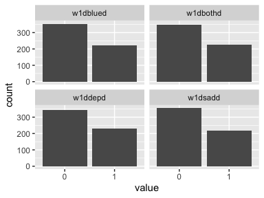
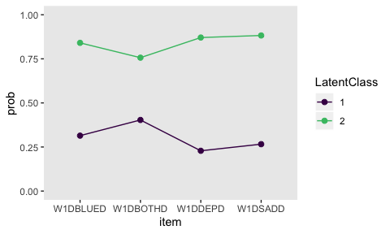
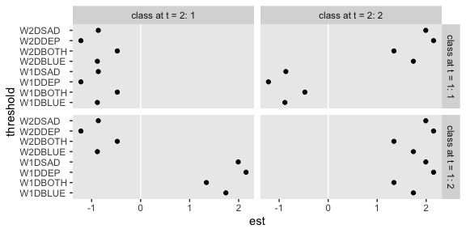
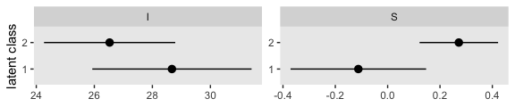

10
================
A Solomon Kurz
2019-12-11

# Latent Transition and Growth Mixture Models

> SEM is generally concerned with continuous latent variables, but it is
> also possible to conceptualize latent variables as categorical. The
> basic multiple-indicator model in which the latent variable is
> categorical is usually referred to as a latent class model
> ([Lazarsfeld &
> Henry, 1968](http://www.worldcat.org/title/latent-structure-analysis/oclc/433623);
> [Goodman, 1974](https://www.jstor.org/stable/pdf/2776792.pdf?casa_token=NLElBmQ-72kAAAAA:7fZ6wc3ITo9DxC3J425CJp8kQ9mxCvlEOO-pv-u9zVSShdR3t6T_DPu56u3Rfb0RQJHQrZ96tU3pGR6chWZm8el_1GppUPAYd4MFJVO1d-pQCbz77hxX)).
> Either exploratory or confirmatory approaches to latent class models
> are possible, analogous to the distinction between exploratory and
> confirmatory factor analysis. (p. 264)

## Latent class analysis

### Basic concepts.

> Latent class estimation is a process of estimating membership in an
> unknown group, which differs conceptually from the concept of the
> factor model. Factor analysis involving continuous latent variables
> could be said to cluster items, whereas latent class analysis
> involving categorical latent variables could be said to cluster cases.
> (p. 265)

### Binary indicators.

> For binary indicators, the latent class model has two parameters of
> principal interest – the predicted probability of class membership of
> a case and the conditional probability that \(y_{ij} = 1\) on the
> observed indicator that takes into account class membership, usually
> referred to as the response probability. The index \(i\) designates an
> individual case and \(j\) designates a particular indicator. (p. 265)

Each item gets a threshold \(\tau_{jc}\). There are \(C - 1\) mean
estimates, \(\alpha_c\), with the mean of the first class set to zero as
the referent class.

#### Class membership probabilities.

On page 276, we read “the unconditional probability of latent class
membership is an exponential function of the latent class mean,
\(\alpha_c\).” The formula for the intercept-only model with two classes
is

\[\hat \pi_c = P (\eta_i^C = c) = \frac{e^{\alpha_c}}{1 + e^{\alpha_c}}.\]

With more than two classes, we still keep \(c = 1\) as the referent
class, but broaden the formula
to

\[\hat \pi_c = \frac{e^{\alpha_c}}{\displaystyle \sum_{c = 1}^C e^{\alpha_c}}\]

where \(\alpha_{c = 1} = 0\), and thus \(e^0 = 1\). “The odds of
membership in one class versus the referent class can be computed by
exponentiating the latent class mean,
\(e^{\alpha_c} = \hat \pi_c / \hat \pi_0\), where \(\hat \pi_0\) is the
probability of membership in the referent class” (p. 266). Because the
classes are exclusive, it is also the case that

\[\sum_{c = 1}^C \hat \pi_c = 1,\]

presuming conditional independence.

#### Response probabilities.

> The second parameter of importance is the indicator threshold. The
> indicator threshold contains information about the conditional
> probability that a particular indicator will be equal to 1 given class
> membership. These conditional probabilities are referred to as
> *response probabilities*. (p. 266, *emphasis* in the original)

Within the logistic regression paradigm, the thresholds are given in a
log-odds metric. You can convert a threshold into a conditional
probability, \(\hat p_{j | c}\), with the
formula

\[P (y_{ij} = 1 | \eta^C = c) = \hat p_{j | c} = \frac{e^{\tau_{jc}}}{1 + e^{\tau_{jc}}}.\]

The closer \(\hat p_{j | c}\) is to 0 or 1, the better the item is at
discriminating among classes.

#### The latent class model.

> The statistical model for latent class analysis states that an
> observed pattern of responses is equal to the sum of the product of
> the class membership and the response probabilities across classes. A
> case has a particular pattern of values on the indicators if it falls
> into a particular cell of the contingency table formed by crossing all
> indicators. (p. 267)

The general formula for the latent class model is

\[
P (\mathbf Y = \mathbf y) = \sum_{c = 1}^C \hat \pi_c \prod_{j = 1}^J \hat p_{j | c}, \text{where}
\]

> \(\mathbf Y\) is a vector of possible values, \(\mathbf y\) is a
> vector representing a particular observed pattern, and
> \(P (\mathbf Y = \mathbf y)\) is the probability of a particular
> response pattern across all of the binary \(y\) indicators. The
> symboln \(\prod\) is the product operator, indicating the product of
> the conditional probabilities across all \(J\) indicators. The formula
> therefore states that a particular response pattern on the indicators
> is a function of the predicted latent class membership probability and
> the product of all the conditional probabilities for the values of the
> indicators.

#### Entropy.

> Probability of individual class membership can then be used to
> summarize the overall accuracy of classification or class separation.
> Although there are several possible measures of accuracy, the entropy
> index, E, which represents a kind of average of the natural log of all
> class membership probabilities, is the most frequently employed
> ([Ramaswamy, DeSarbo, Reibstein, &
> Robinson, 1993](https://www.researchgate.net/profile/Wayne_Desarbo/publication/227442033_An_Empirical_Pooling_Approach_for_Estimating_Marketing_Mix_Elasticities_with_PIMS_Data/links/552d44730cf21acb09215310.pdf)).
> (pp. 268–269)

\(E\) follows the formula:

\[
E = \frac{\displaystyle \sum_{i = 1}^N \sum_{j = 1}^J (- \hat \pi_{ic} \ln \hat \pi_{ic})}{N \ln C}.
\]

### Continuous indicators.

> Categorical latent variables also may be defined by continuous
> indicators. Although such models are often referred to in a general
> sense as latent class models, the term *latent profile analysis* is
> more specifically applied to latent class models with continuous
> indicators ([Lazarsfeld &
> Henry, 1968](https://www.worldcat.org/title/latent-structure-analysis/oclc/433623))
> (p. 269, *emphasis* in the original)

## Structural equation mixture models

Structural equation mixture models allow analysts to fit models with
various combinations of categorical and continuous latent variables
based on continuous and/or discrete observed variables.

### Estimation, model identification, and fit.

> The most common estimator for latent class models is maximum
> likelihood (ML) using an expectation maximization (EM) algorithm
> ([Dempster, Laird, &
> Rubin, 1977](http://www.eng.auburn.edu/~troppel/courses/7970%202015A%20AdvMobRob%20sp15/literature/paper%20W%20refs/dempster%20EM%201977.pdf);
> [McLachlan &
> Krishnan, 1997](https://www.worldcat.org/title/em-algorithm-and-extensions/oclc/35305113);
> [Muthén &
> Shedden, 1999](http://www.statmodel.com/download/Muthen_Shedden_1999.pdf)).
> In the EM steps of the ML process, conditional expectations and the
> posterior class membership probabilities are computed in the
> expectation step and parameter estimates are updated. The fit is then
> maximized through iterations in the maximization step. This process
> alternates between the two steps until an optimization criterion is
> reached….
> 
> For identification, the number of classes must be less than the number
> of indicators unless there are additional constraints (e.g., equal
> variances for the indicators across classes). Thus, with three
> indicators, only two classes can be specified without spe- cial
> restrictions….
> 
> No chi-square model fit is available for latent class models with
> continuous indicators. Instead, for assessment of fit, one must rely
> on likelihood-based fit indices, such as the Akaike Information
> Criterion (AIC) and the Bayesian Information Criterion (BIC), which
> are commonly used for evaluation of fit relative to comparison models.
> The sample size adjusted BIC (aBIC;
> [Sclove, 1987](https://link.springer.com/article/10.1007/BF02294360))
> seems to perform better than other information criteria (e.g., [Nylund
> et
> al., 2007](https://www.researchgate.net/profile/Karen_Nylund-Gibson/publication/228701265_Deciding_On_the_Number_of_Classes_In_Latent_Class_Analysis_and_Growth_Mixture_Modeling_A_Monte_Carlo_Simulation_Study/links/54ebb87f0cf2a03051949730.pdf)).
> (pp. 271–272)

The aBIC follows the formula

\[\text{aBIC} = -2 LL + q \cdot \ln \bigg ( \frac{N + 2}{24} \bigg ),\]

where \(LL\) is the log likelihood for the \(\text H0\) model and \(q\)
is the number of free parameters.

### Determining the number of classes.

> The difference in the log likelihoods for two models with a different
> number of classes is not distributed as chi-square, so an exact test
> to compare models does not exist. The adjusted BIC is commonly used
> for this purpose (lower values indicating better fit) and performs
> fairly well ([Tofighi &
> Enders, 2008](https://www.researchgate.net/profile/Davood_Tofighi/publication/281378561_Identifying_the_correct_number_of_classes_in_growth_mixture_models/links/58e28714aca272059ab62ed0/Identifying-the-correct-number-of-classes-in-growth-mixture-models.pdf);
> [Yang 2006](https://reader.elsevier.com/reader/sd/pii/S0167947304003391?token=EE5CBDABB182FA75FE5CC23BA33ED4F81FF7E6E51F2AC9C262612A24604E62C814ADFD97EA12FB4B7F3C2CFFB6F3D1D6)),
> but a number of simulation studies suggest that more precise methods
> may be preferable. These methods are designed to compare two models
> that differ by only one latent class. Among the several proposed
> alternatives are a bootstrapped likelihood ratio test ([Dziak, Lanza,
> &
> Tan, 2014](https://www.ncbi.nlm.nih.gov/pmc/articles/PMC4196274/pdf/nihms596137.pdf);
> [McLachlan &
> Peel, 2000](https://www.wiley.com/en-us/Finite+Mixture+Models-p-9780471006268);
> Nylund et al., 2007), the Lo–Mendell–Rubin adjusted likelihood ratio
> test, and the Vuong–Lo–Mendell–Rubin likelihood ratio test ([Lo,
> Mendell, &
> Rubin, 2001](https://www.jstor.org/stable/pdf/2673445.pdf?refreqid=excelsior%3A82355e1314c1f876f1d5fe72a193c113);
> [Vuong, 1989](https://authors.library.caltech.edu/81424/1/sswp605.pdf))
> (p. 273)

### Example 10.1: Latent class and latent profile models.

Let’s load the `socex1.1` data.

``` r
library(tidyverse)

socex1_names <- 
  c("w1vst1", "w1vst2", "w1vst3", "w2vst1", "w2vst2", "w2vst3", "w3vst1", "w3vst2", "w3vst3", "w1unw1", "w1unw2", "w1unw3", "w2unw1", "w2unw2", "w2unw3", "w3unw1", "w3unw2", "w3unw3", "w1dboth","w1dsad", "w1dblues", "w1ddep", "w2dboth", "w2dsad","w2dblues", "w2ddep", "w3dboth", "w3dsad", "w3dblues", "w3ddep", "w1marr2", "w1happy", "w1enjoy", "w1satis", "w1joyful", "w1please", "w2happy", "w2enjoy", "w2satis", "w2joyful", "w2please", "w3happy", "w3enjoy", "w3satis", "w3joyful", "w3please", "w1lea", "w2lea", "w3lea")

socex1.1 <- 
  read_table2("data/socex1.dat",
              col_names = F) %>% 
  set_names(socex1_names)

head(socex1.1)
```

    ## # A tibble: 6 x 49
    ##   w1vst1 w1vst2 w1vst3 w2vst1 w2vst2 w2vst3 w3vst1 w3vst2 w3vst3 w1unw1 w1unw2 w1unw3 w2unw1 w2unw2
    ##    <dbl>  <dbl>  <dbl>  <dbl>  <dbl>  <dbl>  <dbl>  <dbl>  <dbl>  <dbl>  <dbl>  <dbl>  <dbl>  <dbl>
    ## 1      0      1      0      3      3      2      3      2      2      2      2      3      4      4
    ## 2      3      3      4      3      3      3      2      3      3      1      3      2      3      2
    ## 3      2      2      3      1      0      2      2      2      1      2      1      1      1      3
    ## 4      2      2      3      1      2      2      2      2      2      4      3      3      3      2
    ## 5      3      2      2      2      2      2      3      3      2      2      4      3      2      3
    ## 6      4      4      4      4      4      4      4      4      4      0      2      1      2      1
    ## # … with 35 more variables: w2unw3 <dbl>, w3unw1 <dbl>, w3unw2 <dbl>, w3unw3 <dbl>, w1dboth <dbl>,
    ## #   w1dsad <dbl>, w1dblues <dbl>, w1ddep <dbl>, w2dboth <dbl>, w2dsad <dbl>, w2dblues <dbl>,
    ## #   w2ddep <dbl>, w3dboth <dbl>, w3dsad <dbl>, w3dblues <dbl>, w3ddep <dbl>, w1marr2 <dbl>,
    ## #   w1happy <dbl>, w1enjoy <dbl>, w1satis <dbl>, w1joyful <dbl>, w1please <dbl>, w2happy <dbl>,
    ## #   w2enjoy <dbl>, w2satis <dbl>, w2joyful <dbl>, w2please <dbl>, w3happy <dbl>, w3enjoy <dbl>,
    ## #   w3satis <dbl>, w3joyful <dbl>, w3please <dbl>, w1lea <dbl>, w2lea <dbl>, w3lea <dbl>

``` r
dim(socex1.1)
```

    ## [1] 574  49

Following along with Newsom in the first paragraph of this subsection,
here we dichotomize our four variables of interest in a series of
`if_else()` statements.

``` r
socex1.1 <-
  socex1.1 %>% 
  mutate(w1dbothd = if_else(w1dboth  == 0, 0, 1),
         w1dsadd  = if_else(w1dsad   == 0, 0, 1),
         w1dblued = if_else(w1dblues == 0, 0, 1),
         w1ddepd  = if_else(w1ddep   == 0, 0, 1))

socex1.1 %>% 
  select(w1dboth:w1ddep, w1dbothd:w1ddepd)
```

    ## # A tibble: 574 x 8
    ##    w1dboth w1dsad w1dblues w1ddep w1dbothd w1dsadd w1dblued w1ddepd
    ##      <dbl>  <dbl>    <dbl>  <dbl>    <dbl>   <dbl>    <dbl>   <dbl>
    ##  1       0      0        1      0        0       0        1       0
    ##  2       0      1        1      1        0       1        1       1
    ##  3       0      0        0      0        0       0        0       0
    ##  4       2      0        0      0        1       0        0       0
    ##  5       1      2        1      1        1       1        1       1
    ##  6       0      0        0      0        0       0        0       0
    ##  7       0      0        1      2        0       0        1       1
    ##  8       0      2        0      1        0       1        0       1
    ##  9       0      0        0      0        0       0        0       0
    ## 10       0      0        0      0        0       0        0       0
    ## # … with 564 more rows

Here’s a quick look at their distributions.

``` r
socex1.1 %>% 
  select(w1dbothd:w1ddepd) %>% 
  gather() %>% 
  mutate(value = as.factor(value)) %>% 
  
  ggplot(aes(x = value)) +
  geom_bar() +
  facet_wrap(~key)
```

<!-- -->

lavaan does [not support mixture
models](http://lavaan.ugent.be/development.html), at this time. But as
long as you also have a recent version of M*plus*, you can fit them
within R via the MplusAutomation package.

``` r
library(MplusAutomation)
```

Newsom provided the M*plus* code for the first model in the
`ex10-3a.inp` file. Here’s our version using MplusAutomation.

``` r
model10.1.a <- 
  mplusObject(
  TITLE = "Newsom Longitudinal SEM Chapter 10, Example 10.1, Latent Transition and Growth Mixture Models;",
  VARIABLE = "
  usevariables = w1dbothd w1dsadd w1dblued w1ddepd;
  categorical  = w1dbothd w1dsadd w1dblued w1ddepd;
  classes = etac(2);
  ",
  ANALYSIS = "
  type = mixture;
  ",
  MODEL = "
  ! no model statements are needed, one-factor LCA estimated by default;
  ! here's the optional specification;
  
  %overall%
  [w1dbothd$1 w1dsadd$1 w1dblued$1 w1ddepd$1];
  
  ! class 1 mean estimated by default and cannot be specified;
  %etac#1%
  [w1dbothd$1 w1dsadd$1 w1dblued$1 w1ddepd$1] (t1-t4);
  
  ! class 2 mean set to 0 by default and cannot be modified;
  %etac#2%
  [w1dbothd$1 w1dsadd$1 w1dblued$1 w1ddepd$1] (t5-t8);
  ",
  OUTPUT = "
  ! conduct the LMR and the VLMR likelihood ratio tests; 
  tech11 tech14 cinterval;
  ",
  rdata = socex1.1 %>% select(w1dbothd:w1ddepd))

fit_10.1.a <- mplusModeler(model10.1.a, modelout = "model10.1.a.inp", run = 1L)
```

    ## 
    ## Running model: model10.1.a.inp 
    ## System command: cd "." && "/Applications/Mplus/mplus" "model10.1.a.inp" 
    ## Reading model:  model10.1.a.out

Here is a summary of the results.

``` r
fit_10.1.a$results$summaries %>% 
  glimpse()
```

    ## Observations: 1
    ## Variables: 48
    ## $ Mplus.version                  <chr> "7.4"
    ## $ Title                          <chr> " Newsom Longitudinal SEM Chapter 10, Example 10.1, Latent…
    ## $ AnalysisType                   <chr> "mixture"
    ## $ DataType                       <chr> "INDIVIDUAL"
    ## $ Estimator                      <chr> "MLR"
    ## $ Observations                   <dbl> 574
    ## $ NGroups                        <dbl> 1
    ## $ NDependentVars                 <dbl> 4
    ## $ NIndependentVars               <dbl> 0
    ## $ NContinuousLatentVars          <dbl> 0
    ## $ NCategoricalLatentVars         <dbl> 1
    ## $ Parameters                     <dbl> 9
    ## $ ChiSqCategoricalPearson_Value  <dbl> 13.09
    ## $ ChiSqCategoricalPearson_DF     <dbl> 6
    ## $ ChiSqCategoricalPearson_PValue <dbl> 0.0416
    ## $ ChiSqCategoricalLRT_Value      <dbl> 12.739
    ## $ ChiSqCategoricalLRT_DF         <dbl> 6
    ## $ ChiSqCategoricalLRT_PValue     <dbl> 0.0474
    ## $ LL                             <dbl> -1410.775
    ## $ LLCorrectionFactor             <dbl> 1.0324
    ## $ AIC                            <dbl> 2839.55
    ## $ BIC                            <dbl> 2878.724
    ## $ aBIC                           <dbl> 2850.153
    ## $ Entropy                        <dbl> 0.638
    ## $ T11_KM1Starts                  <dbl> 20
    ## $ T11_KM1Final                   <dbl> 4
    ## $ T11_KM1LL                      <dbl> -1534.865
    ## $ T11_VLMR_2xLLDiff              <dbl> 248.18
    ## $ T11_VLMR_ParamDiff             <dbl> 5
    ## $ T11_VLMR_Mean                  <dbl> 4.676
    ## $ T11_VLMR_SD                    <dbl> 5.511
    ## $ T11_VLMR_PValue                <dbl> 0
    ## $ T11_LMR_Value                  <dbl> 240.605
    ## $ T11_LMR_PValue                 <dbl> 0
    ## $ BLRT_RequestedDraws            <chr> "                        Varies"
    ## $ BLRT_KM1AnalysisStarts         <dbl> 20
    ## $ BLRT_KM1AnalysisFinal          <dbl> 4
    ## $ BLRT_KM1GenStarts              <dbl> 0
    ## $ BLRT_KM1GenFinal               <dbl> 0
    ## $ BLRT_KGenStarts                <dbl> 40
    ## $ BLRT_KGenFinal                 <dbl> 8
    ## $ BLRT_KM1LL                     <dbl> -1534.865
    ## $ BLRT_2xLLDiff                  <dbl> 248.18
    ## $ BLRT_ParamDiff                 <dbl> 5
    ## $ BLRT_PValue                    <dbl> 0
    ## $ BLRT_SuccessfulDraws           <dbl> 5
    ## $ AICC                           <dbl> 2839.869
    ## $ Filename                       <chr> "model10.1.a.out"

Happily, all our fit values match up with those in the text. In case you
were curious, here’s how we might use the formula from above to compute
the aBIC by hand.

``` r
ll <- fit_10.1.a$results$summaries$LL
q  <- fit_10.1.a$results$summaries$Parameters
n  <- fit_10.1.a$results$summaries$Observations

(-2 * ll) + q * log((n + 2) / 24)
```

    ## [1] 2850.152

Here are the unstandardized parameter
    estimates.

``` r
readModels("model10.1.a.out")$parameters$unstandardized
```

    ## Reading model:  model10.1.a.out

    ## No PROPORTION OF DATA PRESENT sections found within COVARIANCE COVERAGE OF DATA output.

    ##   paramHeader      param    est    se est_se  pval                  LatentClass
    ## 1  Thresholds W1DBOTHD$1 -0.392 0.166 -2.356 0.018                            1
    ## 2  Thresholds  W1DSADD$1 -1.015 0.248 -4.093 0.000                            1
    ## 3  Thresholds W1DBLUED$1 -0.780 0.208 -3.756 0.000                            1
    ## 4  Thresholds  W1DDEPD$1 -1.217 0.287 -4.240 0.000                            1
    ## 5  Thresholds W1DBOTHD$1  1.134 0.174  6.520 0.000                            2
    ## 6  Thresholds  W1DSADD$1  2.016 0.312  6.457 0.000                            2
    ## 7  Thresholds W1DBLUED$1  1.663 0.234  7.098 0.000                            2
    ## 8  Thresholds  W1DDEPD$1  1.908 0.285  6.685 0.000                            2
    ## 9       Means     ETAC#1 -0.301 0.188 -1.595 0.111 Categorical.Latent.Variables

We can pull their 95% confidence intervals like this.

``` r
readModels("model10.1.a.out")$parameters$ci.unstandardized %>% 
  select(contains("param"), est, contains("2.5"), LatentClass)
```

    ## Reading model:  model10.1.a.out

    ## No PROPORTION OF DATA PRESENT sections found within COVARIANCE COVERAGE OF DATA output.

    ##   paramHeader      param    est low2.5  up2.5                  LatentClass
    ## 1  Thresholds W1DBOTHD$1 -0.392 -0.718 -0.066                            1
    ## 2  Thresholds  W1DSADD$1 -1.015 -1.501 -0.529                            1
    ## 3  Thresholds W1DBLUED$1 -0.780 -1.187 -0.373                            1
    ## 4  Thresholds  W1DDEPD$1 -1.217 -1.779 -0.654                            1
    ## 5  Thresholds W1DBOTHD$1  1.134  0.793  1.475                            2
    ## 6  Thresholds  W1DSADD$1  2.016  1.404  2.628                            2
    ## 7  Thresholds W1DBLUED$1  1.663  1.204  2.122                            2
    ## 8  Thresholds  W1DDEPD$1  1.908  1.348  2.467                            2
    ## 9       Means     ETAC#1 -0.301 -0.670  0.069 Categorical.Latent.Variables

You’ll note that what the Newsom calls the estimates for the first
latent class, our output calls `LatentClass == 2`. This is not a big
deal. This ordering is arbitrary.

If we’d like to use Equation 10.1 (i.e., the inverse logit function) to
convert our intercept estimates to response probabilities, it can be
useful to make a custom `inv_logit()` function.

``` r
inv_logit <- function(x) {
  exp(x) / (1 + exp(x))
}
```

Here we feed in the point estimates for the thresholds for our
`LatentClass == 2` (i.e., Newsom’s first latent class).

``` r
inv_logit(c(1.134, 2.016, 1.663, 1.908))
```

    ## [1] 0.7565763 0.8824668 0.8406403 0.8707943

Frustratingly, our values don’t quite match up with his.

But anyways, we don’t have to do this by hand. It’s already part of the
model output. We just have to extract it
    properly.

``` r
readModels("model10.1.a.out")$parameters$probability.scale 
```

    ## Reading model:  model10.1.a.out

    ## No PROPORTION OF DATA PRESENT sections found within COVARIANCE COVERAGE OF DATA output.

    ##       param category   est    se est_se pval
    ## 1  W1DBOTHD        1 0.403 0.040 10.069    0
    ## 2  W1DBOTHD        2 0.597 0.040 14.902    0
    ## 3   W1DSADD        1 0.266 0.048  5.494    0
    ## 4   W1DSADD        2 0.734 0.048 15.159    0
    ## 5  W1DBLUED        1 0.314 0.045  7.024    0
    ## 6  W1DBLUED        2 0.686 0.045 15.321    0
    ## 7   W1DDEPD        1 0.229 0.051  4.518    0
    ## 8   W1DDEPD        2 0.771 0.051 15.251    0
    ## 9  W1DBOTHD        1 0.757 0.032 23.621    0
    ## 10 W1DBOTHD        2 0.243 0.032  7.599    0
    ## 11  W1DSADD        1 0.882 0.032 27.250    0
    ## 12  W1DSADD        2 0.118 0.032  3.630    0
    ## 13 W1DBLUED        1 0.841 0.031 26.783    0
    ## 14 W1DBLUED        2 0.159 0.031  5.078    0
    ## 15  W1DDEPD        1 0.871 0.032 27.115    0
    ## 16  W1DDEPD        2 0.129 0.032  4.024    0

It’s beyond me why our values don’t match up with those in the text. If
you know the answer, [please
share](https://github.com/ASKurz/Longidutinal-SEMing/issues) with the
rest of the class.

Here’s what our output might look like in a plot.

``` r
readModels("model10.1.a.out")$parameters$unstandardized %>% 
  filter(paramHeader != "Means") %>% 
  mutate(prob = inv_logit(est),
         item = str_remove(param, "\\$1")) %>% 
  
  ggplot(aes(x = item, y = prob, group = LatentClass, color = LatentClass)) +
  geom_line() +
  geom_point(size = 2) +
  scale_color_viridis_d(end = .7) +
  ylim(0, 1) +
  theme(panel.grid = element_blank())
```

    ## Reading model:  model10.1.a.out

    ## No PROPORTION OF DATA PRESENT sections found within COVARIANCE COVERAGE OF DATA output.

<!-- -->

Here’s a focused look at the mean for our first class.

``` r
readModels("model10.1.a.out")$parameters$unstandardized %>% 
  filter(paramHeader == "Means")
```

    ## Reading model:  model10.1.a.out

    ## No PROPORTION OF DATA PRESENT sections found within COVARIANCE COVERAGE OF DATA output.

    ##   paramHeader  param    est    se est_se  pval                  LatentClass
    ## 1       Means ETAC#1 -0.301 0.188 -1.595 0.111 Categorical.Latent.Variables

We can use the `$class_counts$posteriorProb` index to retrieve the
posterior probabilities for the proportion of cases within each latent
class.

``` r
readModels("model10.1.a.out")$class_counts$posteriorProb
```

    ## Reading model:  model10.1.a.out

    ## No PROPORTION OF DATA PRESENT sections found within COVARIANCE COVERAGE OF DATA output.

    ##   class    count proportion
    ## 1     1 244.1872    0.42541
    ## 2     2 329.8128    0.57459

``` r
readModels("model10.1.a.out")$parameters$probability.scale %>% 
  filter(category == 2) %>% 
  mutate(class = rep(1:2, each = 4))
```

    ## Reading model:  model10.1.a.out

    ## No PROPORTION OF DATA PRESENT sections found within COVARIANCE COVERAGE OF DATA output.

    ##      param category   est    se est_se pval class
    ## 1 W1DBOTHD        2 0.597 0.040 14.902    0     1
    ## 2  W1DSADD        2 0.734 0.048 15.159    0     1
    ## 3 W1DBLUED        2 0.686 0.045 15.321    0     1
    ## 4  W1DDEPD        2 0.771 0.051 15.251    0     1
    ## 5 W1DBOTHD        2 0.243 0.032  7.599    0     2
    ## 6  W1DSADD        2 0.118 0.032  3.630    0     2
    ## 7 W1DBLUED        2 0.159 0.031  5.078    0     2
    ## 8  W1DDEPD        2 0.129 0.032  4.024    0     2

Next in the first full paragraph on page 274, Newsom compared the fit of
the 2-class model with a 1-class model with the Lo–Mendell–Rubin
adjusted likelihood ratio test (LMR) and the Vuong–Lo–Mendell–Rubin
likelihood ratio test (VLMR). With M*plus*, you get those tests for a
\(k\) versus a \(k - 1\) class model by requesting `tech11` in the
`OUTPUT`.

``` r
fit_10.1.a$results$summaries %>% 
  select(starts_with("T11")) %>% 
  glimpse()
```

    ## Observations: 1
    ## Variables: 10
    ## $ T11_KM1Starts      <dbl> 20
    ## $ T11_KM1Final       <dbl> 4
    ## $ T11_KM1LL          <dbl> -1534.865
    ## $ T11_VLMR_2xLLDiff  <dbl> 248.18
    ## $ T11_VLMR_ParamDiff <dbl> 5
    ## $ T11_VLMR_Mean      <dbl> 4.676
    ## $ T11_VLMR_SD        <dbl> 5.511
    ## $ T11_VLMR_PValue    <dbl> 0
    ## $ T11_LMR_Value      <dbl> 240.605
    ## $ T11_LMR_PValue     <dbl> 0

The `T11_LMR_` lines give the LMR information and the `T11_VLMR_` lines
give the VLMR information. Happily, our values match those in the text.

Newsom said he attempted a three-class model, but the solution didn’t
converge without constraints. Here’s the code.

``` r
model10.1.b <- 
  mplusObject(
  TITLE = "Newsom Longitudinal SEM Chapter 10, Example 10.1, Latent Transition and Growth Mixture Models;",
  VARIABLE = "
  usevariables = w1dbothd w1dsadd w1dblued w1ddepd;
  categorical  = w1dbothd w1dsadd w1dblued w1ddepd;
  classes = etac (3);
  ",
  ANALYSIS = "
  type = mixture;
  ",
  MODEL = "
  ! no model statements are needed, one-factor LCA estimated by default;
  ! here's the optional specification;
  
  %overall%
  [w1dbothd$1 w1dsadd$1 w1dblued$1 w1ddepd$1];
  
  ! class 1;
  %etac#1%
  [w1dbothd$1 w1dsadd$1 w1dblued$1 w1ddepd$1] (t1-t4);
  
  ! class 2;
  %etac#2%
  [w1dbothd$1 w1dsadd$1 w1dblued$1 w1ddepd$1] (t5-t8);
  
  ! class 3;
  %etac#3%
  [w1dbothd$1 w1dsadd$1 w1dblued$1 w1ddepd$1] (t9-t12);
  ",
  OUTPUT = "
  ! conduct the LMR and the VLMR likelihood ratio tests; 
  tech11 tech14 cinterval;
  ",
  rdata = socex1.1 %>% select(w1dbothd:w1ddepd))

fit_10.1.b <- mplusModeler(model10.1.b, modelout = "model10.1.b.inp", run = 1L)
```

    ## 
    ## Running model: model10.1.b.inp 
    ## System command: cd "." && "/Applications/Mplus/mplus" "model10.1.b.inp" 
    ## Reading model:  model10.1.b.out

We can check for warnings like this.

``` r
fit_10.1.b$results$warnings
```

    ## [[1]]
    ## [1] "Input line exceeded 90 characters. Some input may be truncated."                            
    ## [2] "Newsom Longitudinal SEM Chapter 10, Example 10.1, Latent Transition and Growth Mixture Mode"
    ## [3] "1 WARNING(S) FOUND IN THE INPUT INSTRUCTIONS"                                               
    ## 
    ## attr(,"class")
    ## [1] "list"           "mplus.warnings"

No big issues with the warnings other than truncation without title
prose. But the plot thickens when we look at the unstandardized
parameter
    estimates.

``` r
readModels("model10.1.b.out")$parameters$unstandardized
```

    ## Reading model:  model10.1.b.out

    ## No PROPORTION OF DATA PRESENT sections found within COVARIANCE COVERAGE OF DATA output.

    ##    paramHeader      param     est    se  est_se    pval                  LatentClass
    ## 1   Thresholds W1DBOTHD$1  -0.348 0.173  -2.006   0.045                            1
    ## 2   Thresholds  W1DSADD$1  -0.971 0.235  -4.135   0.000                            1
    ## 3   Thresholds W1DBLUED$1  -0.790 0.202  -3.909   0.000                            1
    ## 4   Thresholds  W1DDEPD$1  -1.708 0.478  -3.576   0.000                            1
    ## 5   Thresholds W1DBOTHD$1 -15.000 0.000 999.000 999.000                            2
    ## 6   Thresholds  W1DSADD$1   0.906 0.690   1.313   0.189                            2
    ## 7   Thresholds W1DBLUED$1   0.896 0.602   1.488   0.137                            2
    ## 8   Thresholds  W1DDEPD$1  15.000 0.000 999.000 999.000                            2
    ## 9   Thresholds W1DBOTHD$1   2.618 2.403   1.090   0.276                            3
    ## 10  Thresholds  W1DSADD$1   2.056 0.279   7.375   0.000                            3
    ## 11  Thresholds W1DBLUED$1   1.721 0.230   7.485   0.000                            3
    ## 12  Thresholds  W1DDEPD$1   1.843 0.285   6.472   0.000                            3
    ## 13       Means     ETAC#1  -0.171 0.296  -0.578   0.563 Categorical.Latent.Variables
    ## 14       Means     ETAC#2  -1.310 0.668  -1.962   0.050 Categorical.Latent.Variables

Looks like we did have estimation difficulties with two of the
thresholds for our second latent class. I would not put my faith on
those results.

The next paragraph in this subsection begins:

> A second model was tested to illustrate a latent profile analysis with
> continuous indicators. For this model, the health and aging data set
> was used so that the results could be presented for the latent
> transition model described below, a model that requires more time
> points than available from the social exchange data set. The latent
> profile model estimated positive affect classes using five continuous
> indicators, frequency ratings for the “happy,” “enjoy,” “satisfied,”
> “joyful,” and “pleased” questions. (p. 274)

I’m not sure what happened, but starting here and going further, there
appear to be a lot of mistakes in the text. First, those five variables
are not in the “health and aging” data set (i.e., `health.dat`). Rather,
those variables are indeed in the social exchange data set (i.e.,
`socex1.dat`), the one we just used. Here they are:

``` r
socex1.1 %>% 
  select(w1happy:w1please)
```

    ## # A tibble: 574 x 5
    ##    w1happy w1enjoy w1satis w1joyful w1please
    ##      <dbl>   <dbl>   <dbl>    <dbl>    <dbl>
    ##  1       3       3       3        3        3
    ##  2       3       3       3        3        2
    ##  3       3       2       3        2        3
    ##  4       2       3       3        3        4
    ##  5       2       3       3        2        2
    ##  6       5       5       4        4        4
    ##  7       2       3       2        3        2
    ##  8       2       2       2        2        1
    ##  9       2       4       4        3        3
    ## 10       4       3       3        3        3
    ## # … with 564 more rows

We can further confirm that based on the code in Newsom’s `ex10-1b.inp`
file, which shows how to use those five variables in a 3-class latent
profile model. Note that since we fit the 3-class model, above, our
naming convention is now a little out of step with Newsom’s. For us,
this will be `model10.1.c`.

``` r
model10.1.c <- 
  mplusObject(
  TITLE = "Newsom Longitudinal SEM Chapter 10, Example 10.1, Latent Transition and Growth Mixture Models;",
  VARIABLE = "
  usevariables = w1happy w1enjoy w1satis w1joyful w1please;
  classes = etac (3);
  ",
  ANALYSIS = "
  type = mixture;
  ",
  MODEL = "
  ! no model statements are needed to obtain basic latent profile model;
  ",
  OUTPUT = "
  ! conduct the LMR and the VLMR likelihood ratio tests; 
  tech11 cinterval;
  ",
  rdata = socex1.1 %>% select(w1happy:w1please))

fit_10.1.c <- mplusModeler(model10.1.c, modelout = "model10.1.c.inp", run = 1L)
```

    ## 
    ## Running model: model10.1.c.inp 
    ## System command: cd "." && "/Applications/Mplus/mplus" "model10.1.c.inp" 
    ## Reading model:  model10.1.c.out

Here is the results summary.

``` r
fit_10.1.c$results$summaries %>% 
  # select(starts_with("T11")) %>% 
  glimpse()
```

    ## Observations: 1
    ## Variables: 30
    ## $ Mplus.version          <chr> "7.4"
    ## $ Title                  <chr> " Newsom Longitudinal SEM Chapter 10, Example 10.1, Latent Transit…
    ## $ AnalysisType           <chr> "mixture"
    ## $ DataType               <chr> "INDIVIDUAL"
    ## $ Estimator              <chr> "MLR"
    ## $ Observations           <dbl> 574
    ## $ NGroups                <dbl> 1
    ## $ NDependentVars         <dbl> 5
    ## $ NIndependentVars       <dbl> 0
    ## $ NContinuousLatentVars  <dbl> 0
    ## $ NCategoricalLatentVars <dbl> 1
    ## $ Parameters             <dbl> 22
    ## $ LL                     <dbl> -3140.472
    ## $ LLCorrectionFactor     <dbl> 1.2213
    ## $ AIC                    <dbl> 6324.944
    ## $ BIC                    <dbl> 6420.702
    ## $ aBIC                   <dbl> 6350.861
    ## $ Entropy                <dbl> 0.79
    ## $ T11_KM1Starts          <dbl> 20
    ## $ T11_KM1Final           <dbl> 4
    ## $ T11_KM1LL              <dbl> -3262.158
    ## $ T11_VLMR_2xLLDiff      <dbl> 243.371
    ## $ T11_VLMR_ParamDiff     <dbl> 6
    ## $ T11_VLMR_Mean          <dbl> -39.505
    ## $ T11_VLMR_SD            <dbl> 110.97
    ## $ T11_VLMR_PValue        <dbl> 9e-04
    ## $ T11_LMR_Value          <dbl> 237.15
    ## $ T11_LMR_PValue         <dbl> 0.001
    ## $ AICC                   <dbl> 6326.781
    ## $ Filename               <chr> "model10.1.c.out"

As indicated in the text, we don’t get a model \(\chi^2\). But we do get
information criteria. Frustratingly, our aBIC does not match up with the
one Newsom reported. If you look at the `T11_` columns, you’ll see our
LMR and VLMR values also conflict with Newsom’s–though at least the
basic interpretations of the \(p\)-values do. Both our findings and
Newsom’s suggest the 2-class model fits significantly worse than the
3-class.

Here’s a focused look at the mean estimates for our first and second
classes.

``` r
readModels("model10.1.c.out")$parameters$unstandardized %>% 
  filter(str_detect(param, "ETAC"))
```

    ## Reading model:  model10.1.c.out

    ##   paramHeader  param   est    se est_se  pval                  LatentClass
    ## 1       Means ETAC#1 0.202 0.431  0.468 0.639 Categorical.Latent.Variables
    ## 2       Means ETAC#2 1.315 0.252  5.224 0.000 Categorical.Latent.Variables

Well finally, at least these match up with the results in the text\!
Here are the estimated proportions for each class.

``` r
readModels("model10.1.c.out")$class_counts$posteriorProb
```

    ## Reading model:  model10.1.c.out

    ##   class     count proportion
    ## 1     1 118.08272    0.20572
    ## 2     2 359.43096    0.62619
    ## 3     3  96.48632    0.16809

We can pull the estimated within-class means from Table 10.1 like so.

``` r
readModels("model10.1.c.out")$parameters$unstandardized %>% 
  filter(paramHeader == "Means" & !str_detect(param, "ETAC")) %>% 
  mutate(class = str_c("class ", LatentClass),
         pa = factor(param,
                     levels = c("W1HAPPY", "W1ENJOY", "W1SATIS", "W1JOYFUL", "W1PLEASE"),
                     labels = c("happy", "enjoy", "satisfied", "joyful", "pleased"))) %>% 
  select(pa, est, class) %>% 
  spread(key = class, value = est)
```

    ## Reading model:  model10.1.c.out

    ##          pa class 1 class 2 class 3
    ## 1     happy   2.167   3.121   3.837
    ## 2     enjoy   2.243   3.097   4.115
    ## 3 satisfied   2.218   3.028   3.966
    ## 4    joyful   2.103   3.024   4.101
    ## 5   pleased   2.253   3.015   3.850

Here’s a quick way to get the observed means.

``` r
socex1.1 %>% 
  select(w1happy:w1please) %>% 
  summarise_all(~mean(.) %>% round(digits = 3)) %>% 
  gather(pa, observed_mean)
```

    ## # A tibble: 5 x 2
    ##   pa       observed_mean
    ##   <chr>            <dbl>
    ## 1 w1happy           3.04
    ## 2 w1enjoy           3.09
    ## 3 w1satis           3.02
    ## 4 w1joyful          3.02
    ## 5 w1please          3.00

## Latent transition analysis

> The purpose of latent transition analysis is to study longitudinal
> changes in an individual’s latent class membership over time. Latent
> class models provide information about the probability of transition
> from one qualitative state to another…. The aim is to discover
> transitions in membership from one unobserved group to another over
> time, contrasting with the aim of many other analyses to investigate
> increases or decreases in the frequency or intensity of a continuous
> construct over time. The latent transition model is an autoregressive
> model that uses membership in a latent class at one time point to
> predict the probability of membership in a latent class at a
> subsequent time point. (p. 275).

### Basic concepts.

With a simple example of a 2-class 2-time point model with binary
indicators, the conditional probability a respondent will transition
from one class to another, \(\hat \pi_{t | t - 1}\),
is

\[\hat \pi_{2 | 1} = P (\eta_2^C = 1 | \eta_1^C = 0) = \frac{e^{\alpha_{2 | 1}}}{ 1 + e^{\alpha_{2 | 1}}},\]

where \(\eta_2^C\) and \(\eta_1^C\) depict the latent classes at times
\(t\) and \(t - 1\). For more than two classes, we generalize this to a
multinomial logistic model.

### Example 10.2: Latent transition model for two time points .

Here we extend how we began our analyses in Example 10.1. We have
already dichotomized the four depression variables for the first wave.
Here we’ll follow the same steps to dichotomize them at the second wave.

``` r
socex1.1 <-
  socex1.1 %>% 
  mutate(w2dbothd = if_else(w2dboth  == 0, 0, 1),
         w2dsadd  = if_else(w2dsad   == 0, 0, 1),
         w2dblued = if_else(w2dblues == 0, 0, 1),
         w2ddepd  = if_else(w2ddep   == 0, 0, 1))

socex1.1 %>% 
  select(w2dboth:w2ddep, w2dbothd:w2ddepd)
```

    ## # A tibble: 574 x 8
    ##    w2dboth w2dsad w2dblues w2ddep w2dbothd w2dsadd w2dblued w2ddepd
    ##      <dbl>  <dbl>    <dbl>  <dbl>    <dbl>   <dbl>    <dbl>   <dbl>
    ##  1       0      1        0      1        0       1        0       1
    ##  2       0      1        2      2        0       1        1       1
    ##  3       1      1        1      0        1       1        1       0
    ##  4       1      0        0      3        1       0        0       1
    ##  5       0      1        0      0        0       1        0       0
    ##  6       0      0        0      0        0       0        0       0
    ##  7       0      0        0      0        0       0        0       0
    ##  8       2      0        2      3        1       0        1       1
    ##  9       0      1        0      1        0       1        0       1
    ## 10       0      1        0      0        0       1        0       0
    ## # … with 564 more rows

Newsome provided code in his `ex10-2a.inp` file.

``` r
model10.2.a <- 
  mplusObject(
  TITLE = "
  Newsom Longitudinal SEM Chapter 10, Example 10.2,; 
  Latent Transition and Growth Mixture Models;
  ",
  VARIABLE = "
  usevariables = w1dbothd w1dsadd w1dblued w1ddepd w2dbothd w2dsadd w2dblued w2ddepd;
  categorical  = w1dbothd w1dsadd w1dblued w1ddepd w2dbothd w2dsadd w2dblued w2ddepd;
  classes = etac1 (2) etac2 (2);
  ",
  ANALYSIS = "
  type = mixture;
  ",
  MODEL = "
  ! this time we cannot rely on defaults;
  %overall%
  etac2 on etac1;
  [etac1#1];
  ! note: mean of last class cannot be referenced;
  
  model etac1:    
  %etac1#1%  
  [w1dbothd$1] (1);
  [w1dsadd$1]  (2);
  [w1dblued$1] (3);
  [w1ddepd$1]  (4);
  
  ! class 2 mean set to 0 by default and cannot be modified;
  %etac1#2%  
  [w1dbothd$1] (5);
  [w1dsadd$1]  (6);
  [w1dblued$1] (7);
  [w1ddepd$1]  (8);
  
  ! note how we're holding the thresholds constant over time
  model etac2:
  ! class 2 mean estimated by default and cannot be specified;
  %etac2#1% 
  [w2dbothd$1] (1);
  [w2dsadd$1]  (2);
  [w2dblued$1] (3); 
  [w2ddepd$1]  (4);
  
  ! class 2 mean set to 0 by default and cannot be modified;
  %etac2#2%  
  [w2dbothd$1] (5);
  [w2dsadd$1]  (6);
  [w2dblued$1] (7);
  [w2ddepd$1]  (8);
  ",
  OUTPUT = "
  ! conduct the LMR and the VLMR likelihood ratio tests; 
  tech11 tech14 cinterval;
  ",
  rdata = socex1.1 %>% select(w1dbothd:w1ddepd, w2dbothd:w2ddepd))

fit_10.2.a <- mplusModeler(model10.2.a, modelout = "model10.2.a.inp", run = 1L)
```

    ## 
    ## Running model: model10.2.a.inp 
    ## System command: cd "." && "/Applications/Mplus/mplus" "model10.2.a.inp" 
    ## Reading model:  model10.2.a.out

Here is the results summary.

``` r
fit_10.2.a$results$summaries %>% 
  glimpse()
```

    ## Observations: 1
    ## Variables: 26
    ## $ Mplus.version                  <chr> "7.4"
    ## $ Title                          <chr> "  Newsom Longitudinal SEM Chapter 10, Example 10.2,; Late…
    ## $ AnalysisType                   <chr> "mixture"
    ## $ DataType                       <chr> "INDIVIDUAL"
    ## $ Estimator                      <chr> "MLR"
    ## $ Observations                   <dbl> 574
    ## $ NGroups                        <dbl> 1
    ## $ NDependentVars                 <dbl> 8
    ## $ NIndependentVars               <dbl> 0
    ## $ NContinuousLatentVars          <dbl> 0
    ## $ NCategoricalLatentVars         <dbl> 2
    ## $ Parameters                     <dbl> 11
    ## $ ChiSqCategoricalPearson_Value  <dbl> 304.541
    ## $ ChiSqCategoricalPearson_DF     <dbl> 244
    ## $ ChiSqCategoricalPearson_PValue <dbl> 0.0051
    ## $ ChiSqCategoricalLRT_Value      <dbl> 310.037
    ## $ ChiSqCategoricalLRT_DF         <dbl> 244
    ## $ ChiSqCategoricalLRT_PValue     <dbl> 0.0027
    ## $ LL                             <dbl> -2744.438
    ## $ LLCorrectionFactor             <dbl> 1.0935
    ## $ AIC                            <dbl> 5510.876
    ## $ BIC                            <dbl> 5558.755
    ## $ aBIC                           <dbl> 5523.834
    ## $ Entropy                        <dbl> 0.685
    ## $ AICC                           <dbl> 5511.346
    ## $ Filename                       <chr> "model10.2.a.out"

The results for our Pearson’s and LRT \(\chi^2\) tests cohere with those
in the text. Both suggest a bit of model misfit.

It can be somewhat challenging to make sense of the parameter summaries.
Here’s what they look like in a facetet plot.

``` r
readModels("model10.2.a.out")$parameters$unstandardized %>% 
  filter(paramHeader == "Thresholds") %>% 
  separate(LatentClass, into = c("class at t = 1", "class at t = 2")) %>% 
  mutate(`class at t = 1` = str_c("class at t = 1: ", `class at t = 1`),
         `class at t = 2` = str_c("class at t = 2: ", `class at t = 2`),
         threshold = str_remove(param, "D\\$1")) %>% 
  
  ggplot(aes(x = est, y = threshold)) +
  geom_vline(xintercept = 0, color = "white") +
  geom_point() +
  theme(panel.grid  = element_blank(),
        axis.text.y = element_text(hjust = 0)) +
  facet_grid(`class at t = 1` ~ `class at t = 2`)
```

    ## Reading model:  model10.2.a.out

    ## No PROPORTION OF DATA PRESENT sections found within COVARIANCE COVERAGE OF DATA output.

<!-- -->

Remember the estimates are on the log-odds scale. Negative values
convert to probabilities less than .5 and positive estimates convert to
probabilities greater than .5.

Here’s how to extract the transition probabilities, as presented in
Table 10.2.

``` r
fit_10.2.a$results$class_counts$transitionProbs
```

    ##      from      to probability
    ## 1 ETAC1.1 ETAC2.1       0.677
    ## 2 ETAC1.2 ETAC2.1       0.236
    ## 3 ETAC1.1 ETAC2.2       0.323
    ## 4 ETAC1.2 ETAC2.2       0.764

In case you were curious, here’s how to put the output in a more Table
10.2-like format.

``` r
fit_10.2.a$results$class_counts$transitionProbs %>% 
  mutate(`time 1` = ifelse(from == "ETAC1.1", "class 1", "class 2"),
         `time 2` = ifelse(to   == "ETAC2.1", "class 1", "class 2")) %>% 
  select(probability:`time 2`) %>% 
  spread(key = `time 2`, value = probability)
```

    ##    time 1 class 1 class 2
    ## 1 class 1   0.677   0.323
    ## 2 class 2   0.236   0.764

Here are the non-threshold parameter estimates for the model.

``` r
readModels("model10.2.a.out")$parameters$unstandardized %>% 
  filter(paramHeader != "Thresholds")
```

    ## Reading model:  model10.2.a.out

    ## No PROPORTION OF DATA PRESENT sections found within COVARIANCE COVERAGE OF DATA output.

    ##   paramHeader   param    est    se est_se  pval                  LatentClass
    ## 1  ETAC2#1.ON ETAC1#1  1.917 0.281  6.815 0.000 Categorical.Latent.Variables
    ## 2       Means ETAC1#1 -0.234 0.169 -1.384 0.166 Categorical.Latent.Variables
    ## 3       Means ETAC2#1 -1.177 0.187 -6.305 0.000 Categorical.Latent.Variables

From the top to the bottom, those are the

  - autoregressive coefficient,
  - \(\alpha_{1 | 1}\), and
  - \(\alpha_{2 | 1}\).

Here’s the interpretation of \(\alpha_{2 | 1}\).

``` r
readModels("model10.2.a.out")$parameters$unstandardized %>% 
  filter(param == "ETAC2#1") %>% 
  select(est) %>% 
  mutate(`probability from 2 to 1` = inv_logit(est) %>% round(digits = 3))
```

    ## Reading model:  model10.2.a.out

    ## No PROPORTION OF DATA PRESENT sections found within COVARIANCE COVERAGE OF DATA output.

    ##      est probability from 2 to 1
    ## 1 -1.177                   0.236

Here’s a quick way to get the odds ratio.

``` r
(fit_10.2.a$results$class_counts$transitionProbs[1, 3] / 
   fit_10.2.a$results$class_counts$transitionProbs[3, 3]) / 
  (fit_10.2.a$results$class_counts$transitionProbs[2, 3] / 
     fit_10.2.a$results$class_counts$transitionProbs[4, 3])
```

    ## [1] 6.785276

It suggests “an individual was nearly seven times more likely to be in
the depressed group at Time 2 if they were in the depressed group at
Time 1” (p. 277).

### The latent Markov chain: A quasi-simplex model for latent classes.

> Once the basic concepts of the latent transition model are understood
> as an autoregressive model of categorical variables, the model can be
> related to the autoregressive models with additional time points. With
> a set of continuous observed variables that have been repeatedly
> measured, stability or change can be modeled with the simplex or
> quasi-simplex model (Chapter 5). Markov chain model is a special name
> for a simplex model with binary measured variables in which the
> categories are known. If there are two latent classes defined by a
> single observed binary indicator at each time point, the model is
> called a *latent Markov model* or “hidden” Markov model ([Baum,
> Petrie, Soules, &
> Weiss, 1970](https://www.biostat.wisc.edu/~kbroman/teaching/statgen/2004/refs/baum.pdf);
> [Langeheine, 1994](https://psycnet.apa.org/record/1996-97111-015);
> [Wiggins, 1973](https://psycnet.apa.org/record/1974-10981-000)).
> Recall that the quasi-simplex model is designed to take meas- urement
> error into account in the estimation of the autoregressive effects
> even though only a single indicator is used to define a latent
> continuous variable at each occasion. In a parallel fashion, the
> latent Markov model can be conceptualized as a quasi-simplex analysis
> with latent classes defined by only a single indicator at each time
> point in which the observed variable is considered a fallible
> indicator of the true underlying class membership
> ([Kaplan, 2009](https://us.sagepub.com/en-us/nam/structural-equation-modeling/book227519))
> (pp. 278–179, *emphasis* in the original)

### Example 10.3: Latent Markov chain model.

Here we load the `health`
data.

``` r
health1_names <- c("age", "srh1", "srh2", "srh3", "srh4", "srh5", "srh6", "bmi1",
"bmi2", "bmi3", "bmi4", "bmi5", "bmi6", "cesdna1", "cesdpa1", "cesdso1",
"cesdna2", "cesdpa2", "cesdso2", "cesdna3", "cesdpa3", "cesdso3",
"cesdna4", "cesdpa4", "cesdso4", "cesdna5", "cesdpa5", "cesdso5",
"cesdna6", "cesdpa6", "cesdso6", "diab1", "diab2", "diab3", "diab4", "diab5", "diab6")

health1 <- 
  read_table2("data/health.dat",
              col_names = F) %>% 
  set_names(health1_names)

glimpse(health1)
```

    ## Observations: 5,335
    ## Variables: 37
    ## $ age     <dbl> 55.14051, 63.33294, 58.57362, 62.28161, 59.67750, 54.28464, 52.55816, 57.86435, 4…
    ## $ srh1    <dbl> 3.2198275, 2.9382677, 2.0597007, 3.0955038, 5.0433826, 3.5554657, 5.5763941, 2.52…
    ## $ srh2    <dbl> 2.8445559, 0.4750199, 2.9808080, 5.1865756, 4.8425321, 3.1431942, 5.8039766, 1.72…
    ## $ srh3    <dbl> 1.5812505, 0.6661576, 3.3965038, 3.9656595, 3.4228102, 4.3778358, 4.2649820, 2.44…
    ## $ srh4    <dbl> 1.246121, 3.082019, 2.927770, 3.111632, 4.037927, 4.864917, 4.987574, 2.826647, 2…
    ## $ srh5    <dbl> 2.109169, 3.313588, 2.910595, 3.385376, 3.679832, 3.939745, 4.714705, 2.041515, 1…
    ## $ srh6    <dbl> 0.7174636, 3.4266173, 2.2108723, 4.0888979, 2.8907116, 5.4200764, 4.1951033, 1.80…
    ## $ bmi1    <dbl> 27.07684, 24.73399, 13.92317, 23.66202, 23.77539, 24.20106, 30.58369, 20.77051, 2…
    ## $ bmi2    <dbl> 29.36844, 27.05468, 12.46290, 24.68125, 25.61055, 22.28988, 29.87928, 20.09698, 2…
    ## $ bmi3    <dbl> 29.66096, 27.94157, 13.35623, 24.15629, 25.38682, 22.66508, 30.93980, 20.45760, 2…
    ## $ bmi4    <dbl> 29.17343, 25.27107, 15.84282, 26.11209, 25.27067, 22.91192, 29.27698, 22.85022, 2…
    ## $ bmi5    <dbl> 27.89252, 26.70287, 15.94613, 25.38515, 28.23984, 24.07524, 29.91350, 21.36999, 2…
    ## $ bmi6    <dbl> 27.84005, 28.03522, 15.36183, 24.78045, 31.23735, 23.05708, 28.44048, 21.13281, 2…
    ## $ cesdna1 <dbl> 0.74303571, 0.16488355, 1.87221256, 1.31373798, 0.09486535, 0.12510548, -0.915756…
    ## $ cesdpa1 <dbl> 0.436906701, -0.033533830, 1.475101223, 0.401203350, -0.842562892, 0.417105784, -…
    ## $ cesdso1 <dbl> 1.011333702, 1.545492577, 2.193678046, 1.510663107, 1.026094881, -0.637535959, -0…
    ## $ cesdna2 <dbl> 0.12849876, 1.34096676, 1.13514402, 0.23508332, -0.11428990, 0.29573280, -0.85329…
    ## $ cesdpa2 <dbl> 0.038760982, 0.324536201, 0.563480932, 0.891357097, -0.259453742, 0.087950132, -0…
    ## $ cesdso2 <dbl> 0.565636114, 1.445836063, 0.897660059, 1.029471024, 0.121380560, 0.119198506, -0.…
    ## $ cesdna3 <dbl> 1.28247129, 0.64601176, 1.65421496, 1.11993582, -0.33731809, -0.05723795, -0.2395…
    ## $ cesdpa3 <dbl> 0.00449714, 0.11487274, 0.97725106, 0.06974150, -0.59886001, -0.17291847, 0.32511…
    ## $ cesdso3 <dbl> 0.98245704, 1.14681368, 0.54377474, 1.09111187, -0.22315701, -0.84097531, 0.29798…
    ## $ cesdna4 <dbl> 0.76634368, 0.45245331, 0.94656252, 0.90004914, -0.21023571, -0.62962542, -0.2955…
    ## $ cesdpa4 <dbl> 1.06791063, 0.42990375, 1.13790307, -0.28098070, -0.21969694, -0.45545507, -0.131…
    ## $ cesdso4 <dbl> 1.344636026, 1.920672847, 0.779635300, 1.279747533, 0.533762378, -0.869282164, 1.…
    ## $ cesdna5 <dbl> 1.662771683, 0.485716594, 1.039801515, 1.849047774, -0.978267122, -0.154426006, -…
    ## $ cesdpa5 <dbl> 0.47487035, 0.07592504, 0.85403794, 0.33552042, -0.35155820, 0.29087568, -0.59251…
    ## $ cesdso5 <dbl> 1.149128170, 1.395302757, 1.148873191, 0.909460004, 0.309136029, -0.781009273, -0…
    ## $ cesdna6 <dbl> 0.775151864, -0.657313881, 1.104759377, 1.008838723, 0.290811382, -0.130866419, -…
    ## $ cesdpa6 <dbl> 0.92909329, -0.58094074, 0.82054117, 0.58563043, 0.85744930, -0.19660509, 0.07765…
    ## $ cesdso6 <dbl> 0.52176789, 1.07739169, 1.34071571, 1.25569779, 0.95729093, -0.45461663, 0.381784…
    ## $ diab1   <dbl> 0, 0, 0, 0, 0, 0, 0, 0, 0, 0, 0, 0, 0, 0, 0, 0, 0, 0, 0, 0, 0, 0, 0, 0, 0, 1, 0, …
    ## $ diab2   <dbl> 0, 0, 0, 0, 0, 0, 0, 0, 0, 0, 0, 0, 0, 0, 0, 0, 0, 0, 0, 0, 1, 0, 0, 0, 0, 1, 0, …
    ## $ diab3   <dbl> 0, 0, 0, 0, 0, 0, 0, 0, 0, 0, 0, 0, 0, 0, 0, 0, 0, 0, 0, 0, 0, 0, 0, 0, 0, 1, 0, …
    ## $ diab4   <dbl> 0, 0, 0, 0, 0, 0, 0, 0, 0, 0, 1, 0, 0, 0, 0, 0, 0, 0, 0, 0, 1, 0, 0, 0, 0, 1, 0, …
    ## $ diab5   <dbl> 0, 0, 0, 0, 0, 0, 0, 0, 0, 0, 1, 0, 0, 0, 0, 0, 0, 0, 0, 0, 1, 0, 0, 0, 0, 1, 0, …
    ## $ diab6   <dbl> 0, 0, 0, 0, 0, 0, 0, 0, 0, 0, 0, 0, 0, 0, 0, 0, 0, 0, 0, 0, 0, 0, 0, 0, 0, 1, 0, …

Newsom provided the M*plus* code for the first model in the
`ex10-3a.inp` file. Here’s our version using MplusAutomation.

``` r
model10.3.a <- 
  mplusObject(
  TITLE = "Newsom Longitudinal SEM Chapter 10, Example 10.1, Latent Transition and Growth Mixture Models;",
  VARIABLE = "
  usevariables = diab1 diab2 diab3 diab4 diab5 diab6;
  categorical  = diab1 diab2 diab3 diab4 diab5 diab6;
  classes = etac1(2) etac2(2) etac3(2) etac4(2) etac5(2) etac6(2);
  ",
  ANALYSIS = "
  type = mixture;
  ",
  MODEL = "
  %OVERALL%
    [etac2#1-etac6#1];
    etac2 on etac1;
  etac3 on etac2; 
    etac4 on etac3;
  etac5 on etac4;
  etac6 on etac5;
    
    MODEL etac1:
    %etac1#1%
    [diab1$1] (3);
    %etac1#2%
    [diab1$1] (4);
    
    MODEL etac2:
    %etac2#1%
    [diab2$1] (3) ;
    %etac2#2%
    [diab2$1] (4);
    
    MODEL etac3:
    %etac3#1%
    [diab3$1] (3);
    %etac3#2%
    [diab3$1] (4);
    
    MODEL etac4:
    %etac4#1%
    [diab4$1] (3);
    %etac4#2%
    [diab4$1] (4);
    
    MODEL etac5:
    %etac5#1%
    [diab5$1] (3);
    %etac5#2%
    [diab5$1] (4);
    
    MODEL etac6:
    %etac6#1%
    [diab6$1] (3);
    %etac6#2%
    [diab6$1] (4);
  ",
  OUTPUT = "cinterval! TECH8 on output line requests optimization history;",
  rdata = health1 %>% select(diab1:diab6))

fit_10.3.a <- mplusModeler(model10.3.a, modelout = "model10.3.a.inp", run = 1L)
```

    ## 
    ## Running model: model10.3.a.inp 
    ## System command: cd "." && "/Applications/Mplus/mplus" "model10.3.a.inp" 
    ## Reading model:  model10.3.a.out

Let’s take a focused look at the model \(\chi^2\) results and the aBIC.

``` r
fit_10.3.a$results$summaries %>% 
  select(contains("ChiSq"), aBIC) %>% 
  glimpse()
```

    ## Observations: 1
    ## Variables: 7
    ## $ ChiSqCategoricalPearson_Value  <dbl> 160.19
    ## $ ChiSqCategoricalPearson_DF     <dbl> 50
    ## $ ChiSqCategoricalPearson_PValue <dbl> 0
    ## $ ChiSqCategoricalLRT_Value      <dbl> 136.543
    ## $ ChiSqCategoricalLRT_DF         <dbl> 50
    ## $ ChiSqCategoricalLRT_PValue     <dbl> 0
    ## $ aBIC                           <dbl> 16662.57

They match those reported in the text. Here are the latent class means.

``` r
fit_10.3.a$results$parameters$unstandardized %>% 
  filter(paramHeader == "Means")
```

    ##   paramHeader   param    est    se  est_se pval                  LatentClass
    ## 1       Means ETAC1#1  2.313 0.056  41.625    0 Categorical.Latent.Variables
    ## 2       Means ETAC2#1 -2.587 0.355  -7.286    0 Categorical.Latent.Variables
    ## 3       Means ETAC3#1 -2.310 0.193 -11.977    0 Categorical.Latent.Variables
    ## 4       Means ETAC4#1 -2.208 0.168 -13.139    0 Categorical.Latent.Variables
    ## 5       Means ETAC5#1 -2.338 0.168 -13.927    0 Categorical.Latent.Variables
    ## 6       Means ETAC6#1 -2.395 0.227 -10.544    0 Categorical.Latent.Variables

We can use the our handmade `inv_logit()` function to convert them to
probabilities.

``` r
fit_10.3.a$results$parameters$unstandardized %>% 
  filter(paramHeader == "Means") %>% 
  mutate(prob = inv_logit(est) %>% round(digits = 3))
```

    ##   paramHeader   param    est    se  est_se pval                  LatentClass  prob
    ## 1       Means ETAC1#1  2.313 0.056  41.625    0 Categorical.Latent.Variables 0.910
    ## 2       Means ETAC2#1 -2.587 0.355  -7.286    0 Categorical.Latent.Variables 0.070
    ## 3       Means ETAC3#1 -2.310 0.193 -11.977    0 Categorical.Latent.Variables 0.090
    ## 4       Means ETAC4#1 -2.208 0.168 -13.139    0 Categorical.Latent.Variables 0.099
    ## 5       Means ETAC5#1 -2.338 0.168 -13.927    0 Categorical.Latent.Variables 0.088
    ## 6       Means ETAC6#1 -2.395 0.227 -10.544    0 Categorical.Latent.Variables 0.084

Here are the autoregressive parameters and their odds ratios.

``` r
fit_10.3.a$results$parameters$unstandardized %>% 
  filter(str_detect(paramHeader, ".ON")) %>% 
  mutate(odds_ratio = exp(est) %>% round(digits = 3))
```

    ##   paramHeader   param   est    se est_se pval                  LatentClass odds_ratio
    ## 1  ETAC2#1.ON ETAC1#1 6.137 0.383 16.011    0 Categorical.Latent.Variables    462.663
    ## 2  ETAC3#1.ON ETAC2#1 5.650 0.218 25.951    0 Categorical.Latent.Variables    284.291
    ## 3  ETAC4#1.ON ETAC3#1 5.419 0.194 27.924    0 Categorical.Latent.Variables    225.653
    ## 4  ETAC5#1.ON ETAC4#1 5.277 0.191 27.678    0 Categorical.Latent.Variables    195.782
    ## 5  ETAC6#1.ON ETAC5#1 5.123 0.246 20.825    0 Categorical.Latent.Variables    167.838

Newsom gave the code for the next model, a simplified one with equality
constraints on the conditional means (\(\alpha_{2|1}\) through
\(\alpha_{6|5}\)) and autoregressive parameters (\(\beta_{21}\) through
\(\beta_{65}\)), in the `ex10-3b.inp` file.

``` r
model10.3.b <- 
  mplusObject(
  TITLE = "Newsom Longitudinal SEM Chapter 10, Example 10.1, Latent Transition and Growth Mixture Models;",
  VARIABLE = "
  usevariables = diab1 diab2 diab3 diab4 diab5 diab6;
  categorical  = diab1 diab2 diab3 diab4 diab5 diab6;
  classes = etac1(2) etac2(2) etac3(2) etac4(2) etac5(2) etac6(2);
  ",
  ANALYSIS = "
  type = mixture;
  ",
  MODEL = "
  !stationarity model;
  %OVERALL%
    [etac2#1-etac6#1] (1);
    etac2 on etac1 (2);
  etac3 on etac2 (2); 
    etac4 on etac3 (2);
  etac5 on etac4 (2);
  etac6 on etac5 (2);
    
    MODEL etac1:
    %etac1#1%
    [diab1$1] (3);
    %etac1#2%
    [diab1$1] (4);
    
    MODEL etac2:
    %etac2#1%
    [diab2$1] (3) ;
    %etac2#2%
    [diab2$1] (4);
    
    MODEL etac3:
    %etac3#1%
    [diab3$1] (3);
    %etac3#2%
    [diab3$1] (4);
    
    MODEL etac4:
    %etac4#1%
    [diab4$1] (3);
    %etac4#2%
    [diab4$1] (4);
    
    MODEL etac5:
    %etac5#1%
    [diab5$1] (3);
    %etac5#2%
    [diab5$1] (4);
    
    MODEL etac6:
    %etac6#1%
    [diab6$1] (3);
    %etac6#2%
    [diab6$1] (4);
  ",
  OUTPUT = "cinterval! TECH8 on output line requests optimization history;",
  rdata = health1 %>% select(diab1:diab6))

fit_10.3.b <- mplusModeler(model10.3.b, modelout = "model10.3.b.inp", run = 1L)
```

    ## 
    ## Running model: model10.3.b.inp 
    ## System command: cd "." && "/Applications/Mplus/mplus" "model10.3.b.inp" 
    ## Reading model:  model10.3.b.out

As in the text, the fit for this constrained model is worse.

``` r
fit_10.3.b$results$summaries %>% 
  select(contains("ChiSq"), aBIC) %>% 
  glimpse()
```

    ## Observations: 1
    ## Variables: 7
    ## $ ChiSqCategoricalPearson_Value  <dbl> 218.59
    ## $ ChiSqCategoricalPearson_DF     <dbl> 58
    ## $ ChiSqCategoricalPearson_PValue <dbl> 0
    ## $ ChiSqCategoricalLRT_Value      <dbl> 194.42
    ## $ ChiSqCategoricalLRT_DF         <dbl> 58
    ## $ ChiSqCategoricalLRT_PValue     <dbl> 0
    ## $ aBIC                           <dbl> 16677.21

We can compute the difference in the models’ two likelihood ratio values
and their degrees of freedom like
this.

``` r
fit_10.3.b$results$summaries[["ChiSqCategoricalLRT_Value"]] - fit_10.3.a$results$summaries[["ChiSqCategoricalLRT_Value"]]
```

    ## [1] 57.877

``` r
fit_10.3.b$results$summaries[["ChiSqCategoricalLRT_DF"]] - fit_10.3.a$results$summaries[["ChiSqCategoricalLRT_DF"]]
```

    ## [1] 8

The code for the Markov model with the observed variables, the perfect
simplex model, is simpler (see the `ex10-3c.inp` file).

``` r
model10.3.c <- 
  mplusObject(
  TITLE = "Newsom Longitudinal SEM Chapter 10, Example 10.1, Latent Transition and Growth Mixture Models;",
  VARIABLE = "
  usevariables = diab1 diab2 diab3 diab4 diab5 diab6;
  categorical  =       diab2 diab3 diab4 diab5 diab6;
  ",
  ANALYSIS = "
  type = general; 
  estimator = ml;
  ",
  MODEL = "
  !observed variable (manifest) model;
    [diab1@0];
    diab2 on diab1;
  diab3 on diab2; 
    diab4 on diab3;
  diab5 on diab4;
  diab6 on diab5;
  ",
  OUTPUT = "cinterval",
  rdata = health1 %>% select(diab1:diab6))

fit_10.3.c <- mplusModeler(model10.3.c, modelout = "model10.3.c.inp", run = 1L)
```

    ## 
    ## Running model: model10.3.c.inp 
    ## System command: cd "." && "/Applications/Mplus/mplus" "model10.3.c.inp" 
    ## Reading model:  model10.3.c.out

Here are the estimates for the conditional means (i.e., the thresholds)
and the conditional probabilities.

``` r
fit_10.3.c$results$parameters$unstandardized %>% 
  filter(paramHeader == "Thresholds") %>% 
  mutate(conditional_prob = 1 - inv_logit(est) %>% round(digits = 3))
```

    ##   paramHeader   param   est    se est_se pval conditional_prob
    ## 1  Thresholds DIAB2$1 3.173 0.073 43.408    0            0.040
    ## 2  Thresholds DIAB3$1 3.004 0.068 43.988    0            0.047
    ## 3  Thresholds DIAB4$1 2.823 0.064 44.387    0            0.056
    ## 4  Thresholds DIAB5$1 2.630 0.059 44.440    0            0.067
    ## 5  Thresholds DIAB6$1 2.445 0.056 44.005    0            0.080

Now behold the autoregressive parameters and their odds ratios.

``` r
fit_10.3.c$results$parameters$unstandardized %>% 
  filter(str_detect(paramHeader, ".ON")) %>% 
  mutate(odds_ratio = exp(est) %>% round(digits = 3))
```

    ##   paramHeader param   est    se est_se pval odds_ratio
    ## 1    DIAB2.ON DIAB1 4.420 0.131 33.645    0     83.096
    ## 2    DIAB3.ON DIAB2 4.226 0.121 34.944    0     68.443
    ## 3    DIAB4.ON DIAB3 4.093 0.113 36.153    0     59.919
    ## 4    DIAB5.ON DIAB4 3.957 0.106 37.358    0     52.300
    ## 5    DIAB6.ON DIAB5 3.797 0.099 38.523    0     44.567

“Lower stability is generally expected with the assumption of no
measurement error implied by the use of the observed variables used in
this model instead of latent class variables used in the prior model”
(p. 279).

### Latent transition models with multiple indicators.

> The multiple indicator latent class and Markov models can be
> integrated to form an autoregressive simplex model with multiple
> indicator latent class variables at each time point….
> 
> The latent transition modeling framework is sometimes more broadly
> termed *latent stage sequential modeling* ([Collins &
> Wugalter, 1992](https://www.tandfonline.com/doi/abs/10.1207/s15327906mbr2701_8);
> [Lanza, 2003](https://www.cpc.unc.edu/projects/addhealth/publications/4274)).
> The concept of the stage sequence is that an individual has a specific
> class membership pattern. For example, in a set of six binary latent
> classes, one individual’s class membership might be 1, 2, 2, 1, 1, 1.
> This individual moves from Class 1 to Class 2 at the second occasion
> but then moves back to Class 1 at the fourth occasion. (pp. 179–280)

### Example 10.4: Latent transition models with multiple indicators.

We can get the M*plus* code for the next model from Newsom’s
`ex-10-4a.inp` file.

``` r
model10.4.a <- 
  mplusObject(
  TITLE = "Newsom Longitudinal SEM Chapter 10, Example 10.4,
    Latent Transition and Growth Mixture Models;",
  VARIABLE = "
    usevariables= 
    cesdna1 cesdpa1 cesdso1
    cesdna2 cesdpa2 cesdso2
    cesdna3 cesdpa3 cesdso3
    cesdna4 cesdpa4 cesdso4
    cesdna5 cesdpa5 cesdso5
    cesdna6 cesdpa6 cesdso6;
    
    classes = etac1(2) etac2(2) etac3(2) etac4(2) etac5(2) etac6(2);   
  ",
  ANALYSIS = "
  type = mixture;
  ",
  MODEL = "
  %OVERALL%
    [etac2#1-etac6#1];
  etac2 on etac1;
  etac3 on etac2; 
    etac4 on etac3;
  etac5 on etac4;
  etac6 on etac5;
    
  MODEL etac1:
    %etac1#1%
    [cesdna1] (3);
  [cesdpa1] (4);
  [cesdso1] (5);
    %etac1#2%
    [cesdna1] (6);
  [cesdpa1] (7);
  [cesdso1] (8);
  
  MODEL etac2:
    %etac2#1%
    [cesdna2] (3);
  [cesdpa2] (4);
  [cesdso2] (5);
    %etac2#2%
    [cesdna2] (6);
  [cesdpa2] (7);
  [cesdso2] (8);
  
  MODEL etac3:
    %etac3#1%
    [cesdna3] (3);
  [cesdpa3] (4);
  [cesdso3] (5);
    %etac3#2%
    [cesdna3] (6);
  [cesdpa3] (7);
  [cesdso3] (8);
  
  MODEL etac4:
    %etac4#1%
    [cesdna4] (3);
  [cesdpa4] (4);
  [cesdso4] (5);
    %etac4#2%
    [cesdna4] (6);
  [cesdpa4] (7);
  [cesdso4] (8);
  
  MODEL etac5:
    %etac5#1%
    [cesdna5] (3);
  [cesdpa5] (4);
  [cesdso5] (5);
    %etac5#2%
    [cesdna5] (6);
  [cesdpa5] (7);
  [cesdso5] (8);
  
  MODEL etac6:
    %etac6#1%
    [cesdna6] (3);
  [cesdpa6] (4);
  [cesdso6] (5);
    %etac6#2%
    [cesdna6] (6);
  [cesdpa6] (7);
  [cesdso6] (8);
  ",
  OUTPUT = "cinterval",
  rdata = health1 %>% select(starts_with("cesd")))

fit_10.4.a <- mplusModeler(model10.4.a, modelout = "model10.4.a.inp", run = 1L)
```

    ## 
    ## Running model: model10.4.a.inp 
    ## System command: cd "." && "/Applications/Mplus/mplus" "model10.4.a.inp" 
    ## Reading model:  model10.4.a.out

We don’t have a \(\chi^2\) for this model, but here’s the aBIC and
friends.

``` r
fit_10.4.a$results$summaries %>% 
  glimpse()
```

    ## Observations: 1
    ## Variables: 20
    ## $ Mplus.version          <chr> "7.4"
    ## $ Title                  <chr> " Newsom Longitudinal SEM Chapter 10, Example 10.4, Latent Transit…
    ## $ AnalysisType           <chr> "mixture"
    ## $ DataType               <chr> "INDIVIDUAL"
    ## $ Estimator              <chr> "MLR"
    ## $ Observations           <dbl> 5335
    ## $ NGroups                <dbl> 1
    ## $ NDependentVars         <dbl> 18
    ## $ NIndependentVars       <dbl> 0
    ## $ NContinuousLatentVars  <dbl> 0
    ## $ NCategoricalLatentVars <dbl> 6
    ## $ Parameters             <dbl> 35
    ## $ LL                     <dbl> -75352.86
    ## $ LLCorrectionFactor     <dbl> 1.3311
    ## $ AIC                    <dbl> 150775.7
    ## $ BIC                    <dbl> 151006.1
    ## $ aBIC                   <dbl> 150894.9
    ## $ Entropy                <dbl> 0.77
    ## $ AICC                   <dbl> 150776.2
    ## $ Filename               <chr> "model10.4.a.out"

Here are the conditional latent means and the corresponding transition
probabilities.

``` r
fit_10.4.a$results$parameters$unstandardized %>% 
  filter(str_detect(param, "ETA") & 
           paramHeader == "Means") %>% 
  filter(param != "ETAC1#1") %>% 
  mutate(transition_prob = inv_logit(est) %>% round(digits = 3))
```

    ##   paramHeader   param    est    se  est_se pval                  LatentClass transition_prob
    ## 1       Means ETAC2#1 -1.584 0.087 -18.125    0 Categorical.Latent.Variables           0.170
    ## 2       Means ETAC3#1 -2.595 0.148 -17.543    0 Categorical.Latent.Variables           0.069
    ## 3       Means ETAC4#1 -2.181 0.112 -19.452    0 Categorical.Latent.Variables           0.101
    ## 4       Means ETAC5#1 -2.197 0.114 -19.261    0 Categorical.Latent.Variables           0.100
    ## 5       Means ETAC6#1 -1.866 0.099 -18.811    0 Categorical.Latent.Variables           0.134

You can get a more complete account of the various transition
probabilities like so.

``` r
fit_10.4.a$results$class_counts$transitionProbs
```

    ##       from      to probability
    ## 1  ETAC1.1 ETAC2.1       0.845
    ## 2  ETAC1.2 ETAC2.1       0.170
    ## 3  ETAC1.1 ETAC2.2       0.155
    ## 4  ETAC1.2 ETAC2.2       0.830
    ## 5  ETAC2.1 ETAC3.1       0.829
    ## 6  ETAC2.2 ETAC3.1       0.069
    ## 7  ETAC2.1 ETAC3.2       0.171
    ## 8  ETAC2.2 ETAC3.2       0.931
    ## 9  ETAC3.1 ETAC4.1       0.903
    ## 10 ETAC3.2 ETAC4.1       0.102
    ## 11 ETAC3.1 ETAC4.2       0.097
    ## 12 ETAC3.2 ETAC4.2       0.898
    ## 13 ETAC4.1 ETAC5.1       0.914
    ## 14 ETAC4.2 ETAC5.1       0.100
    ## 15 ETAC4.1 ETAC5.2       0.086
    ## 16 ETAC4.2 ETAC5.2       0.900
    ## 17 ETAC5.1 ETAC6.1       0.892
    ## 18 ETAC5.2 ETAC6.1       0.134
    ## 19 ETAC5.1 ETAC6.2       0.108
    ## 20 ETAC5.2 ETAC6.2       0.866

Here are the estimates for the autoregressive coefficients and their
corresponding log odds.

``` r
fit_10.4.a$results$parameters$unstandardized %>% 
  filter(str_detect(paramHeader, "ON")) %>% 
  mutate(log_odds = exp(est) %>% round(digits = 3))
```

    ##   paramHeader   param   est    se est_se pval                  LatentClass log_odds
    ## 1  ETAC2#1.ON ETAC1#1 3.282 0.132 24.789    0 Categorical.Latent.Variables   26.629
    ## 2  ETAC3#1.ON ETAC2#1 4.171 0.174 23.905    0 Categorical.Latent.Variables   64.780
    ## 3  ETAC4#1.ON ETAC3#1 4.415 0.168 26.253    0 Categorical.Latent.Variables   82.682
    ## 4  ETAC5#1.ON ETAC4#1 4.554 0.175 26.087    0 Categorical.Latent.Variables   95.012
    ## 5  ETAC6#1.ON ETAC5#1 3.982 0.162 24.503    0 Categorical.Latent.Variables   53.624

next is `ex10-4b.inp` in the middle of page 281

### Covariates.

## Growth Mixture Modeling

\[starts page 283\]

### Growth curve model review.

> *Growth mixture models* involve the combination of the latent growth
> curve model and latent class models, grouping individual trajectories
> by their patterns of change. Grouping of trajectories can be handled
> with an integrated approach using SEM software ([Muthén &
> Shedden, 1999](https://onlinelibrary.wiley.com/doi/pdf/10.1111/j.0006-341X.1999.00463.x?casa_token=uc6XACrdm-8AAAAA:78xA4L2groJsrPEDXVilalljGKQ6-m2PnXCsWI1ummR8WLho9hsJx_hvuBtDuvw7v9PAcQUBPUaf4DQ);
> [Muthén, 2001](http://statmodel.com/bmuthen/articles/Article_082.pdf))
> or a semiparametric process with other software
> ([Nagin, 1999](https://pdfs.semanticscholar.org/9c42/040f9ce675175ab89d777aa0b263a4f6d0b7.pdf);
> [Rindskopf, 1990](https://www.researchgate.net/publication/247715659_Testing_developmental_models_using_latent_class_analysis)).
> An important difference is that the semiparametric approach assumes no
> individual variance of parameters within class (see [Shiyko, Ram, &
> Grimm, 2012](https://www.researchgate.net/publication/313597224_An_overview_of_growth_mixture_modeling_A_simple_nonlinear_application_in_OpenMx)
> for a more detailed contrast of the approaches). Moreover, the SEM
> mixture modeling framework has a number of additional potential
> advantages, such as incorporation into larger structural models like
> second-order growth curve models. (p. 283, *emphasis* in the original)

### Growth curve model review.

The basic equation for the latent growth curve model follows the form

$$  $$

where the latent variables \(\eta_{0i}\) and \(\eta_{1i}\) are the
varying intercepts and slopes, respectively, the two \(]\alpha\)
parameters are their means, and the \(\zeta\) parameters are their
residual variances which are themselves distributed as multivariate
normal with zero means and variance/covariance matrix.

### Specification of the growth mixture model.

The general model follows the form

\[
y_{tic} = \sum_{c = 1}^C \hat \pi_{ic} (\eta_{0ic} + \lambda_{tc} \eta_{1ic} + \epsilon_{tic})
\]

which indicates “an observed score at a particular time point for an
individual within a class, \(y_{tic}\), is equal to the sum across
classes of the growth curve (in parentheses) weighted by that case’s
estimated probability of membership in the class, \(\hat \pi_{ic}\)”
(p. 284).

### Example 10.5: Growth mixture model.

We can get the M*plus* code for the next model from Newsom’s
`ex-10-5.inp` file. We continue to use the `health` data.

``` r
model10.5 <- 
  mplusObject(
  TITLE = "Newsom Longitudinal SEM Chapter 10, Example 10.5,
    Latent Transition and Growth Mixture Models;",
  VARIABLE = "
    usevariables = 
    bmi1 bmi2 bmi3 bmi4 bmi5 bmi6;
    classes = etac (2); 
  ",
  ANALYSIS = "
  type = mixture;
  starts = 200 20;  ! this model required additional random starts
  ",
  MODEL = "
  %overall%
  i by bmi1@1 bmi2@1 bmi3@1 bmi4@1 bmi5@1 bmi6@1;
  s by bmi1@0 bmi2@1 bmi3@2 bmi4@3 bmi5@4 bmi6@5;
  i (1); 
  s (2);
  i with s;
  [i s];
  [bmi1-bmi6@0];
  bmi1 bmi2 bmi3 bmi4 bmi5 bmi6 (5-10);
  
  ! bmi1-bmi5 pwith bmi2-bmi6 (10-14);  ! optional AR 1 residual correlations
  ! note: equality constraints on means in this model had convergence issues;
  
  %etac#1%
  ! [i] (3);  !comment out except for means test
  ! [s] (4);  !comment out except for means test

  %etac#2%  ! statements needed to free means in second class
  [i];  ! add (3) for equal intercept mean test
  [s];  ! add (4) for equal slope mean test
  
  ! Equivalent model using Mplus shortcuts;
  ! %overall%
  ! i s | bmi1@0 bmi2@1 bmi3@2 bmi4@3 bmi5@4 bmi6@5;
  ",
  OUTPUT = "tech11 tech14 cinterval",
  rdata = health1 %>% select(bmi1, bmi2, bmi3, bmi4, bmi5, bmi6))

fit_10.5 <- mplusModeler(model10.5, modelout = "model10.5.inp", run = 1L)
```

    ## 
    ## Running model: model10.5.inp 
    ## System command: cd "." && "/Applications/Mplus/mplus" "model10.5.inp" 
    ## Reading model:  model10.5.out

As with the last example, we don’t have a \(\chi^2\) for this model.
Here are the aBIC and friends.

``` r
fit_10.5$results$summaries %>% 
  glimpse()
```

    ## Observations: 1
    ## Variables: 42
    ## $ Mplus.version          <chr> "7.4"
    ## $ Title                  <chr> " Newsom Longitudinal SEM Chapter 10, Example 10.5, Latent Transit…
    ## $ AnalysisType           <chr> "mixture"
    ## $ DataType               <chr> "INDIVIDUAL"
    ## $ Estimator              <chr> "MLR"
    ## $ Observations           <dbl> 5335
    ## $ NGroups                <dbl> 1
    ## $ NDependentVars         <dbl> 6
    ## $ NIndependentVars       <dbl> 0
    ## $ NContinuousLatentVars  <dbl> 2
    ## $ NCategoricalLatentVars <dbl> 1
    ## $ Parameters             <dbl> 14
    ## $ LL                     <dbl> -68667.36
    ## $ LLCorrectionFactor     <dbl> 1.0195
    ## $ AIC                    <dbl> 137362.7
    ## $ BIC                    <dbl> 137454.9
    ## $ aBIC                   <dbl> 137410.4
    ## $ Entropy                <dbl> 0.201
    ## $ T11_KM1Starts          <dbl> 200
    ## $ T11_KM1Final           <dbl> 20
    ## $ T11_KM1LL              <dbl> -68667.97
    ## $ T11_VLMR_2xLLDiff      <dbl> 1.231
    ## $ T11_VLMR_ParamDiff     <dbl> 3
    ## $ T11_VLMR_Mean          <dbl> 4.623
    ## $ T11_VLMR_SD            <dbl> 4.589
    ## $ T11_VLMR_PValue        <dbl> 0.7936
    ## $ T11_LMR_Value          <dbl> 1.185
    ## $ T11_LMR_PValue         <dbl> 0.8021
    ## $ BLRT_RequestedDraws    <chr> "                        Varies"
    ## $ BLRT_KM1AnalysisStarts <dbl> 200
    ## $ BLRT_KM1AnalysisFinal  <dbl> 20
    ## $ BLRT_KM1GenStarts      <dbl> 0
    ## $ BLRT_KM1GenFinal       <dbl> 0
    ## $ BLRT_KGenStarts        <dbl> 40
    ## $ BLRT_KGenFinal         <dbl> 8
    ## $ BLRT_KM1LL             <dbl> -68667.97
    ## $ BLRT_2xLLDiff          <dbl> 1.231
    ## $ BLRT_ParamDiff         <dbl> 3
    ## $ BLRT_PValue            <dbl> 0.6667
    ## $ BLRT_SuccessfulDraws   <dbl> 3
    ## $ AICC                   <dbl> 137362.8
    ## $ Filename               <chr> "model10.5.out"

“the likelihood ratio tests comparing a model with only one latent class
were not significant, … , suggesting that no unobserved classes of
trajectories existed for this model. It is unlikely that a model with
additional classes would fit better” (p. 285).

Here are the intercepts and slopes for the two classes.

``` r
fit_10.5$results$parameters$unstandardized %>% 
  filter(paramHeader == "Means") %>% 
  filter(param != "ETAC#1")
```

    ##   paramHeader param    est    se est_se  pval LatentClass
    ## 1       Means     I 28.674 1.400 20.482 0.000           1
    ## 2       Means     S -0.112 0.132 -0.846 0.398           1
    ## 3       Means     I 26.527 1.153 23.003 0.000           2
    ## 4       Means     S  0.272 0.076  3.558 0.000           2

They’re quite similar, particularly the intercepts. Here they are in
coefficient plots.

``` r
fit_10.5$results$parameters$ci.unstandardized %>% 
  filter(paramHeader == "Means") %>% 
  filter(param != "ETAC#1") %>% 
  
  ggplot(aes(x = LatentClass, y = est, ymin = low2.5, ymax = up2.5)) +
  geom_pointrange() +
  labs(x = "latent class",
       y = NULL) +
  coord_flip() +
  theme(panel.grid = element_blank()) +
  facet_wrap(~param, scales = "free")
```

<!-- -->

For kicks and giggles, here are the class counts.

``` r
fit_10.5$results$class_counts$posteriorProb
```

    ##   class    count proportion
    ## 1     1 1699.344    0.31853
    ## 2     2 3635.656    0.68147

### Comments.

> Once the number of classes has been determined, interpretation must be
> given to the latent classes in the final model, and plotting
> within-class trajectories is essential for the optimal interpretation.
> A continuum of growth rather than discrete classes may equivalently
> account for the data, and researchers should use theory to guide
> decisions about which is most appropriate. Nonnormal distributions of
> growth parameters (i.e., violations of within-class normality
> assumptions) may also be responsible for incorrect conclusions about
> the number of latent classes, including whether or not latent classes
> exist ([Bauer &
> Curran, 2003](http://dbauer.web.unc.edu/files/2014/08/bauer-curran-PM-2003.pdf)).
> (p. 286)

## Reference

[Newsom, J. T. (2015). *Longitudinal structural equation modelling: A
comprehensive introduction*. London:
Routledge.](http://www.longitudinalsem.com)

## Session info

``` r
sessionInfo()
```

    ## R version 3.6.0 (2019-04-26)
    ## Platform: x86_64-apple-darwin15.6.0 (64-bit)
    ## Running under: macOS High Sierra 10.13.6
    ## 
    ## Matrix products: default
    ## BLAS:   /Library/Frameworks/R.framework/Versions/3.6/Resources/lib/libRblas.0.dylib
    ## LAPACK: /Library/Frameworks/R.framework/Versions/3.6/Resources/lib/libRlapack.dylib
    ## 
    ## locale:
    ## [1] en_US.UTF-8/en_US.UTF-8/en_US.UTF-8/C/en_US.UTF-8/en_US.UTF-8
    ## 
    ## attached base packages:
    ## [1] stats     graphics  grDevices utils     datasets  methods   base     
    ## 
    ## other attached packages:
    ##  [1] MplusAutomation_0.7-3 forcats_0.4.0         stringr_1.4.0         dplyr_0.8.3          
    ##  [5] purrr_0.3.3           readr_1.3.1           tidyr_1.0.0           tibble_2.1.3         
    ##  [9] ggplot2_3.2.1         tidyverse_1.2.1      
    ## 
    ## loaded via a namespace (and not attached):
    ##  [1] Rcpp_1.0.2        lubridate_1.7.4   lattice_0.20-38   assertthat_0.2.1  zeallot_0.1.0    
    ##  [6] digest_0.6.21     utf8_1.1.4        R6_2.4.0          cellranger_1.1.0  plyr_1.8.4       
    ## [11] backports_1.1.5   evaluate_0.14     coda_0.19-3       httr_1.4.0        pillar_1.4.2     
    ## [16] rlang_0.4.1       lazyeval_0.2.2    readxl_1.3.1      rstudioapi_0.10   data.table_1.12.2
    ## [21] texreg_1.36.23    rmarkdown_1.13    gsubfn_0.7        proto_1.0.0       labeling_0.3     
    ## [26] pander_0.6.3      munsell_0.5.0     broom_0.5.2       compiler_3.6.0    modelr_0.1.4     
    ## [31] xfun_0.10         pkgconfig_2.0.3   htmltools_0.4.0   tidyselect_0.2.5  fansi_0.4.0      
    ## [36] viridisLite_0.3.0 crayon_1.3.4      withr_2.1.2       grid_3.6.0        nlme_3.1-139     
    ## [41] jsonlite_1.6      xtable_1.8-4      gtable_0.3.0      lifecycle_0.1.0   magrittr_1.5     
    ## [46] scales_1.0.0      cli_1.1.0         stringi_1.4.3     reshape2_1.4.3    xml2_1.2.0       
    ## [51] ellipsis_0.3.0    generics_0.0.2    vctrs_0.2.0       boot_1.3-22       tools_3.6.0      
    ## [56] glue_1.3.1.9000   hms_0.4.2         parallel_3.6.0    yaml_2.2.0        colorspace_1.4-1 
    ## [61] rvest_0.3.4       knitr_1.23        haven_2.1.0
