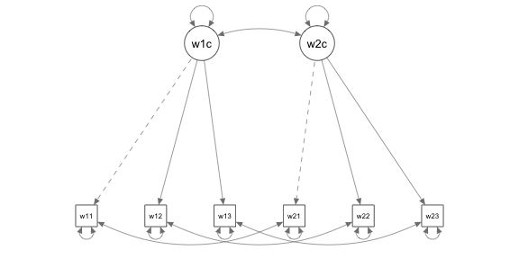
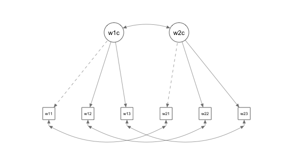
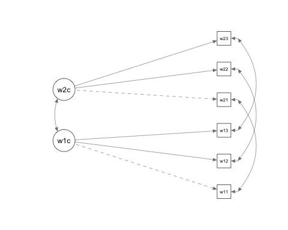
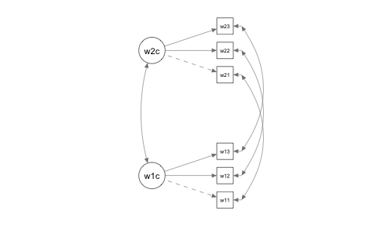
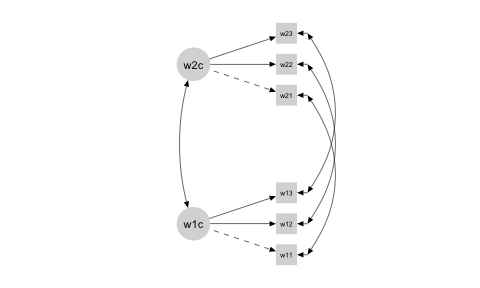
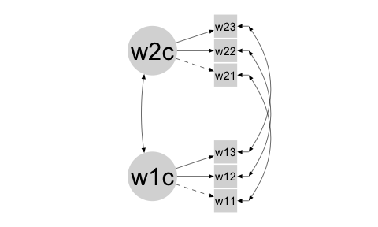
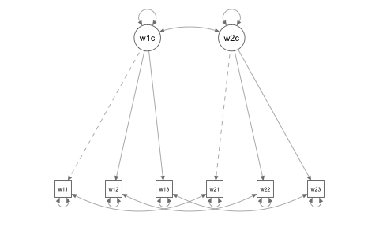
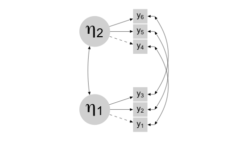
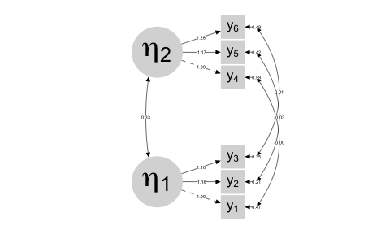

semPlot practice
================
A Solomon Kurz
2018-11-04

The purpose of this file is to practice working with the semPlot package.

Load the semPlot package.

``` r
# install.packages("semPlot", dependencies = T)
library(tidyverse)
library(semPlot)
library(lavaan)
```

Load the data.

``` r
socex1_names <- 
  c("w1vst1", "w1vst2", "w1vst3", "w2vst1", "w2vst2", "w2vst3", "w3vst1", "w3vst2", "w3vst3", "w1unw1", "w1unw2", "w1unw3", "w2unw1", "w2unw2", "w2unw3", "w3unw1", "w3unw2", "w3unw3", "w1dboth","w1dsad", "w1dblues", "w1ddep", "w2dboth", "w2dsad","w2dblues", "w2ddep", "w3dboth", "w3dsad", "w3dblues", "w3ddep", "w1marr2", "w1happy", "w1enjoy", "w1satis", "w1joyful", "w1please", "w2happy", "w2enjoy", "w2satis", "w2joyful", "w2please", "w3happy", "w3enjoy", "w3satis", "w3joyful", "w3please", "w1lea", "w2lea", "w3lea")

socex1 <- 
  read_table2("data/socex1.dat",
              col_names = F) %>% 
  set_names(socex1_names)
```

Here's our lavaan `model1.1`.

``` r
model1.1 <- '
# loadings
w1comp =~ w1vst1 + w1vst2 + w1vst3
w2comp =~ w2vst1 + w2vst2 + w2vst3

# variances and covariances
w2comp ~~ w1comp
w1comp ~~ w1comp
w2comp ~~ w2comp
w1vst1 ~~ w1vst1
w1vst2 ~~ w1vst2
w1vst3 ~~ w1vst3
w2vst1 ~~ w2vst1
w2vst2 ~~ w2vst2
w2vst3 ~~ w2vst3
w1vst1 ~~ w2vst1
w1vst2 ~~ w2vst2
w1vst3 ~~ w2vst3
'

fitmodel1.1 <- sem(model1.1, data = socex1)
```

Here's the default semPlot figure via the `semPaths()` function.

``` r
semPaths(fitmodel1.1)
```



Here's the same plot, but using `style = "lisrel"`.

``` r
semPaths(fitmodel1.1,
         style = "lisrel")
```



You can rotate the diagram.

``` r
semPaths(fitmodel1.1,
         style = "lisrel",
         rotation = 2)
```



You can also split up the layout of the measurement and structural models.

``` r
semPaths(fitmodel1.1,
         style = "lisrel",
         layoutSplit = T,
         rotation = 2)
```



You might darken up the line color with the `edge.color` argument and globally change the fill color with `color`. While we at it, we can get rid of the shape outlines with `borders = F`.

``` r
semPaths(fitmodel1.1,
         style = "lisrel",
         layoutSplit = T,
         rotation = 2,
         edge.color = "black",
         color = "grey85",
         borders = F)
```



In addition, you might change the size of the shapes and the font of their text, like so.

``` r
semPaths(fitmodel1.1,
         style = "lisrel",
         layoutSplit = T,
         rotation = 2,
         edge.color = "black",
         color = "grey85",
         sizeMan = 7,
         sizeLat = 15,
         label.scale = T,
         label.cex = 1.5,
         borders = F)
```



If you want to relable any of the variables, you might index like using `$Arguments$labels`.

``` r
semPaths(fitmodel1.1)$Arguments$labels
```



    ## w1vst1 w1vst2 w1vst3 w2vst1 w2vst2 w2vst3 w1comp w2comp 
    ##  "w11"  "w12"  "w13"  "w21"  "w22"  "w23"  "w1c"  "w2c"

Once you have a sense of the order of the elements, you can then use `nodeLabels` to specify your updated labels. You can even use mathematical notation using the `expression` function.

``` r
semPaths(fitmodel1.1,
         style = "lisrel",
         layoutSplit = T,
         rotation = 2,
         edge.color = "black",
         color = "grey85",
         sizeMan = 7,
         sizeLat = 15,
         label.scale = T,
         label.cex = 1.75,
         borders = F,
         nodeLabels = c(expression(y[1]), 
                        expression(y[2]),
                        expression(y[3]),
                        expression(y[4]),
                        expression(y[5]),
                        expression(y[6]),
                        expression(eta[1]),
                        expression(eta[2])))
```



With the `whatLabel` argument, we can add the parameter point estimates.

``` r
semPaths(fitmodel1.1,
         style = "lisrel",
         layoutSplit = T,
         rotation = 2,
         edge.color = "black",
         color = "grey85",
         sizeMan = 7,
         sizeLat = 15,
         label.scale = T,
         label.cex = 1.75,
         borders = F,
         nodeLabels = c(expression(y[1]), 
                        expression(y[2]),
                        expression(y[3]),
                        expression(y[4]),
                        expression(y[5]),
                        expression(y[6]),
                        expression(eta[1]),
                        expression(eta[2])),
         whatLabel = "est")
```



``` r
sessionInfo()
```

    ## R version 3.5.1 (2018-07-02)
    ## Platform: x86_64-apple-darwin15.6.0 (64-bit)
    ## Running under: macOS High Sierra 10.13.6
    ## 
    ## Matrix products: default
    ## BLAS: /Library/Frameworks/R.framework/Versions/3.5/Resources/lib/libRblas.0.dylib
    ## LAPACK: /Library/Frameworks/R.framework/Versions/3.5/Resources/lib/libRlapack.dylib
    ## 
    ## locale:
    ## [1] en_US.UTF-8/en_US.UTF-8/en_US.UTF-8/C/en_US.UTF-8/en_US.UTF-8
    ## 
    ## attached base packages:
    ## [1] stats     graphics  grDevices utils     datasets  methods   base     
    ## 
    ## other attached packages:
    ##  [1] lavaan_0.6-3    semPlot_1.1     forcats_0.3.0   stringr_1.3.1  
    ##  [5] dplyr_0.7.6     purrr_0.2.5     readr_1.1.1     tidyr_0.8.1    
    ##  [9] tibble_1.4.2    ggplot2_3.0.0   tidyverse_1.2.1
    ## 
    ## loaded via a namespace (and not attached):
    ##   [1] minqa_1.2.4          colorspace_1.3-2     rjson_0.2.20        
    ##   [4] rprojroot_1.3-2      htmlTable_1.12       corpcor_1.6.9       
    ##   [7] base64enc_0.1-3      rstudioapi_0.7       lubridate_1.7.4     
    ##  [10] xml2_1.2.0           splines_3.5.1        mnormt_1.5-5        
    ##  [13] knitr_1.20           glasso_1.10          Formula_1.2-3       
    ##  [16] jsonlite_1.5         nloptr_1.0.4         broom_0.4.5         
    ##  [19] cluster_2.0.7-1      png_0.1-7            compiler_3.5.1      
    ##  [22] httr_1.3.1           backports_1.1.2      assertthat_0.2.0    
    ##  [25] Matrix_1.2-14        lazyeval_0.2.1       cli_1.0.0           
    ##  [28] acepack_1.4.1        htmltools_0.3.6      tools_3.5.1         
    ##  [31] OpenMx_2.11.5        bindrcpp_0.2.2       igraph_1.2.1        
    ##  [34] coda_0.19-1          gtable_0.2.0         glue_1.3.0          
    ##  [37] reshape2_1.4.3       Rcpp_0.12.18         carData_3.0-2       
    ##  [40] cellranger_1.1.0     statnet.common_4.1.4 nlme_3.1-137        
    ##  [43] lisrelToR_0.1.4      psych_1.8.4          network_1.13.0.1    
    ##  [46] lme4_1.1-17          rvest_0.3.2          ggm_2.3             
    ##  [49] semTools_0.5-1       gtools_3.8.1         XML_3.98-1.16       
    ##  [52] MASS_7.3-50          scales_0.5.0         BDgraph_2.52        
    ##  [55] hms_0.4.2            parallel_3.5.1       huge_1.2.7          
    ##  [58] RColorBrewer_1.1-2   yaml_2.1.19          pbapply_1.3-4       
    ##  [61] gridExtra_2.3        rpart_4.1-13         latticeExtra_0.6-28 
    ##  [64] stringi_1.2.3        sem_3.1-9            checkmate_1.8.5     
    ##  [67] boot_1.3-20          d3Network_0.5.2.1    rlang_0.3.0.1       
    ##  [70] pkgconfig_2.0.1      arm_1.10-1           evaluate_0.10.1     
    ##  [73] lattice_0.20-35      bindr_0.1.1          htmlwidgets_1.2     
    ##  [76] tidyselect_0.2.4     plyr_1.8.4           magrittr_1.5        
    ##  [79] R6_2.2.2             Hmisc_4.1-1          sna_2.4             
    ##  [82] whisker_0.3-2        pillar_1.2.3         haven_1.1.2         
    ##  [85] foreign_0.8-70       withr_2.1.2          rockchalk_1.8.117   
    ##  [88] survival_2.42-3      abind_1.4-5          nnet_7.3-12         
    ##  [91] modelr_0.1.2         crayon_1.3.4         fdrtool_1.2.15      
    ##  [94] ellipse_0.4.1        rmarkdown_1.10       jpeg_0.1-8          
    ##  [97] grid_3.5.1           readxl_1.1.0         qgraph_1.5          
    ## [100] data.table_1.11.4    pbivnorm_0.6.0       matrixcalc_1.0-3    
    ## [103] digest_0.6.15        mi_1.0               stats4_3.5.1        
    ## [106] munsell_0.5.0
